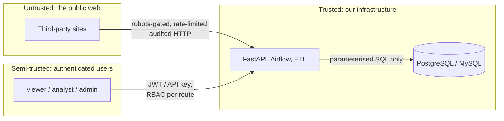

# Security Policy

## Supported versions

| Version | Supported |
| --- | --- |
| 1.3.x | ✅ |
| 1.2.x | ✅ |
| < 1.2 | ❌ |

## Reporting a vulnerability

**Please do not open a public issue for a security problem.**

This is a private repository, but reports are still handled as confidential so that a fix lands
before any detail becomes visible in the issue tracker.

Report a vulnerability by email to **ahmed.bakr@depi.local**, or via GitHub's private reporting:

1. Open the repository → **Security** → **Advisories** → **Report a vulnerability**.
2. Include the affected component, the reproduction steps, and the impact you observed.

Please do **not** include third-party credentials, live tokens, or customer data in a report.

### What to expect

| Stage | Target |
| --- | --- |
| Acknowledgement | within 72 hours |
| Triage and severity assessment | within 7 days |
| Fix or mitigation plan | within 14 days of triage |
| Disclosure | coordinated with the reporter after the fix ships |

You are welcome to test against the running stack in a lab environment. Out of scope for
responsible disclosure: automated scanning of the permitted public sources beyond the documented
rate limits, and denial-of-service testing.

## Threat model in one page

The system handles three very different trust boundaries, each with different controls.



| Boundary | Threat | Control implemented |
| --- | --- | --- |
| Web → ingestion | Malicious or hostile HTML/JSON | Schema validation, length caps, HTML stripping in the 29-step cleaner, no code execution from payloads |
| Web → ingestion | Unauthorised crawling | robots.txt enforced in the transport layer before the socket opens, per-host rate limits, circuit breaker |
| User → API | Credential theft | Argon2id hashing, JWT access + rotating refresh, API keys shown once and hashed at rest, 5-attempt lockout for 15 minutes |
| User → API | Privilege escalation | RBAC (viewer / analyst / admin) enforced server-side per route, not by hiding UI |
| User → API | SQL injection | Parameterised SQL throughout; the Query Lab is SELECT-only with identifier whitelisting and clamped `LIMIT` |
| Any → data | Sensitive data exposure | `.env` git-ignored, secrets from environment only, CORS allow-list, gzip, audit log of every mutation |
| API → warehouse | Accidental destructive query | Read-only replicas for analytics paths, statement timeouts, no DDL or DML reachable from user input |

## Security controls in place

### Authentication

- **Passwords** — Argon2id (memory-hard). Plain text is never stored or logged.
- **Access tokens** — HS256 JWT, 12-hour lifetime.
- **Refresh tokens** — 30-day lifetime with rotation; the client refreshes in a single flight on
  `401`, so an expired token cannot produce a request storm.
- **API keys** — `pip_...` prefixed, generated once, displayed once, hashed at rest, usage-counted,
  and individually revocable.
- **Brute force** — five failed attempts lock the account for 15 minutes.

### Authorisation

Three roles, checked in the dependency layer on every route:

| Role | Read | Trigger runs | Change settings | Manage users | View audit |
| --- | --- | --- | --- | --- | --- |
| `viewer` | ✅ | ❌ | ❌ | ❌ | ❌ |
| `analyst` | ✅ | ✅ | ✅ | ❌ | ✅ |
| `admin` | ✅ | ✅ | ✅ | ✅ | ✅ |

### Auditability

Every mutating request writes the user, action, IP address and user agent to `app_audit_log`. Every
outbound web fetch writes its URL, status, latency, byte count, **robots decision** and retry count
to `ingestion_http_log` — which is what makes "did the crawler respect the rules?" an answerable
question rather than an assumption.

### Secrets

All configuration arrives through environment variables. `.env` is git-ignored; `.env.example`
documents every variable with non-working placeholder values. No credential, API key, connection
string or private URL is committed anywhere in the history.

### Crawler conduct

The crawler identifies itself honestly with a `User-Agent` that names the bot and provides a contact
address. It honours `robots.txt` (RFC 9309 semantics) and `Crawl-delay`, applies a global floor
delay even when a site declares none, and stops entirely for five consecutive failures rather than
hammering an unhealthy host.

## Verifying these claims yourself

Security claims in this repository are testable, not decorative:

```bash
make test                      # 255 tests, including RBAC and the SQL-injection guards
.venv/bin/python scripts/api_smoke.py   # 78 checks, including unauthenticated -> 401
```

The smoke suite explicitly asserts that an unauthenticated request to `/api/v1/products` returns
`401`, and that a `viewer` attempting to trigger a pipeline run is denied.