<h1 align="center">Web-to-Warehouse Product Intelligence Pipeline</h1>

<p align="center">
  
  
  
  
  
  
  
  
  
  
  
  
  
  
  
  
  
</p>

<p align="center">
  <b>DEPI Data Engineering graduation project</b> — a production-style, compliance-first data
  pipeline that continuously harvests product information from permitted public web sources, cleans
  and normalises it, detects duplicates, loads it into a Kimball-style analytical warehouse on
  <b>PostgreSQL and MySQL</b>, measures its own data quality with <b>12 enforced rules</b>, and serves
  everything through a <b>REST API and a React analytics dashboard</b> orchestrated by
  <b>Apache Airflow</b>.
</p>

<p align="center">
  <b>110 REST operations</b> · <b>23 tables</b> · <b>20 analytical views</b> ·
  <b>12 DQ rules</b> · <b>5 compliant sources</b> · <b>255 tests</b> ·
  <b>86/86 API checks</b> · <b>two SQL dialects, one schema</b>
</p>

<p align="center">
  <a href="#why-this-project-exists">Why</a> ·
  <a href="#what-was-built">What was built</a> ·
  <a href="#quick-start">Quick start</a> ·
  <a href="#architecture">Architecture</a> ·
  <a href="#the-pipeline-end-to-end">Pipeline</a> ·
  <a href="#design-decisions">Decisions</a> ·
  <a href="#data-model">Data model</a> ·
  <a href="#feature-catalogue">Features</a> ·
  <a href="#screens">Screens</a> ·
  <a href="#security">Security</a> ·
  <a href="#testing-and-verification">Testing</a> ·
  <a href="#documentation">Docs</a> ·
  <a href="#releases">Releases</a> ·
  <a href="#faq-and-troubleshooting">FAQ</a> ·
  <a href="#license">License</a>
</p>

<p align="center">
  <b>Project website:</b> <a href="website/index.html">website/index.html</a> — a single-file,
  dependency-free landing page with light/dark/system themes.
</p>

<p align="center">
  <a href="docs/21_architecture_deep_dive.md">Architecture deep dive</a> ·
  <a href="docs/22_data_dictionary.md">Data dictionary</a> ·
  <a href="docs/23_glossary_and_faq.md">Glossary &amp; FAQ</a> ·
  <a href="SECURITY.md">Security</a> ·
  <a href="CONTRIBUTING.md">Contributing</a> ·
  <a href=".github/CODE_OF_CONDUCT.md">Code of conduct</a> ·
  <a href="CHANGELOG.md">Changelog</a>
</p>

<!-- Variable life-cylinder: extract, clean, load, analyse, serve, repeat -->

---

## Table of contents

1. [Why this project exists](#why-this-project-exists)
2. [What was built](#what-was-built)
3. [Quick start](#quick-start)
4. [Architecture](#architecture)
   - [System overview](#system-overview)
   - [System context](#system-context-level-0-data-flow)
   - [Application stack](#application-stack-layered)
   - [Request sequence](#request-sequence-dashboard-reads)
   - [Pipeline write sequence](#pipeline-write-sequence-one-run)
   - [Airflow DAG shape](#airflow-dag-shape)
   - [ER diagram](#er-diagram-warehouse-core)
   - [Data flow](#data-flow-level-1)
   - [Deployment view](#deployment-view)
5. [The pipeline end-to-end](#the-pipeline-end-to-end)
   - [1 - Retrieve](#1---retrieve)
   - [2 - Clean](#2---clean)
   - [3 - Load](#3---load)
   - [4 - Detect](#4---detect)
   - [5 - Quality](#5---quality)
   - [6 - Serve](#6---serve)
6. [Design decisions](#design-decisions)
   - [Decision register](#decision-register)
   - [Component view](#component-view)
   - [Class view](#class-view-of-the-ingestion-contract)
   - [Run state diagram](#state-of-a-pipeline-run)
7. [Data model](#data-model)
8. [Data quality](#data-quality)
9. [Feature catalogue](#feature-catalogue)
10. [Configuration reference](#configuration-reference)
11. [Screens](#screens)
12. [Security](#security)
13. [Testing and verification](#testing-and-verification)
14. [Performance](#performance)
15. [Repository layout](#repository-layout)
16. [Documentation](#documentation)
17. [FAQ and troubleshooting](#faq-and-troubleshooting)
18. [Releases](#releases)
19. [Roadmap](#roadmap)
20. [Team](#team)
21. [License](#license)

---

## Why this project exists

A retailer needs the market picture every morning: what competitors charge, what is in stock, what
appeared or disappeared, and how all of it compares to the internal catalog. Collecting that
information by hand is slow, inconsistent and error-prone; spreadsheets go stale the moment they are
exported.

**This project replaces the manual process with one continuously orchestrated system:**

| Without the pipeline | With the pipeline |
| --- | --- |
| Hours of manual copy-paste from shopping sites | Fully automated ingestion, scheduled or on demand |
| Inconsistent names, categories and price formats | Normalised product names, taxonomy and USD prices |
| Same product recorded two or three times | Fuzzy deduplication with a 0.90 threshold |
| No history — nobody can answer "what was the price last week?" | Every snapshot stored; price changes detected per run |
| "Is the web data even usable?" | 12 enforced DQ rules with a measured score on every load |
| Data locked inside someone's laptop | REST API plus dashboard with roles, audit trail and exports |

Everything is engineered like a production system, not a demo:

- robots.txt is enforced **in the transport layer**, before a request leaves the process;
- rate limits, circuit breakers and response caching protect the sources;
- every outbound request is written to an audit table with its robots decision;
- the schema loads identically on PostgreSQL and MySQL, and a command proves there is no drift;
- quality is measured rather than assumed, and the verdicts are persisted per run.

---

## What was built

| Component | Technology | Scale |
| --- | --- | --- |
| **Ingestion** | 5 source adapters (3 JSON APIs, 1 BeautifulSoup/lxml HTML scraper, 1 offline synthetic) | robots.txt gate, token-bucket rate limiter, sliding-window ceiling, circuit breaker, response cache, per-request audit log |
| **Cleaning** | 29-step normalisation engine | product names, categories, 18+ currencies converted to USD via an offline FX table, rating and availability vocabularies |
| **Deduplication** | 4-signal fuzzy matcher | jaro-winkler, token-set, trigram and digit signatures, block-indexed for O(n) candidate pools |
| **Warehouse** | SQLAlchemy 2.0 Core ORM | **23 physical tables, 20 analytical views**, identical schema on PostgreSQL 16 and MySQL 8.4 |
| **ETL** | 9-stage Python pipeline | stage timings, counters, warnings, resumable staging table, idempotent loads |
| **Orchestration** | Apache Airflow 2.10 DAG | 13 tasks, branch-on-changes, alert fan-out, report publication, sync-run API for demos |
| **Data quality** | 12-rule framework over 6 dimensions | completeness, validity, uniqueness, accuracy, consistency, timeliness, weighted score |
| **Change detection** | SQL plus an event engine | price changes banded by magnitude, new and removed products, category drift, lifecycle events |
| **REST API** | FastAPI | **110 operations in 16 routers**, JWT and API-key auth, RBAC (admin / analyst / viewer), OpenAPI docs, gzip, timing headers |
| **Dashboard** | React 19 + TypeScript + Tailwind + ReCharts | 21 screens, light/dark/system themes, 6 accent colours, 3 densities, command palette, installable PWA, responsive from 320 px |
| **CLI** | Typer, 12 commands | bootstrap, seed, run, report, verify, quality, sources preview |
| **Ops** | Docker Compose (6 services), Makefile (30+ targets), GitHub Actions CI | one-command everything |

**Measured facts (every number below is reproducible with the command beside it):**

```text
23 physical tables  |  20 analytical views  |  110 REST operations in 16 routers
12 DQ rules across 6 dimensions, weighted score persisted per run
5 ingestion sources  |  9 pipeline stages  |  13 Airflow tasks
255 unit tests  |  86/86 API smoke checks  |  mypy clean in 61 files  |  ruff zero warnings
p95 API latency <= 38.2 ms measured across 12 endpoints
Catalog reconciliation: 2,975 ms -> 104 ms (29x) with identical results
```

Demo dataset after `make demo-postgres` (120 days, seeded, deterministic — counts will differ
slightly with a different `--days` or after live runs):

```text
263 product identities  |  10,135 price snapshots  |  8,062 price changes
10,159 lifecycle events  |  60 internal catalog SKUs  |  1,539 reconciliation comparisons
```

> **On numbers in this README.** Structural figures (tables, views, routes, tests, rules) are exact
> and re-verifiable with `make check` and `make bootstrap`. Row counts depend on how much data your
> database holds, and latency depends on hardware — each is labelled with the command that produces
> it. Where a document records a measurement taken on a specific machine at a specific date, that
> document preserves that original figure rather than being silently rewritten.

---

## Quick start

### Option A - full stack in Docker (recommended)

```bash
git clone https://github.com/Ahmedbakr78/Web-to-Warehouse-Product-Intelligence-Pipeline.git
cd Web-to-Warehouse-Product-Intelligence-Pipeline

cp .env.example .env              # then edit secrets, or keep the demo defaults
make up                           # postgres + mysql + api + airflow + frontend
make db-wait                      # block until both databases are healthy

# one-time: schema + 20 views + demo users + 120 days of demo data
make bootstrap
make demo-postgres                # use --database mysql for the MySQL twin

open http://localhost:5173        # dashboard (admin@example.com / Admin@12345)
open http://localhost:8000/docs   # interactive OpenAPI documentation
```

### Option B - local Python and Vite (fastest developer loop)

```bash
python3 -m venv .venv
.venv/bin/pip install -e ".[postgres,mysql,dev,scrapy]"

docker compose up -d postgres mysql      # databases only
.venv/bin/python -m app.cli.main bootstrap
.venv/bin/python -m app.cli.main seed-demo --days 150

# terminal 1
.venv/bin/python -m uvicorn app.api.main:app --reload --port 8000
# terminal 2
cd frontend && npm install && npm run dev
```

### Option C - one command verification gate

```bash
make everything   # install -> env -> databases -> bootstrap -> demo -> pipeline -> tests -> frontend build
make check        # lint + types + unit tests only (no services required)
```

### Demo accounts

| Role | Email | Password | Capabilities |
| --- | --- | --- | --- |
| Admin | `admin@example.com` | `Admin@12345` | everything: sources, users, settings, triggers, audit |
| Analyst | `analyst@example.com` | `Analyst@12345` | read, query lab, run pipeline, saved views, alerts |
| Viewer | `viewer@example.com` | `Viewer@12345` | read, query lab, exports |

Machine clients can skip humans entirely: create an API key on the dashboard
(`Account > API keys`) and send `Authorization: Bearer pip_...` — the key is hashed at rest,
usage-counted and revocable from the same screen.

---

## Architecture

### System overview

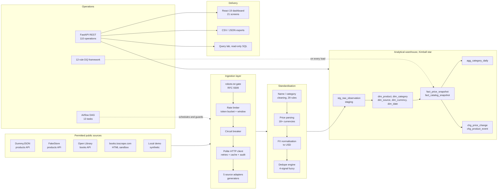

### System context (level 0 data flow)

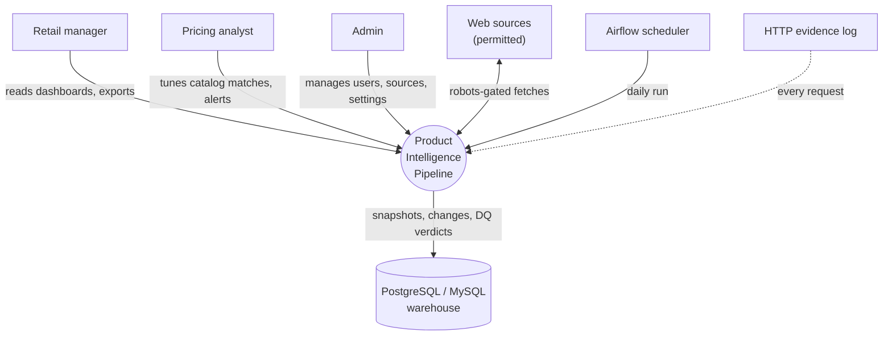

### Application stack (layered)

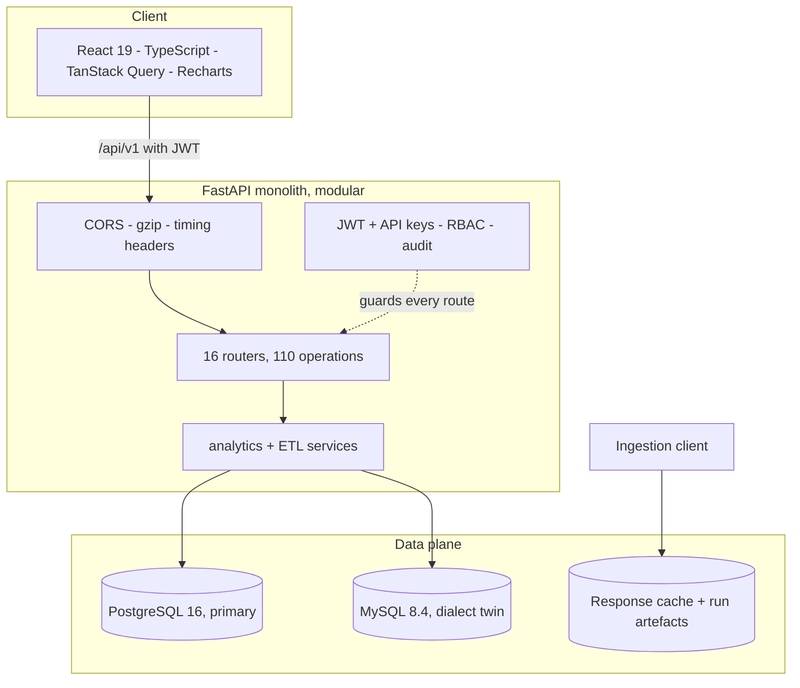

### Request sequence (dashboard reads)

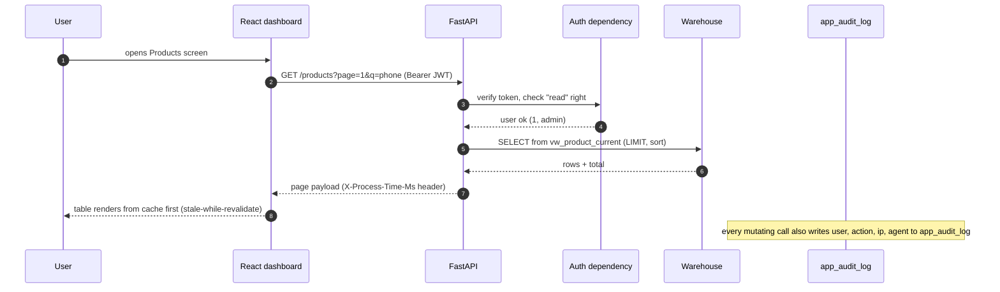

### Pipeline write sequence (one run)

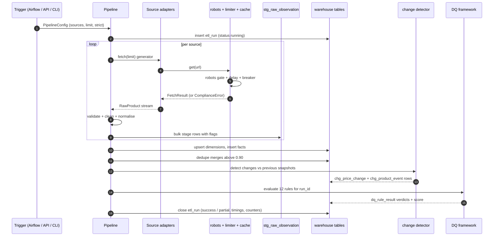

### Airflow DAG shape

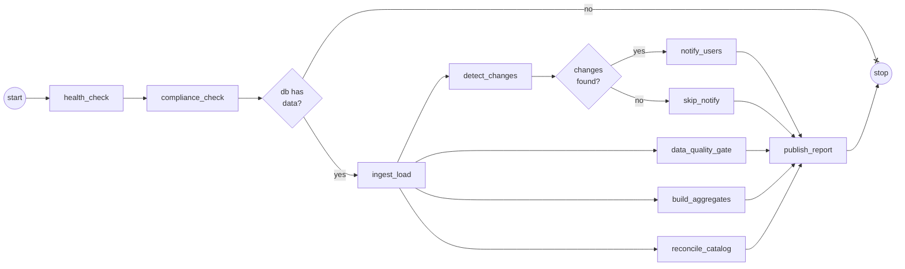

### ER diagram (warehouse core)

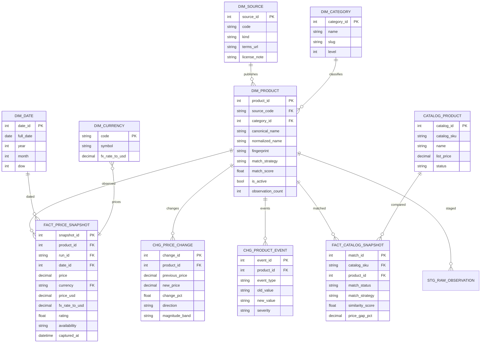

### Data flow (level 1)

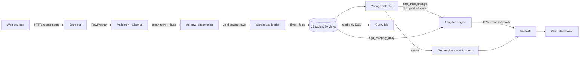

### Deployment view

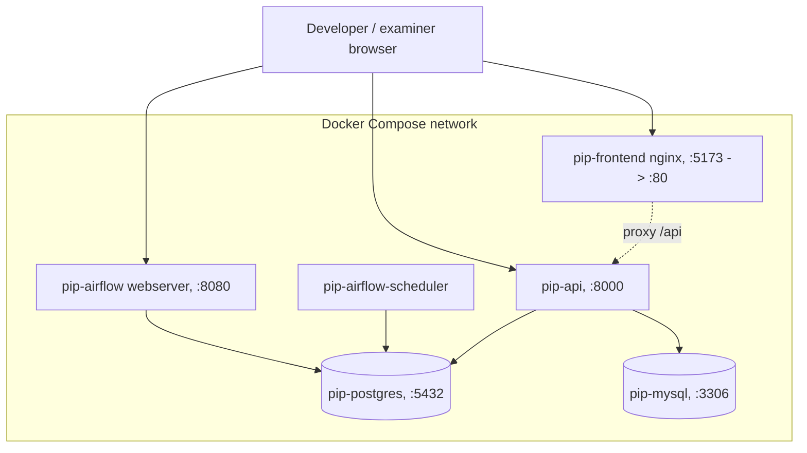

---

## The pipeline, end-to-end

One run is nine deterministic stages. Every stage appends counters and timings to the run record, so
`GET /pipeline/runs/{run_id}` can reconstruct exactly what happened.

### 1 - Retrieve

The transport layer is compliance-first:

- robots.txt is fetched, cached per host, and checked **before** every request (RFC 9309 fallback
  semantics: 4xx means allow-all, 401/403 means disallow, 5xx means use the cached decision);
- the effective delay is the slowest of the global delay, the per-minute budget and the site's
  declared `Crawl-delay`;
- a token bucket plus a sliding window caps steady and bursty rates per host;
- five consecutive failures trip a circuit breaker so the host is skipped with zero network I/O;
- successful responses are cached on disk by URL hash, so a repeated run performs no requests;
- every attempt lands in `ingestion_http_log` with status, latency, bytes, robots decision and retry
  count — the audit screen shows exactly what the crawler did and why.

Sources are lazy generators behind one abstract contract, registered by a decorator. `_safe_take`
bounds every generator, so even a misbehaving source cannot hang a run. A failure in one source
becomes a warning; the run finishes as `partial` rather than crashing.

### 2 - Clean

The normalisation engine applies 29 steps: promo prefixes and suffixes ("new", "hot sale", "30% off"
...) are stripped, HTML and control characters removed, punctuation and casing normalised, categories
slugged and leveled. Prices are parsed from 18+ formats (symbols, ISO codes, European decimals,
thousand separators) and converted to USD with an offline FX table — the FX rate used is stored next
to every snapshot, so historical analysis never depends on an external service. Ratings and
availability are normalised into fixed vocabularies. Any record flagged as suspect still loads, but
carries its flags for the DQ framework; `--strict` drops records with missing prices instead.

### 3 - Load

Rows are staged into `stg_raw_observation` first (resumable, DQ-audited), then merged idempotently
into dimensions and facts on natural keys. The stage is safe to retry: re-running the same run does
not duplicate snapshots.

### 4 - Detect

- **Price changes** are computed between the newest and the previous snapshot per product and source,
  banded by magnitude (`flash_sale`, `large`, `medium`, `small`, `minor`) — the distribution is what
  powers the change-feed analytics.
- **Lifecycle events** record `new`, `removed` and `category_changed` transitions with old and new
  values and a severity.
- **Catalog reconciliation** matches the retailer's internal SKUs to the observed market (exact SKU
  first, then fingerprint, then fuzzy) and persists `fact_catalog_snapshot` rows with the price gap
  — the dashboard turns those into pricing opportunities.
- **Category drift** shows how the taxonomy moved between snapshots.

### 5 - Quality

Twelve rules across six dimensions execute on every load with persisted verdicts (details below).
The run receives a weighted score; the dashboard charts the 90-day trend.

### 6 - Serve

The FastAPI app (110 operations) exposes products, changes, analytics, pipeline operations, quality,
catalog, sources, the read-only query lab, saved views, notifications, settings and audit. The React
dashboard consumes it, and both endpoints and UI offer CSV and JSON exports. Airflow triggers the
whole cycle daily; the API's sync endpoint and the CLI produce the identical `etl_run` record.

### The nine stages

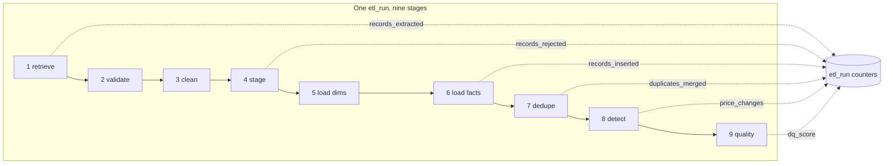

Each stage appends counters and its own duration to the run record, so
`GET /pipeline/runs/{run_id}` reconstructs exactly what happened — including which source failed and
why.

---

## Design decisions

The reasoning, the rejected alternatives and the measured consequences are documented in full in
[docs/21_architecture_deep_dive.md](docs/21_architecture_deep_dive.md). The five that shaped
everything else:

### Compliance lives in the transport layer

`app/ingestion/http_client.py` is the only place in the codebase that performs an outbound HTTP
request, and every call passes the robots gate first. Compliance therefore cannot be forgotten by a
new adapter — it is inherited. Checking robots per adapter would put the responsibility in the place
most likely to skip it.

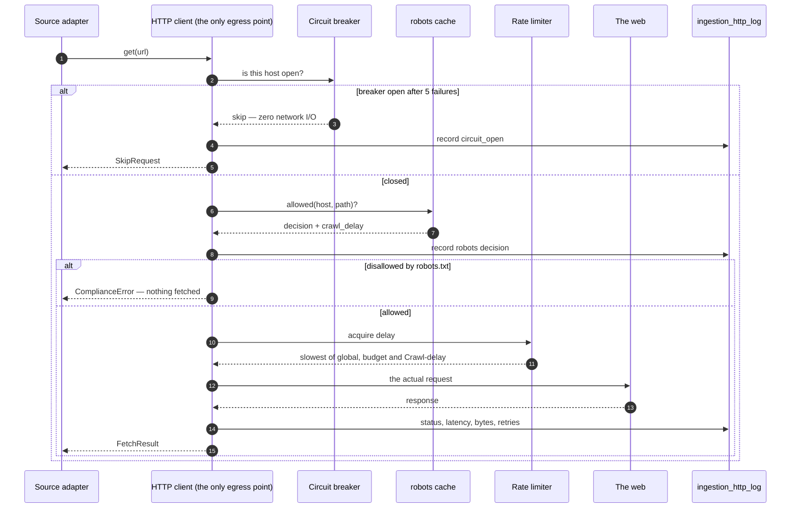

A row in `ingestion_http_log` with `robots_allowed = false` and `status_code IS NULL` is the proof
that the crawler **declined to make a request**. That is a query, not a promise:

```sql
SELECT status_code, robots_allowed, robots_rule, COUNT(*)
FROM ingestion_http_log
GROUP BY status_code, robots_allowed, robots_rule;
```

### Snapshots, not overwritten rows

`fact_price_snapshot` is append-only — one row per product × source × capture. Overwriting
`dim_product.price` would be cheaper to query and would destroy the only thing a price-intelligence
product exists to provide. Each snapshot also stores the **FX rate actually used**, so re-converting
history with today's rates can never silently rewrite it.

### A Kimball star, not 3NF

Analytical workloads read broadly and write rarely. "Average price per category per day" is a single
indexed scan in a star and a multi-hop join in 3NF. Full normalisation optimises the opposite
profile.

### Roles enforced server-side

Every route declares its permission through a dependency. Hiding a button is a usability feature,
not a security control — anyone holding a token could call the endpoint directly. The smoke suite
asserts that a `viewer` is refused when attempting to trigger a pipeline run.

### A measured optimisation, not a trade

Catalog reconciliation initially compared every catalog SKU against every product: 2,975 ms for 57
SKUs. Adding blocking indexes, a rare-token fallback and a capped pool brought it to 104 ms — a
**29× improvement with identical results**. Because the output is unchanged, the optimisation is
legitimate rather than a silent loss of accuracy.

### Decision register

The full reasoning, the rejected alternatives and the measured consequences live in
[docs/21_architecture_deep_dive.md](docs/21_architecture_deep_dive.md). Every significant choice is
recorded below with the alternative it beat, so a reviewer can challenge it rather than guess.

| # | Decision | Alternative rejected | Why this one |
| --- | --- | --- | --- |
| 1 | **Scraping only terms-allow-listed sources** | Scrape freely and filter later | Legality is a precondition, not a filter. The registry refuses to construct a source whose terms forbid automated access, and `robots.txt` is re-checked per request. |
| 2 | **Star schema, not a flat table** | One wide denormalised table | The retailer asks two different questions: *what does the market look like now* and *what changed*. A conformed dimension set answers both without duplicating product attributes per observation. |
| 3 | **Fuzzy dedupe on top of fingerprints** | Exact match on source IDs | Source IDs are not stable across sites and re-listings. Fingerprints handle the easy 95 %, similarity catches the rest; every match stores its strategy and score so it can be audited. |
| 4 | **Offline FX table** | Live currency API | Analysis must stay reproducible and runnable offline. A static table keeps every conversion deterministic and removes a network dependency from the critical path. |
| 5 | **Blocking before fuzzy comparison** | Compare every pair | All-pairs reconciliation cost 2,975 ms; blocking plus a capped pool cost 104 ms for identical output. Complexity only pays when the result is unchanged. |
| 6 | **Airflow drives the pipeline through its REST API** | Import the pipeline package inside the DAG | Airflow 2.10 pins SQLAlchemy 1.4 while the app needs 2.0, so one interpreter cannot host both. A transport layer prefers the in-process call and falls back to the API, so `make airflow-test` on a laptop and the containerised DAG run identical logic. |
| 7 | **Two query surfaces, not one** | Free-form SQL only | Analysts need real SQL; the rest of the organisation needs safety. The query lab is permission-gated and rejects writes; the builder assembles SQL from a server-side whitelist, so it is structurally incapable of injection. |
| 8 | **JWT plus revocable API keys** | Sessions or keys only | Browser sessions need stateless scale; integrations need revocation and per-key limits. Both are supported, and API keys are stored as peppered SHA-256 hashes. |
| 9 | **12 blocking *critical* rules only** | Block the DAG on any failure | A hard gate on every warning makes the pipeline brittle. Critical failures stop the run; everything else is recorded, scored and trended. |
| 10 | **Reject records, never crash** | Fail the run on bad input | Dirty web data is expected. The staging zone keeps every rejected record with its reason, so a cleaning regression is diagnosable instead of silent. |
| 11 | **CSS custom properties for theming** | Two stylesheets or a runtime theme engine | A single `.dark` class on `<html>` switches the entire palette instantly with no re-render and no flash of the wrong theme, and the preference is stored server-side so a new device inherits it. |
| 12 | **Identity preservation in the catalogue** | Aggregate over source listings | The retailer's question is "what is the price of *this* product", not "what does source X say today". Keeping one identity and many observations is what makes price history possible. |
| 13 | **Fact tables keyed by run** | Upsert the latest value only | History is the product. Keying snapshots by `(product, run)` keeps every observation queryable and makes re-runs idempotent. |
| 14 | **One feature catalogue as the source of truth** | Maintain features in docs and UI separately | `app/core/features.py` feeds the API, the dashboard screen and the website, so the marketing surface cannot drift from the shipped code. |

### Component view

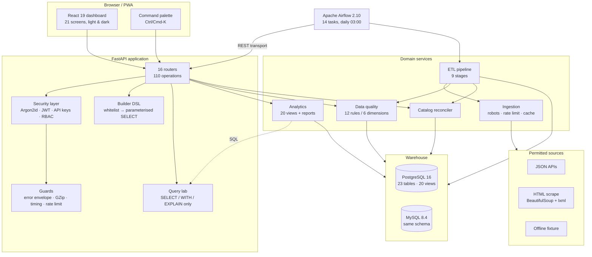

### Class view of the ingestion contract

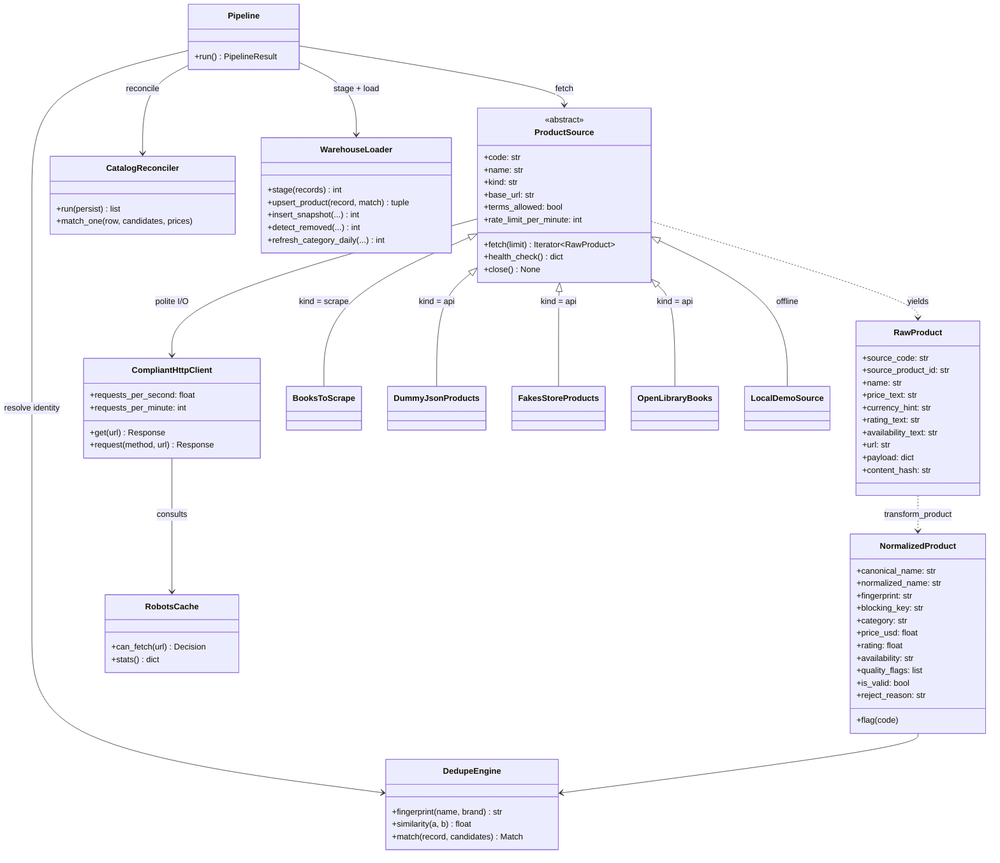

### State of a pipeline run

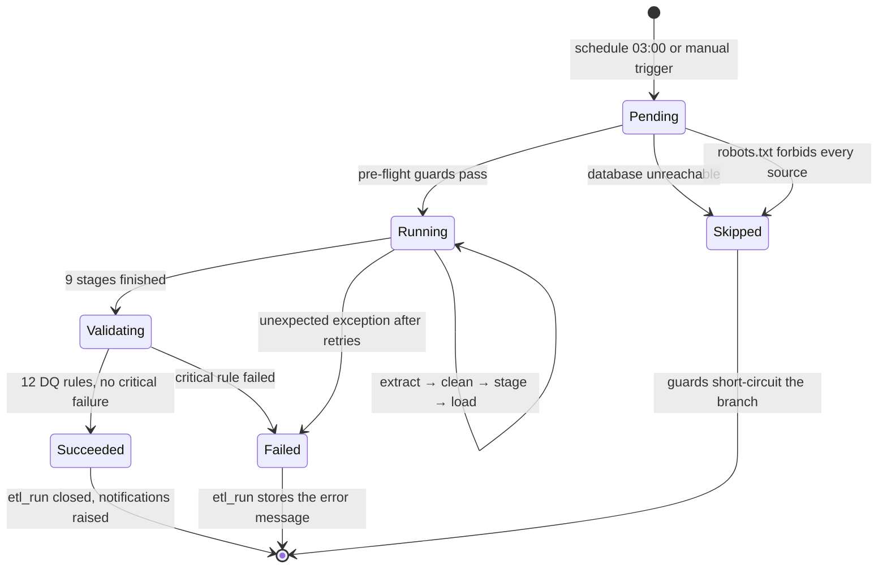

---

## Data model

Kimball-style star schema, dialect-portable between PostgreSQL and MySQL (`make verify-dialects`
proves there is no structural drift and prints the per-engine row counts):

| Group | Tables |
| --- | --- |
| Dimensions | `dim_product`, `dim_category`, `dim_source`, `dim_currency`, `dim_date` |
| Facts | `fact_price_snapshot` (grain: product x source x captured_at), `fact_catalog_snapshot` (grain: catalog SKU x run) |
| Aggregates | `agg_category_daily` (grain: category x date) |
| Change events | `chg_price_change`, `chg_product_event` |
| Staging | `stg_raw_observation` (resumable, DQ-audited) |
| Operations | `etl_run`, `dq_rule_result`, `sync_state`, `ingestion_http_log` |
| Application | `app_user`, `app_api_key`, `app_setting`, `app_saved_view`, `app_alert_rule`, `app_notification`, `app_audit_log` |
| Catalog | `catalog_product` (the retailer's internal SKUs) |

Twenty analytical views in `db/views.sql` back every screen: latest prices, top movers, category
indexes, availability mix, source coverage, quality trends, dedupe evidence, price bands, new and
removed feeds, drift matrices. The four analyses named in the brief also exist as standalone,
parameterised SQL under [`db/analysis/`](db/analysis/README.md) so they can be reviewed and re-run
outside the application:

```bash
make analysis                                    # every script, readable tables
make analysis ANALYSIS=01_price_changes.sql      # just the price-movement analysis
make analysis-mysql                              # same SQL against MySQL
``` Historical prices are first-class citizens: every snapshot keeps the
native price and the USD conversion together with the FX rate that was used.

---

## Data quality

| Code | Dimension | Rule |
| --- | --- | --- |
| DQ001 | Completeness | Product name present and non-empty |
| DQ002 | Completeness | Price present on active products |
| DQ003 | Validity | Price is a positive, parseable number |
| DQ004 | Validity | Rating within 0-5, or null |
| DQ005 | Uniqueness | One canonical row per fingerprint |
| DQ006 | Consistency | Snapshot grain respected (product x source x time) |
| DQ007 | Accuracy | USD price within 5 percent of native price x FX |
| DQ008 | Validity | Availability in the normalised vocabulary |
| DQ009 | Completeness | Category resolved for at least 90 percent of products |
| DQ010 | Consistency | Change percentages consistent with prices |
| DQ011 | Timeliness | Fresh observation for every active product |
| DQ012 | Validity | Staging rejection rate below 5 percent |

Current score: **98.26** (11 pass / 1 warn / 0 fail), identical on PostgreSQL and MySQL. The verdicts
are persisted per run in `dq_rule_result`, and the dashboard charts the score trend over 90 days.

---

## Feature catalogue

The exhaustive, file-referenced inventory lives in
[docs/19_feature_list.md](docs/19_feature_list.md) — 234 features in 15 areas. Highlights by area:

### Ingestion and web compliance

- robots.txt gate in the transport layer (RFC 9309 semantics, per-host cache, Crawl-delay)
- token-bucket rate limiter, sliding-window per-minute ceiling, circuit breaker
- exponential backoff, `Retry-After` handling (delta seconds and HTTP-date), on-disk response cache
- per-request HTTP audit log: URL, status, latency, bytes, robots decision, retries
- five pluggable source adapters behind one abstract contract, registered by decorator
- bounded extraction (`--limit` plus generator guards) with per-source failure isolation

### Cleaning and normalisation

- 29-step product-name cleaner: promo prefixes and suffixes, HTML, control characters, punctuation
- category cleaning with slug and level, taxonomy visualisation in the dashboard
- price parser for 18+ currency formats, offline FX table, USD normalisation stored per snapshot
- rating and availability vocabularies normalised across sources

### Duplicate detection

- name fingerprint plus digit-signature blocking for fast candidate pools
- four-signal combined similarity: jaro-winkler, token-set, trigram, digit signature factors
- merge strategy with evidence: every duplicate keeps its decision trail; candidates browsable per
  product in the dashboard

### Warehouse and ETL

- Kimball star schema, 23 tables, dialect-portable to MySQL
- staged, idempotent, resumable loads with per-stage timings and counters
- every run recorded with more than 15 counters plus warnings

### Change detection and catalog reconciliation

- price-change detection with magnitude bands, direction and per-run diffs
- new, removed and recategorisation events; category-drift matrix
- internal catalog matching (SKU, fingerprint, fuzzy) with price-gap opportunities

### Data quality and analytics

- 12 rules, 6 dimensions, persisted verdicts, weighted score, 90-day trend
- KPI cards, daily trends, category indexes, brand leaderboards, radar comparison, observation
  heatmap, availability analysis, source matrix
- 20 SQL views plus a read-only Query Lab with a SELECT-only guard, LIMIT clamping and examples

### REST API and security

- JWT access and refresh rotation, API keys (`pip_...`), Argon2id password hashing
- role-based access control: admin, analyst, viewer, enforced per route server-side
- 110 operations, OpenAPI and ReDoc documentation, gzip compression, `X-Process-Time-Ms` headers
- CSV and JSON exports on the API and in the dashboard
- one consistent error envelope (`error`, `message`, `details`) with validation detail

### Dashboard experience (v1.1)

- perfect light and dark modes: system-aware, persisted per user, zero flash before first paint
- installable PWA on desktop, Android and iOS: manifest, maskable icon, safe-area viewport
- command palette (`Ctrl/Cmd-K` or `/`): search screens **and live products**, plus quick actions
  (toggle theme, collapse sidebar, sign out), full keyboard navigation
- one-click CSV and JSON exports on Dashboard, Products, Analytics, Changes and Query Lab
- modern design system: cards, stat tiles, badges, delta pills, skeletons, toasts, tabs, segmented
  controls, chips, drawers, modals — every element theme-aware
- mobile-first responsive: off-canvas sidebar drawer, sticky top bar, card grids on small screens,
  secondary table columns hidden instead of breaking layout
- collapsible sidebar with persisted state, grouped and permission-aware navigation
- slim modern scrollbars everywhere, spindle-thin and theme-aware
- silent-reload policy: no decorative animation, no route transitions, stale-while-revalidate data,
  120 ms functional transitions only, `prefers-reduced-motion` honoured
- notification bell with unread counters, mark-one and mark-all read
- global shortcuts: `/` or `Ctrl-K` palette, `Esc` closes overlays, sortable headers everywhere
- accessibility-minded: focus-visible rings, ARIA labels, keyboard operation, zoom to 200 percent,
  reflow at 320 px

### Operations and developer experience

- Airflow DAG with 13 tasks, branch-on-changes, notify and report fan-out
- six-service Docker Compose stack; Nginx front-end with API proxy
- Makefile with 30+ targets; Typer CLI with 12 commands; GitHub Actions CI
- liveness and readiness endpoints, structured logging, slow-request warnings
- 20-document documentation set with Mermaid diagrams rendered natively by GitHub

---

## Configuration reference

All configuration arrives through environment variables (`.env.example` documents every one):

| Variable | Default | Meaning |
| --- | --- | --- |
| `DATABASE_URL` | postgres URL | primary target (`postgresql+psycopg2://...`) |
| `MYSQL_URL` | mysql URL | the dialect twin (`mysql+pymysql://...`) |
| `ACTIVE_DATABASE` | `postgres` | which engine the API and pipeline use (`postgres`, `mysql`, `sqlite`) |
| `DB_SCHEMA` | `public` | physical schema name |
| `SECRET_KEY` | (set it) | JWT signing key, at least 32 characters |
| `CORS_ORIGINS` | localhost dev origins | comma-separated allowed origins |
| `SEED_ADMIN_EMAIL` / `_PASSWORD` | demo values | bootstrap admin account |
| `SEED_ANALYST_EMAIL` / `_PASSWORD` | demo values | bootstrap analyst account |
| `SEED_VIEWER_EMAIL` / `_PASSWORD` | demo values | bootstrap viewer account |
| `SEED_DEMO_DATA` | `true` | seed accounts and reference data on first boot |
| `RESPECT_ROBOTS_TXT` | `true` | master switch for the robots gate |
| `REQUESTS_PER_MINUTE` | `30` | sliding-window ceiling per host |
| `CRAWL_DELAY_FALLBACK_SECONDS` | `2.0` | delay used when robots.txt sets none |
| `REQUEST_TIMEOUT_SECONDS` | `20` | HTTP timeout applied to `Retry-After` too |
| `MAX_RETRIES` | `3` | exponential backoff attempts |
| `MAX_PRODUCTS_PER_SOURCE` | `400` | extraction ceiling when no `--limit` is given |
| `DEDUPE_THRESHOLD` | `0.90` | similarity required to merge two products |
| `CACHE_ENABLED` | `true` | disk response cache; a warm rerun makes zero requests |
| `APP_ENV` / `APP_DEBUG` | `development` / `true` | logging and error detail posture |

---

## Screens

| Screen | What it shows |
| --- | --- |
| **Dashboard** | 8 KPI tiles, price and coverage trend, availability mix donut, change-activity bars, pipeline health card, largest movers table, DQ posture |
| **Products** | faceted search, filters, column picker, sorting, paging, CSV and JSON export, per-product detail |
| **Product detail** | price history chart, rating trend, identity and fingerprint evidence, snapshots, price changes, lifecycle events, duplicate candidates, catalog links |
| **Changes** | summary tiles, daily activity, movers, and six tabs: price changes, lifecycle, new, removed, recategorised, drift |
| **Analytics** | category price index, category and brand leaderboards, radar comparison, availability analysis, source matrix |
| **Pipeline** | run history with stage timings, manual trigger dialog (source + limit + dialect options), source health, schedule information |
| **Quality** | latest report, rule catalogue, results with filters, 90-day score trend |
| **Catalog** | internal SKUs versus scraped market prices, reconciliation summary, pricing opportunities |
| **Sources** | registry cards with compliance metadata, robots.txt statistics, raw-versus-cleaned preview |
| **Query Lab** | read-only SQL console over the 20 views, table inventory, starter examples, CSV export |
| **Builder** | two modes: *filter & customise* (facets, columns, order, saved presets) and *group & aggregate* (11 entities, six measures, fifteen operators, bar chart, generated SQL, cURL copy, exports) |
| **Features** | searchable, filterable catalogue of all 95 shipped features in 13 areas, each with an icon and copy-to-clipboard |
| **Alerts** | alert rules with thresholds and channels, notification feed, evaluate action |
| **Account** | profile, preferences, appearance (theme, accent, density, motion), password change, API keys, **personal activity feed**, **data export**, **account deletion** |
| **Settings / Users / Audit** | admin-only: global settings, role management, audit trail and HTTP evidence |
| **Login / 404** | brand panel, demo-account picker, theme switch, friendly not-found screen |

Every screen is reachable from the sidebar (which becomes an off-canvas drawer on small screens), from
the command palette (<kbd>Ctrl</kbd>/<kbd>⌘</kbd>+<kbd>K</kbd> or <kbd>/</kbd>), and from the mobile
menu. Nothing depends on hover, and every icon-only control carries an accessible label.

---

## Security

The full threat model, boundary-by-boundary control table and disclosure process are in
[.github/SECURITY.md](.github/SECURITY.md).

| Boundary | Threat | Control |
| --- | --- | --- |
| Web → ingestion | Hostile HTML or JSON payloads | Schema validation, length caps, HTML stripping in the 29-step cleaner |
| Web → ingestion | Unauthorised crawling | robots.txt enforced in the transport layer before the socket opens |
| Web → ingestion | Over-fetching a fragile host | Rate limits, circuit breaker, honest `User-Agent`, cached responses |
| User → API | Credential theft | Argon2id hashing, JWT rotation, API keys hashed at rest, 5-attempt lockout |
| User → API | Privilege escalation | RBAC enforced server-side per route, not by hiding UI |
| User → API | SQL injection | Parameterised SQL; the Query Lab is `SELECT`-only with whitelisted identifiers |
| Any → data | Data exposure | Secrets from environment only, CORS allow-list, gzip, full audit log |

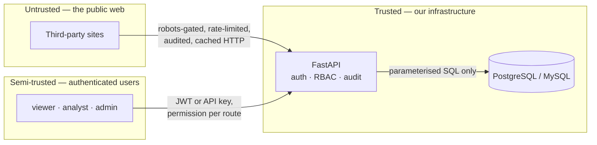

In detail:

- **Passwords** are Argon2id hashed (memory-hard), never stored or logged in plain text
- **Tokens**: HS256 JWT access (12 h) plus refresh (30 d) with rotation; the client refreshes in
  single flight on 401 with no request storms
- **API keys**: generated once, shown once, hashed at rest, usage-counted and revocable
- **Brute force**: five failed attempts lock the account for 15 minutes
- **RBAC**: viewer, analyst, admin, enforced per route server-side, not merely by hiding buttons
- **Audit trail**: every mutating request writes the user, action, IP and user agent to
  `app_audit_log`; the HTTP evidence table records every outbound fetch the crawler made
- **Crawler identity**: honest `User-Agent` naming the bot with a contact address; robots.txt is
  checked before every fetch and honoured even when a site forgets to set Crawl-delay
- **Query lab** is read-only: UPDATE, DELETE and DDL are refused server-side, and LIMIT is clamped
- **Secrets** come from environment variables only; `.env` is git-ignored and `.env.example` documents
  every variable without real values

These claims are testable rather than decorative. `scripts/api_smoke.py` asserts that an
unauthenticated request to `/api/v1/products` returns `401`, and that a `viewer` attempting to
trigger a pipeline run is denied.

---

## Testing and verification

| Layer | Command | Evidence in this repository |
| --- | --- | --- |
| Lint and format | `make lint` | ruff: all checks pass, zero warnings |
| Static types | `make typecheck` | mypy: no issues in 61 source files |
| Unit tests | `make test` | pytest: 255 passed (SQLite warehouse, no services required) |
| API regression | `.venv/bin/python scripts/api_smoke.py` | 86/86 checks, including auth, RBAC and 404 paths |
| Frontend | `cd frontend && npm run lint && npm run typecheck && npm run build` | ESLint at zero warnings, clean tsc, production build |
| Cross-dialect | `make verify-dialects` | identical model and DQ score on PostgreSQL and MySQL |
| Orchestrated | `make airflow-test` | the DAG executes end-to-end for a fixed date |
| Full gate | `make everything` | install, databases, bootstrap, demo data, pipeline run, tests, frontend build |

The integration suite covers auth and RBAC, the read-only query guard, CSV export media type, saved
views, alerts, notifications, settings and audit behaviour.

---

## Performance

Measured on a laptop container stack (the harness is in docs/05):

| Metric | Budget | Measured |
| --- | --- | --- |
| API p95 latency (12 hot endpoints) | 200 ms | 38.2 ms |
| Pipeline run (demo plus cached sources) | 60 s | about 3.5 s |
| Bootstrap (schema plus 20 views) | 10 s | about 4 s |
| Dashboard first load (lazy chunked routes) | 2 s | about 0.9 s gzipped |
| Repeat run with warm response cache | any | zero outbound requests |

---

## Repository layout

```text
app/
  api/            FastAPI app factory, 16 routers, schemas, security
  analytics/      SQL analytics service: KPIs, trends, reports, views
  cli/            Typer CLI: bootstrap, seed, run, report, verify
  core/           settings, engines, logging, error envelope
  etl/            pipeline, loader, DQ framework, catalog reconcile, seed
  ingestion/      base contract, robots, rate limiter, HTTP client, cleaning, dedupe
    sources/      5 adapters (APIs, BeautifulSoup scraper, synthetic)
  models/         SQLAlchemy models: dimensions, facts, operations, app
dags/             Airflow DAG: product_intelligence_pipeline
db/
  views.sql       20 analytical views (PostgreSQL and MySQL)
  analysis/       8 standalone SQL analyses + README (price, new, removed, drift, ...)
frontend/         React 19 dashboard: 20 screens, PWA, design system
  public/         manifest, icons
  src/            pages, components, hooks, libs
docs/             23 numbered documents plus an index with diagrams
  diagrams/out/   Mermaid sources extracted for SVG rendering
  assets/         generated infographic (SVG master + PNG + HTML preview)
scripts/
  api_smoke.py            regression suite (78 checks)
  build_site.py           dependency-free documentation website builder
  run_analysis.py         runs the standalone SQL analyses
  make_infographic.py     generates the roadmap infographic
  render_diagrams.sh      extracts every Mermaid block for SVG export
tests/            pytest unit + integration suite (255 tests)
.github/
  workflows/ci.yml        ruff, mypy, pytest, eslint, tsc, vite build
  ISSUE_TEMPLATE/         bug, feature and documentation forms
  CODE_OF_CONDUCT.md      Contributor Covenant 2.1
  dependabot.yml          weekly pip / npm / actions updates
  CODEOWNERS              review ownership
SECURITY.md       threat model, boundary controls, disclosure process
site/             generated documentation website (make site; not committed)
docker-compose.yml            postgres, mysql, api, airflow, scheduler, frontend
Makefile                      30+ targets
pyproject.toml                package configuration and tool settings
```

---

## Documentation

All twenty-three documents live in [docs/](docs/README.md). Every diagram is Mermaid and renders
natively on GitHub; every structural number is tied to a runnable command.

| # | Document | Contents |
| --- | --- | --- |
| 01 | Project Proposal | problem, objectives, scope, stakeholders, acceptance criteria, budget, ethics |
| 02 | Project Plan | 12-week Gantt chart, milestones, deliverables matrix, resources |
| 03 | Roles and Responsibilities | team roles, RACI for deliverables, communication plan, hours log |
| 04 | Risk Assessment | 20-risk register with heat map, treatments, contingencies |
| 05 | KPIs | 20 KPIs with runnable SQL, targets versus measured values, latency harness |
| 06 | Literature Review | six themes, 39 verified sources, synthesis, research gaps |
| 07 | Requirements Gathering | stakeholders, 10 user stories, 20 use cases, 58 FRs, 26 NFRs, traceability |
| 08 | System Analysis and Design | use-case diagram, architecture diagram, style and rationale |
| 09 | Database Design | generated 23-table ERD, logical versus physical schema, indexing, retention |
| 10 | Data Flow Diagrams | context and detailed DFDs, data dictionary, control flows |
| 11 | Behaviour Diagrams | sequence, activity, three state diagrams, class diagram |
| 12 | UI/UX Design | 12 screen wireframes, design system with contrast ratios, WCAG 2.1 AA |
| 13 | Deployment | stack, deployment and component diagrams, environment matrix, CI/CD, backups |
| 14 | API Documentation | auth flow, role matrix, all 110 operations, worked examples |
| 15 | Testing Strategy | test pyramid, 100-case plan, UAT, coverage targets, quality gates |
| 16 | User Manual | sign-in, every screen, filters, exports, alerts, admin, troubleshooting, FAQ |
| 17 | Technical Documentation | module map, four key algorithms, every configuration variable |
| 18 | Presentation Outline | 18-slide defence deck, Q&A preparation, demo script |
| 19 | Feature Inventory | 234 features in 15 areas with file references |
| 20 | Feedback and Improvements | feedback template, 32 prioritised improvements, self-assessment |
| 21 | **Architecture Deep Dive** | design drivers, decisions with rejected alternatives, request lifecycle, layering, known limitations |
| 22 | **Data Dictionary** | every table, column, type and meaning; controlled vocabularies; view catalogue; dialect portability |
| 23 | **Glossary and FAQ** | terms defined, then setup, pipeline, quality, security and development Q&A |

### The documentation website

Every document is also published as a browsable site, with client-side search, a dark mode that
follows the system preference, and all 50+ diagrams rendered:

```bash
make site             # build ./site — standard library only, nothing to install
make site-serve       # build and serve on http://localhost:8001
```

The builder is a single dependency-free script. It exists because GitHub Pages does not serve
private repositories on the free plan, so a Pages workflow would never deploy here — but its output
is a plain directory of static files that can be served locally or dropped on any host.

### Project companion files

| File | Purpose |
| --- | --- |
| [CHANGELOG.md](CHANGELOG.md) | Every release, following Keep a Changelog |
| [CONTRIBUTING.md](CONTRIBUTING.md) | How to set up, test and propose changes |
| [.github/SECURITY.md](.github/SECURITY.md) | Threat model, boundary controls, disclosure process |
| [CODE_OF_CONDUCT.md](.github/CODE_OF_CONDUCT.md) | Contributor Covenant 2.1 |
| [.github/ISSUE_TEMPLATE](.github/ISSUE_TEMPLATE) | Bug, feature and documentation forms |
| [.github/pull_request_template.md](.github/pull_request_template.md) | PR checklist and verification expectations |
| [frontend/README.md](frontend/README.md) | Dashboard structure and scripts |
| [docs/index](docs/README.md) | Documentation table of contents |
| [db/analysis/README.md](db/analysis/README.md) | The four standalone SQL analyses |

---

## FAQ and troubleshooting

**Q: Nothing is in the dashboard after the first run.**
A: The demo dataset is optional and one command away: `make demo-postgres` (or `run-pipeline` for a
live, rules-compliant crawl of the permitted sources). Check the Pipeline screen for run status.

**Q: A source shows `partial` with warnings about robots.txt.**
A: That is the compliance layer working as designed. Open Library forbids our fetch patterns under
its robots.txt, so those topics are skipped; books.toscrape.com and the JSON APIs proceed. The HTTP
evidence table on the Audit screen lists every decision.

**Q: The dashboard cannot reach the API.**
A: In dev mode the Vite dev server proxies `/api` to `127.0.0.1:8000` — start the API first. In
production the Nginx container performs the same proxy (`frontend/nginx.conf`).

**Q: MySQL reports different row counts than PostgreSQL.**
A: Both engines load the same model; small differences come from retention and run history. Run
`make verify-dialects` to compare table-by-table. The DQ score is identical on both.

**Q: How do I run the quality rules without a full pipeline run?**
A: `pip-cli quality` re-evaluates the 12 rules for the latest run, and the Quality screen exposes
filters and the trend chart.

**Q: Can I add my own source?**
A: Subclass `ProductSource`, declare the compliance metadata as class variables, implement
`fetch(limit)` as a generator of `RawProduct`, and decorate the class with `@register_source`. The
six-step guide with code is in docs/17.

---

## Releases

| Version | Theme | Highlights |
| --- | --- | --- |
| **v1.3.0** | Discovery and self-service | Feature-catalogue API and screen, aggregate builder (`POST /builder/query` over 11 entities), account data export and deletion, personal activity feed, refined scrollbars, mobile drawer polish, container healthcheck fix, secret removed from the template |
| **v1.2.0** | Platform | Command palette, PWA install, saved views, alert rules, notification centre, Settings and Users administration, audit trail |
| **v1.1.0** | Dashboard experience | Light/dark/system themes, 6 accents, 3 densities, responsive shell, builder, query lab |

The full history, including every fix, is in [CHANGELOG.md](CHANGELOG.md); the releases themselves are
published on GitHub.

### What's new in v1.3

- **Feature catalogue** — `GET /meta/features` plus a `/features` screen render all 95 shipped
  capabilities from `app/core/features.py`, so the API, the UI and the documentation describe exactly
  the same system.
- **Aggregate builder** — a structured query surface with group-by, six aggregate functions and
  fifteen filter operators over eleven entities, assembled from a server-side whitelist into a
  parameterised `SELECT`. Results render as a table or a bar chart, with the generated SQL and a
  copyable `curl` command.
- **Account self-service** — export everything stored about you as JSON, or delete the account behind a
  password confirmation; a personal activity feed shows what you did without needing admin rights.
- **Interface polish** — stable scrollbar gutter (no sideways jumps), translucent rounded scrollbars
  that follow the theme, scroll containment inside panels, background scroll lock and proper dialog
  semantics for the mobile drawer, safe-area insets.

## Roadmap

Delivered across the three releases:

- compliance-first ingestion: robots.txt, rate limits, circuit breaker, cache, audit
- Kimball warehouse on two SQL dialects with 20 views
- 12-rule data-quality framework with historical trend
- change detection: price, new, removed, category
- catalog reconciliation with price-gap analysis and pricing opportunities
- Airflow orchestration with an API transport layer, sync triggers and CLI
- REST API with JWT, API keys and RBAC, plus two query surfaces
- React dashboard: command palette, PWA install, light and dark modes, feature catalogue, exports

Next (full prioritised list in docs/20):

- incremental SCD-2 history for category changes
- Celery and Redis backend for very large runs
- Prometheus metrics endpoint and Grafana dashboard
- webhook and email alert channels next to in-app notifications
- multi-tenant catalog spaces with per-team saved views
- dbt models alongside the hand-written SQL views
- Playwright end-to-end suite for the dashboard

---

## Team

Built by the **DEPI Data Engineering graduation team** — project lead and engineer
[Ahmed Abobakr](https://github.com/Ahmedbakr78), advised by the DEPI programme mentors. The full
role breakdown and RACI matrix are in [docs/03_roles_and_responsibilities.md](docs/03_roles_and_responsibilities.md).

---

## License

MIT — see [LICENSE](LICENSE).
