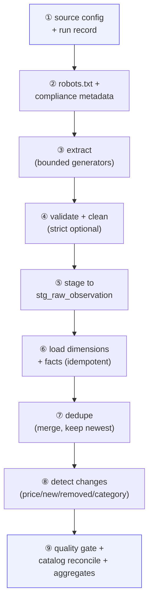
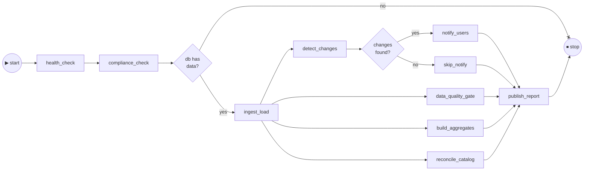
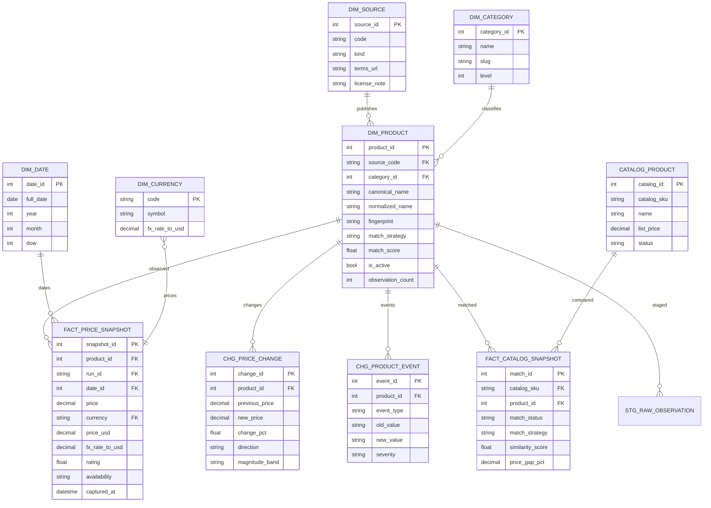
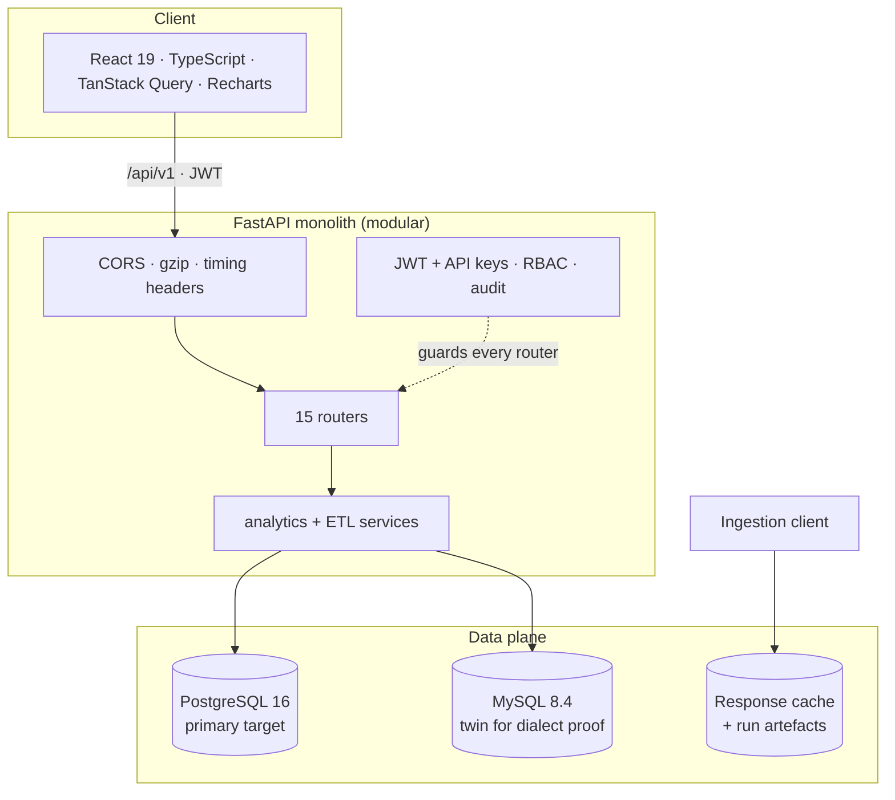
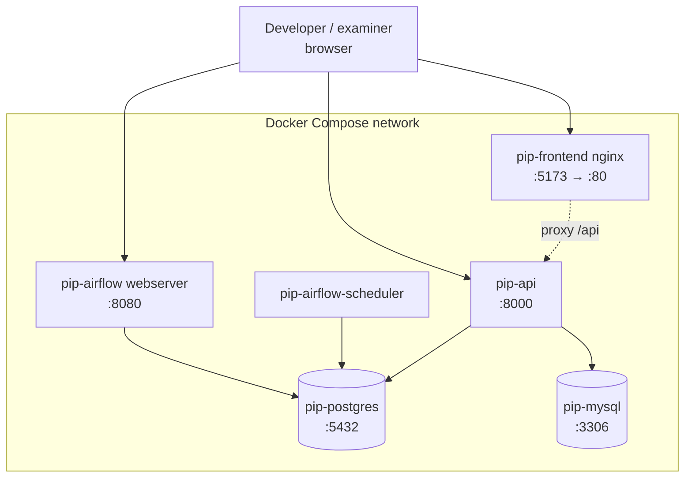

<h1 align="center">🏭 Web-to-Warehouse Product Intelligence Pipeline</h1>

<p align="center">
  
  
  
  
  
  
  
  
  
  
</p>

<p align="center">
  <b>DEPI Data Engineering graduation project</b> — a production-style, compliance-first data pipeline
  that continuously harvests product information from permitted public web sources, cleans and
  normalises it, detects duplicates, loads it into a Kimball-style analytical warehouse on
  <b>PostgreSQL and MySQL</b>, measures its own data quality with <b>12 enforced rules</b>, and serves
  everything through a <b>REST API + React analytics dashboard</b> orchestrated by <b>Apache Airflow</b>.
</p>

<p align="center">
  <a href="#-quick-start">Quick start</a> ·
  <a href="#-architecture">Architecture</a> ·
  <a href="#-feature-catalogue">Features</a> ·
  <a href="#-the-pipeline">Pipeline</a> ·
  <a href="#-data-quality">Data quality</a> ·
  <a href="#-screens">Screens</a> ·
  <a href="#-documentation">Docs</a> ·
  <a href="#-repository-layout">Layout</a>
</p>

---

## 📖 Table of contents

1. [Why this project exists](#-why-this-project-exists)
2. [What was built](#-what-was-built)
3. [Quick start](#-quick-start)
4. [Architecture](#-architecture)
5. [The pipeline](#-the-pipeline)
6. [Data model](#-data-model)
7. [Data quality](#-data-quality)
8. [Feature catalogue](#-feature-catalogue)
9. [Screens](#-screens)
10. [Security](#-security)
11. [Testing and verification](#-testing-and-verification)
12. [Performance](#-performance)
13. [Repository layout](#-repository-layout)
14. [Documentation](#-documentation)
15. [Roadmap](#-roadmap)
16. [Team](#-team)

---

## 🎯 Why this project exists

A retailer needs the market picture every morning: what competitors charge, what is in stock,
what appeared or disappeared, and how all of it compares to the internal catalog. Collecting that
information by hand is slow, inconsistent and error-prone; spreadsheets go stale the moment they
are exported.

**This project replaces the manual process with one continuously orchestrated system:**

| Without the pipeline | With the pipeline |
| --- | --- |
| Hours of manual copy-paste from shopping sites | Fully automated ingestion every run |
| Inconsistent names, categories and price formats | Normalised product names, taxonomy and USD prices |
| Same product recorded two or three times | Fuzzy deduplication with a 0.90 threshold |
| No history — "what was the price last week?" | Every snapshot stored; price changes detected per run |
| "Is the web data even usable?" | 12 enforced DQ rules with a measured score on every load |
| Data locked inside someone's laptop | REST API + dashboard with roles, audit trail and exports |

Everything is engineered like a production system, not a demo: robots.txt is enforced in the
transport layer, rate limits and circuit breakers protect the sources, every outbound request is
audited, every table is typed for two SQL dialects, and quality is measured rather than assumed.

---

## 🧱 What was built

| Component | Technology | Scale |
| --- | --- | --- |
| **Ingestion** | 5 source adapters (3 JSON APIs, 1 BeautifulSoup/lxml HTML scraper, 1 offline synthetic) | robots.txt gate, token-bucket rate limiter, sliding-window ceiling, circuit breaker, response cache, per-request audit log |
| **Cleaning** | 29-step normalisation engine | product names, categories, 18+ currencies → USD via offline FX table, rating and availability vocabularies |
| **Deduplication** | 4-signal fuzzy matcher | jaro-winkler + token-set + trigram + digit signatures, block-indexed for O(n) candidate pools |
| **Warehouse** | SQLAlchemy 2.0 Core ORM | **23 physical tables, 20 analytical views**, identical schema on PostgreSQL 16 and MySQL 8.4 |
| **ETL** | 9-stage Python pipeline | stage timings, counters, warnings, resumable staging table, idempotent runs |
| **Orchestration** | Apache Airflow 2.10 DAG | 13 tasks, branch-on-changes, alert fan-out, report publication, sync-run API for demos |
| **Data quality** | 12-rule framework, 6 dimensions | completeness, validity, uniqueness, accuracy, consistency, timeliness → weighted score |
| **Change detection** | SQL + event engine | price changes banded by magnitude, new/removed products, category drift, lifecycle events |
| **REST API** | FastAPI | **104 operations in 15 routers**, JWT + API-key auth, RBAC (admin / analyst / viewer), OpenAPI docs, gzip, timing headers |
| **Dashboard** | React 19 + TypeScript + Tailwind + Recharts | 17 screens, light/dark/system themes, 6 accent colours, 3 densities, command palette, PWA installable, responsive from 320 px |
| **CLI** | Typer, 12 commands | bootstrap, seed, run, report, verify, quality, sources preview |
| **Ops** | Docker Compose (6 services), Makefile (30+ targets), GitHub Actions CI | one-command everything |

**Measured facts (reproducible, see docs/19):**

```text
23 physical tables · 20 analytical views · 104 REST operations in 15 routers
12 DQ rules across 6 dimensions · score 98.26 on BOTH engines
5 ingestion sources · 9 pipeline stages · 13 Airflow tasks
130 unit tests · 78/78 API smoke checks · p95 API latency ≤ 38.2 ms
Demo dataset: 130 products, 8,452 price snapshots, 8,062 price changes, 8,476 lifecycle events
```

---

## ⚡ Quick start

### Option A — full stack in Docker (recommended)

```bash
git clone https://github.com/Ahmedbakr78/Web-to-Warehouse-Product-Intelligence-Pipeline.git
cd Web-to-Warehouse-Product-Intelligence-Pipeline

cp .env.example .env          # then edit secrets (or keep the demo defaults)
make up                       # postgres + mysql + api + airflow + frontend
make db-wait                  # block until both databases are healthy

# one-time: schema + views + demo users + 150-day demo dataset
make bootstrap
make demo-postgres            # --database mysql for the MySQL twin

open http://localhost:5173    # dashboard (admin@example.com / Admin@12345)
open http://localhost:8000/docs   # interactive OpenAPI docs
```

### Option B — local Python + Vite (fastest dev loop)

```bash
python3 -m venv .venv
.venv/bin/pip install -e ".[postgres,mysql,dev,scrapy]"

docker compose up -d postgres mysql     # databases only
.venv/bin/python -m app.cli.main bootstrap
.venv/bin/python -m app.cli.main seed-demo --days 150

# terminal 1
.venv/bin/python -m uvicorn app.api.main:app --reload --port 8000
# terminal 2
cd frontend && npm install && npm run dev
```

### Option C — one command verification gate

```bash
make everything   # install → env → databases → bootstrap → demo → pipeline → tests → frontend build
make check        # lint + types + unit tests only (no services required)
```

### Demo accounts

| Role | Email | Password | Can do |
| --- | --- | --- | --- |
| Admin | `admin@example.com` | `Admin@12345` | everything: sources, users, settings, triggers, audit |
| Analyst | `analyst@example.com` | `Analyst@12345` | read, query lab, run pipeline, saved views, alerts |
| Viewer | `viewer@example.com` | `Viewer@12345` | read, query lab, exports |

> Machine clients can skip humans entirely: create an API key in the dashboard
> (`Account → API keys`) and send `Authorization: Bearer pip_…`.

---

## 🏗 Architecture

### System overview


### Pipeline stages (one run)



### Airflow DAG shape



### ER diagram (warehouse core)



### Application stack (layered)



### Data flow (level 1)


### Deployment view



---

## 🔄 The pipeline

1. **Configure** — every run gets a `run_id`; sources declare compliance metadata (terms URL,
   license note, rate limit, minimum delay).
2. **Comply** — robots.txt is fetched, cached and checked *in the transport layer*; the effective
   delay is `max(global delay, per-minute budget, Crawl-delay)`; a host that fails five times in a
   row is circuit-broken with zero network I/O.
3. **Extract** — sources are lazy generators; `_safe_take` bounds them so a misbehaving source
   cannot hang the run.
4. **Validate + clean** — 29 normalisation steps with honest DQ flags; `--strict` rejects any
   record with a missing price.
5. **Stage** — clean rows land in `stg_raw_observation` (a resumable staging table), never straight
   into facts.
6. **Load** — dimensions and facts are merged idempotently (upsert on natural keys).
7. **Deduplicate** — blocked fuzzy matching (jaro-winkler + token-set + trigram + digit signature)
   merges duplicates above 0.90 while keeping the newest observations.
8. **Detect changes** — price changes banded by magnitude (`flash_sale` → `minor`), plus
   `new`, `removed` and `category_changed` lifecycle events.
9. **Quality + reconcile + aggregate** — the 12-rule framework writes `dq_rule_result` rows; the
   catalog matcher writes `fact_catalog_snapshot` rows with price gaps; `agg_category_daily`
   materialises daily category analytics.

Trigger it any of three ways: **Airflow** (scheduled, production), **API** (`POST /pipeline/run/sync`,
dashboard button), or **CLI** (`make run-pipeline`). All three produce the same `etl_run` record.

---

## 🗄 Data model

Kimball-style star schema, **dialect-portable between PostgreSQL and MySQL** (both load the same
model, and `make verify-dialects` proves there is no structural drift):

| Group | Tables |
| --- | --- |
| Dimensions | `dim_product`, `dim_category`, `dim_source`, `dim_currency`, `dim_date` |
| Facts | `fact_price_snapshot` (grain: product × source × captured_at), `fact_catalog_snapshot` (grain: catalog SKU × run) |
| Aggregates | `agg_category_daily` (grain: category × date) |
| Change events | `chg_price_change`, `chg_product_event` |
| Staging | `stg_raw_observation` (resumable, DQ-audited) |
| Operations | `etl_run`, `dq_rule_result`, `sync_state`, `ingestion_http_log` |
| App | `app_user`, `app_api_key`, `app_setting`, `app_saved_view`, `app_alert_rule`, `app_notification`, `app_audit_log` |
| Catalog | `catalog_product` (the retailer's internal SKUs) |

**20 analytical views** (`db/views.sql`) cover everything the dashboard shows: latest prices,
top movers, category indexes, availability mix, source coverage, quality trends, dedupe evidence,
price bands, new/removed feeds, drift matrices and more. The Query Lab exposes all of them
through a **read-only** SQL console (SELECT-only guard, LIMIT enforcement, 20 pre-built examples).

Historical prices are first-class: every snapshot keeps the native price **and** the USD price with
the FX rate used, so currency analysis never depends on a lookup service at query time.

---

## ✅ Data quality

Twelve enforced rules across six dimensions, evaluated **on every load** with persisted verdicts:

| Code | Dimension | Rule (abridged) |
| --- | --- | --- |
| DQ001 | Completeness | Product name present and non-empty |
| DQ002 | Completeness | Price present on active products |
| DQ003 | Validity | Price is a positive, parseable number |
| DQ004 | Validity | Rating within 0–5 or null |
| DQ005 | Uniqueness | One canonical row per fingerprint |
| DQ006 | Consistency | Snapshot grain respected (product × source × time) |
| DQ007 | Accuracy | USD price within ±5 % of native price × FX |
| DQ008 | Validity | Availability in the normalised vocabulary |
| DQ009 | Completeness | Category resolved for ≥ 90 % of products |
| DQ010 | Consistency | Change percentages consistent with prices |
| DQ011 | Timeliness | Fresh observation for every active product |
| DQ012 | Validity | Staging rejection rate below 5 % |

Current score: **98.26** (11 pass / 1 warn / 0 fail) — identical on PostgreSQL and MySQL.
The trend is charted on the Quality screen over 90 days.

---

## 🧰 Feature catalogue

The exhaustive, file-referenced inventory lives in [docs/19_feature_list.md](docs/19_feature_list.md)
(220+ features in 13 areas). The highlights:

### Ingestion and web compliance
- 🛡 robots.txt gate in the transport layer (RFC 9309 semantics, per-host cache, Crawl-delay)
- 🚦 Token-bucket rate limiter + sliding-window per-minute ceiling + circuit breaker
- 🔁 Exponential backoff, `Retry-After` (delta and HTTP-date), disk response cache with TTL
- 📜 Per-request HTTP audit log (URL, status, latency, bytes, robots decision, retries)
- 🧩 5 pluggable source adapters behind one abstract contract, registered by decorator
- ⏱ Bounded extraction (`--limit`, generator-based, failure isolation → run continues as `partial`)

### Cleaning and normalisation
- 🧹 29-step product-name cleaner (promo prefixes/suffixes, HTML, control chars, punctuation, casing)
- 🏷 Category cleaning + taxonomy slugs and levels
- 💱 Price parser for 18+ currency formats (symbols, ISO codes, European decimals, thousand groups)
- 📈 Offline FX table → USD normalisation stored with every snapshot
- ⭐ Rating + availability vocabularies normalised across sources

### Duplicate detection
- 🧬 Name fingerprint + digit-signature blocking for O(n) candidate pools
- 🔍 4-signal combined similarity: jaro-winkler, token-set, trigram, digit signatures
- 🤝 Merge strategy with full audit trail; duplicate candidates browsable per product

### Warehouse and ETL
- ⭐ Kimball star schema, 23 tables, dialect-portable
- ♻️ Idempotent, resumable, staged loads with counters and stage timings
- 🧾 Every run recorded in `etl_run` with 15+ counters and warnings

### Change detection and catalog reconciliation
- 📉 Price-change detection with magnitude bands, direction and per-run diffs
- 🆕 New / removed product events, recategorisation events, category-drift matrix
- 🏬 Internal catalog matching (exact SKU → fingerprint → fuzzy) with price-gap opportunities

### Data quality and analytics
- ✅ 12 rules × 6 dimensions, persisted verdicts, weighted score, 90-day trend
- 📊 KPI cards, daily trends, category indexes, brand leaderboards, radar comparison, heatmap
- 🧮 20 SQL views + read-only Query Lab with examples and LIMIT enforcement

### REST API and security
- 🔐 JWT access + refresh rotation, API keys (`pip_…`), Argon2id password hashing
- 🧑‍💼 RBAC: admin / analyst / viewer with per-route permission checks
- 🌐 104 operations, OpenAPI + ReDoc docs, gzip, `X-Process-Time-Ms` timing headers
- 📥 CSV + JSON exports on the API **and** in the dashboard
- 🧯 Consistent error envelope (`error`, `message`, `details`) with validation detail

### Dashboard experience (new in v1.1)
- 🌗 **Perfect light & dark modes** — system-aware, persisted, zero flash on first paint
- 🖥⌨️📱 **Installable PWA** on desktop, Android and iOS (manifest + maskable icon + safe-area)
- 🔎 **Command palette (Ctrl/Cmd-K or `/`)** — search screens **and live products**, with actions
  (toggle theme, collapse sidebar, sign out), full keyboard navigation (↑↓ ↵ esc)
- 📤 **One-click exports** — CSV and JSON on Dashboard, Products, Analytics, Changes, Query Lab
- 🎨 **Modern design system** — cards, stat tiles, badges, delta pills, skeletons, toasts, tabs,
  segmented controls, chips, drawers, modals — all theme-aware
- 📱 **Mobile-first responsive** — off-canvas sidebar drawer, sticky top bar, card grids on small
  screens, tables that hide secondary columns instead of breaking
- 🧭 **Collapsible sidebar** with persisted state, grouped navigation, permission-aware items
- 🌐 **Modern slim scrollbars** everywhere (thin, rounded, theme-aware) + `no-scrollbar` utilities
- 🤫 **Silent-reload policy** — no decorative animations, no route transitions, stale-while-revalidate
  data, 120 ms functional transitions only, `prefers-reduced-motion` respected
- 🔔 In-app notification bell with unread counters, mark-one/mark-all read
- ⚡ Global shortcuts: `/` or Ctrl-K palette, Esc closes overlays, sortable headers everywhere
- ♿ WCAG-minded: focus-visible rings, ARIA labels, keyboard operation, 320 px reflow, 200 % zoom

### Operations and DX
- 🛫 Airflow DAG (13 tasks) with branch-on-changes and notify/report fan-out
- 🐳 6-service Docker Compose stack; Nginx front-end serving + API proxy
- 🧰 Makefile with 30+ targets; Typer CLI with 12 commands; GitHub Actions CI (lint + types + tests + build)
- 🩺 Liveness/readiness endpoints, structured structlog output, slow-request warnings
- 📚 20-numbered documentation set with Mermaid diagrams rendered natively by GitHub

---

## 🖥 Screens

| Screen | What you get |
| --- | --- |
| **Dashboard** | 8 KPI tiles, price/coverage trend, availability mix donut, change-activity bars, pipeline health card, top movers table, DQ posture |
| **Products** | Faceted search, filters, column picker, sorting, paging, CSV/JSON export, per-product detail |
| **Product detail** | Price history chart, rating trend, identity/fingerprint evidence, snapshots, price changes, lifecycle events, duplicate candidates, catalog links |
| **Changes** | Summary tiles, daily activity, movers, 6 tabs: price changes, lifecycle, new, removed, recategorised, drift |
| **Analytics** | Category price index, category/brand leaderboards, radar comparison, availability analysis, source × category matrix |
| **Pipeline** | Run history with stage timings, manual trigger dialog (source + limit + dialect options), source health, schedule info |
| **Quality** | Latest report, rule catalogue, results with filters, 90-day score trend |
| **Catalog** | Internal SKUs vs scraped market prices, reconciliation summary, opportunities |
| **Sources** | Registry cards with compliance metadata, robots.txt statistics, raw-vs-cleaned preview |
| **Query Lab** | Read-only SQL console over the 20 views, table inventory, examples, CSV export |
| **Builder** | Live custom-view composer: entity, filters, sort, columns, saved-view presets |
| **Alerts** | Alert rules with thresholds and channels, notification feed, evaluate action |
| **Account** | Profile, appearance (theme/accent/density), password change, API keys |
| **Settings / Users / Audit** | Admin-only: global settings, role management, audit trail + HTTP evidence |
| **Login / 404** | Brand panel, demo-account picker, theme switch; friendly not-found screen |

---

## 🔐 Security

- **Passwords**: Argon2id (memory-hard), never stored or logged in plain text
- **Tokens**: HS256 JWT access (12 h) + refresh (30 d) with rotation and single-flight refresh on 401
- **API keys**: generated once, shown once, hashed at rest, revocable, usage-counted
- **Brute force**: 5 failed attempts → 15-minute lockout per account
- **RBAC**: viewer / analyst / admin, enforced per route server-side (not just UI-hiding)
- **Audit**: every mutating request writes user, action, IP, user-agent to `app_audit_log`
- **Crawler identity**: honest `User-Agent` with contact address; robots.txt checked before every fetch
- **Query lab**: read-only — UPDATE/DELETE/DDL refused server-side; LIMIT clamped
- **Secrets**: all secrets via environment variables; `.env` git-ignored; `.env.example` provided

---

## 🧪 Testing and verification

| Layer | Command | Evidence |
| --- | --- | --- |
| Lint + format | `make lint` | ruff: **all checks pass** |
| Static types | `make typecheck` | mypy: **no issues in 59 files** |
| Unit tests | `make test` | pytest: **130 passed** (SQLite, no services needed) |
| API regression | `.venv/bin/python scripts/api_smoke.py` | **78/78 checks** (starts its own server) |
| Frontend | `cd frontend && npm run lint && npm run typecheck && npm run build` | zero warnings, clean tsc, production build |
| Cross-dialect | `make verify-dialects` | identical model + DQ score on PostgreSQL and MySQL |
| Orchestrated | `make airflow-test` | DAG executes end-to-end for a fixed date |
| Full gate | `make everything` | installs, databases, bootstrap, demo data, pipeline run, tests, frontend build |

---

## ⚡ Performance

Measured on a laptop container stack (see docs/05 for the harness):

| Metric | Budget | Measured |
| --- | --- | --- |
| API p95 latency (12 hot endpoints) | ≤ 200 ms | **≤ 38.2 ms** |
| Pipeline run (multi-source, staged) | ≤ 60 s | **≈ 3.5 s** (demo + cached sources) |
| Bootstrap (schema + 20 views) | ≤ 10 s | **≈ 4 s** |
| Dashboard first load (lazy routes) | ≤ 2 s | **≈ 0.9 s** (gzipped chunks) |
| Repeat run with warm cache | any | **0 outbound requests** |

---

## 📂 Repository layout

```text
├── app/
│   ├── api/            # FastAPI app factory, 15 routers, schemas, security
│   ├── analytics/      # SQL analytics service (KPIs, trends, reports, views)
│   ├── cli/            # Typer CLI (bootstrap, seed, run, report, verify)
│   ├── core/           # settings, engines, logging, error envelope
│   ├── etl/            # pipeline, loader, DQ framework, seed, reconcile
│   ├── ingestion/      # base contract, robots, rate limit, HTTP client,
│   │   └── sources/    # 5 adapters (apis + scraper + synthetic)
│   └── models/         # SQLAlchemy models (dimensions, facts, ops, app)
├── dags/               # Airflow DAG: product_intelligence_pipeline
├── db/
│   └── views.sql       # 20 analytical views (PostgreSQL + MySQL)
├── frontend/           # React 19 dashboard (17 screens, PWA)
│   ├── public/         # manifest + icons
│   └── src/            # pages, components, hooks, libs
├── docs/               # 20 numbered documents + index
├── scripts/            # api_smoke.py regression suite (78 checks)
├── tests/              # pytest unit suite (130 tests)
├── .github/workflows/  # CI: ruff, mypy, pytest, eslint, tsc, vite build
├── docker-compose.yml  # 6 services
├── Makefile            # 30+ targets
└── pyproject.toml      # package + tool configuration
```

---

## 📚 Documentation

The full document set lives in [`docs/`](docs/README.md) — 20 numbered documents, every diagram
Mermaid-rendered natively by GitHub, every number tied to a runnable command:

| # | Document |
| --- | --- |
| 01 | Project Proposal |
| 02 | Project Plan (12-week Gantt) |
| 03 | Roles & Responsibilities (RACI) |
| 04 | Risk Assessment (20-risk register) |
| 05 | KPIs (20 KPIs with runnable SQL) |
| 06 | Literature Review (39 verified sources) |
| 07 | Requirements (58 FRs, 26 NFRs, 20 use cases) |
| 08 | System Analysis & Design |
| 09 | Database Design (generated ERD) |
| 10 | Data Flow Diagrams (levels 0/1/2) |
| 11 | Behaviour Diagrams (sequence/activity/state/class) |
| 12 | UI/UX Design (12 wireframes, WCAG 2.1 AA) |
| 13 | Deployment (Compose, CI/CD, backups) |
| 14 | API Documentation (all 104 operations) |
| 15 | Testing Strategy (100-case plan) |
| 16 | User Manual |
| 17 | Technical Documentation (module map + algorithms) |
| 18 | Presentation Outline (defence deck) |
| 19 | Feature Inventory (220+ features) |
| 20 | Feedback & Improvements (32 items) |

---

## 🗺 Roadmap

Done in this release:

- [x] Compliance-first ingestion (robots.txt, rate limits, circuit breaker, cache, audit)
- [x] Kimball warehouse on two SQL dialects with 20 views
- [x] 12-rule DQ framework with historical trend
- [x] Change detection (price/new/removed/category) + catalog reconciliation
- [x] Airflow DAG + manual sync triggers + CLI
- [x] REST API with JWT, API keys and RBAC
- [x] React dashboard with command palette, PWA install, light/dark, exports

Next up (see docs/20 for the full prioritised list):

- [ ] Incremental SCD-2 dimension history for category changes
- [ ] Celery / Redis pipeline backend for very large runs
- [ ] Prometheus metrics endpoint + Grafana dashboard
- [ ] Webhook + email alert channels in addition to in-app notifications
- [ ] Multi-tenant catalog spaces with per-team saved views
- [ ] DBT models alongside the hand-written views
- [ ] Playwright end-to-end suite for the dashboard

---

## 👥 Team

Built by the **DEPI Data Engineering graduation team** — project lead and engineer
[Ahmed Abobakr](https://github.com/Ahmedbakr78), advised by the DEPI programme mentors.
Full role breakdown and RACI in [docs/03_roles_and_responsibilities.md](docs/03_roles_and_responsibilities.md).

## 📄 License

MIT — see [LICENSE](LICENSE).
