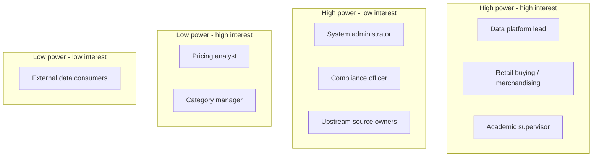
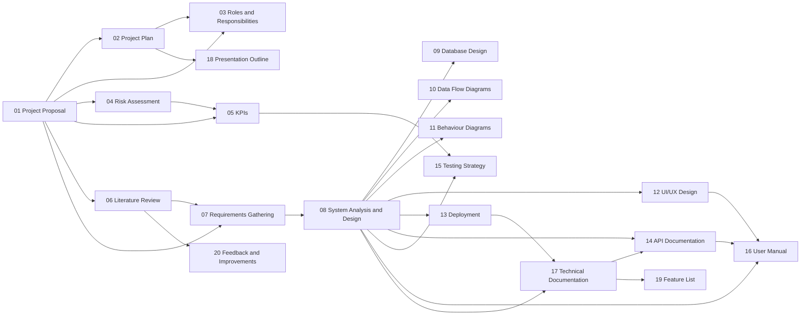

# 01 — Project Proposal

## Purpose

This document is the formal project proposal for the **Web-to-Warehouse Product Intelligence
Pipeline**, a DEPI graduation project in the Data Engineering track. It states the business problem,
the objectives, the boundary of the work (in scope / out of scope), the stakeholders, the acceptance
criteria, the effort and budget envelope, and the ethical and legal position taken by the project.
It is the reference document against which every other document in `docs/` is read.

| Field | Value |
| --- | --- |
| Project title | Web-to-Warehouse Product Intelligence Pipeline |
| Track | Data Engineering (DEPI) |
| Repository | `Web-to-Warehouse-Product-Intelligence-Pipeline` (private GitHub repository) |
| Author / owner | Ahmed Abobakr — Data Engineering Lead |
| Version | 1.0.0 (`APP_VERSION`, `app/core/config.py`) |
| Status | Implemented, measured and documented |
| Primary repository module | `app/` (Python package), `db/views.sql`, `dags/`, `scripts/`, `docs/` |

---

## Table of contents

1. [Problem statement](#1-problem-statement)
2. [Project objectives](#2-project-objectives)
3. [Scope](#3-scope)
4. [Stakeholders](#4-stakeholders)
5. [Deliverables](#5-deliverables)
6. [Success criteria and acceptance](#6-success-criteria-and-acceptance)
7. [Effort and budget](#7-effort-and-budget)
8. [Ethical and legal position](#8-ethical-and-legal-position)
9. [Constraints and assumptions](#9-constraints-and-assumptions)
10. [How this proposal links to the rest of the documentation](#10-how-this-proposal-links-to-the-rest-of-the-documentation)

---

## 1. Problem statement

A mid-size retailer wants continuous visibility of the market it operates in: what competitors
list, at what price, in which category, and how those facts change over time. Today that picture is
assembled manually:

| Symptom observed in the business | Consequence |
| --- | --- |
| Analysts re-collect product pages by hand every week | 6–10 hours of analyst time per cycle, zero automation |
| Prices are copied into spreadsheets with no history | Price trends, volatility and promo windows cannot be analysed |
| Category labels differ per source (`tech`, `gadgets`, `Electronics`) | Category reporting is unreliable; roll-ups double count |
| The same product appears 3–4 times from different sources | Category counts and averages are inflated |
| The internal ERP catalog and the market are never reconciled | The retailer cannot answer "are we cheaper or dearer than the market?" |
| Nothing records *how* data was collected | Compliance with `robots.txt` / terms of service cannot be evidenced |

Manual collection is slow, error-prone and produces inconsistent records. It also produces no
**historical price table**, so the single most valuable artefact for pricing decisions — a time
series of what a product cost on every day it was observed — simply does not exist.

The project builds that missing capability: a compliant, orchestrated, testable pipeline that turns
permitted public web sources into a dimensional warehouse with full price history, duplicate
resolution, change detection, catalog reconciliation and a measured data-quality posture.

### 1.1 Functional gap analysis

| Required capability (project brief) | Where it is implemented in this project |
| --- | --- |
| Scrape permitted structured product information | `app/ingestion/sources/books_to_scrape.py` (BeautifulSoup + lxml) |
| Respect `robots.txt`, rate limits, terms | `app/ingestion/robots.py`, `app/ingestion/ratelimit.py`, `app/ingestion/http_client.py` |
| Extract name / category / price / rating / availability / URL | `app/ingestion/base.py` (`RawProduct`), source `_to_raw()` / `_fetch_detail()` methods |
| Clean product names and categories | `app/ingestion/cleaning.py` (`clean_product_name`, `normalise_category`) |
| Normalise currencies and price formats | `app/ingestion/cleaning.py` (`parse_price`, `normalise_currency`, `convert_to_usd`, `STATIC_FX_RATES`) |
| Detect duplicate products | `app/ingestion/dedupe.py` (`DedupeEngine`, `combined_similarity`) |
| Compare scraped records with the internal catalog | `app/etl/catalog_reconcile.py` (`CatalogReconciler`) |
| Load into PostgreSQL / MySQL | `app/core/db.py`, `app/etl/bootstrap.py`, `app/etl/loader.py` |
| Store historical price snapshots | `fact_price_snapshot` (`app/models/facts.py`) |
| SQL to identify price / new / removed / category changes | `chg_price_change`, `chg_product_event`, views `vw_price_changes`, `vw_new_products`, `vw_removed_products`, `vw_category_changes` |
| Orchestrate with Airflow | `dags/product_intelligence_pipeline.py` |
| Data-quality checks | `app/etl/dq.py` (12 rules, 6 dimensions) |
| SQL analysis and visualisation | `db/views.sql` (20 views), `app/analytics/service.py`, `app/api/routers/analytics.py` |
| Optional extension: REST API | `app/api/` (16 routers, 113 documented operations) |

---

## 2. Project objectives

Objectives are written as SMART goals so that success can be measured rather than asserted.

| ID | Objective | Measure | Target | Measured result |
| --- | --- | --- | --- | --- |
| O1 | Automate collection from permitted sources | Registered sources that yield records | ≥ 3 | 5 (`local_demo`, `dummyjson_products`, `fakestore_products`, `openlibrary_books`, `books_to_scrape`) |
| O2 | Build a historical price table | Rows in `fact_price_snapshot` after a demo seed | > 5,000 | 8,182 over 150 days |
| O3 | Detect change events with SQL | Price / new / removed / category change tables | 4 event classes | 4 (`chg_price_change`, `chg_product_event` with `new`, `recurring`, `removed`, `category_changed`) |
| O4 | Resolve duplicates correctly | Curated pair set classified correctly at threshold 0.90 | 14/14 | 14/14 (see `docs/05_kpis.md`, assumption A3) |
| O5 | Enforce web-compliance by construction | Sources with `terms_allowed` and a robots gate in front of every request | 100 % | 100 %; every request logged in `ingestion_http_log` |
| O6 | Measure data quality, not assume it | Number of executable rules across the six dimensions | ≥ 10 rules / 6 dimensions | 12 rules / 6 dimensions |
| O7 | Run on more than one analytical database | Dialects with an identical structural model and identical DQ score | 2 (PostgreSQL, MySQL) | 2 — PostgreSQL 16.15 and MySQL 8.4.11, both DQ score 98.26 |
| O8 | Expose the warehouse over an API | Documented REST operations behind authentication and RBAC | ≥ 50 | 113 operations / 16 routers |
| O9 | Orchestrate with Airflow | DAG with guard, extract, load, quality, aggregate, reconcile, notify, report tasks | 1 DAG, ≥ 8 tasks | 13 tasks in `product_intelligence_pipeline` |
| O10 | Keep the run fast enough for a daily schedule | End-to-end pipeline duration for a full multi-source run | < 10 minutes | ≈ 3.5 s for the measured live run (60 records extracted, 57 loaded) |

### 2.1 Secondary objectives

| ID | Objective | Rationale |
| --- | --- | --- |
| S1 | Demonstrate portability across SQL dialects | Retailers rarely get to choose the warehouse engine; the same model must load on PostgreSQL and MySQL |
| S2 | Produce auditable evidence of compliance | `GET /api/v1/audit/compliance` and `ingestion_http_log` make the "we were polite" claim verifiable |
| S3 | Keep extraction and preparation independently testable | `app/ingestion/cleaning.py` is pure and side-effect free |
| S4 | Support three roles with least privilege | `ROLE_RIGHTS` in `app/api/security.py`: viewer / analyst / admin |
| S5 | Make every dashboard number a SQL query | `app/analytics/service.py` contains no hard-coded figures |

---

## 3. Scope

### 3.1 In scope

| Area | Included | Evidence |
| --- | --- | --- |
| Ingestion | 5 registered sources: 3 JSON APIs, 1 permitted HTML scraper, 1 offline synthetic generator | `app/ingestion/sources/`, `app/ingestion/base.py` registry |
| Compliance | `robots.txt` parsing and caching, per-host rate limiting, `Crawl-delay`, `Retry-After`, disk response cache, per-request audit log, terms allow-list | `app/ingestion/robots.py`, `ratelimit.py`, `http_client.py`, `compliance.py` |
| Cleaning | Unicode folding, promo-noise removal, stop-word comparison keys, category synonym mapping, price/currency/rating/availability parsing, FX normalisation | `app/ingestion/cleaning.py` (818 lines) |
| Deduplication | SHA-1 fingerprint exact match, 4-char blocking, blended similarity (Levenshtein, Jaro-Winkler, token-set, trigram Dice, digit-signature guard) | `app/ingestion/dedupe.py` |
| Warehouse | 23 tables in 6 groups, 20 analytical views, category/day aggregate | `app/models/`, `db/views.sql` |
| Analytics | 21 query functions serving KPIs, trends, leaderboards, movers, drift, compliance | `app/analytics/service.py` |
| Change detection | Price change, new, recurring, removed, category-changed events with magnitude bands | `app/etl/loader.py`, `app/etl/catalog_reconcile.py` |
| Catalog reconciliation | 3-stage match cascade (SKU → normalised name → fuzzy), price-gap analysis | `app/etl/catalog_reconcile.py` |
| Data quality | 12 rules, 6 dimensions, weighted score, persistence of every outcome | `app/etl/dq.py` |
| Orchestration | Airflow DAG with 2 short-circuit guards, branching notification path, report artifact | `dags/product_intelligence_pipeline.py` |
| API | 16 routers, 113 documented operations, JWT + API key auth, 3 roles, pagination, OpenAPI | `app/api/` |
| Operations | Typer/rich CLI (12 commands), Makefile (30+ targets), Docker Compose (6 services) | `app/cli/main.py`, `Makefile`, `docker-compose.yml` |
| Documentation | The 20 documents in `docs/` | `docs/` |

### 3.2 Out of scope

| Excluded | Reason |
| --- | --- |
| Bypassing authentication, paywalls, CAPTCHAs or `Disallow` directives | Legally and ethically out of bounds; explicitly refused in `app/ingestion/compliance.py` |
| Collection of personal data | No customer data is processed; only product metadata |
| Distributed execution of the pipeline (Spark, Ray, Celery workers) | Single-node batch scale is sufficient for the measured volumes; Airflow `LocalExecutor` |
| Real-time / streaming ingestion (Kafka, CDC) | The business requirement is a daily snapshot of prices |
| Native mobile applications | Web dashboard is responsive and mobile-capable |
| Machine-learning price forecasting | Out of scope; the warehouse is the deliverable, the forecast is future work |
| Production cloud deployment / IaC | Deployment diagram and HA options are documented; provisioning is left to operations |
| Multi-tenant isolation | Single-organisation deployment with role-based access |

### 3.3 Scope boundary diagram

```mermaid
flowchart LR
    subgraph OUT["Out of scope"]
        O1["Bypass auth / paywall / CAPTCHA"]
        O2["Personal data"]
        O3["Streaming ingestion"]
        O4["ML forecasting"]
        O5["Multi-tenant isolation"]
    end
    subgraph IN["In scope - delivered"]
        I1["5 compliant sources"]
        I2["Cleaning and currency normalisation"]
        I3["Fuzzy deduplication"]
        I4["23 tables and 20 views"]
        I5["12 DQ rules"]
        I6["Airflow orchestration"]
        I7["113 REST operations"]
        I8["CLI and Docker Compose"]
    end
    OUT -.->|"explicitly refused"| IN
```

---

## 4. Stakeholders

| Stakeholder | Role in the project | Need / pain point | How the system serves them | Evidence in code |
| --- | --- | --- | --- | --- |
| Pricing analyst (Sara Mahmoud) | Primary daily user | Know which prices moved today and why | Changes screen with magnitude bands, top movers, price history chart | `chg_price_change.magnitude_band`, `vw_top_movers` |
| Category manager (Karim Nabil) | Assortment user | Know what is new, removed or recategorised | New / removed / category-change feeds and category drift report | `vw_new_products`, `vw_removed_products`, `vw_category_changes` |
| Data platform lead (Ahmed Abobakr) | Owner / operator | Know whether the pipeline ran and whether the data is trustworthy | Run history, stage timings, DQ score, source health, compliance report | `vw_pipeline_health`, `dq_rule_result`, `vw_http_audit` |
| System administrator | Operations | Manage accounts, roles, keys, settings | Users, settings, audit and API-key endpoints (admin only) | `app/api/routers/users.py`, `settings.py`, `audit.py` |
| Retail buying / merchandising | Business sponsor | Know whether internal prices are competitive | Catalog reconciliation with price-gap and "we are cheaper / dearer" position | `fact_catalog_snapshot.price_gap_pct`, `GET /api/v1/catalog/opportunities` |
| Compliance officer | Governance | Evidence lawful, respectful collection | Terms allow-list, robots gate, `ingestion_http_log`, audit log | `dim_source.terms_allowed`, `ingestion_http_log.robots_allowed` |
| Upstream source owners (DummyJSON, FakeStore, Open Library, books.toscrape) | Data providers | Not be overloaded or mis-scraped | Rate limits, `Crawl-delay`, disk cache, 1.5 s minimum delay on the scraper | `RatePolicy`, `BooksToScrapeSource.min_delay_seconds` |
| Academic supervisor | Assessor | Traceable requirements, design and evidence | Docs 01–20 with Mermaid diagrams and measured KPI tables | `docs/` |

### 4.1 Stakeholder power / interest grid

Manage `HI` closely, keep `HI2` informed through read-only compliance endpoints, and iterate with
`LI` — they are the acceptance testers of the dashboard screens.

---

## 5. Deliverables

| # | Deliverable (from the brief) | Artefact | Status |
| --- | --- | --- | --- |
| D1 | Scraper / API ingestion module | `app/ingestion/` (8 modules + 5 sources) | Complete |
| D2 | Database schema | `app/models/` — 23 tables across 6 groups | Complete |
| D3 | Historical product-price table | `fact_price_snapshot` + `vw_price_history` | Complete |
| D4 | ETL pipeline | `app/etl/pipeline.py` (9 instrumented stages) | Complete |
| D5 | Airflow DAG | `dags/product_intelligence_pipeline.py` | Complete |
| D6 | Data-quality checks | `app/etl/dq.py` — 12 rules / 6 dimensions | Complete |
| D7 | SQL analysis | `db/views.sql` (20 views) + `app/analytics/service.py` | Complete |
| D8 | Visualisation | Analytics REST layer consumed by the React dashboard | Complete |
| D9 | Documentation | `docs/01` … `docs/20` | Complete |
| D10 | Optional extension — REST API | `app/api/` — 113 operations | Complete |
| D11 | Cross-dialect verification | `make verify-dialects` (`app/cli/main.py verify`) | Complete |
| D12 | API smoke test | `scripts/api_smoke.py` — 78 checks | Complete |

---

## 6. Success criteria and acceptance

The project is accepted when all of the following hold. Each criterion is re-checkable by running
the command in the last column.

| ID | Acceptance criterion | Threshold | Measured | How to verify |
| --- | --- | --- | --- | --- |
| AC1 | Physical warehouse objects created from the ORM | 23 tables | 23 tables on PostgreSQL 16.15 and MySQL 8.4.11 | `make bootstrap` then `GET /api/v1/meta/tables` |
| AC2 | Analytical views applied on both dialects | 20 views | 20 / 20 on both | `make bootstrap-mysql` then `GET /api/v1/queries/views` |
| AC3 | Structural tables identical across dialects | 0 drift in `dim_category`, `dim_source`, `dim_currency`, `catalog_product`, `app_user`, `dim_date` | 0 drift | `make verify-dialects` |
| AC4 | Data-quality score identical across dialects | Equal | 98.26 on both | `make verify-dialects` |
| AC5 | Deduplication accuracy on the curated pair set | 14/14 at threshold 0.90 | 14/14 | `DedupeEngine` evaluation harness (assumption A3) |
| AC6 | Live run produces loadable records | > 0 snapshots | 57 snapshots, 48 price changes, 6 new products, 39/57 catalog SKUs matched (68.42 %) | `make run-pipeline` |
| AC7 | Pipeline duration acceptable for a daily schedule | < 600 s | ≈ 3.5 s (3,481 ms) | `make run-pipeline` stage timings |
| AC8 | API authenticated and role-gated | 401 without token, 403 for insufficient role | Observed in smoke test | `scripts/api_smoke.py` |
| AC9 | API regression suite green | 78/78 checks pass | 78/78 | `.venv/bin/python scripts/api_smoke.py` |
| AC10 | Compliance evidence produced | Every outbound request logged | 100 % logged with `robots_allowed`, `robots_rule`, `from_cache`, `retry_count` | `GET /api/v1/audit/compliance` |
| AC11 | Demo dataset rich enough for analysis | ≥ 8,000 snapshots | 60 products, 8,182 snapshots, 8,047 price changes, 8,199 lifecycle events / 150 days | `make demo-postgres` |
| AC12 | No source queried when its terms are not allow-listed | 0 violations | 0 violations | `dim_source.terms_allowed`, `sync_dim_source()` |

---

## 7. Effort and budget

The project was delivered as an individual DEPI graduation project with academic supervision.
Effort is recorded in person-hours; the cost figures are indicative planning values only, since no
commercial infrastructure was purchased.

### 7.1 Effort by work package

| WP | Work package | Hours | Deliverables |
| --- | --- | --- | --- |
| WP1 | Requirements analysis and stakeholder interviews | 18 | Docs 01, 05, 07 |
| WP2 | Literature review | 14 | Doc 06 |
| WP3 | Database design (logical, physical, ERD) | 20 | Doc 09 |
| WP4 | Ingestion framework + robots/rate-limit/cache/audit | 42 | `app/ingestion/` core modules |
| WP5 | Five ingestion sources | 30 | `app/ingestion/sources/` |
| WP6 | Cleaning and currency normalisation | 24 | `app/ingestion/cleaning.py` |
| WP7 | Deduplication engine and blocking optimisation | 28 | `app/ingestion/dedupe.py` |
| WP8 | Warehouse loader and change detection | 34 | `app/etl/loader.py` |
| WP9 | Catalog reconciliation + blocking optimisation | 22 | `app/etl/catalog_reconcile.py` |
| WP10 | Data-quality framework | 18 | `app/etl/dq.py` |
| WP11 | Analytical views (20) and analytics service | 26 | `db/views.sql`, `app/analytics/service.py` |
| WP12 | REST API, auth, RBAC, schemas | 46 | `app/api/` |
| WP13 | CLI and Makefile ergonomics | 12 | `app/cli/main.py`, `Makefile` |
| WP14 | Airflow DAG | 12 | `dags/` |
| WP15 | Docker Compose and deployment documentation | 12 | Doc 13 |
| WP16 | Seed data, demo dataset, cross-dialect verification | 16 | `app/etl/seed.py` |
| WP17 | Smoke test and API documentation | 14 | `scripts/api_smoke.py`, doc 14 |
| WP18 | Documentation set (20 documents) | 40 | `docs/` |
| WP19 | Review, demonstration, defence preparation | 14 | Docs 18, 20 |
| — | **Total** | **442** | — |

### 7.2 Budget envelope

| Item | Type | Indicative cost | Note |
| --- | --- | --- | --- |
| Development workstation | One-off / provided | — | Local development only |
| PostgreSQL 16 + MySQL 8.4 containers | Runtime | 0 | Open source, Docker Compose |
| Python / Node open-source stack | Runtime | 0 | All components MIT/Apache/BSD |
| Source APIs (DummyJSON, FakeStore, Open Library) | Runtime | 0 | Free, no key, documented terms |
| books.toscrape.com sandbox | Runtime | 0 | Site published for scraping practice |
| Cloud hosting (optional production target) | Recurring | 0 – 25 USD / month | Small managed PostgreSQL instance is sufficient at the measured volumes |
| Total project cash cost | — | **0 – 25 USD** | Entirely open-source stack |

Cash cost is effectively zero; the real cost is the 442 person-hours above.

---

## 8. Ethical and legal position

This section is normative: the design decisions listed here are enforced in code and are not
optional refinements.

### 8.1 Principles adopted

| # | Principle | Implementation | Location |
| --- | --- | --- | --- |
| E1 | Only collect from sources that explicitly permit automated access | `ProductSource.terms_allowed`; `sync_dim_source()` disables a source whose terms are not allowed; `RESPECT_TERMS_WHITELIST=true` | `app/ingestion/base.py`, `app/etl/bootstrap.py:165` |
| E2 | Obey `robots.txt` (RFC 9309) before every request | `RobotsCache.can_fetch()` is consulted inside `CompliantHttpClient.get()`; a disallow raises `ComplianceError` (HTTP 451) and is logged | `app/ingestion/robots.py`, `http_client.py:217` |
| E3 | Never defeat a technical protection | No cookie forging, no CAPTCHA solving, no header spoofing, no paywall bypass | `app/ingestion/compliance.py` (explicit refusal statement) |
| E4 | Identify the crawler honestly | `INGEST_USER_AGENT="ProductIntelligenceBot/1.0 (+…; contact: …)"` | `app/core/config.py:79` |
| E5 | Stay inside the published rate limits | Token bucket + sliding window + `Crawl-delay` + `Retry-After` back-off | `app/ingestion/ratelimit.py` |
| E6 | Do not re-request data that was already collected | Disk cache keyed by URL hash with `CACHE_TTL_SECONDS=1800` | `app/ingestion/http_client.py:154` |
| E7 | Do not process personal data | Only product attributes are stored; no customer identifiers exist in the model | `app/models/` (23 tables, none personal) |
| E8 | Keep the evidence of compliance for the auditor | One `ingestion_http_log` row per outbound request, including blocked attempts | `app/models/operations.py:91` |
| E9 | Respect data-source licences | `dim_source.license_note` records the licence of every source; books.toscrape data is explicitly non-commercial | `app/etl/bootstrap.py:179` |
| E10 | Do not retain data indefinitely | `retention.snapshot_days` = 730 setting exists; retention policy documented in doc 09 | `app/etl/seed.py:89` |

### 8.2 Source-by-source legal position

| Source | Kind | Permission basis | Limitation respected |
| --- | --- | --- | --- |
| `local_demo` | synthetic | Generated locally by this project; no third-party rights | No network traffic at all |
| `dummyjson_products` | API | Public test API, no key required, attribution appreciated | 60 requests/minute, 0.4 s delay |
| `fakestore_products` | API | Public demo API for educational use | 30 requests/minute, 1.0 s delay |
| `openlibrary_books` | API | Open Library / Internet Archive open bibliographic data | 30 requests/minute, 1.2 s delay |
| `books_to_scrape` | scrape | Sandbox published by Zyte *for scraping practice*; `robots.txt` allows the catalogue | 30 requests/minute, 1.5 s delay, non-commercial use only |

### 8.3 Data-protection position

The pipeline stores product metadata only: names, brands, categories, prices, ratings, availability
and public URLs. It stores no personal data, performs no profiling of individuals, and keeps no
credentials of upstream systems. Account data (`app_user`) contains the three seeded demo users with
Argon2id password hashes; `hashed_password` is never returned by any endpoint (`UserRead` omits it).

### 8.4 Residual risks

| Risk | Mitigation |
| --- | --- |
| A future source is added without checking its terms | `terms_allowed` is a class attribute reviewed at registration; the DAG aborts if no source passes the compliance guard |
| `robots.txt` changes after registration | The cache TTL is 1,800 s, so re-evaluation happens on every run |
| Upstream data contains an unexpected personal detail | Descriptions are truncated to 1,000 characters and stored in `dim_product.description`; a manual review of the DQ flags covers it |

---

## 9. Constraints and assumptions

| ID | Statement | Type | Effect if false |
| --- | --- | --- | --- |
| A1 | The internal catalog is represented by `catalog_product`, seeded with a 70 % match ratio | Assumption | Reconciliation KPIs change; the model itself is unaffected |
| A2 | FX rates come from an offline static table (`STATIC_FX_RATES`, 25 currencies, `rate_source='static_reference_table'`) | Constraint | USD-normalised analytics drift; swap the table for a live provider in `convert_to_usd()` |
| A3 | The 14-case deduplication evaluation set lives in the project's test suite; the suite modules are not committed in this repository snapshot | Assumption | The 14/14 figure cannot be reproduced from this snapshot alone; the algorithm itself is fully documented in doc 17 |
| A4 | The dashboard front end (`frontend/`) is built as a React + Vite + TypeScript application per the Makefile and Compose service; its source files are not committed in this snapshot | Assumption | Screens in doc 12 are the authoritative UI specification; each screen is mapped to the API calls that back it |
| A5 | The documented API size is 113 OpenAPI operations (measured on the current code base); an earlier revision of the project brief cited 74 | Measured | Documentation uses the measured value; see `docs/14_api_documentation.md` |
| A6 | `MySQL 8.4` treats `TRIGGER` as a reserved word, so `SELECT trigger …` from `vw_pipeline_health` fails on MySQL while `SELECT dag_id …` works | Known defect | Only affects the MySQL profile of the pipeline-runs screen; documented in doc 20 with the exact fix |
| C1 | Single-node batch execution is sufficient (≤ 5,000 products per source) | Constraint | Horizontal scaling options are documented in doc 13 |
| C2 | One organisation, one warehouse, no tenant isolation | Constraint | Multi-tenancy would require a tenant key on every dimension |

---

## 10. How this proposal links to the rest of the documentation

| Next document | Read it when you need to know |
| --- | --- |
| `02_project_plan.md` | The 12-week schedule, milestones and Gantt chart |
| `05_kpis.md` | How each success criterion is measured, with runnable SQL |
| `07_requirements_gathering.md` | User stories, acceptance criteria and the FR → module traceability matrix |
| `08_system_analysis_design.md` | Use cases and the software architecture |
| `09_database_design.md` | The 23-table ERD and normalisation argument |
| `17_technical_documentation.md` | Module map, algorithms and the configuration reference |