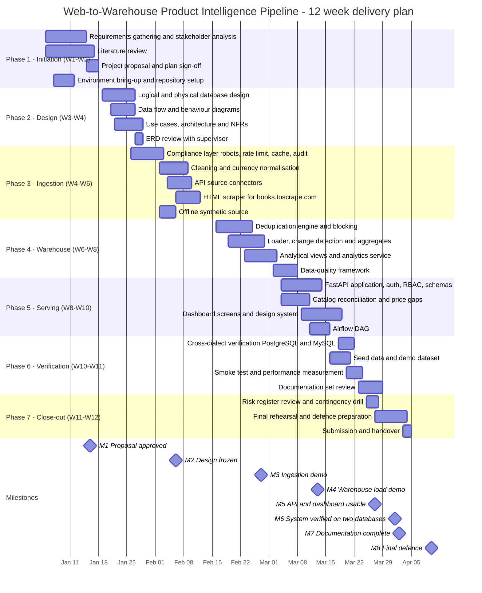
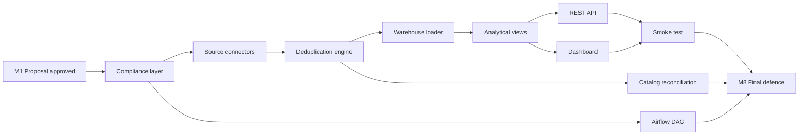

# 02 — Project Plan

## Purpose

This document turns the proposal (`01_project_proposal.md`) into an executable plan: a 12-week
timeline with a Mermaid Gantt chart, a milestone table with entry/exit criteria, a
deliverable-to-work-package matrix, a resource allocation table and the governance rhythm that the
team used. It is the reference used in the project review meetings.

| Field | Value |
| --- | --- |
| Project | Web-to-Warehouse Product Intelligence Pipeline |
| Duration | 12 weeks (W1 – W12), academic semester |
| Cadence | 2-week sprints, weekly supervisor checkpoint, demo at the end of each sprint |
| Team | 1 data-engineering lead (full time), 1 supervisor (review), 2 peer reviewers (Sprint 9–12) |

---

## Table of contents

1. [Planning approach](#1-planning-approach)
2. [12-week timeline (Gantt)](#2-12-week-timeline-gantt)
3. [Milestones](#3-milestones)
4. [Deliverables matrix](#4-deliverables-matrix)
5. [Resource allocation](#5-resource-allocation)
6. [Sprint plan](#6-sprint-plan)
7. [Governance and reporting](#7-governance-and-reporting)
8. [Critical path and slack](#8-critical-path-and-slack)

---

## 1. Planning approach

The plan follows a requirements → design → build → verify → document sequence, with two deliberate
parallel tracks:

* **Data track** — warehouse schema, cleaning, dedupe, quality, reconciliation. This is the
  academically interesting part and must be right before anything is presented.
* **Serving track** — REST API and dashboard. It consumes only the analytical views, so it can start
  as soon as `db/views.sql` is stable (end of W5).

Two hard constraints shaped the plan:

1. The warehouse must be demonstrable offline (`local_demo`), so no external dependency can block a
   sprint demonstration.
2. Cross-dialect verification requires both databases, so W1 includes the Docker Compose bring-up.

---

## 2. 12-week timeline (Gantt)

### 2.1 Week-by-week narrative

| Week | Focus | Key artefact produced | Verification command |
| --- | --- | --- | --- |
| W1 | Requirements, stakeholder map, literature | `docs/07_requirements_gathering.md`, `docs/06_literature_review.md` | Document review with supervisor |
| W2 | Proposal, plan, risk register, KPI definitions | `docs/01` … `docs/05` | Sign-off on objectives and KPIs |
| W3 | Logical schema, normalisation argument | `docs/09_database_design.md` | ERD review |
| W4 | Use cases, architecture, DFD, behaviour diagrams | `docs/08`, `docs/10`, `docs/11` | Design freeze (M2) |
| W5 | Compliance layer + cleaning + FX normalisation | `app/ingestion/robots.py`, `ratelimit.py`, `http_client.py`, `cleaning.py` | `make sources` |
| W6 | Source connectors (3 APIs, 1 scraper, 1 synthetic) | `app/ingestion/sources/` | `make sources preview books_to_scrape -n 3` |
| W7 | Deduplication engine | `app/ingestion/dedupe.py` | Threshold + blocking evaluation |
| W8 | Loader, change detection, aggregates, views | `app/etl/loader.py`, `db/views.sql` | `make bootstrap` then row counts |
| W9 | DQ framework + catalog reconciliation | `app/etl/dq.py`, `app/etl/catalog_reconcile.py` | `make analytics` |
| W10 | REST API, auth, RBAC; dashboard screens | `app/api/` | `scripts/api_smoke.py` |
| W11 | Airflow DAG, demo dataset, cross-dialect verification, docs | `dags/`, `app/etl/seed.py`, `docs/` | `make verify-dialects` |
| W12 | Rehearsal, defence, submission | `docs/18_presentation_outline.md` | Full dry run of the 3-minute demo |

---

## 3. Milestones

| Milestone | Date (plan) | Entry criteria | Exit criteria | Verification |
| --- | --- | --- | --- | --- |
| **M1 — Proposal approved** | End W2 | Requirements doc complete, at least 2 stakeholder interviews | Objectives, scope, KPIs and risk register accepted in writing | Signed `docs/01`, `docs/05` |
| **M2 — Design frozen** | End W4 | Logical schema drafted | ERD, use cases, architecture and DFD approved; no schema change after this date without a design note | `docs/08` … `docs/11` reviewed |
| **M3 — Ingestion demo** | End W6 | Compliance layer complete | 5 sources registered, records extracted, cleaning applied, `robots.txt` respected | `make sources` + `make sources preview` |
| **M4 — Warehouse load demo** | End W8 | Dedupe engine complete | Snapshots, changes, events and aggregates loaded; 20 views created | `make run-pipeline`, `GET /api/v1/analytics/kpi` |
| **M5 — API and dashboard usable** | End W10 | Views stable | 113 operations documented, RBAC enforced, dashboard screens functional | `scripts/api_smoke.py` 78/78 |
| **M6 — Verified on two databases** | End W11 | MySQL target provisioned | Identical structural row counts and identical DQ score on PostgreSQL and MySQL | `make verify-dialects` |
| **M7 — Documentation complete** | End W11 | All measurements reproducible | 20 documents present, each with a purpose paragraph and diagram | `ls -l docs/` |
| **M8 — Final defence** | End W12 | Rehearsal passed | Live demo + Q&A | `docs/18_presentation_outline.md` |

---

## 4. Deliverables matrix

Rows are deliverables, columns are the project phases. `●` = primary owner phase, `○` = contributing
phase, `—` = not involved.

| Deliverable | P1 Initiation | P2 Design | P3 Ingestion | P4 Warehouse | P5 Serving | P6 Verification | P7 Close-out |
| --- | --- | --- | --- | --- | --- | --- | --- |
| Requirements and stakeholders | ● | ○ | — | — | — | — | — |
| Literature review | ● | ○ | — | — | — | — | — |
| Database schema (23 tables) | ○ | ● | — | ○ | — | ○ | — |
| Analytical views (20) | — | ○ | — | ● | ○ | ○ | — |
| Compliance layer | — | ○ | ● | — | — | ○ | — |
| Cleaning / normalisation | — | ○ | ● | ○ | — | ○ | — |
| Deduplication engine | — | ○ | ○ | ● | — | ○ | — |
| ETL pipeline | — | ○ | — | ● | ○ | ○ | — |
| Data-quality framework | — | ○ | — | ● | ○ | ○ | — |
| Catalog reconciliation | — | ○ | — | ● | ○ | ○ | — |
| REST API | — | ○ | — | — | ● | ○ | — |
| Dashboard | — | ○ | — | — | ● | ○ | — |
| Airflow DAG | — | ○ | — | ○ | ● | ○ | — |
| Deployment (Compose, docs) | — | ○ | — | — | ○ | ● | ○ |
| Demo dataset | — | — | ○ | ○ | — | ● | — |
| Documentation set | ○ | ● | ○ | ○ | ○ | ● | ● |

### 4.1 Deliverable traceability to acceptance criteria

| Deliverable | Supports acceptance criteria |
| --- | --- |
| Ingestion module | AC5, AC6, AC12 |
| Database schema | AC1, AC2, AC3 |
| ETL pipeline | AC6, AC7 |
| Airflow DAG | AC9, AC10 |
| Data-quality framework | AC4, AC6 |
| SQL analysis | AC11 |
| REST API | AC8, AC9 |
| Documentation | AC12 and the whole grading rubric |

---

## 5. Resource allocation

### 5.1 Person-hours per phase

| Phase | Lead (h) | Peer reviewer (h) | Supervisor (h) | Total (h) |
| --- | --- | --- | --- | --- |
| P1 Initiation | 40 | 0 | 8 | 48 |
| P2 Design | 56 | 0 | 12 | 68 |
| P3 Ingestion | 96 | 0 | 6 | 102 |
| P4 Warehouse | 88 | 0 | 8 | 96 |
| P5 Serving | 68 | 12 | 10 | 90 |
| P6 Verification | 40 | 12 | 6 | 58 |
| P7 Close-out | 30 | 8 | 6 | 44 |
| **Total** | **418** | **32** | **56** | **506** |

(Phase totals include the review overhead that the pure build effort of `docs/01` §7 does not.)

### 5.2 Weekly capacity model

| Week | Planned hours | Buffer hours | Utilisation | Note |
| --- | --- | --- | --- | --- |
| W1 | 40 | 10 | 80 % | Requirements interviews are hard to schedule |
| W2 | 32 | 16 | 67 % | Documentation week |
| W3 | 40 | 10 | 80 % | Schema work |
| W4 | 40 | 10 | 80 % | Diagram work |
| W5 | 45 | 5 | 90 % | Compliance layer is on the critical path |
| W6 | 45 | 5 | 90 % | Source connectors |
| W7 | 40 | 10 | 80 % | Dedupe |
| W8 | 45 | 5 | 90 % | Loader + views |
| W9 | 40 | 10 | 80 % | DQ + reconciliation |
| W10 | 45 | 5 | 90 % | API surface is the largest single block |
| W11 | 40 | 10 | 80 % | Verification + docs |
| W12 | 28 | 22 | 56 % | Rehearsal and defence |

### 5.3 Reconciliation of the two effort views

| View | Total | Meaning |
| --- | --- | --- |
| `docs/01` §7.1 (work packages) | 442 h | Build, analysis and documentation effort |
| `docs/02` §5.1 (phases, all roles) | 506 h | Build effort plus review, supervision and defence preparation |
| §5.2 weekly model (12 weeks) | 480 h planned | Capacity reserved for the lead, including code review responses, environment failures and rework |

The three views are consistent: the weekly model reserves more capacity than the recorded build
effort, which is the intended buffer (2–10 hours per week depending on the phase).

### 5.4 Tools and environments consumed

| Resource | Purpose | Provisioning | Cost |
| --- | --- | --- | --- |
| Docker Desktop | Compose stack (PostgreSQL, MySQL, Airflow, API, frontend) | W1 | 0 |
| Python 3.12 venv (`.venv`) | Application runtime and test execution | W1 (`make install`) | 0 |
| Airflow 2.10.5 | Orchestration | W11 (`make install-airflow`) | 0 |
| Node.js + npm | Dashboard build | W10 (`make frontend-install`) | 0 |
| GitHub private repository | Version control and documentation hosting | W1 | 0 |
| Public source APIs | Extraction | Continuous | 0 |

---

## 6. Sprint plan

| Sprint | Weeks | Sprint goal | Definition of done |
| --- | --- | --- | --- |
| S1 | W1 – W2 | Requirements and plan agreed | Docs 01–07 drafted; KPIs measurable; risk register populated |
| S2 | W3 – W4 | Design frozen | ERD, use cases, DFD, architecture, behaviour diagrams reviewed |
| S3 | W5 – W6 | Compliant extraction | 5 sources return records; robots gate and rate limiter enforced; cleaning applied |
| S4 | W7 – W8 | Warehouse loaded | Dedupe, loader, change detection, aggregates and 20 views working |
| S5 | W9 – W10 | Measurable and served | DQ framework, reconciliation, 113 API operations, dashboard screens |
| S6 | W11 – W12 | Verified and defended | Two-dialect verification, smoke test 78/78, documentation complete, rehearsal passed |

### 6.1 Sprint ceremony agenda (45 minutes)

| Item | Minutes | Output |
| --- | --- | --- |
| Demo against the sprint goal | 15 | Evidence that the goal was met |
| KPI dashboard review | 10 | Any KPI that regressed becomes a task |
| Risk register review | 5 | New risks entered, closed risks archived |
| Plan the next sprint | 15 | Task board updated |

---

## 7. Governance and reporting

| Artefact | Frequency | Audience | Owner |
| --- | --- | --- | --- |
| Sprint demo | Every 2 weeks | Supervisor, peers | Lead |
| Weekly progress note (repo `docs/` update) | Weekly | Supervisor | Lead |
| KPI report (`docs/05_kpis.md` targets vs measured) | Fortnightly | Supervisor | Lead |
| Risk register review | Every 2 weeks | Team | Lead |
| Change log in the GitHub repository | On every merge | All | Lead |

### 7.1 Change control

After milestone **M2 (Design frozen)** the following rules apply:

1. Any schema change requires a design note in `docs/09_database_design.md` explaining the impact on
   the ERD, the views and the API.
2. Any new endpoint requires an entry in `docs/14_api_documentation.md` and a check in
   `scripts/api_smoke.py`.
3. Any new source requires a `terms_allowed` justification in `docs/01_project_proposal.md` §8.2.

---

## 8. Critical path and slack

| Element | Float | Consequence if delayed |
| --- | --- | --- |
| Compliance layer → connectors | 2 days | Blocks every extraction-based task |
| Dedupe → loader | 0 days | Hard dependency; `upsert_product()` consumes `MatchResult` |
| Views → API / dashboard | 3 days | API and UI can start on table queries instead |
| API → smoke test | 1 day | Documentation of endpoints slips into W12 |
| Airflow DAG | 5 days | Can be demonstrated from the CLI if Airflow installation fails |
| Documentation set | 8 days | Was the main buffer of the plan; used deliberately in W12 |

The plan reserves the last week of slack for documentation, which is the deliverable most exposed
to measurement drift — every number quoted in `docs/05_kpis.md` is re-measured at the end of W11.