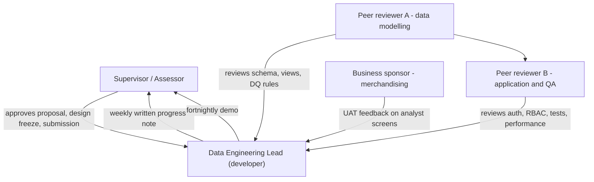

# 03 — Task Assignment and Roles

## Purpose

This document defines who does what in the project: the team roles, the RACI matrix over the
deliverables, the communication plan, the sprint and iteration plan, and the hours log template
used to record effort. It is the document consulted when someone asks "who owns the API?" or "who
approves a schema change?".

| Field | Value |
| --- | --- |
| Project | Web-to-Warehouse Product Intelligence Pipeline |
| Team size | 4 people (1 lead, 2 peer reviewers, 1 supervisor) |
| Working model | One full-time engineer (DEPI student) with asynchronous review |
| Review cadence | Weekly written review, fortnightly live demo |

---

## Table of contents

1. [Team and role definitions](#1-team-and-role-definitions)
2. [Responsibility matrix by work package](#2-responsibility-matrix-by-work-package)
3. [RACI matrix for deliverables](#3-raci-matrix-for-deliverables)
4. [RACI matrix for key decisions](#4-raci-matrix-for-key-decisions)
5. [Communication plan](#5-communication-plan)
6. [Sprint and iteration plan](#6-sprint-and-iteration-plan)
7. [Hours log template](#7-hours-log-template)
8. [Working agreements](#8-working-agreements)

---

## 1. Team and role definitions

### 1.1 Roles

| Role | Person | Commitment | Mandate | Responsibilities |
| --- | --- | --- | --- | --- |
| Data Engineering Lead / Developer | Ahmed Abobakr | 100 % (≈ 40 h/week) | Owns the design and the code | Architecture, ingestion, warehouse, API, documentation; makes technical decisions; runs the demos |
| Peer reviewer — Data modelling | Reviewer A | 20 % (≈ 8 h/week, W9–W12) | Challenges the data model | Reviews the ERD, normalisation, view definitions and the DQ rule set |
| Peer reviewer — Application & QA | Reviewer B | 20 % (≈ 8 h/week, W9–W12) | Challenges correctness and security | Reviews auth, RBAC, error handling, the smoke test and performance claims |
| Supervisor / Assessor | DEPI supervisor | 5 % (≈ 2 h/week) | Academic authority | Approves the proposal, the design freeze and the final submission; arbitrates scope changes |
| Business sponsor (simulated) | Retail merchandising lead | 1 h total | Represents the user | Validates the analyst-facing screens during UAT (doc 15) |

### 1.2 Responsibility split inside the single-developer reality



### 1.3 Role responsibilities in detail

| Role | Decisions they own | Deliverables they own | Escalation path |
| --- | --- | --- | --- |
| Lead | Table layout, algorithm design, API shape, source allow-listing | All code, all docs except the peer review notes | Supervisor for scope or deadline changes |
| Reviewer A | Physical normalisation, view contracts | Design review record, data-model findings | Supervisor if the design freeze is violated |
| Reviewer B | Security posture, test coverage, performance evidence | QA review record, defect list | Supervisor if a security finding is not fixed |
| Supervisor | Scope, weighting, acceptance | Grades and feedback | Department |
| Business sponsor | Priority of the analyst screens | UAT sign-off on screens | Lead |

---

## 2. Responsibility matrix by work package

Effort share and ownership per work package (hours from `docs/01_project_proposal.md` §7.1).

| WP | Work package | Lead | Reviewer A | Reviewer B | Supervisor |
| --- | --- | --- | --- | --- | --- |
| WP1 | Requirements and stakeholder analysis | 16 | 0 | 2 | M1 review |
| WP2 | Literature review | 14 | 0 | 0 | M1 review |
| WP3 | Database design | 16 | 4 | 0 | M2 approval |
| WP4 | Compliance layer | 42 | 0 | 2 | — |
| WP5 | Ingestion sources | 30 | 0 | 0 | — |
| WP6 | Cleaning and normalisation | 24 | 0 | 0 | — |
| WP7 | Deduplication engine | 28 | 2 | 0 | — |
| WP8 | Loader and change detection | 34 | 2 | 0 | — |
| WP9 | Catalog reconciliation | 22 | 2 | 0 | — |
| WP10 | Data-quality framework | 18 | 2 | 0 | — |
| WP11 | Views and analytics service | 26 | 3 | 0 | — |
| WP12 | REST API, auth, RBAC | 46 | 0 | 4 | — |
| WP13 | CLI and Makefile | 12 | 0 | 0 | — |
| WP14 | Airflow DAG | 12 | 0 | 0 | — |
| WP15 | Deployment documentation | 12 | 0 | 1 | — |
| WP16 | Seed data and verification | 16 | 1 | 2 | M6 approval |
| WP17 | Smoke test and API docs | 14 | 0 | 2 | — |
| WP18 | Documentation set | 40 | 2 | 2 | M7 approval |
| WP19 | Review and defence preparation | 14 | 4 | 4 | M8 defence |

---

## 3. RACI matrix for deliverables

Legend: **R** = Responsible (does the work), **A** = Accountable (single owner, signs off),
**C** = Consulted (two-way input), **I** = Informed (one-way update).

| # | Deliverable | Lead | Reviewer A | Reviewer B | Supervisor | Business sponsor |
| --- | --- | --- | --- | --- | --- | --- |
| 1 | Project proposal | R | I | I | A | C |
| 2 | Project plan and Gantt | R | I | I | A | I |
| 3 | Roles and responsibilities | R | C | C | A | I |
| 4 | Risk register | R | C | C | A | I |
| 5 | KPI catalogue | R | I | C | A | C |
| 6 | Literature review | R | C | I | A | I |
| 7 | Requirements and user stories | R | C | C | A | C |
| 8 | System analysis and architecture | R | C | C | A | I |
| 9 | Database design and ERD | R | A | I | C | I |
| 10 | Data flow diagrams | R | C | I | C | I |
| 11 | Behaviour diagrams | R | C | C | C | I |
| 12 | UI/UX design | R | I | C | I | A |
| 13 | Deployment plan | R | I | C | C | I |
| 14 | API documentation | R | I | C | C | I |
| 15 | Testing strategy | R | C | A | C | I |
| 16 | User manual | R | I | C | C | A |
| 17 | Technical documentation | R | C | C | C | I |
| 18 | Presentation outline | R | C | C | A | I |
| 19 | Feature inventory | R | I | I | I | I |
| 20 | Feedback and improvements | R | C | C | A | I |
| D1 | Ingestion module | R | I | C | I | I |
| D2 | Database schema | R | A | I | C | I |
| D3 | Price history table | R | A | I | I | I |
| D4 | ETL pipeline | R | C | C | I | I |
| D5 | Airflow DAG | R | I | C | I | I |
| D6 | Data-quality checks | R | A | C | C | I |
| D7 | SQL analysis and views | R | A | I | C | I |
| D8 | Dashboard | R | I | C | I | A |
| D10 | REST API | R | I | A | I | I |
| D12 | API smoke test | R | I | A | I | I |

Exactly one `A` per row — the rule enforced at every review.

---

## 4. RACI matrix for key decisions

| Decision | Proposed by | Consulted | Accountable | Informed |
| --- | --- | --- | --- | --- |
| Add a new ingestion source | Lead | Reviewer B, Supervisor | Lead (terms allow-list) | Team |
| Change the dedupe threshold | Lead | Reviewer A | Lead | Business sponsor |
| Change the star-schema grain (fact_price_snapshot) | Lead | Reviewer A, Supervisor | Supervisor | Team |
| Add or rename a REST endpoint | Lead | Reviewer B | Lead | Dashboard developer |
| Add a data-quality rule | Lead | Reviewer A, business sponsor | Lead | Team |
| Change the public API contract in a breaking way | Lead | Reviewer B, Supervisor | Supervisor | Team |
| Provision a new database target | Lead | Reviewer B | Lead | Team |
| Change the retention window | Lead | Supervisor, compliance officer (simulated) | Supervisor | Team |
| Disable a source because of a terms change | Lead | Supervisor | Lead | Business sponsor |
| Submit the final documentation set | Lead | Both reviewers | Supervisor | — |

---

## 5. Communication plan

### 5.1 Channels

| Channel | Purpose | Participants | Frequency | Response expectation |
| --- | --- | --- | --- | --- |
| GitHub repository | Source of truth for code and docs | All | Continuous | — |
| Weekly progress note (repository `docs/` update) | Status, next steps, blockers | Supervisor | Weekly (Friday) | Supervisor comments within 3 working days |
| Fortnightly sprint demo | Evidence of progress | Supervisor, both reviewers | Every 2 weeks | Live questions |
| Design review meeting | Approve or reject a design change | Supervisor, lead, Reviewer A | At M2 and on any schema change | Decision recorded in the doc |
| Code review | Correctness before merge | Lead + one reviewer | On every pull request for `app/api`, `app/etl`, `db/` | Review within 1 working day |
| Incident note | Pipeline or environment failure | Supervisor | On failure | Same day |

### 5.2 Status reporting template (used every Friday)

```text
Week:        W__
Sprint goal: <one sentence>
Done:        <bullets with file references>
In progress: <bullets>
Blocked:     <issue, owner, needed decision>
KPIs:        DQ score __ | pipeline duration __ s | smoke __/__ | views __/20 | tables __/23
Risks:       <new / closed>
Next week:   <bullets>
```

### 5.3 Escalation matrix

| Trigger | Action | Timeframe |
| --- | --- | --- |
| Critical blocker on the critical path > 2 days | Raise in the weekly note and propose a scope reduction | Same day |
| Source becomes non-compliant (robots/terms change) | Disable the source (`enabled=false`) and record the reason | Immediate |
| DQ score drops below 80 for two consecutive runs | Open an incident note and re-run with `--strict` | Same day |
| Database divergence between PostgreSQL and MySQL | Stop feature work, run `make verify-dialects`, fix the model | Immediate |
| Smoke test failure | Block the merge until fixed or explicitly waived by Reviewer B | Immediate |

---

## 6. Sprint and iteration plan

### 6.1 Iteration structure

| Element | Value |
| --- | --- |
| Iteration length | 2 weeks |
| Iterations | 6 (S1 … S6) |
| Sprint planning | 45 min, first day of the sprint |
| Daily stand-up | Written, 5 lines, in the repository (asynchronous because it is a solo project) |
| Sprint review | 60 min demo against the sprint goal |
| Retrospective | 30 min, three questions: what worked, what blocked, what changes next sprint |

### 6.2 Task board convention

| Column | Meaning | Exit criterion |
| --- | --- | --- |
| `Backlog` | Identified but not started | — |
| `Ready` | Specification, acceptance criteria and dependencies known | Can be started without questions |
| `In progress` | Currently being implemented | One task at a time per work package |
| `Code review` | Awaiting a reviewer | Reviewer assigned |
| `Verify` | Awaiting a command-based check (test, smoke, KPI) | Check command recorded in the task |
| `Done` | Acceptance criteria met and verified | Linked to a commit and, where applicable, a KPI value |
| `Blocked` | Waiting on an external input | Blocker and owner recorded |

### 6.3 Definition of done (DoD)

A task is *done* only when all of the following are true:

1. Code is committed to the private repository.
2. `make lint` and `make typecheck` pass (`ruff`, `mypy`).
3. A verification command exists and has been run (`make test`, `make verify-dialects`,
   `scripts/api_smoke.py`, or a CLI command).
4. If the task changes behaviour, the corresponding document in `docs/` is updated in the same
   commit.
5. If the task adds an endpoint, `scripts/api_smoke.py` gains a check for it.

---

## 7. Hours log template

Effort is tracked per task so the final effort table in `docs/01_project_proposal.md` §7 can be
audited. The log is maintained in the repository as `docs/assets/hours-log.csv`.

### 7.1 Column definition

| Column | Type | Example | Meaning |
| --- | --- | --- | --- |
| `date` | ISO date | `2026-02-18` | Day of work |
| `week` | `W1`…`W12` | `W7` | Project week |
| `wp` | `WP1`…`WP19` | `WP7` | Work package |
| `task_id` | text | `T-124` | Task board identifier |
| `task` | text | `Blocking index for candidate pool` | Short task name |
| `role` | `lead` / `revA` / `revB` / `sup` | `lead` | Who worked on it |
| `hours` | decimal | `3.5` | Hours spent |
| `type` | `build` / `review` / `doc` / `test` / `meeting` | `build` | Activity type |
| `artifacts` | text | `app/ingestion/dedupe.py` | Files touched |
| `notes` | text | `29x faster than naive scan` | Outcome or finding |

### 7.2 Filled example rows

| date | week | wp | task_id | task | role | hours | type | artifacts | notes |
| --- | --- | --- | --- | --- | --- | --- | --- | --- | --- |
| 2026-01-05 | W1 | WP1 | T-001 | Stakeholder interview — pricing analyst | lead | 2.0 | meeting | `docs/07` | 6 pain points recorded |
| 2026-01-07 | W1 | WP1 | T-004 | Docker Compose bring-up | lead | 1.5 | build | `docker-compose.yml` | both DBs healthy |
| 2026-02-18 | W7 | WP7 | T-118 | Blocking index for the candidate pool | lead | 3.5 | build | `app/ingestion/dedupe.py` | naive scan 2975 ms → 104 ms |
| 2026-03-19 | W11 | WP16 | T-204 | Cross-dialect verification run | lead | 2.0 | test | `docs/05` | identical structural counts |
| 2026-03-24 | W11 | WP18 | T-231 | API endpoint inventory reconciled with OpenAPI | lead | 2.0 | doc | `docs/14` | measured 104 operations |

### 7.3 Weekly roll-up template

| Week | build | review | doc | test | meeting | Total | Cumulative |
| --- | --- | --- | --- | --- | --- | --- | --- |
| W1 | 24.0 | 0.0 | 12.0 | 2.0 | 2.0 | 40.0 | 40.0 |
| W2 | 12.0 | 0.0 | 18.0 | 0.0 | 2.0 | 32.0 | 72.0 |
| … | … | … | … | … | … | … | … |
| W12 | 8.0 | 4.0 | 12.0 | 2.0 | 2.0 | 28.0 | 418.0 |

### 7.4 Estimation method

| Class | Meaning | Planning factor |
| --- | --- | --- |
| S | ≤ 4 h, single module, no design decision | ×1.0 |
| M | ≤ 12 h, one module plus its tests | ×1.5 |
| L | ≤ 30 h, crosses modules or needs a design decision | ×2.0 |
| XL | > 30 h or high uncertainty | Split before starting; never planned as one task |

Every task in the board carries a class. The sum of the estimates is compared with the roll-up table
each sprint; a variance above 25 % triggers a retrospective item.

---

## 8. Working agreements

1. **One work package at a time.** Context switching between ingestion and API work is the main
   observed productivity risk.
2. **Commit messages state the why.** Format: `<type>(<scope>): <summary> — <reason>`, where type is
   one of `feat`, `fix`, `refactor`, `docs`, `test`, `chore`.
3. **No schema change without a design note** (see `docs/02` §7.1).
4. **No source without a terms justification** (see `docs/01` §8.2).
5. **No endpoint without a smoke check.**
6. **Measurements are re-run before they are quoted.** Every figure in `docs/05_kpis.md` carries the
   command that produced it.
7. **Secrets never enter the repository.** `.env` is git-ignored; `.env.example` is the only
   committed configuration template.
8. **Reviewers respond within one working day**; the lead responds to a review finding within two.
9. **The demo dataset is regenerated, never hand-edited**, so the numbers in the documentation stay
   reproducible (`make demo-postgres`).
10. **Assumptions are written down.** Anything not verifiable from the code base is recorded in the
    assumption tables of `docs/01` §9 rather than silently asserted.