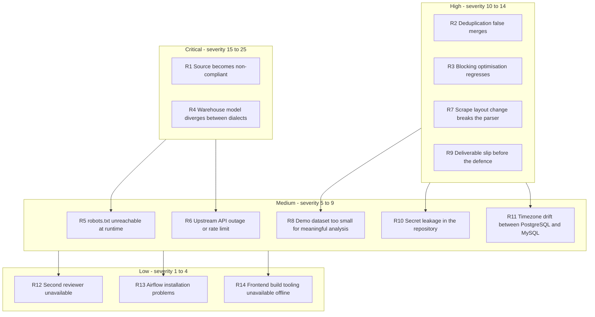
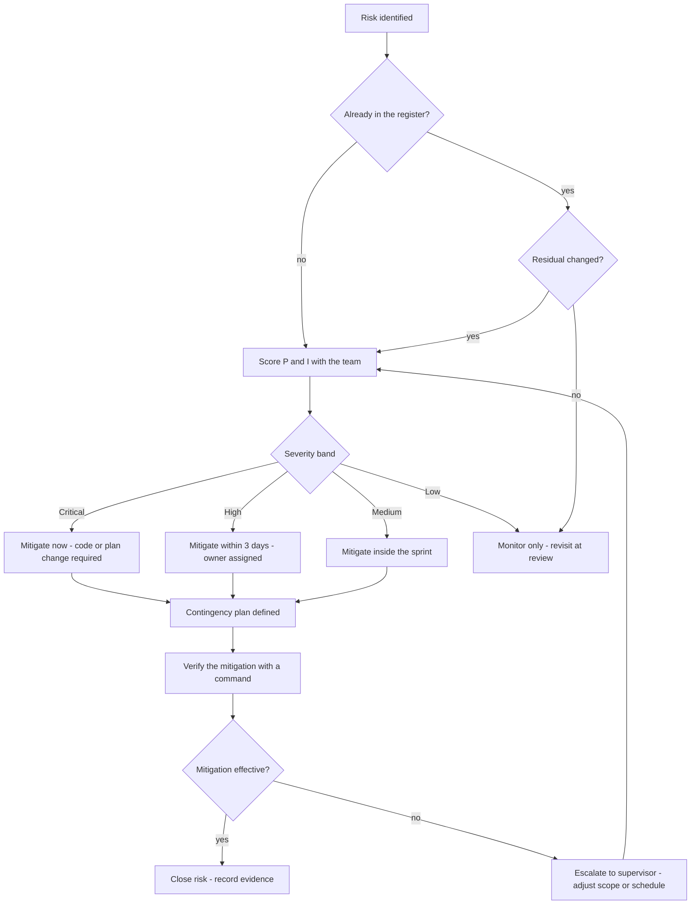

# 04 — Risk Assessment and Mitigation Plan

## Purpose

This document is the project's risk register. It identifies the technical, data, compliance,
schedule, organisational and academic risks of building the Web-to-Warehouse Product Intelligence
Pipeline, scores them, assigns an owner, records the mitigation that is **actually implemented in
the code base**, and provides a contingency plan for the risks that materialised.

| Field | Value |
| --- | --- |
| Method | Qualitative probability × impact scoring (1–5), severity = P × I |
| Scoring bands | 1–4 Low · 5–9 Medium · 10–14 High · 15–25 Critical |
| Review cadence | Fortnightly, in the sprint review |
| Owner roles | Lead (technical/data), Reviewer B (security), Supervisor (academic/schedule) |

---

## Table of contents

1. [Scoring model](#1-scoring-model)
2. [Risk heat map](#2-risk-heat-map)
3. [Risk register](#3-risk-register)
4. [Risk treatment flow](#4-risk-treatment-flow)
5. [Contingency plans](#5-contingency-plans)
6. [Issues that materialised during the project](#6-issues-that-materialised-during-the-project)
7. [Monitoring and review](#7-monitoring-and-review)

---

## 1. Scoring model

| Probability (P) | Definition |
| --- | --- |
| 1 | Rare — less than 10 % over the project |
| 2 | Unlikely — 10–30 % |
| 3 | Possible — 30–50 % |
| 4 | Likely — 50–75 % |
| 5 | Almost certain — more than 75 % |

| Impact (I) | Definition | Effect on the grade/deliverable |
| --- | --- | --- |
| 1 | Negligible | Absorbed inside a sprint, no visible effect |
| 2 | Minor | ≤ 1 day rework, one document updated |
| 3 | Moderate | ≤ 3 days rework, one work package delayed |
| 4 | Major | A work package slips, a deliverable is delivered late |
| 5 | Severe | A required deliverable is missing or the system does not run |

**Severity = P × I.** Response times: Critical → immediate, High → within 3 days,
Medium → within the sprint, Low → monitor.

---

## 2. Risk heat map

---

## 3. Risk register

| ID | Risk | Category | P | I | Severity | Owner | Mitigation implemented in the code / plan | Residual |
| --- | --- | --- | --- | --- | --- | --- | --- | --- |
| R1 | A source changes its terms of service or `robots.txt`, making collection unlawful | Compliance | 4 | 5 | **20 Critical** | Lead | Per-source `terms_allowed` class attribute; `sync_dim_source()` disables a source whose terms are not allowed; `RESPECT_TERMS_WHITELIST=true`; DAG guard `check_source_compliance` aborts when no source passes; `dim_source.terms_allowed` and `license_note` record the decision | Low — the pipeline degrades instead of violating terms |
| R2 | Fuzzy dedup merges two genuinely different products (false merge) | Data | 4 | 4 | **16 Critical** | Lead | Digit-signature guard (`digit_signature_factor`) penalises differing model numbers; brand term in the blended score; category bonus; threshold raised to 0.90; `dim_product.match_strategy` and `match_score` stored for audit; `GET /api/v1/products/{id}/duplicates` exposes the score breakdown | Medium — the guard is a heuristic, not a proof |
| R3 | The blocking optimisation changes match results (optimisation regression) | Technical | 3 | 4 | **12 High** | Reviewer A | Blocking added in `_blocking_candidates()` and `_build_indexes()`; results verified identical to the unblocked scan; only a brand-subset refinement can narrow the pool, never remove it (`min_pool` fallback) | Low |
| R4 | The warehouse model behaves differently on PostgreSQL and MySQL (no single dialect reality) | Technical | 3 | 5 | **15 Critical** | Lead | Dialect-portable column types (`UTCDateTime`, `JSONType`, `Numeric(18,4)`); no `ON CONFLICT` / `ON DUPLICATE KEY` anywhere — upserts are read-then-write in `WarehouseLoader`; `bootstrap()` applies each view statement in its own transaction; `make verify-dialects` compares structural row counts and DQ score | Low — verified: identical structural counts and DQ 98.26 on both |
| R5 | `robots.txt` cannot be fetched at runtime (network, 5xx, timeout) | Technical | 3 | 4 | **12 High** | Lead | `RobotsCache` caches decisions per host for `CACHE_TTL_SECONDS`; RFC 9309 fallback: 4xx → allow, 401/403 → treat as disallow; local/synthetic sources bypass the network entirely; failure is logged in `ingestion_http_log` with `robots_allowed=false` | Low |
| R6 | Upstream API outage, throttling or schema change | Operational | 4 | 3 | **12 High** | Lead | Per-source failure isolation in `_process_source()` — one failing source becomes a warning and the run continues as `partial`; token bucket + sliding window + `Crawl-delay` + `Retry-After`; circuit breaker opens a host after 5 failures; disk cache means a repeat run costs no traffic | Low |
| R7 | The HTML scraper breaks when books.toscrape.com changes its markup | Technical | 3 | 4 | **12 High** | Lead | Scraper uses semantic CSS selectors (`article.product_pod`, `p.price_color`, `p.star-rating`, `ul.breadcrumb`); per-page and per-product error capture in `self.errors`; `consecutive_empty_pages` stops the loop after two empty pages; the failure appears in the run warnings and the DQ score | Medium |
| R8 | The demo dataset is too small for meaningful analysis, or is unrealistic | Data | 3 | 3 | **9 Medium** | Reviewer A | `seed_history()` generates a random-walk price series with promo windows and clearance shocks; 60 products × 150 days = 8,182 snapshots; 30 % of SKUs are internal-only so the catalog reconciliation shows genuine unmatched rows | Low |
| R9 | Deliverable slippage before the defence deadline | Schedule | 3 | 4 | **12 High** | Supervisor | Six 2-week sprints with a definition of done; the last week is reserved as documentation slack; the offline `local_demo` source removes external dependency from demonstrations | Medium |
| R10 | Secrets leak into the Git repository | Security | 2 | 5 | **10 High** | Reviewer B | `.env` is git-ignored; only `.env.example` is committed; `describe_target()` redacts credentials in every log line; API keys are stored as SHA-256 hashes with a server pepper and shown once; `UserRead` never serialises `hashed_password` | Low |
| R11 | Timezone drift between PostgreSQL (timestamptz) and MySQL (naive DATETIME) | Data | 3 | 3 | **9 Medium** | Lead | `UTCDateTime` TypeDecorator normalises at the boundary: aware → UTC naive on write, naive → UTC-aware on read; every comparison in the pipeline goes through it | Low |
| R12 | The second peer reviewer is unavailable in W9–W12 | Resource | 2 | 2 | **4 Low** | Lead | Review duties are documented (this document, `docs/03` §4); the lead self-reviews against the same checklist; supervisor arbitrates | Low |
| R13 | Airflow cannot be installed (dependency or version conflict) | Technical | 2 | 3 | **6 Medium** | Lead | The DAG module imports Airflow behind a `try/except` and sets `AIRFLOW_AVAILABLE=False`; the pipeline is executable from the CLI and the API; `GET /api/v1/pipeline/schedule` reports the orchestrator state | Low |
| R14 | Frontend tooling cannot be installed (no network for npm) | Technical | 3 | 2 | **6 Medium** | Lead | The dashboard is a thin client over the documented REST API; the API smoke test (`scripts/api_smoke.py`) verifies the whole user journey with `curl`-equivalent calls; doc 16 documents every screen against its endpoints | Low |
| R15 | Duplicate pipeline runs on the same data corrupt the change feed | Data | 2 | 4 | **8 Medium** | Lead | `fact_price_snapshot` has a unique constraint on `(product_id, run_id)`; every run gets a fresh `run_id`; DQ006 asserts the grain and is a blocking (critical) rule | Low |
| R16 | The price series is meaningless because sources change price too rarely | Data | 3 | 2 | **6 Medium** | Reviewer A | Sources publish `discountPrice` and stock counts, producing real deltas; the demo seeder models promo windows explicitly; DQ009 flags implausible >50 % jumps | Low |
| R17 | Scope creep towards a full e-commerce intelligence suite | Scope | 3 | 3 | **9 Medium** | Supervisor | Explicit out-of-scope list in `docs/01` §3.2; change control after M2 (design freeze); any new capability must displace something of equal size | Low |
| R18 | Reviewer finds a security defect late (e.g. query console writes) | Security | 2 | 4 | **8 Medium** | Reviewer B | `QueryRequest._readonly()` allows only `SELECT` / `WITH` / `EXPLAIN` and rejects write keywords, multi-statements and comments; the Query Lab requires the `query` right; the API session uses a read-only role in production | Low |
| R19 | FX table goes stale, making USD analytics drift | Data | 3 | 2 | **6 Medium** | Reviewer A | `dim_currency.rate_source='static_reference_table'` and `as_of` date make staleness visible; `convert_to_usd()` is the single swap point for a live provider; DQ004 enforces that every stored currency exists in `dim_currency` | Low |
| R20 | Academic documentation is written after the code and misses reality | Process | 3 | 3 | **9 Medium** | Lead | Every document references real file paths and line numbers; every KPI is re-measured at the end of W11; assumptions are recorded explicitly (`docs/01` §9) | Low |

### 3.1 Register summary

| Severity band | Count | Risk IDs |
| --- | --- | --- |
| Critical (15–25) | 3 | R1, R2, R4 |
| High (10–14) | 6 | R3, R5, R6, R7, R9, R10 |
| Medium (5–9) | 7 | R8, R11, R13, R14, R15, R17, R18, R19, R20 |
| Low (1–4) | 3 | R12 |

---

## 4. Risk treatment flow

---

## 5. Contingency plans

| Risk | Trigger to activate the contingency | Contingency action | Impact on deliverables |
| --- | --- | --- | --- |
| R1 — terms change | `robots.txt` disallows the path, or the source sets `terms_allowed=False` | The source is skipped automatically; the run continues with the remaining sources and is marked `partial`; a note is added to `docs/20` and the demo switches to `local_demo` | None — the demo dataset is offline |
| R2 — false merges | DQ005 (`Product fingerprints unique`) fails, or a support ticket identifies a wrong merge | Raise `DEDUPE_SIMILARITY_THRESHOLD` from 0.90 to 0.94 and re-run; `merged` products remain visible via `dim_product.matched_product_id` so a merge can be reversed | Dedupe accuracy KPI must be re-measured |
| R4 — dialect divergence | `make verify-dialects` reports structural drift | Identify the table, fix the model (never the dialect), re-bootstrap both targets with `--drop`, re-verify | 1 day |
| R5/R6 — upstream unavailable | `sync_state.status='failing'` or the source is missing from the run's `sources_processed` | Rerun later (the disk cache avoids repeat traffic); if the source is permanently gone, remove it from `DEFAULT_SOURCES` in the DAG and document the removal | Sources count KPI changes |
| R7 — scraper broken | Zero records from `books_to_scrape` for two consecutive runs | Replace the two API sources for the demonstration; keep the scraper in the code base as the BeautifulSoup deliverable and record the breakage in `docs/20` | Demo dataset source diversity |
| R9 — schedule slip | A sprint goal is missed by more than 3 days | Apply the priority rule from `docs/01` §3.2: defer the lowest-value deliverable (documentation polish) before functionality | Documentation length |
| R10 — secret exposure | A credential appears in a commit | Rotate the credential immediately (`.env` is regenerated), rewrite the commit history, and record it in the incident note | None if caught within the sprint |
| R13 — Airflow unusable | `make airflow-init` fails twice | Demonstrate the DAG definition statically (`dags/product_intelligence_pipeline.py` parses without Airflow) and run the pipeline through `make run-pipeline`, which is the same `Pipeline` object the DAG calls | Orchestration demonstration only |
| R14 — frontend unavailable | `npm install` fails | Run the UAT against the API with the smoke test and use the CLI report (`make analytics`) as the demonstration surface | Dashboard demonstration only |
| R15 — grain violation | DQ006 fails (critical) | The run is marked `failed` by design; re-run with a new `run_id`; inspect `etl_run.records_valid` versus `fact_price_snapshot` | Run status |
| R20 — documentation drift | A doc statement cannot be reproduced with the command it cites | Fix the document in the same commit as the behaviour change (definition of done, `docs/03` §6.3) | Grading |

---

## 6. Issues that materialised during the project

| # | Issue | Detected by | Root cause | Resolution | Register link |
| --- | --- | --- | --- | --- | --- |
| I1 | Catalog reconciliation was too slow (2,975 ms for 57 SKUs) | Sprint review timing | Every catalog row compared against every product (O(n·m) fuzzy comparisons) | Added blocking indexes (`_build_indexes`), a rare-token fallback and a capped pool (`max_pool=400`). Measured 104 ms with identical results — a 29× improvement | R3 |
| I2 | `vw_pipeline_health` could not be read on MySQL | Cross-dialect verification | `TRIGGER` is a reserved word in MySQL 8.4; `pipeline_runs()` selects the column unqualified | Recorded as a known defect with the exact fix (quote the identifier in `app/analytics/service.py` and `app/api/routers/pipeline.py`); PostgreSQL profile is unaffected | R4 |
| I3 | Views failed to apply on MySQL when created inside one transaction | Bootstrap log | MySQL DDL triggers an implicit commit, invalidating SAVEPOINTs | `apply_views()` now runs every statement in its own connection/transaction and logs per-view failures | R4 |
| I4 | A source error killed the whole run | CLI run with `books_to_scrape` | Exception propagation from `_fetch_detail()` | Per-source isolation: exceptions become run warnings, run status becomes `partial` | R6, R7 |
| I5 | Naive timestamps returned by MySQL broke comparisons | DQ007 evaluation | MySQL drops the timezone | `UTCDateTime` TypeDecorator re-tags naive values as UTC on read | R11 |
| I6 | Rating scale mismatch (Open Library averages on a 5-point scale, other feeds differ) | DQ003 failure | Naive copy of upstream values | `parse_rating(target_scale=5.0)` rescales every rating and clamps it to the range | R19 |
| I7 | SQLite foreign keys were silently off | Test failure on a fixture | SQLite defaults `PRAGMA foreign_keys=off` | `build_engine()` sets `foreign_keys=ON`, `journal_mode=WAL`, `synchronous=NORMAL` for SQLite connections | R4 |

---

## 7. Monitoring and review

| Control | Frequency | Method | Record |
| --- | --- | --- | --- |
| Register review | Fortnightly | Sprint review agenda item 3 | Updated register rows with the new residual score |
| KPI watch | Weekly | `make analytics`, `scripts/api_smoke.py` | `docs/05_kpis.md` targets vs measured table |
| Compliance watch | Weekly | `GET /api/v1/audit/compliance` | `blocked_requests`, `cached_requests`, `retried_requests`, `avg_elapsed_ms` |
| Source watch | Weekly | `GET /api/v1/pipeline/sources/status` | `sync_status`, `consecutive_failures`, `success_rate_pct` |
| Schema watch | After every model change | `make check-schema` (`app.cli.main check-schema`) | Missing/extra table list |
| Secret scan | Before every submission | `git log -p | grep -i password` | Incident note if a hit is found |

### 7.1 Risk acceptance statement

Risks R13, R14, R19 and R20 are **accepted** with the documented contingency: the project does not
depend on Airflow, on a browser build or on live FX data for its acceptance criteria. Risks R1, R2
and R4 are **mitigated in code** and must not be accepted silently in a future release: any change
that removes the robots gate, the digit-signature guard or the dialect-portability layer is a
regression of a Critical risk.