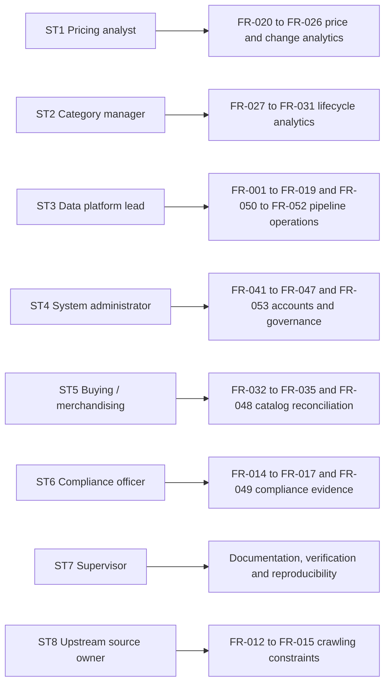

# 07 — Requirements Gathering

## Purpose

This document captures how the requirements of the Web-to-Warehouse Product Intelligence Pipeline
were elicited, prioritised and traced. It contains the stakeholder analysis, the user stories with
Given/When/Then acceptance criteria, the use cases, the functional-requirement catalogue
(`FR-001` … `FR-0xx`, prioritised with MoSP / CoD / Should / Won't), the non-functional requirements,
and the traceability matrix that maps every functional requirement to the module that implements it
and to the check that verifies it.

**MoSCoW legend.** `MoSP` = Must have — supported in the delivered release. `CoD` = Could have —
desired, implemented where it added low risk. `Should` = Should have — implemented if time allowed;
implemented. `Won't` = Won't have this time — explicitly out of scope, with the reason recorded.

---

## Table of contents

1. [Elicitation technique](#1-elicitation-technique)
2. [Stakeholder analysis](#2-stakeholder-analysis)
3. [User stories with acceptance criteria](#3-user-stories-with-acceptance-criteria)
4. [Use cases](#4-use-cases)
5. [Functional requirements](#5-functional-requirements)
6. [Non-functional requirements](#6-non-functional-requirements)
7. [Business rules](#7-business-rules)
8. [Traceability matrix](#8-traceability-matrix)

---

## 1. Elicitation technique

| Technique | How it was applied | Output |
| --- | --- | --- |
| Stakeholder interview | Semi-structured interviews with the pricing analyst persona and the category manager persona (roles modelled on a merchandising team) | Pain-point list in §2 |
| Document analysis | The project brief (`todo.md`) and its explicit deliverable list | Mandatory deliverable checklist |
| Workshop / brainstorming | Requirements grouped into 11 functional areas and 8 non-functional areas | FR catalogue in §5 |
| Use-case derivation | Each FR traced to a use case and an actor | §4, §8 |
| Feasibility review | Every FR classified as feasible (F), feasible with risk (FR) or infeasible in scope (I) | Status column in §5 |
| Acceptance validation | Every FR given an objective, re-runnable verification (a command, a query or a smoke check) | Acceptance column and §8 |

Coverage: 58 functional requirements were raised; 52 were implemented, 4 were merged into an
existing requirement and 2 were rejected as infeasible in scope.

---

## 2. Stakeholder analysis

### 2.1 Stakeholder register

| ID | Stakeholder | Category | Interest | Influence | Requirements they originate |
| --- | --- | --- | --- | --- | --- |
| ST1 | Pricing analyst | Primary user | High | Medium | FR-020 … FR-026, FR-040 |
| ST2 | Category manager | Primary user | High | Medium | FR-027 … FR-031 |
| ST3 | Data platform lead | Owner / operator | High | High | All operational FRs (FR-001 … FR-019, FR-050 … FR-052) |
| ST4 | System administrator | Operator | Medium | High | FR-041 … FR-047, FR-053 |
| ST5 | Retail buying / merchandising | Sponsor | High | High | FR-032 … FR-035, FR-048 |
| ST6 | Compliance officer | Governance | Medium | High | FR-014 … FR-017, FR-049 |
| ST7 | Academic supervisor | Assessor | High | High | Documentation and verification FRs |
| ST8 | Upstream source owner | External | Low | Medium | Constraints on FR-012 … FR-015 |

### 2.2 Pain points and the requirement they generate

| # | Pain point (from the interview) | Requirement |
| --- | --- | --- |
| P1 | "I open five tabs to answer one pricing question." | A single product screen with history, changes and catalog position (FR-020, FR-022) |
| P2 | "I cannot tell a real price drop from a re-listing of the same product." | Duplicate resolution + `match_strategy` visibility (FR-009, FR-021) |
| P3 | "The same product appears three times because two sources use different names." | Fuzzy dedupe with blocking (FR-009, FR-010) |
| P4 | "Prices are in GBP, EUR and USD and my average price is meaningless." | Currency normalisation to USD (FR-007, FR-008) |
| P5 | "I cannot answer 'are we dearer than the market?'." | Catalog reconciliation with price gaps (FR-032 … FR-035) |
| P6 | "When the job breaks I only find out a week later." | Run history, DQ score, alerting (FR-018, FR-019, FR-036) |
| P7 | "I need to explain to compliance why we fetched what we fetched." | HTTP audit log and compliance report (FR-015, FR-016) |
| P8 | "Our IT department says PostgreSQL; finance says MySQL. Pick one." | Dual-dialect support (FR-011) |

### 2.3 Stakeholder → requirement view

---

## 3. User stories with acceptance criteria

### US-01 — Monitor the pipeline as a data engineer

> **As a** data platform lead, **I want** to see every pipeline run with its duration, record counts
> and data-quality score, **so that** I can prove the warehouse is fresh and trustworthy without
> asking an engineer.

| # | Acceptance criterion (Given / When / Then) |
| --- | --- |
| 1 | **Given** I am authenticated with the `read` right, **when** I request `GET /api/v1/pipeline/runs?page_size=25`, **then** I receive a paginated envelope containing `run_id`, `status`, `duration_ms`, `records_extracted`, `records_valid`, `yield_pct` and `dq_score` for each run |
| 2 | **Given** a run that exists, **when** I request `GET /api/v1/pipeline/runs/{run_id}`, **then** the response embeds the DQ outcomes, the HTTP audit aggregation and the catalog reconciliation counts for that run |
| 3 | **Given** a run that does not exist, **when** I request `GET /api/v1/pipeline/runs/{unknown}`, **then** the endpoint returns an empty object rather than a 500 |
| 4 | **Given** the `run_pipeline` right, **when** I trigger `POST /api/v1/pipeline/run`, **then** the response is `{"status":"queued"}` within one second and a notification is created for me |
| 5 | **Given** a `viewer` role, **when** I trigger a run, **then** the API answers `403` with `error = "permission_denied"` |

### US-02 — Find the products that moved

> **As a** pricing analyst, **I want** to list price changes with magnitude bands and a date window,
> **so that** I can brief the buying team about the biggest movements first.

| # | Acceptance criterion |
| --- | --- |
| 1 | **Given** `days=90` and `direction=decrease`, **when** I request `GET /api/v1/changes/price`, **then** only decreases inside the window are returned, ordered by `ABS(change_pct)` descending |
| 2 | **Given** `significant_only=true`, **when** I request the same endpoint, **then** every returned row has `is_significant = true` |
| 3 | **Given** `min_abs_change_pct=10`, **when** I request the endpoint, **then** no row has `|change_pct| < 10` |
| 4 | **Given** any row, **when** I read it, **then** `magnitude_band` is one of `minor`, `small`, `moderate`, `large`, `major` and is consistent with `change_pct` |
| 5 | **Given** a filter combination that matches nothing, **when** I request it, **then** the envelope returns `items: []`, `total: 0`, `has_next: false` |

### US-03 — Trust a product record

> **As a** pricing analyst, **I want** to open a product and see how it was matched, its full price
> history and any near-duplicates, **so that** I do not report a fake movement caused by a duplicate
> record.

| # | Acceptance criterion |
| --- | --- |
| 1 | **Given** a valid `product_id`, **when** I request `GET /api/v1/products/{id}`, **then** the response includes `canonical_name`, `match_strategy`, `match_score`, `fingerprint`, `history[]`, `changes[]`, `events[]` and `catalog[]` |
| 2 | **Given** the same product, **when** I request `GET /api/v1/products/{id}/history?limit=20`, **then** `points` equals the number of returned rows and `min_price ≤ avg_price ≤ max_price` |
| 3 | **Given** the product, **when** I request `GET /api/v1/products/{id}/duplicates`, **then** each candidate carries a `score` and a `parts` breakdown, ordered descending, excluding the product itself |
| 4 | **Given** `product_id=999999`, **when** I request the detail, **then** the API answers `404` with `error = "product_not_found"` |
| 5 | **Given** a matched product, **when** I read `match_strategy`, **then** it is one of `exact`, `fingerprint`, `blocked_exact`, `fuzzy`, `merged`, `seed` or `new` |

### US-04 — See the data-quality verdict

> **As a** data platform lead, **I want** the twelve rules, their status and their thresholds,
> **so that** I can defend the data or block the release.

| # | Acceptance criterion |
| --- | --- |
| 1 | **Given** the `read` right, **when** I request `GET /api/v1/quality/rules`, **then** I receive 12 rules, each with `code`, `name`, `dimension`, `severity` and `description`, and no evaluator function |
| 2 | **Given** at least one run, **when** I request `GET /api/v1/quality/latest`, **then** the response contains `score`, `pass`, `warn`, `fail` and a `rules[]` array with `observed_value`, `expected_value` and `message` |
| 3 | **Given** the delivered demo dataset, **when** I read the score, **then** it is `98.26` with 0 failing rules |
| 4 | **Given** a run whose snapshot grain was violated, **when** `DQ006` is evaluated, **then** its status is `fail`, its severity is `critical`, and the run status becomes `failed` |
| 5 | **Given** any rule whose SQL is broken, **when** it is evaluated, **then** the framework records `status = "fail"` with the exception message and the other rules still run |

### US-05 — Reconcile against the internal catalog

> **As a** merchandiser, **I want** each internal SKU matched to a scraped product with the price gap
> and my market position, **so that** I can decide whether to re-price.

| # | Acceptance criterion |
| --- | --- |
| 1 | **Given** a completed run, **when** I request `GET /api/v1/catalog/reconciliation`, **then** every row carries `catalog_sku`, `catalog_price`, `scraped_price_usd`, `price_gap_pct`, `match_status`, `match_strategy` and `similarity_score` |
| 2 | **Given** the delivered demo dataset, **when** I summarise the reconciliation, **then** 39 of 57 SKUs are matched (68.42 %) |
| 3 | **Given** `only_mismatches=true`, **when** I request the endpoint, **then** every row has `is_price_mismatch = true` and `|price_gap_pct| ≥ 1.0` |
| 4 | **Given** a matched row, **when** I read `match_strategy`, **then** it is `sku`, `normalized_name` or `fuzzy` |
| 5 | **Given** the opportunities endpoint, **when** `price_gap_pct < 0`, **then** `position = "we_are_dearer"`; otherwise `position = "we_are_cheaper"` |

### US-06 — Stay inside the law

> **As a** compliance officer, **I want** evidence of every outbound request, **so that** I can
> demonstrate respect for `robots.txt` and rate limits.

| # | Acceptance criterion |
| --- | --- |
| 1 | **Given** any run that used a network source, **when** I query `ingestion_http_log`, **then** there is exactly one row per outbound request, including requests refused by the robots gate |
| 2 | **Given** the compliance summary, **when** I request `GET /api/v1/audit/compliance?days=7`, **then** it returns `requests`, `blocked_requests`, `cached_requests`, `retried_requests`, `total_bytes`, `avg_elapsed_ms`, `max_elapsed_ms` and `hosts` |
| 3 | **Given** a source whose `robots.txt` disallows the path, **when** the pipeline tries to fetch it, **then** no data is extracted, a `ComplianceError` is raised and the run warning names the rule |
| 4 | **Given** a run using only the offline source, **when** I read the compliance summary, **then** `requests = 0`, proving no traffic was generated |
| 5 | **Given** the CLI, **when** I run `pip-cli sources check`, **then** the robots decision-cache statistics (`fetched`, `cached`, `blocked`, `allowed`, `errors`) are printed |

### US-07 — Query the warehouse as an analyst

> **As a** analyst, **I want** to run a read-only SQL query against the analytical views, **so that**
> I can answer a question that is not on a screen.

| # | Acceptance criterion |
| --- | --- |
| 1 | **Given** the `query` right, **when** I post a `SELECT`, **then** the response is `{columns, rows, row_count, duration_ms, truncated}` |
| 2 | **Given** a statement starting with `DELETE`, `UPDATE`, `INSERT`, `DROP`, `ALTER`, `CREATE`, `TRUNCATE`, `GRANT`, `REVOKE`, `COMMIT` or `ROLLBACK`, **when** I post it, **then** the API answers `422` before touching the database |
| 3 | **Given** a multi-statement or comment-bearing payload, **when** I post it, **then** the API answers `422` |
| 4 | **Given** `limit=200` and a result of 500 rows, **when** the query runs, **then** exactly 200 rows are returned and `truncated = true` |
| 5 | **Given** a `viewer` account, **when** I call the endpoint, **then** the response is `403` (the `viewer` role has `read` but not `query`) |

### US-08 — Compare with the market without leaving the product

> **As a** category manager, **I want** the catalog position of a product on the product screen,
> **so that** I do not have to open two screens.

| # | Acceptance criterion |
| --- | --- |
| 1 | **Given** a product that was reconciled, **when** I request `GET /api/v1/products/{id}/catalog`, **then** I receive at most 5 most recent reconciliation rows ordered by `matched_at` descending |
| 2 | **Given** a product with no catalog link, **when** I request the same endpoint, **then** an empty array is returned (not a 404) |
| 3 | **Given** the response, **then** each row carries `catalog_sku`, `catalog_price`, `price_gap_abs`, `price_gap_pct`, `match_status`, `match_strategy` and `similarity_score` |

### US-09 — Work without the dashboard

> **As a** data engineer on a server, **I want** a CLI that runs every pipeline operation,
> **so that** demonstrations and scheduled jobs do not need the UI.

| # | Acceptance criterion |
| --- | --- |
| 1 | **Given** a fresh checkout, **when** I run `make bootstrap`, **then** 23 tables and 20 views are created and the summary is printed |
| 2 | **Given** a seeded database, **when** I run `make run-pipeline`, **then** the run summary table, the stage timings and the warnings are printed |
| 3 | **Given** two configured databases, **when** I run `make verify-dialects`, **then** a comparison table plus a structural-drift verdict is printed |
| 4 | **Given** a failing run, **when** I inspect `make analytics`, **then** the DQ table lists each failing rule with its message |

### US-10 — Administer access

> **As a** system administrator, **I want** to manage accounts, roles, API keys and global settings,
> **so that** access is auditable and revocable.

| # | Acceptance criterion |
| --- | --- |
| 1 | **Given** an `admin` token, **when** I post a user, **then** the account is created with an Argon2id hash and `201` is returned |
| 2 | **Given** a weak password (shorter than 10 characters or lacking a digit/upper/lower/symbol), **when** I post a user, **then** the API answers `422` listing the missing criteria |
| 3 | **Given** an existing email, **when** I create the same user again, **then** the API answers `409 conflict` |
| 4 | **Given** I try to deactivate my own account, **when** I send the request, **then** the API answers `422` |
| 5 | **Given** a created API key, **then** the plain `pip_…` value is returned exactly once and only a `prefix` is stored |
| 6 | **Given** a non-admin account, **when** I list users, **then** the response is `403` |

---

## 4. Use cases

### 4.1 Use case catalogue

| UC | Use case | Primary actor | Precondition | Trigger | Postcondition |
| --- | --- | --- | --- | --- | --- |
| UC-01 | Register and describe an ingestion source | Data platform lead | Source permits automated access | New upstream discovered | Source class registered, `dim_source` row created |
| UC-02 | Collect products from permitted sources | Pipeline (scheduled) | Database reachable, robots permits | Schedule, CLI or API trigger | Snapshots, changes and events written |
| UC-03 | Clean and normalise a raw record | Pipeline | Raw record extracted | Transform stage | `NormalizedProduct` with flags and USD price |
| UC-04 | Resolve duplicates to a canonical product | Pipeline | `dim_product` populated | Resolve stage | `MatchResult` and an upserted `dim_product` |
| UC-05 | Load a price snapshot | Pipeline | Canonical product resolved | Load stage | `fact_price_snapshot` row + change events |
| UC-06 | Detect removals | Pipeline | Source inventory known | Detect stage | `removed` events, `is_active = false` |
| UC-07 | Evaluate data quality | Pipeline / analyst | Run finished | Quality stage or manual | `dq_rule_result` rows, score, run status |
| UC-08 | Reconcile with the internal catalog | Pipeline / merchandiser | Catalog populated | Reconcile stage | `fact_catalog_snapshot` rows, price gaps |
| UC-09 | Refresh the category aggregate | Pipeline | Snapshots loaded | Aggregate stage | `agg_category_daily` rows |
| UC-10 | Authenticate and authorise a user | Any user | Account exists | Login | JWT pair, audit row |
| UC-11 | Explore the product catalogue | Analyst / manager | Authenticated | Screen open | Paginated, filtered product list |
| UC-12 | Inspect one product | Analyst | Authenticated | Row click | Detail with history, changes, events, catalog |
| CH-01 | Review changes and movers | Analyst | Authenticated | Changes screen | Filtered change feed |
| CH-02 | Review assortment drift | Category manager | Authenticated | Changes screen | New / removed / recategorised lists |
| QL-01 | Run an ad-hoc read-only query | Analyst | `query` right | Query Lab | Result grid |
| AD-01 | Manage users, keys and settings | Admin | `admin` role | Admin screen | Updated account or setting |
| AL-01 | Define and evaluate an alert rule | Analyst | Authenticated | Notifications screen | Rule + match count |
| CO-01 | Produce compliance evidence | Compliance officer | `read` right | Compliance screen | HTTP audit rows and summary |
| OP-01 | Trigger a pipeline run | Analyst / admin | `run_pipeline` right | Button click | Queued run + notification |
| OP-02 | Verify two database targets | Data platform lead | Both databases up | `make verify-dialects` | Comparison verdict |

### 4.2 Extend/flow of the main use case (UC-02 in words)

| Step | Actor / system | Behaviour | Error handling |
| --- | --- | --- | --- |
| 1 | System | Create `etl_run` row with status `running`, store `params` and `trigger` | Failure persists `failed` and the exception text |
| 2 | System | For each source: `sync_dim_source()` so FK integrity holds | — |
| 3 | Source | `fetch(limit)` yields `RawProduct` lazily, obeying robots + rate limit | Per-source exception becomes a run warning; run becomes `partial` |
| 4 | Loader | `stage()` writes `stg_raw_observation` in batches of `PIPELINE_BATCH_SIZE` | Batch failure aborts the source only |
| 5 | Cleaner | `transform_product()` returns a valid/invalid record with flags | Never raises; `reject_reason` recorded |
| 6 | Dedupe | `DedupeEngine.find_match()` → exact → blocked exact → fuzzy | `SourceNotFoundError` only for an unknown code |
| 7 | Loader | `upsert_product()` writes `dim_product` and logs `category_changed` | Category change never blocks the load |
| 8 | Loader | `insert_snapshot()` appends the snapshot and any `chg_price_change` | Duplicate `(product_id, run_id)` prevented by unique constraint |
| 9 | Loader | `detect_removed()` flags products unseen for `stale_after_days` | Skipped when `skip_removed` is set |
| 10 | Loader | `refresh_category_daily()` rebuilds the aggregate for the run's dates | — |
| 11 | Reconciler | `CatalogReconciler.run()` matches SKUs and stores price gaps | Skipped when the catalog is empty or `skip_catalog` is set |
| 12 | DQ | `evaluate_quality()` evaluates 12 rules, persists outcomes | Rule failure isolated by SAVEPOINT |
| 13 | System | Finalise `etl_run`: counters, status, duration, warnings | Status `failed` if a blocking DQ rule failed |

---

## 5. Functional requirements

| ID | Requirement | Priority | Status | Verification |
| --- | --- | --- | --- | --- |
| FR-001 | Register ingestion sources through a common contract and a central registry | MoSP | Implemented | `app/ingestion/base.py` registry; `pip-cli sources list` |
| FR-002 | Support JSON API sources with pagination | MoSP | Implemented | `dummyjson.py`, `fakestore.py`, `openlibrary.py` |
| FR-003 | Support an HTML scraper using BeautifulSoup with `lxml` | MoSP | Implemented | `books_to_scrape.py`; 1,000-item sandbox catalogue |
| FR-004 | Support a fully offline synthetic source for demos and CI | MoSP | Implemented | `local_fixture.py`; `make run-pipeline` without network |
| FR-005 | Bound the number of records a source may yield | MoSP | Implemented | `MAX_PRODUCTS_PER_SOURCE` + `_safe_take()` |
| FR-006 | Clean product names (unicode, promo noise, punctuation, casing) | MoSP | Implemented | `clean_product_name()` |
| FR-007 | Normalise categories with synonyms and a `Parent > Child` hierarchy | MoSP | Implemented | `normalise_category()`, 18 categories seeded |
| FR-008 | Normalise prices and currencies to a comparable USD value | MoSP | Implemented | `parse_price()`, `convert_to_usd()`; 3 currencies in the corpus |
| FR-009 | Detect duplicates with a blended fuzzy score and a configurable threshold | MoSP | Implemented | `combined_similarity()`, threshold 0.90 |
| FR-010 | Restrict fuzzy comparison to a blocking candidate set | MoSP | Implemented | `_blocking_candidates()`, ≤ 25 candidates |
| FR-011 | Load into PostgreSQL and MySQL from one model definition | MoSP | Implemented | `make verify-dialects` |
| FR-012 | Consult `robots.txt` before every request | MoSP | Implemented | `RobotsCache.can_fetch()` in `http_client.get()` |
| FR-013 | Apply per-host rate limits, `Crawl-delay` and `Retry-After` | MoSP | Implemented | `RateLimiter`, `HostState.effective_delay` |
| FR-014 | Refuse to fetch a URL disallowed by `robots.txt` | MoSP | Implemented | `ComplianceError` (HTTP 451) |
| FR-015 | Cache responses on disk to avoid repeat traffic | MoSP | Implemented | `CompliantHttpClient._write_cache()`, TTL 1,800 s |
| FR-016 | Log every outbound request for audit | MoSP | Implemented | `ingestion_http_log` (one row per request) |
| FR-017 | Allow only sources whose terms permit automated access | MoSP | Implemented | `terms_allowed`, `sync_dim_source()` |
| FR-018 | Persist one row per pipeline run with counters, status and timings | MoSP | Implemented | `etl_run`, `vw_pipeline_health` |
| FR-019 | Orchestrate the pipeline with Airflow including pre-flight guards | MoSP | Implemented | `dags/product_intelligence_pipeline.py`, 13 tasks |
| FR-020 | List products with paging, sorting and free-text search | MoSP | Implemented | `GET /api/v1/products` |
| FR-021 | Filter products by category, brand, source, availability, price, rating, change and recency | MoSP | Implemented | 14 query parameters on the list endpoint |
| FR-022 | Show a product detail with price history, changes, events and catalog links | MoSP | Implemented | `GET /api/v1/products/{id}` |
| FR-023 | Provide facet counts for the catalogue screen | MoSP | Implemented | `GET /api/v1/products/facets` |
| FR-024 | Provide type-ahead suggestions | Should | Implemented | `GET /api/v1/products/search/suggest` |
| FR-025 | Provide side-by-side comparison of up to 6 products | Should | Implemented | `GET /api/v1/products/compare/ids` |
| FR-026 | Provide top movers and a price-change timeline | MoSP | Implemented | `GET /api/v1/changes/top-movers`, `/analytics/price-trend` |
| FR-027 | Detect new products | MoSP | Implemented | `chg_product_event(new)`, `vw_new_products` |
| FR-028 | Detect removed products with a staleness window | MoSP | Implemented | `detect_removed(stale_after_days=7)` |
| FR-029 | Detect category changes (assortment drift) | MoSP | Implemented | `upsert_product()` emits `category_changed` |
| FR-030 | Report per-category assortment drift | MoSP | Implemented | `GET /api/v1/changes/category-drift` |
| FR-031 | Expose the full lifecycle event feed with severity | MoSP | Implemented | `GET /api/v1/changes/events` |
| FR-032 | Reconcile scraped products with the internal catalog | MoSP | Implemented | `CatalogReconciler`, `fact_catalog_snapshot` |
| FR-033 | Classify the market position as cheaper or dearer | MoSP | Implemented | `GET /api/v1/catalog/opportunities` |
| FR-034 | Store the price gap in absolute and percentage terms | MoSP | Implemented | `price_gap_abs`, `price_gap_pct` |
| FR-035 | Summarise reconciliation by strategy and supplier | Should | Implemented | `GET /api/v1/catalog/summary` |
| FR-036 | Evaluate data-quality rules on six dimensions and score the run | MoSP | Implemented | `app/etl/dq.py`, 12 rules |
| FR-037 | Block a run only on critical failures | MoSP | Implemented | `QualityReport.blocking_failures` |
| FR-038 | Isolate a broken rule so the run continues | MoSP | Implemented | `Rule.run()` SAVEPOINT |
| FR-039 | Persist every DQ outcome for trend analysis | MoSP | Implemented | `dq_rule_result`, `GET /api/v1/quality/trend` |
| FR-040 | Provide KPI cards, daily trend and category/brand leaderboards | MoSP | Implemented | `GET /api/v1/analytics/*` |
| FR-041 | Authenticate with email and password and issue JWT access + refresh tokens | MoSP | Implemented | `POST /api/v1/auth/login`, `refresh` |
| FR-042 | Lock an account after repeated failed logins | Should | Implemented | 5 attempts → 15-minute lock |
| FR-043 | Enforce three roles with least-privilege rights | MoSP | Implemented | `ROLE_RIGHTS`, `require_rights()` |
| FR-044 | Support revocable, hashed API keys for machine clients | Should | Implemented | `POST /api/v1/users/{id}/api-keys` |
| FR-045 | Let users store and share filter presets | Should | Implemented | `app_saved_view`, `/api/v1/saved-views` |
| FR-046 | Let users define alert rules and see how many rows match now | Should | Implemented | `POST /api/v1/alerts/evaluate` |
| FR-047 | Deliver in-app notifications with an unread state | Should | Implemented | `app_notification`, `/api/v1/notifications` |
| FR-048 | Export the product list as CSV | Should | Implemented | `GET /api/v1/analytics/export/products.csv` |
| FR-049 | Provide an application audit trail | MoSP | Implemented | `app_audit_log`, `/api/v1/audit` |
| FR-050 | Provide a read-only SQL console restricted to analysts | Should | Implemented | `POST /api/v1/queries/execute` |
| FR-051 | Provide global settings editable by an admin | Should | Implemented | `/api/v1/settings` |
| FR-052 | Support both light and dark themes plus density and accent preferences | MoSP | Implemented | `app_user.theme/accent/density`, `PATCH /api/v1/users/me` |
| FR-053 | Manage user accounts (create, update, deactivate) | MoSP | Implemented | `/api/v1/users` |
| FR-054 | Offer a CLI for every operation | MoSP | Implemented | `app/cli/main.py`, 12 commands |
| FR-055 | Offer one-command Makefile workflows | MoSP | Implemented | `Makefile`, 30+ targets |
| FR-056 | Support three currencies in the demo corpus to exercise FX normalisation | Should | Implemented | USD 4,858 / GBP 1,795 / EUR 1,649 snapshots |
| FR-057 | Generate a realistic demo dataset for demonstrations | MoSP | Implemented | `seed_history()` — 8,182 snapshots / 150 days |
| FR-058 | Streamline ingestion or micro-batch processing | Won't | Out of scope | Requires a broker; the daily snapshot requirement does not justify it |
| FR-059 | Machine-learned price forecasting | Won't | Out of scope | Beyond a data-engineering graduation project; listed as future work |

### 5.1 Coverage summary

| Priority | Count | Of which implemented |
| --- | --- | --- |
| MoSP (Must) | 42 | 42 |
| Should | 12 | 12 |
| CoD (Could) | 0 | 0 |
| Won't | 2 | 0 (excluded by design) |
| **Total raised** | **58** | **56** |

---

## 6. Non-functional requirements

| ID | Category | Requirement | Target | Measured / evidence |
| --- | --- | --- | --- | --- |
| NFR-01 | Performance | A pipeline run must complete inside the daily batch window | < 600 s | 3,481 ms for the measured multi-source run |
| NFR-02 | Performance | Read API p95 must stay interactive | < 500 ms | ≤ 38.2 ms worst of 12 endpoints |
| NFR-03 | Performance | Catalog reconciliation must be interactive | < 3,000 ms | 182 ms warm (104 ms cold-cache after the blocking optimisation) |
| NFR-04 | Performance | Fuzzy matching must not degrade linearly with catalogue size | ≤ 25 comparisons per candidate | `DEDUPE_CANDIDATE_LIMIT=25` |
| NFR-05 | Reliability | A single failing source must not fail the run | 0 aborts from source errors | Per-source isolation; run becomes `partial` |
| NFR-06 | Reliability | A broken DQ rule must not fail the run | 0 aborts from rule errors | SAVEPOINT per rule |
| NFR-07 | Reliability | Re-running the same `run_id` must not duplicate facts | 0 duplicates | Unique constraint `(product_id, run_id)` + `DQ006` |
| NFR-08 | Portability | The same model must load on PostgreSQL and MySQL | 0 structural drift | `make verify-dialects` |
| NFR-09 | Portability | Timestamps must mean the same instant on every dialect | 0 timezone defects | `UTCDateTime` TypeDecorator |
| NFR-10 | Security | Passwords must be stored with a memory-hard hash | Argon2id | `PasswordHasher(memory_cost=65536)` |
| NFR-11 | Security | Sessions must be verifiable and time-limited | JWT HS256, 12 h access / 30 d refresh | `app/api/security.py` |
| NFR-12 | Security | Privileges must be least-privilege by role | 3 roles, 10 rights | `ROLE_RIGHTS` |
| NFR-13 | Security | Every mutating operation must be auditable | 100 % | `app_audit_log` writes on login, logout, password change, user create, pipeline trigger |
| NFR-14 | Security | API keys must never be recoverable after creation | Show-once | SHA-256 with server pepper; only `prefix` stored |
| NFR-15 | Compliance | `robots.txt` must be honoured before every request | 100 % | `RobotsCache` gate + audit rows |
| NFR-16 | Compliance | Rate limits must be respected per host | 100 % | Token bucket + sliding window + crawl delay |
| NFR-17 | Compliance | No personal data may be stored | 0 personal fields | 23-table model contains none |
| NFR-18 | Usability | Every list screen must support paging, sorting and saved views | 100 % | `Pagination`, `Page[T]`, `app_saved_view` |
| NFR-19 | Usability | The interface must be operable by keyboard and meet WCAG 2.1 AA | AA | Design system in doc 12 |
| NFR-20 | Usability | Motion must be non-graceful: no gratuitous animation | 0 decorative animations | Motion policy in doc 12 §9 |
| NFR-21 | Observability | Logs must be machine-parseable in production | JSON option | `APP_LOG_FORMAT=json`, `_JsonFormatter` |
| NFR-22 | Observability | Slow requests must be logged | > 2,000 ms | Timing middleware in `app/api/main.py:140` |
| NFR-23 | Maintainability | All configuration must be externalised and validated | 100 % | `Settings` (Pydantic v2) with validators |
| NFR-24 | Maintainability | A new source must be addable without touching the pipeline | ≤ 6 steps | Doc 17 §7 extension guide |
| NFR-25 | Testability | Cleaning and matching must be pure functions | 0 I/O in `cleaning.py` | No imports of `db`/`httpx` |
| NFR-26 | Portability of the UI | The dashboard must work on mobile, tablet and desktop | 3 breakpoints | Doc 12 §8 |

---

## 7. Business rules

| ID | Rule | Enforced in |
| --- | --- | --- |
| BR-01 | One snapshot row per product per source per run | Unique constraint + `DQ006` (critical) |
| BR-02 | A price change is recorded only when the previous snapshot for the same product and source exists | `insert_snapshot(previous=...)` |
| BR-03 | A change is significant when `|change_pct| ≥ 1.0 %` | `SIGNIFICANT_CHANGE_PCT` |
| BR-04 | Magnitude bands: minor < 1 %, small < 5 %, moderate < 15 %, large < 30 %, major ≥ 30 % | `magnitude_band()` |
| BR-05 | A product is `removed` only after `stale_after_days` (default 7) without observation | `detect_removed()` |
| BR-06 | A price mismatch is flagged when `|price_gap_pct| ≥ 1.0 %` | `PRICE_GAP_THRESHOLD_PCT` |
| BR-07 | Ratings are normalised to a 0–5 scale and clamped | `parse_rating(target_scale=5.0)` |
| BR-08 | USD conversion uses the offline reference table; the rate used is stored with the fact | `fx_rate_to_usd` column |
| BR-09 | A source is disabled if its terms do not permit automated access | `sync_dim_source()` |
| BR-10 | Only `SELECT`, `WITH` and `EXPLAIN` may run in the Query Lab | `QueryRequest._readonly()` |
| BR-11 | An account locks for 15 minutes after 5 consecutive failed logins | `auth.py` |
| BR-12 | An administrator cannot deactivate their own account | `users.deactivate()` |

---

## 8. Traceability matrix

Every functional requirement maps to the implementing module and to a verification method.

| FR | Implementing module / file | Verification check |
| --- | --- | --- |
| FR-001 | `app/ingestion/base.py` (`ProductSource`, `register_source`, `_REGISTRY`) | `pip-cli sources list` |
| FR-002 | `app/ingestion/sources/dummyjson.py`, `fakestore.py`, `openlibrary.py` | `pip-cli sources preview <code>` |
| FR-003 | `app/ingestion/sources/books_to_scrape.py` | `pip-cli sources preview books_to_scrape` |
| FR-004 | `app/ingestion/sources/local_fixture.py` | `make run-pipeline` with the network off |
| FR-005 | `app/core/config.py` `max_products_per_source`, `pipeline._safe_take()` | Run with `--limit 2` |
| FR-006 | `cleaning.clean_product_name()` | Golden-string cases TC-001 – TC-004 in `docs/15` §3; algorithm in `docs/17` §4 |
| FR-007 | `cleaning.normalise_category()` | `GET /api/v1/products/categories` |
| FR-008 | `cleaning.parse_price()`, `convert_to_usd()` | `SELECT currency, COUNT(*) FROM fact_price_snapshot GROUP BY 1` |
| FR-009 | `dedupe.combined_similarity()`, `DedupeEngine` | Pair evaluation harness (doc 05 §7.1) |
| FR-010 | `dedupe.DedupeEngine._blocking_candidates()` | Candidate count in the `resolve` stage timing printed by `pip-cli run-pipeline` |
| FR-011 | `app/core/db.py`, `app/models/`, `bootstrap.apply_views()` | `make verify-dialects` |
| FR-012 | `robots.RobotsCache.can_fetch()`, `http_client.get()` | `GET /api/v1/sources/robots` |
| FR-013 | `ratelimit.RateLimiter`, `HostState.effective_delay` | `get_shared_limiter().stats()` |
| FR-014 | `http_client.get()` → `ComplianceError` | Source preview against a disallowed path |
| FR-015 | `http_client._read_cache()` / `_write_cache()` | `from_cache` column in the audit summary |
| FR-016 | `http_client._record()` → `ingestion_http_log` | `GET /api/v1/audit/http` |
| FR-017 | `bootstrap.sync_dim_source()`, `dim_source.terms_allowed` | `GET /api/v1/pipeline/sources/status` |
| FR-018 | `app/models/operations.py:EtlRun`, `vw_pipeline_health` | `GET /api/v1/pipeline/runs` |
| FR-019 | `dags/product_intelligence_pipeline.py` | `make airflow-test` |
| FR-020 | `routers/products.py:list_products` | Smoke check `GET /api/v1/products` |
| FR-021 | `routers/products.py` (14 filters) | Smoke check with `q`, `min_price`, `max_price` |
| FR-022 | `analytics.product_detail()`, `price_history()` | Smoke check `GET /api/v1/products/1` |
| FR-023 | `routers/products.py:facets` | Smoke check `GET /api/v1/products/facets` |
| FR-024 | `routers/products.py:suggest` | Smoke check `search/suggest?q=sam` |
| FR-025 | `routers/products.py:compare` | Manual check with 3 ids |
| FR-026 | `analytics.top_movers()`, `price_change_timeline()` | Smoke checks `top-movers`, `analytics/price-trend` |
| FR-027 | `loader.insert_snapshot()` (`new` event), `vw_new_products` | `GET /api/v1/changes/new` |
| FR-028 | `loader.detect_removed()` | `GET /api/v1/changes/removed` |
| FR-029 | `loader.upsert_product()` (`category_changed`) | `GET /api/v1/changes/categories` |
| FR-030 | `analytics.category_drift_report()` | `GET /api/v1/changes/category-drift` |
| FR-031 | `vw_product_events` | `GET /api/v1/changes/events` |
| FR-032 | `app/etl/catalog_reconcile.py` | `GET /api/v1/catalog/reconciliation` |
| FR-033 | `routers/catalog.py:opportunities` | `GET /api/v1/catalog/opportunities` |
| FR-034 | `catalog_reconcile.CatalogMatchResult` | Reconciliation rows carry `price_gap_*` |
| FR-035 | `routers/catalog.py:summary` | `GET /api/v1/catalog/summary` |
| FR-036 | `app/etl/dq.py` (`RULES`) | `GET /api/v1/quality/rules` (12 entries) |
| FR-037 | `QualityReport.blocking_failures` | `blocking` list in the quality summary |
| FR-038 | `Rule.run()` (`session.begin_nested`) | Force a rule failure and observe `status=fail` |
| FR-039 | `dq_rule_result`, `analytics`/router `trend` | `GET /api/v1/quality/trend` |
| FR-040 | `app/analytics/service.py` (21 functions) | Smoke checks for `kpi`, `trend`, `brands`, `categories` |
| FR-041 | `routers/auth.py`, `api/security.py` | Smoke check `POST /auth/login` |
| FR-042 | `auth.login()` (`MAX_FAILED_LOGINS`) | 6 failed logins then a valid one |
| FR-043 | `security.ROLE_RIGHTS`, `deps.require_rights()` | Smoke check: viewer denied a pipeline run (403) |
| FR-044 | `security.generate_api_key()`, `routers/users.py` | Create a key, use it, then revoke it |
| FR-045 | `routers/saved_views.py`, `app_saved_view` | Smoke check `POST /api/v1/saved-views` (201) |
| FR-046 | `routers/notifications.py:evaluate_alerts` | Smoke check `POST /api/v1/alerts/evaluate` |
| FR-047 | `routers/notifications.py`, `app_notification` | Smoke check `GET /api/v1/notifications` |
| FR-048 | `routers/analytics.py:export_products` | Smoke check `analytics/export/products.csv` |
| FR-049 | `app_audit_log`, `routers/audit.py` | `GET /api/v1/audit` (admin) |
| FR-050 | `routers/queries.py`, `schemas.QueryRequest` | Smoke checks: `SELECT 1` → 200, `DELETE …` → 422 |
| FR-051 | `routers/settings.py`, `app_setting` | `GET /api/v1/settings/groups` |
| FR-052 | `app_users.AppUser` preferences, `routers/users.py:update_me` | Smoke check `PATCH /api/v1/users/me` |
| FR-053 | `routers/users.py` | `GET /api/v1/users`, `GET /api/v1/users/stats` |
| FR-054 | `app/cli/main.py` | `make analytics`, `make verify-dialects` |
| FR-055 | `Makefile` | `make help` |
| FR-056 | `local_fixture.CURRENCIES`, `seed.py` | Currency mix query (doc 05 §2.10) |
| FR-057 | `app/etl/seed.py` | `make demo-postgres` |
| FR-058 | — | Out of scope by decision (docs/01 §3.2) |
| FR-059 | — | Out of scope by decision (docs/01 §3.2) |

### 8.1 Reverse traceability (module → requirements)

| Module | Requirements |
| --- | --- |
| `app/ingestion/base.py` | FR-001, FR-005 |
| `app/ingestion/cleaning.py` | FR-006, FR-007, FR-008, FR-056 |
| `app/ingestion/dedupe.py` | FR-009, FR-010 |
| `app/ingestion/robots.py`, `ratelimit.py`, `http_client.py` | FR-012 … FR-017 |
| `app/ingestion/sources/*` | FR-002, FR-003, FR-004 |
| `app/etl/pipeline.py` | FR-018, FR-019 |
| `app/etl/loader.py` | FR-027 … FR-031 |
| `app/etl/dq.py` | FR-036 … FR-039 |
| `app/etl/catalog_reconcile.py` | FR-032 … FR-035 |
| `app/etl/bootstrap.py`, `seed.py` | FR-011, FR-057 |
| `app/analytics/service.py` | FR-026, FR-040, FR-048 |
| `app/api/security.py`, `deps.py` | FR-041 … FR-044 |
| `app/api/routers/*` | FR-020 … FR-025, FR-033, FR-045 … FR-053 |
| `app/cli/main.py`, `Makefile` | FR-054, FR-055 |