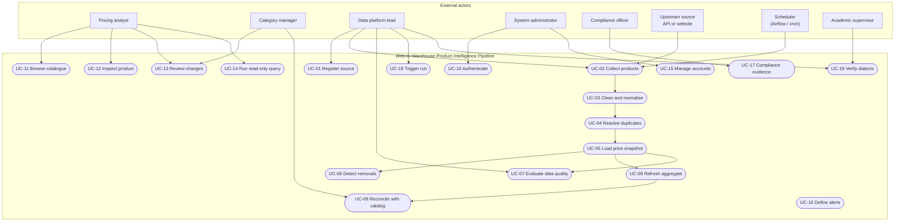
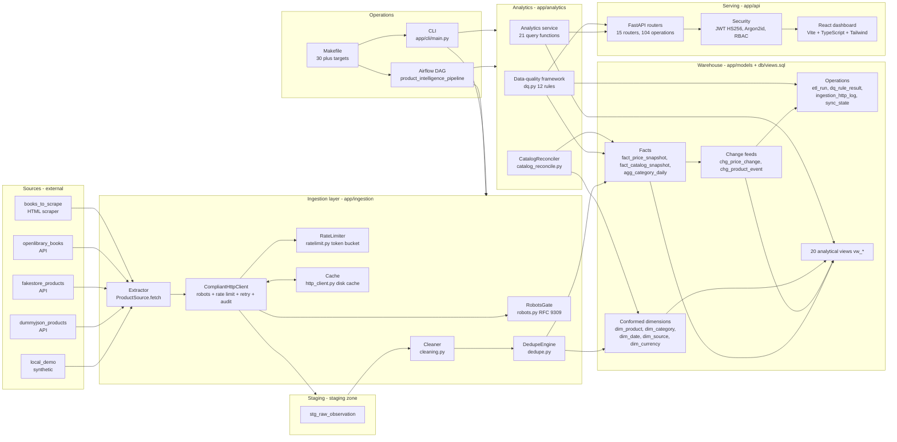
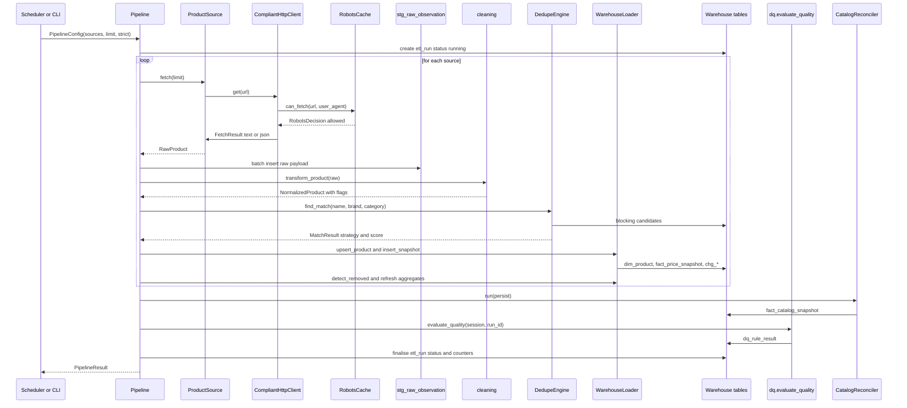
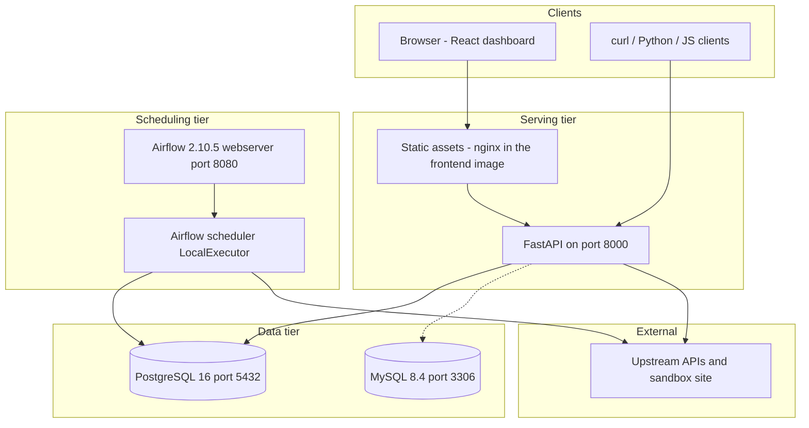

# 08 — System Analysis and Design

## Purpose

This document is the system-level analysis and design of the Web-to-Warehouse Product Intelligence
Pipeline. It restates the problem and objectives in engineering terms, presents the use-case diagram
and detailed use-case descriptions, summarises the functional and non-functional requirements,
documents the software architecture as a Mermaid component diagram, and justifies the chosen
architecture style (layered batch ETL with a read-only serving API and an MVC-like front end).

---

## Table of contents

1. [Problem statement and objectives](#1-problem-statement-and-objectives)
2. [Actors and use-case diagram](#2-actors-and-use-case-diagram)
3. [Use-case descriptions](#3-use-case-descriptions)
4. [Requirements summary](#4-requirements-summary)
5. [Software architecture](#5-software-architecture)
6. [Architecture style and rationale](#6-architecture-style-and-rationale)
7. [Deployment and runtime view](#7-deployment-and-runtime-view)
8. [Cross-cutting concerns](#8-cross-cutting-concerns)

---

## 1. Problem statement and objectives

### 1.1 Problem statement

> A retailer must observe price and assortment movement across permitted public web sources and
> combine that observation with its internal product catalog. Manual collection is slow, produces
> inconsistent records and destroys history, so the business cannot answer three questions: *what
> does a product cost now and how did it get there?*, *what appeared or disappeared in the market?*,
> and *are our prices competitive?* The system must collect only from sources that permit automated
> access, standardise what it collects, resolve duplicates, preserve full price history, measure its
> own data quality, and expose the result through an API that non-technical users can trust.

### 1.2 Engineering objectives

| ID | Objective | Verification |
| --- | --- | --- |
| O1 | Ingest from ≥ 3 permitted sources with robots enforcement in the transport layer | `pip-cli sources list`; `ingestion_http_log` |
| O2 | Preserve every observed price as an immutable snapshot | `fact_price_snapshot` (8,182 rows / 150 days) |
| O3 | Detect four change classes with SQL | `chg_price_change`, `chg_product_event` |
| O4 | Resolve duplicates without a third-party matching library | `app/ingestion/dedupe.py`, 14/14 pairs |
| O5 | Reconcile with the internal catalog and quantify the price gap | `fact_catalog_snapshot` (39/57 matched) |
| O6 | Measure data quality on six dimensions and fail only on critical rules | 12 rules, score 98.26 |
| O7 | Run identically on PostgreSQL and MySQL | `make verify-dialects` |
| O8 | Serve the warehouse read-only over a secure, role-gated API | 104 operations, 78/78 smoke checks |
| O9 | Be orchestrated on a schedule with recoverable tasks | Airflow DAG, 13 tasks, 2 retries each |
| O10 | Be operable without the UI | CLI with 12 commands, Makefile with 30+ targets |

### 1.3 Constraints

| Constraint | Consequence for the design |
| --- | --- |
| Web sources are untrusted and unstable | Staging zone + per-source isolation + flags instead of hard failures |
| Two SQL engines must be supported | No dialect-specific SQL: read-then-write upserts, `UTCDateTime`, `JSONType`, per-statement view application |
| Compliance must be provable | Every request audited; terms allow-list; robots gate inside the HTTP client |
| Analysts cannot wait for IT | Self-service read-only SQL over a stable semantic layer of views |
| Extraction and preparation must be testable in isolation | Pure functions in `app/ingestion/cleaning.py` |

---

## 2. Actors and use-case diagram

### 2.1 Actor responsibilities

| Actor | Goals | Frequency | Interfaces |
| --- | --- | --- | --- |
| Pricing analyst | Price movement, history, catalog position | Daily | Dashboard, API, CSV export |
| Category manager | New / removed / recategorised products | Daily | Dashboard, change feeds |
| Data platform lead | Runs, quality, source health, performance | Continuous | Dashboard, CLI, API |
| System administrator | Accounts, roles, keys, settings | Weekly | Dashboard admin area |
| Compliance officer | Evidence of respectful collection | Monthly | Compliance screen, API |
| Upstream source | Serve data without being overloaded | Continuous | HTTP (passive) |
| Scheduler | Trigger the pipeline unattended | Daily | Airflow DAG / cron |
| Academic supervisor | Verify the design and the evidence | Per milestone | Documentation, CLI |

---

## 3. Use-case descriptions

### UC-02 — Collect products from permitted sources (primary)

| Field | Value |
| --- | --- |
| **Use case ID** | UC-02 |
| **Name** | Collect products from permitted sources |
| **Primary actor** | Scheduler (system); secondary actors: data platform lead |
| **Goal** | Load a fresh, standardised, de-duplicated snapshot of the market into the warehouse |
| **Trigger** | Schedule (default `0 3 * * *`), `pip-cli run-pipeline`, `POST /api/v1/pipeline/run` |
| **Preconditions** | Target database reachable; at least one source enabled and allowed by its terms |
| **Postconditions** | `etl_run` row with status, counters, DQ score; snapshots, changes and events written; `sync_state` and `dim_source` statistics updated; HTTP audit rows written |
| **Main success scenario** | 1. The runner creates an `etl_run` row (status `running`, trigger recorded). 2. For each enabled source the dimension row is ensured, records are extracted under the robots gate and rate limit, and raw payloads are staged. 3. Each record is cleaned, normalised, priced and validated; invalid records are rejected with a reason. 4. Duplicates are resolved to a canonical product. 5. One snapshot per product is appended and price changes are recorded. 6. Products unseen for the staleness window are marked removed. 7. Category-day aggregates are refreshed. 8. The catalog is reconciled and price gaps stored. 9. Twelve DQ rules are evaluated and persisted. 10. The run is finalised: counters, duration, status. |
| **Alternative flows** | A source fails → warning recorded, run marked `partial`, remaining sources continue. Catalog is empty → reconciliation skipped. DQ critical rule fails → run marked `failed`. |
| **Post-conditions on failure** | `etl_run.error_message` and `warnings` carry the reason; already committed work stays committed (stage-level granularity is per source). |

### UC-04 — Resolve duplicates to a canonical product

| Field | Value |
| --- | --- |
| **Use case ID** | UC-04 |
| **Primary actor** | Pipeline |
| **Goal** | Ensure one canonical row per real-world product |
| **Precondition** | A normalised record with a fingerprint and a blocking key |
| **Main success scenario** | 1. Compute `fingerprint = sha1(brand_key|name_key)[:32]`. 2. If the fingerprint is known → strategy `exact`, score 1.0. 3. Else look for a row with the same `normalized_name` → strategy `blocked_exact`. 4. Else load the blocking candidates (prefix `blocking_key`) and score each with `combined_similarity()`. 5. If the best score ≥ 0.90 → strategy `fuzzy` with the score and the per-measure breakdown. 6. Otherwise → strategy `new`; the loader inserts a new `dim_product`. |
| **Alternative flow** | Two upstream rows in the same run resolve to the same product → the second snapshot is skipped and `duplicates_merged` is incremented (protects the fact grain). |
| **Postcondition** | `dim_product.match_strategy`, `match_score` and `observation_count` reflect the decision; the merge is auditable. |

### UC-07 — Evaluate data quality

| Field | Value |
| --- | --- |
| **Use case ID** | UC-07 |
| **Primary actor** | Pipeline; secondary: data platform lead, analyst |
| **Goal** | Produce an auditable quality verdict for the run |
| **Trigger** | End of every run, `POST /api/v1/pipeline/quality` equivalent (`pip-cli quality`), DAG task `data_quality_gate` |
| **Main success scenario** | 1. For each of the 12 rules, open a SAVEPOINT. 2. Evaluate the rule SQL. 3. Compute the status from the threshold (`_status`, with a ±5 % warn band). 4. Persist the outcome in `dq_rule_result`. 5. Compute the severity-weighted score. 6. If a **critical** rule failed, mark the run `failed`. |
| **Alternative flow** | A rule raises → the SAVEPOINT is rolled back and the outcome is recorded as `fail` with the exception message; the remaining rules still run. |
| **Postcondition** | `dq_rule_result` rows, `etl_run.dq_score`, `dq_passed`, `dq_failed`; the Quality screen shows the trend. |

### UC-08 — Reconcile with the internal catalog

| Field | Value |
| --- | --- |
| **Use case ID** | UC-08 |
| **Primary actor** | Pipeline; secondary: merchandiser |
| **Goal** | Match each internal SKU to a scraped product and quantify the price gap |
| **Main success scenario** | 1. Load active catalog rows (≤ 5,000). 2. Load active, recently seen products as candidates and their latest price. 3. Build blocking indexes (4-char prefix and token index). 4. For each SKU: try identifier match → normalised-name match → fuzzy match inside a narrowed pool. 5. Compute `price_gap_abs` and `price_gap_pct`; flag `is_price_mismatch` when the gap ≥ 1 %. 6. Persist the row in `fact_catalog_snapshot`. |
| **Alternative flow** | No candidate ≥ 0.86 → status `unmatched`, product id null (an internal-only SKU). |
| **Postcondition** | Reconciliation summary: total, matched, unmatched, match rate, price mismatches, average similarity, strategy mix. |

### UC-10 — Authenticate and authorise

| Field | Value |
| --- | --- |
| **Use case ID** | UC-10 |
| **Primary actor** | Any authenticated user |
| **Main success scenario** | 1. Post email + password. 2. Look up the user; refuse if unknown or locked. 3. Verify the Argon2id hash (rehash if the parameters changed). 4. Reset the failure counter, update `login_count`, `last_login_at`, `last_login_ip`. 5. Issue an access token (12 h) and a refresh token (30 d). 6. Write an audit row and a welcome notification. |
| **Alternative flows** | Wrong password → increment `failed_login_count`; at 5, lock for 15 minutes. Inactive user → `401`. Refresh → validate the token type is `refresh`, then re-issue. |
| **Postcondition** | Bearer token usable on every protected endpoint; permissions derived from the role. |

### UC-14 — Run a read-only query

| Field | Value |
| --- | --- |
| **Use case ID** | UC-14 |
| **Primary actor** | Analyst or admin (requires the `query` right) |
| **Main success scenario** | 1. Validate the statement: must start with `SELECT`, `WITH` or `EXPLAIN` and must not contain a write keyword, a comment or a second statement. 2. Execute with a row cap (`limit`, default 200, max 5,000). 3. Serialise values (Decimal → float, date → ISO 8601, bytes → size placeholder). 4. Return columns, rows, `row_count`, `duration_ms` and `truncated`. |
| **Alternative flows** | Invalid SQL → `422`; viewer role → `403`. |

---

## 4. Requirements summary

### 4.1 Functional requirements by area

| Area | Requirement summary | Count | Reference |
| --- | --- | --- | --- |
| Ingestion | Source contract, 5 sources, bounded extraction, compliant transport | 17 | `docs/07` FR-001 … FR-019 |
| Preparation | Name/category cleaning, price + currency normalisation, rating and availability parsing | 6 | FR-006 … FR-008, FR-056 |
| Resolution | Fingerprint match, blocking, blended fuzzy scoring, merge bookkeeping | 2 | FR-009, FR-010 |
| Warehouse | 23 tables, 20 views, append-only facts, conformed dimensions | 8 | FR-011, FR-018 |
| Change detection | New, recurring, removed, category changed, price change with bands | 5 | FR-027 … FR-031 |
| Reconciliation | 3-stage match cascade, price gap, market position | 4 | FR-032 … FR-035 |
| Quality | 12 rules, 6 dimensions, weighted score, blocking semantics | 4 | FR-036 … FR-039 |
| Analytics | KPI cards, trends, leaderboards, reports, CSV export | 4 | FR-040, FR-048, FR-026 |
| Serving | 104 REST operations, paging, OpenAPI | 3 | FR-020 … FR-025 |
| Security | Argon2id, JWT, 3 roles, API keys, audit | 7 | FR-041 … FR-044, FR-049 |
| Operations | CLI, Makefile, Airflow, demo seed, cross-dialect verification | 6 | FR-018, FR-019, FR-054 … FR-057 |

### 4.2 Non-functional requirements (condensed)

| Category | Requirement | Target | Measured |
| --- | --- | --- | --- |
| Performance | Pipeline run duration | < 600 s | 3.5 s |
| Performance | API read p95 | < 500 ms | ≤ 38.2 ms |
| Performance | Reconciliation time | < 3 s | 182 ms |
| Reliability | Source isolation, rule isolation, idempotent load | 0 aborts | Verified |
| Portability | PostgreSQL + MySQL parity | 0 drift | Verified |
| Security | Argon2id, JWT HS256, least privilege, audit | 100 % | Verified |
| Compliance | Robots, rate limits, no personal data | 100 % | Verified |
| Usability | Paging, saved views, keyboard access, WCAG 2.1 AA, no gratuitous motion | 100 % | Design specified |
| Maintainability | Externalised configuration, 6-step source extension, pure preparation functions | 100 % | Verified |

The full list is in `docs/07_requirements_gathering.md` §6 (NFR-01 … NFR-26).

---

## 5. Software architecture

### 5.1 Component diagram

### 5.2 Layer responsibilities

| Layer | Package | Responsibility | Must not |
| --- | --- | --- | --- |
| Source adapters | `app/ingestion/sources/` | Yield `RawProduct` records exactly as published; declare compliance metadata | Clean, deduplicate or write to the database |
| Compliance transport | `robots.py`, `ratelimit.py`, `http_client.py` | Robots decision, pacing, retries, caching, audit | Know about products |
| Preparation | `cleaning.py` | Unicode folding, category synonymy, price/currency/rating/availability parsing, fingerprints | Perform I/O or touch the database |
| Resolution | `dedupe.py` | Blocking, similarity, merge bookkeeping | Write facts |
| Warehouse | `loader.py`, `models/` | Dimension upserts, append-only facts, change detection, aggregates | Decide *what* data is valid |
| Quality | `dq.py` | Execute rules, score, persist outcomes | Raise exceptions that abort a run |
| Reconciliation | `catalog_reconcile.py` | Match catalog SKUs, compute price gaps | Persist when `persist=False` |
| Serving | `app/api/`, `app/analytics/` | Auth, RBAC, validation, serialisation, SQL execution | Contain business rules or write to the warehouse |
| Operations | `app/cli/`, `dags/`, `Makefile` | Scheduling, parameterisation, reporting | Reimplement pipeline logic |

### 5.3 Data flow through the architecture

### 5.4 Deployment topology

---

## 6. Architecture style and rationale

### 6.1 Style selected

A **layered architecture** with three classic concerns composed:

| Concern | Style applied | Where |
| --- | --- | --- |
| Data movement | **Batch ETL** (extract → stage → transform → load → analyse) with a raw landing zone | `app/etl/pipeline.py`, `stg_raw_observation` |
| Serving | **Layered REST API** (routers → dependencies → services → ORM) | `app/api/routers` → `app/api/deps.py` → `app/analytics/service.py` → `app/models` |
| Presentation | **MVC-like**: views (React pages) bind to a model (API payloads) with a controller layer provided by React Query hooks | `frontend/src/pages`, `frontend/src/hooks`, `frontend/src/lib` |
| Orchestration | **Workflow-as-code DAG** with a short-circuit guard | `dags/product_intelligence_pipeline.py` |

### 6.2 Why not microservices

| Alternative | Rejected because |
| --- | --- |
| Microservices per stage (scraper service, dedupe service…) | The volumes are tiny (≤ 5,000 records per source, a 3.5 s run). Service boundaries would add network failure modes without adding throughput, and would make the dialect-portability guarantee harder to prove |
| Kafka / stream processing | The business question ("what is the price today?") is answered by a daily snapshot; streaming would add a broker, a consumer group and an eventual-consistency story for no analytical gain |
| Full event sourcing | The fact table is already append-only; the change feeds give the event history that matters. Full event sourcing would prevent the simple SQL the analysts need |
| A BI tool (Power BI / Tableau) instead of an API | Direct connection would bypass the RBAC, the audit trail and the data-quality gate that the compliance stakeholder requires |

### 6.3 Why a single `Pipeline` object rather than framework-coupled tasks

| Benefit | Evidence |
| --- | --- |
| Identical behaviour from CLI, API and Airflow | `app/cli/main.py run-pipeline`, `POST /api/v1/pipeline/run`, DAG task `run_full_pipeline` all call `Pipeline(config).run()` |
| Testability | A run can be limited to 2 records per source in a test, as the smoke test does (`limit_per_source=2`) |
| Instrumented stages | `_timer("extract")`, `_timer("stage")`, … produce the stage-timing table in the CLI and the run detail API |
| Degradation, not failure | Per-source try/except turns a source error into a warning and a `partial` status |

### 6.4 Design principles applied

1. **Compliance in the infrastructure, not in the adapters.** Politeness cannot be forgotten because the HTTP client owns it.
2. **Purity where it pays.** Preparation and matching have no I/O, so they are unit-testable and deterministic.
3. **One semantic layer.** Twenty views are the only place where joins are defined; routers select from views.
4. **Fail soft, fail loud, in that order.** A source error degrades the run; a critical data-quality failure stops it.
5. **Portable SQL only.** No `ON CONFLICT`, no `ON DUPLICATE KEY`, no `STDDEV`; variance is computed with `AVG(x*x)` so that SQLite, PostgreSQL and MySQL agree.
6. **Explain every automatic decision.** `match_strategy`, `match_score`, `quality_flags`, `blocking_key`, `fx_rate_to_usd` and `payload_hash` make each automated judgement inspectable.
7. **Measured, not asserted.** Every number in the documentation is produced by a command in `docs/05`.

---

## 7. Deployment and runtime view

| Tier | Process | Entry point | Configuration |
| --- | --- | --- | --- |
| Presentation | Static SPA served by nginx (or the Vite dev server) | `frontend/` build → nginx | `VITE_API_BASE_URL` |
| Serving | uvicorn + FastAPI | `app.api.main:app` | `APP_PORT`, `DATABASE_URL`, `CORS_ORIGINS`, `SECRET_KEY` |
| Scheduling | Airflow webserver + scheduler | `airflow webserver`, `airflow scheduler` | `PIP_SCHEDULE`, `PIP_DATABASE_URL`, `AIRFLOW__CORE__EXECUTOR` |
| Data | PostgreSQL 16 and MySQL 8.4 | Docker Compose services `postgres`, `mysql` | `POSTGRES_*`, `MYSQL_*` |
| CLI | `python -m app.cli.main` | Typer app | `--database`, `--limit`, `--strict` |

The full deployment design — services, ports, environment matrix, secrets, backup and scaling — is in
`docs/13_deployment.md`.

---

## 8. Cross-cutting concerns

| Concern | Mechanism | Location |
| --- | --- | --- |
| Authentication | JWT HS256 access + refresh, API keys for machines | `app/api/security.py` |
| Authorisation | Role → rights dictionary, dependency factory | `security.ROLE_RIGHTS`, `deps.require_rights()` |
| Input validation | Pydantic v2 models; SQL console allow-list | `app/api/schemas.py` |
| Error handling | Typed domain errors mapped to status codes; global handlers | `app/core/errors.py`, `app/api/main.py` |
| Logging | Namespaced loggers, ANSI or JSON, rotating file handler | `app/core/logging.py` |
| Time | One UTC-aware boundary type for every dialect | `app/models/base.py:UTCDateTime` |
| Money | `Numeric(18,4)` everywhere, plus the FX rate used | `app/models/base.py:NumericMixin` |
| Configuration | Validated settings singleton, reloadable | `app/core/config.py` |
| Observability | Run counters, stage timings, DQ results, HTTP audit, `X-Process-Time-Ms` | `etl_run`, `dq_rule_result`, `ingestion_http_log` |
| Compliance | Robots gate, rate limiter, terms allow-list, license notes | `app/ingestion/` |
| Internationalisation | UTC storage, per-user timezone preference, ISO 8601 in JSON | `app_users.timezone`, `app_timezone` |
| Accessibility | Keyboard-first interaction, focus states, contrast tokens | Design system in `docs/12` |