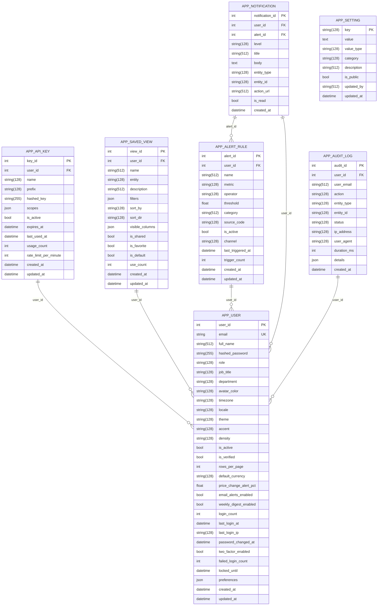

# 09 — Database Design and Data Modelling

## Purpose

This document is the database design of the Web-to-Warehouse Product Intelligence Pipeline. It
presents the entity-relationship diagram for all 23 physical tables with real columns, keys and
cardinalities; the logical versus physical schema; the normalisation argument (3NF for the
dimensions, deliberate denormalisation inside the facts); the indexing, partitioning and retention
strategy; and the per-dialect data-type mapping that keeps PostgreSQL and MySQL in agreement.

Every column, key, index and constraint in this document is generated from the SQLAlchemy models in
`app/models/`, so the ERD cannot drift from the code. Regenerate it with the snippet in §9.9.

---

## Table of contents

1. [Design goals](#1-design-goals)
2. [Table inventory](#2-table-inventory)
3. [Entity-relationship diagram](#3-entity-relationship-diagram)
4. [Logical versus physical schema](#4-logical-versus-physical-schema)
5. [Normalisation](#5-normalisation)
6. [Keys, constraints and referential integrity](#6-keys-constraints-and-referential-integrity)
7. [Indexing strategy](#7-indexing-strategy)
8. [Partitioning and retention](#8-partitioning-and-retention)
9. [Data types per dialect](#9-data-types-per-dialect)
10. [Entity catalogue](#10-entity-catalogue)
11. [View catalogue](#11-view-catalogue)

---

## 1. Design goals

| # | Goal | How the design satisfies it |
| --- | --- | --- |
| G1 | Answer "what did this product cost, and when?" without scanning text | `fact_price_snapshot` is append-only with a declared grain and a surrogate `date_id` |
| G2 | Make every descriptive attribute reusable across subjects | Five conformed dimensions (`dim_product`, `dim_category`, `dim_date`, `dim_source`, `dim_currency`) |
| G3 | Keep analytical SQL simple for non-technical users | 20 views (`db/views.sql`) hide every join; the API and Query Lab only select from views |
| G4 | Run unchanged on PostgreSQL 16, MySQL 8.4 and SQLite | Dialect-portable column types, no vendor SQL, per-statement view application |
| G5 | Make automated decisions inspectable | `match_strategy`, `match_score`, `quality_flags`, `payload_hash`, `fx_rate_to_usd` |
| G6 | Be able to explain every number on a dashboard | `etl_run` counters, `dq_rule_result` outcomes, `ingestion_http_log` per request |
| G7 | Never lose the raw evidence | `stg_raw_observation.raw_payload` keeps every upstream payload with its hash |
| G8 | Separate reference data from observed data | `catalog_product` (the retailer's ERP view) is a separate entity, matched but never overwritten |

---

## 2. Table inventory

23 physical tables in 6 logical groups (the grouping is also exposed by the API at
`GET /api/v1/meta/tables`).

| Group | Count | Tables |
| --- | --- | --- |
| Dimensions (`dim_*`) | 5 | `dim_product`, `dim_category`, `dim_date`, `dim_source`, `dim_currency` |
| Facts (`fact_*`) | 3 | `fact_price_snapshot`, `fact_catalog_snapshot`, `agg_category_daily` |
| Change feeds (`chg_*`) | 2 | `chg_price_change`, `chg_product_event` |
| Operations | 5 | `etl_run`, `dq_rule_result`, `ingestion_http_log`, `stg_raw_observation`, `sync_state` |
| Catalog | 1 | `catalog_product` |
| Application (`app_*`) | 7 | `app_user`, `app_api_key`, `app_saved_view`, `app_alert_rule`, `app_notification`, `app_audit_log`, `app_setting` |

| Table | Purpose | Grain | Typical measured rows |
| --- | --- | --- | --- |
| `dim_product` | Canonical, de-duplicated product | One row per canonical product | 66 |
| `dim_category` | Category hierarchy | One row per category node | 18 |
| `dim_date` | Calendar | One row per calendar day | 403 |
| `dim_source` | Permitted upstream source | One row per source | 1 … 5 |
| `dim_currency` | Currency reference with FX rate | One row per ISO currency | 25 |
| `fact_price_snapshot` | Historical price observation | One row per product per source per run | 8,302 |
| `fact_catalog_snapshot` | Scraped versus internal catalog comparison | One row per catalog SKU per run | 285 |
| `agg_category_daily` | Pre-aggregated category/day rollup | One row per date × category × source | 18 |
| `chg_price_change` | Detected price change event | One row per product per run with a change | 8,062 |
| `chg_product_event` | Lifecycle event | One row per product per run with an event | 8,326 |
| `catalog_product` | Internal ERP/PIM catalogue | One row per SKU | 60 |
| `etl_run` | One pipeline execution | One row per run | 155 |
| `dq_rule_result` | One rule outcome | One row per run × rule | 72 |
| `ingestion_http_log` | One outbound HTTP request | One row per request | 0 offline / grows online |
| `stg_raw_observation` | Landing zone | One row per raw record per run | 126 |
| `sync_state` | Incremental checkpoint | One row per source | 1 |
| `app_user` | Dashboard account | One row per account | 3 |
| `app_api_key` | Machine credential | One row per key | 0 |
| `app_saved_view` | Saved filter preset | One row per view | 6 |
| `app_alert_rule` | User alert | One row per rule | 7 |
| `app_notification` | In-app message | One row per notification | 13 |
| `app_audit_log` | Audit trail | One row per mutating action | 12 |
| `app_setting` | Global key/value setting | One row per setting | 6 |

---

## 3. Entity-relationship diagram

### 3.1 Analytical and operational core (16 tables)

```mermaid
erDiagram
    DIM_CATEGORY ||--o{ DIM_CATEGORY : "parent_id"
    DIM_PRODUCT ||--o{ DIM_CATEGORY : "category_id"
    FACT_PRICE_SNAPSHOT ||--o{ DIM_DATE : "date_id"
    FACT_PRICE_SNAPSHOT ||--o{ DIM_PRODUCT : "product_id"
    FACT_PRICE_SNAPSHOT ||--o{ ETL_RUN : "run_id"
    FACT_PRICE_SNAPSHOT ||--o{ DIM_SOURCE : "source_code"
    FACT_CATALOG_SNAPSHOT ||--o{ DIM_PRODUCT : "product_id"
    FACT_CATALOG_SNAPSHOT ||--o{ DIM_DATE : "date_id"
    FACT_CATALOG_SNAPSHOT ||--o{ CATALOG_PRODUCT : "catalog_sku"
    FACT_CATALOG_SNAPSHOT ||--o{ ETL_RUN : "run_id"
    FACT_CATALOG_SNAPSHOT ||--o{ DIM_SOURCE : "source_code"
    AGG_CATEGORY_DAILY ||--o{ DIM_CATEGORY : "category_id"
    AGG_CATEGORY_DAILY ||--o{ DIM_DATE : "date_id"
    CHG_PRICE_CHANGE ||--o{ DIM_DATE : "date_id"
    CHG_PRICE_CHANGE ||--o{ DIM_PRODUCT : "product_id"
    CHG_PRICE_CHANGE ||--o{ DIM_SOURCE : "source_code"
    CHG_PRICE_CHANGE ||--o{ ETL_RUN : "run_id"
    CHG_PRODUCT_EVENT ||--o{ DIM_DATE : "date_id"
    CHG_PRODUCT_EVENT ||--o{ DIM_SOURCE : "source_code"
    CHG_PRODUCT_EVENT ||--o{ DIM_PRODUCT : "product_id"
    CHG_PRODUCT_EVENT ||--o{ ETL_RUN : "run_id"
    DQ_RULE_RESULT ||--o{ ETL_RUN : "run_id"
    DIM_SOURCE {
        string(128) source_code PK
        string(512) name 
        string(128) kind 
        string(2048) base_url 
        string(2048) robots_url 
        string(2048) terms_url 
        text license_note 
        int rate_limit_per_minute 
        float min_delay_seconds 
        bool enabled 
        bool terms_allowed 
        datetime robots_checked_at 
        string(128) last_run_id 
        datetime last_run_at 
        bigint total_records 
        int total_runs 
        float success_rate_pct 
        float avg_duration_seconds 
        json config 
        datetime created_at 
        datetime updated_at 
    }
    DIM_CATEGORY {
        int category_id PK
        string(512) name 
        string slug UK
        int parent_id FK
        smallint level 
        string(512) path 
        string(512) source_category_raw 
        int product_count 
        decimal(18,4) avg_price 
        datetime created_at 
        datetime updated_at 
    }
    DIM_DATE {
        int date_id PK
        date full_date UK
        smallint year 
        smallint quarter 
        smallint month 
        smallint day 
        string(128) month_name 
        string(128) day_name 
        smallint week_of_year 
        bool is_weekend 
        bool is_month_start 
        bool is_month_end 
        smallint iso_week 
    }
    DIM_CURRENCY {
        string(128) currency_code PK
        string(128) currency_name 
        string(8) symbol 
        decimal(18,6) rate_to_usd 
        string(128) rate_source 
        date as_of 
        datetime created_at 
        datetime updated_at 
    }
    DIM_PRODUCT {
        int product_id PK
        string(128) source_product_id 
        string(128) source_code 
        string(512) canonical_name 
        text normalized_name 
        string(512) display_name 
        string(128) brand 
        int category_id FK
        string(2048) product_url 
        string(2048) image_url 
        text description 
        string(128) currency 
        decimal(18,4) current_price 
        decimal(18,4) previous_price 
        float current_rating 
        int rating_count 
        string(128) availability 
        string(128) fingerprint 
        string(128) match_strategy 
        float match_score 
        int matched_product_id 
        bool is_active 
        int version 
        int observation_count 
        datetime first_seen_at 
        datetime last_seen_at 
        json extra 
        datetime created_at 
        datetime updated_at 
    }
    FACT_PRICE_SNAPSHOT {
        int snapshot_id PK
        int product_id FK
        string(128) source_code FK
        string(128) run_id FK
        int date_id FK
        datetime captured_at 
        datetime ingested_at 
        decimal(18,4) price 
        decimal(18,4) list_price 
        string(128) currency 
        decimal(18,6) fx_rate_to_usd 
        decimal(18,4) price_usd 
        float discount_pct 
        float rating 
        int rating_count 
        string(128) availability 
        bool in_stock 
        decimal(18,4) price_change_abs 
        float price_change_pct 
        bool is_first_sighting 
        string(2048) product_url 
        string(128) raw_price_text 
        json quality_flags 
    }
    FACT_CATALOG_SNAPSHOT {
        int match_id PK
        string(128) run_id FK
        string(128) catalog_sku FK
        int product_id FK
        string(128) source_code FK
        int date_id FK
        string(128) match_status 
        string(128) match_strategy 
        float similarity_score 
        text scraped_name 
        text catalog_name 
        decimal(18,4) scraped_price 
        decimal(18,4) catalog_price 
        decimal(18,4) price_gap_abs 
        float price_gap_pct 
        bool category_match 
        bool brand_match 
        bool is_price_mismatch 
        datetime matched_at 
        json details 
    }
    AGG_CATEGORY_DAILY {
        int agg_id PK
        int date_id FK
        int category_id FK
        string(128) source_code 
        int product_count 
        int new_product_count 
        int removed_product_count 
        decimal(18,4) avg_price 
        decimal(18,4) median_price 
        decimal(18,4) min_price 
        decimal(18,4) max_price 
        float avg_rating 
        int price_change_count 
        float avg_price_change_pct 
        datetime computed_at 
    }
    CHG_PRICE_CHANGE {
        int change_id PK
        int product_id FK
        string(128) source_code FK
        string(128) run_id FK
        int date_id FK
        decimal(18,4) previous_price 
        decimal(18,4) new_price 
        decimal(18,4) change_abs 
        float change_pct 
        string(128) direction 
        string(128) currency 
        string(128) magnitude_band 
        bool is_significant 
        decimal(18,4) previous_price_usd 
        decimal(18,4) new_price_usd 
        datetime detected_at 
    }
    CHG_PRODUCT_EVENT {
        int event_id PK
        int product_id FK
        string(128) source_code FK
        string(128) run_id FK
        int date_id FK
        string(128) event_type 
        string(128) severity 
        text old_value 
        text new_value 
        int old_category_id 
        int new_category_id 
        int days_missing 
        datetime detected_at 
        json details 
    }
    CATALOG_PRODUCT {
        string(128) sku PK
        string(512) name 
        text normalized_name 
        string(128) brand 
        string(512) category 
        string(128) supplier 
        decimal(18,4) cost_price 
        decimal(18,4) list_price 
        string(128) currency 
        int qty_on_hand 
        string(128) status 
        string(2048) product_url 
        string(2048) image_url 
        json attributes 
        datetime created_at 
        datetime updated_at 
    }
    ETL_RUN {
        string(128) run_id PK
        string(128) run_key 
        string(128) pipeline 
        string(128) target_database 
        string(128) dag_id 
        string(128) task_id 
        string(128) status 
        string(128) trigger 
        datetime started_at 
        datetime finished_at 
        int duration_ms 
        int records_extracted 
        int records_valid 
        int records_rejected 
        int records_inserted 
        int records_updated 
        int duplicates_merged 
        int new_products 
        int price_changes 
        int removed_products 
        int catalog_matched 
        int dq_passed 
        int dq_failed 
        float dq_score 
        text error_message 
        json warnings 
        json params 
        string(128) created_by 
        datetime created_at 
    }
    DQ_RULE_RESULT {
        int result_id PK
        string(128) run_id FK
        string(128) rule_code 
        string(512) rule_name 
        string(128) dimension 
        string(128) severity 
        string(128) status 
        string(128) table_name 
        float observed_value 
        float expected_value 
        float threshold 
        int records_checked 
        int records_failed 
        float pass_rate_pct 
        text message 
        json evidence 
        datetime evaluated_at 
    }
    INGESTION_HTTP_LOG {
        int log_id PK
        string(128) run_id 
        string(128) source_code 
        string(128) method 
        string(2048) url 
        string(128) host 
        int status_code 
        float elapsed_ms 
        int response_bytes 
        bool robots_allowed 
        string(128) robots_rule 
        bool from_cache 
        int retry_count 
        text error 
        datetime requested_at 
    }
    STG_RAW_OBSERVATION {
        int observation_id PK
        string(128) run_id 
        string(128) source_code 
        string(128) source_product_id 
        string(128) entity_type 
        string(2048) source_url 
        text raw_name 
        string(512) raw_category 
        string(128) raw_price_text 
        string(128) raw_currency 
        string(128) raw_rating_text 
        string(128) raw_availability 
        json raw_payload 
        string(128) payload_hash 
        int http_status 
        bool is_valid 
        string(512) reject_reason 
        datetime fetched_at 
        datetime landed_at 
    }
    SYNC_STATE {
        string(128) source_code PK
        string(128) last_run_id 
        datetime last_success_at 
        datetime last_attempt_at 
        string(512) cursor_value 
        json cursor_json 
        bigint total_extracted 
        int consecutive_failures 
        string(128) status 
        text message 
    }
```

### 3.2 Application and security tables (7 tables)



### 3.3 Cardinality legend

| Notation | Meaning in this model |
| --- | --- |
| `DIM_PRODUCT \|\|--o{ FACT_PRICE_SNAPSHOT` | One product has zero or many snapshots (optional participation: a new product may not have a snapshot yet) |
| `DIM_PRODUCT \|\|--o{ CHG_PRICE_CHANGE` | One product has zero or many price changes |
| `ETL_RUN \|\|--o{ FACT_PRICE_SNAPSHOT` | One run produces zero or many snapshots |
| `DIM_CATEGORY \|\|--o{ DIM_CATEGORY` | Self-reference: a category has at most one parent (`parent_id`) and zero or many children |
| `APP_USER \|\|--o{ APP_ALERT_RULE` | A user may have no alerts; an alert always belongs to one user (`ondelete="CASCADE"`) |

All fact-side relationships are **optional** (`o{`) because the warehouse must tolerate a partially
loaded run: an `etl_run` row exists from the moment the run starts, while its facts appear as the
stages complete.

---

## 4. Logical versus physical schema

| Aspect | Logical model | Physical model |
| --- | --- | --- |
| Entities | `PRODUCT`, `CATEGORY`, `SOURCE`, `CURRENCY`, `DATE`, `PRICE OBSERVATION`, `CATALOG ITEM`, `RUN`, `DATA QUALITY RESULT`, `USER` | 23 tables listed in §2 |
| Keys | Surrogate integer keys for facts and dimensions; natural keys for reference data (`dim_source.source_code`, `dim_currency.currency_code`, `catalog_product.sku`, `app_setting.key`) | Integer `PRIMARY KEY AUTO_INCREMENT` on PostgreSQL/MySQL; `INTEGER PRIMARY KEY` on SQLite; natural keys are declared directly as primary keys |
| Attributes | Abstract types (identifier, money, measure, timestamp, category, text) | Concrete types chosen for portability: `VARCHAR(128/512/2048)`, `NUMERIC(18,4)`, `FLOAT`, `JSON`, `DATETIME`, `BOOLEAN`, `BIGINT` |
| Relationships | One product → many observations; one category → many products; one run → many facts | Implemented with declared foreign keys (18 of them) and covered by indexes |
| Integrity | Business rules (grain, thresholds, lifecycle) | `UNIQUE` constraints, `CHECK`-by-rule (DQ rules), `NOT NULL`, cascade rules |
| Derived data | Category rollups, current price, movement percentages | `agg_category_daily` (materialised aggregate) plus 20 views (logical projections) |
| Security | Roles and rights | 7 `app_*` tables plus the `ROLE_RIGHTS` dictionary in code |
| Time | Business date and observation timestamp | `dim_date.date_id` (`YYYYMMDD` surrogate) for the business date; `UTCDateTime` for every instant |

### 4.1 Logical-to-physical mapping example

| Logical concept | Logical attributes | Physical realisation |
| --- | --- | --- |
| Price observation | product, source, observation instant, business date, price, list price, currency, FX rate, USD price, rating, availability, change, flags | `fact_price_snapshot` (26 columns) |
| Current product state | name, normalised name, brand, category, price, previous price, rating, availability, active, first/last seen, observation count | `dim_product` (28 columns) |
| Catalogue match | catalog SKU, product, status, strategy, similarity, both prices, gap, brand/category match | `fact_catalog_snapshot` (22 columns) |

---

## 5. Normalisation

### 5.1 Dimensions are in third normal form

| Relation | 1NF | 2NF | 3NF | Argument |
| --- | --- | --- | --- | --- |
| `dim_product` | Every column is atomic; no repeating group of attributes per product | The primary key is a single surrogate column, so no partial dependency is possible | No non-key attribute depends on another non-key attribute: `brand`, `canonical_name`, `availability` and `currency` each depend only on `product_id`. The FP is **not** 3NF because `fingerprint` is derivable from `normalized_name` + `brand` — this is documented below as a deliberate, controlled exception |
| `dim_category` | Atomic columns; the hierarchy is expressed by `parent_id` and `path`, not by repeating groups | Single-column key | `product_count` is a **derived** attribute (recomputed by `seed_history` and `resolve_category`); `avg_price` is declared but not maintained — both are treated as *deferred aggregates*, documented in the catalogue |
| `dim_source` | Atomic | Natural key `source_code`; `total_runs`, `total_records`, `success_rate_pct` are running aggregates of that source | Derived columns again; acceptable because they are recomputed deterministically on each run (`_register_source_dim`) |
| `dim_currency` | Atomic | Natural key `currency_code` | Fully 3NF |
| `dim_date` | Atomic | Surrogate `date_id` derived from `full_date` | Fully 3NF (all calendar attributes are functions of `full_date`) |

### 5.2 Where the model is deliberately denormalised

| Denormalisation | Why | Cost accepted | Control |
| --- | --- | --- | --- |
| `fact_price_snapshot` stores `price_usd` **and** `fx_rate_to_usd` next to `price` and `currency` | The USD series must remain reproducible after a future FX-table update; recomputing history from a mutable rate table would silently restate past performance | A rate change does not retroactively alter stored history | `fx_rate_to_usd` is stored with the row and copied into `dim_product.extra` |
| `fact_price_snapshot` stores `price_change_abs` and `price_change_pct` | Change detection is needed on every read path; computing it with a `LAG()` window over millions of rows for every dashboard request would be expensive | The value is only correct relative to the previous snapshot *for the same product and source* | The view `vw_price_movements` recomputes it independently, so the two implementations can be compared |
| `fact_price_snapshot` stores `is_first_sighting`, `in_stock` and `quality_flags` | These are determinations made at write time (against the previous snapshot, or from the cleaning stage) and cannot be recomputed later without replaying history | Slight redundancy | `is_first_sighting` is derived from the existence of a previous snapshot in the same transaction, so it cannot drift |
| `agg_category_daily` duplicates aggregations that could be computed from `fact_price_snapshot` | Dashboards need category-day numbers at interactive speed, and the aggregate is refreshed once per run for the affected dates only | Double-counting risk if a refresh is partial | Unique key `(date_id, category_id, source_code)` makes the refresh idempotent; `refresh_category_daily()` rebuilds the run's dates |
| `fact_catalog_snapshot` stores both `scraped_price` and `catalog_price` plus the computed gaps | The comparison must be auditable after both prices move | — | Gap columns are recomputed on every run |
| `dim_product.current_price` / `previous_price` alongside the fact table | The product list screen needs the current price without a correlated subquery | Can be stale if a snapshot is written without the dimension update | Both are set in `insert_snapshot()` in the same transaction |

### 5.3 Functional dependencies (informal)

```text
dim_product.product_id            → canonical_name, normalized_name, brand, category_id, fingerprint, ...
dim_category.category_id          → name, slug, level, path, parent_id
dim_category.slug                 → category_id                      (alternate key, UNIQUE)
dim_source.source_code            → name, kind, base_url, rate_limit_per_minute, ...
dim_currency.currency_code        → currency_name, symbol, rate_to_usd, as_of
dim_date.date_id                  → full_date, year, quarter, month, day, is_weekend, ...
fact_price_snapshot.snapshot_id   → all 25 other columns
UNIQUE(fact_price_snapshot.product_id, run_id)                      (fact grain)
UNIQUE(chg_price_change.product_id, run_id)
UNIQUE(fact_catalog_snapshot.run_id, catalog_sku)
UNIQUE(agg_category_daily.date_id, category_id, source_code)
app_user.email                    → user_id                          (alternate key, UNIQUE)
app_api_key.prefix                → key_id                           (indexed lookup key)
```

---

## 6. Keys, constraints and referential integrity

### 6.1 Primary and alternate keys

| Table | Primary key | Alternate key / unique constraint |
| --- | --- | --- |
| `dim_product` | `product_id` (surrogate) | `fingerprint` (indexed, not unique — collisions are reported by `DQ005`), `(source_code, source_product_id)` indexed |
| `dim_category` | `category_id` | `slug` UNIQUE |
| `dim_date` | `date_id` (`YYYYMMDD`) | `full_date` UNIQUE |
| `dim_source` | `source_code` (natural) | — |
| `dim_currency` | `currency_code` (natural) | — |
| `fact_price_snapshot` | `snapshot_id` | `uq_fact_price_product_run (product_id, run_id)` |
| `fact_catalog_snapshot` | `match_id` | `uq_fact_catalog_run_sku (run_id, catalog_sku)` |
| `chg_price_change` | `change_id` | `uq_chg_price_product_run (product_id, run_id)` |
| `chg_product_event` | `event_id` | none (many events per product per run are legitimate) |
| `agg_category_daily` | `agg_id` | `uq_agg_cat_date_cat_source (date_id, category_id, source_code)` |
| `catalog_product` | `sku` (natural) | — |
| `etl_run` | `run_id` (32-char hex) | `run_key` indexed for the Airflow mapping |
| `dq_rule_result` | `result_id` | none (rule can be re-evaluated on demand) |
| `stg_raw_observation` | `observation_id` | `payload_hash` indexed (deduplication of re-ingested payloads) |
| `sync_state` | `source_code` | — |
| `app_user` | `user_id` | `email` UNIQUE |
| `app_api_key` | `key_id` | `prefix` indexed |
| `app_saved_view`, `app_alert_rule`, `app_notification`, `app_audit_log` | surrogate id | — |
| `app_setting` | `key` (natural) | — |

### 6.2 Foreign keys (18)

| From | To | On delete | Rationale |
| --- | --- | --- | --- |
| `dim_product.category_id` | `dim_category.category_id` | restrict | A category is never deleted while products reference it |
| `dim_category.parent_id` | `dim_category.category_id` | restrict | Prevents cycles in the hierarchy |
| `fact_price_snapshot.product_id` | `dim_product.product_id` | restrict | History must keep its product |
| `fact_price_snapshot.source_code` | `dim_source.source_code` | restrict | An observation must know its source |
| `fact_price_snapshot.run_id` | `etl_run.run_id` | restrict | Provenance |
| `fact_price_snapshot.date_id` | `dim_date.date_id` | restrict | Business date must exist |
| `fact_catalog_snapshot.catalog_sku` | `catalog_product.sku` | restrict | The comparison needs the internal row |
| `fact_catalog_snapshot.product_id` | `dim_product.product_id` | set null (nullable) | An unmatched SKU has no product |
| `fact_catalog_snapshot.run_id` | `etl_run.run_id` | restrict | Provenance |
| `fact_catalog_snapshot.source_code` | `dim_source.source_code` | nullable | Recorded for the match |
| `fact_catalog_snapshot.date_id` | `dim_date.date_id` | nullable | Optional business date |
| `chg_price_change.{product_id, source_code, run_id, date_id}` | respective dimensions | restrict | Event context |
| `chg_product_event.{product_id, source_code, run_id, date_id}` | respective dimensions | restrict | Event context |
| `agg_category_daily.{date_id, category_id}` | dimensions | restrict | Aggregate context |
| `dq_rule_result.run_id` | `etl_run.run_id` | `ON DELETE CASCADE` | Deleting a run removes its verdicts |
| `app_api_key.user_id` | `app_user.user_id` | `ON DELETE CASCADE` | Keys die with the account |
| `app_saved_view.user_id` | `app_user.user_id` | `ON DELETE CASCADE` | Views die with the owner |
| `app_alert_rule.user_id` | `app_user.user_id` | `ON DELETE CASCADE` | Alerts die with the owner |
| `app_notification.{user_id, alert_id}` | `app_user`, `app_alert_rule` | `ON DELETE CASCADE` | Notifications follow the owner |
| `app_audit_log.user_id` | `app_user.user_id` | `ON DELETE SET NULL` | **Audit rows are never deleted with the user** |

### 6.3 Business integrity enforced in application code

Because the same model must run on three engines without vendor-specific SQL, several rules are
enforced by the loader and verified by the DQ framework rather than by `CHECK` constraints.

| Rule | Enforcement |
| --- | --- |
| One snapshot per product per run | `UNIQUE(product_id, run_id)` + loader skip + `DQ006` (critical) |
| Price between 0 and 1,000,000 | `DQ002` |
| Rating between 0 and 5 | `DQ003` (clamped upstream by `parse_rating`) |
| Currency must exist in `dim_currency` | `DQ004` |
| Active products must have name, price and category | `DQ001` |
| Products not seen for 7 days become inactive | `detect_removed(stale_after_days=7)` |
| Category change emits an event | `upsert_product()` writes `category_changed` in the same transaction |
| Staging rows keep their rejection reason | `stg_raw_observation.reject_reason` |

---

## 7. Indexing strategy

### 7.1 Declared indexes by table

| Table | Index | Columns | Serves |
| --- | --- | --- | --- |
| `dim_product` | `ix_dim_product_category` | `category_id` | Category drill-down |
| | `ix_dim_product_name_search` | `canonical_name` | Name search in `LIKE '%…%'` (prefix searches elsewhere) |
| | `ix_dim_product_active_seen` | `is_active, last_seen_at` | "Recently seen active products" and removal detection |
| | `ix_dim_product_brand` | `brand` | Brand facet |
| | `ix_dim_product_source_ext` | `source_code, source_product_id` | Upstream traceability lookup |
| | (column index) | `fingerprint` | Dedupe fingerprint probe |
| `dim_category` | `ix_dim_category_parent` | `parent_id` | Hierarchy traversal |
| | `ix_dim_category_name` | `name` | Category filter on the product screen |
| `dim_date` | `ix_dim_date_year_month` | `year, month` | Month-bucketed reporting |
| `dim_source` | `ix_dim_source_enabled`, `ix_dim_source_kind` | `enabled`, `kind` | Source selection at run time |
| `fact_price_snapshot` | `uq_fact_price_product_run` | `product_id, run_id` | **Grain enforcement** |
| | `ix_fact_price_product_time` | `product_id, captured_at` | Price history per product (the `LAG()` window) |
| | `ix_fact_price_date` | `date_id` | Daily trend |
| | `ix_fact_price_source_date` | `source_code, date_id` | Per-source day rollups |
| | `ix_fact_price_run` | `run_id` | Run detail |
| | `ix_fact_price_change` | `price_change_pct` | Top movers ordering |
| `chg_price_change` | `uq_chg_price_product_run` | `product_id, run_id` | Grain |
| | `ix_chg_price_date_dir` | `date_id, direction` | Movement summary |
| | `ix_chg_price_pct` | `change_pct` | Top movers |
| | `ix_chg_price_significant` | `is_significant` | Alerting filter |
| `chg_product_event` | `ix_chg_event_type_date` | `event_type, date_id` | Lifecycle feeds |
| | `ix_chg_event_product` | `product_id` | Product detail |
| | `ix_chg_event_run` | `run_id` | Run detail |
| `fact_catalog_snapshot` | `uq_fact_catalog_run_sku` | `run_id, catalog_sku` | Grain |
| | `ix_fact_catalog_status`, `ix_fact_catalog_similarity`, `ix_fact_catalog_price_gap` | status, similarity, gap | Reconciliation filters |
| `agg_category_daily` | `uq_agg_cat_date_cat_source`, `ix_agg_cat_date` | key, `date_id` | Idempotent refresh, date filters |
| `etl_run` | `ix_etl_run_status_started`, `ix_etl_run_target`, `ix_etl_run_trigger` | status+start, target, trigger | Run list and filters |
| `dq_rule_result` | `ix_dq_rule_result_run`, `_status`, `_dimension` | run, status, dimension | DQ history and posture |
| `ingestion_http_log` | `run_id`, `source_code`, `requested_at`, `ix_ingestion_http_log_run_host` | various | Compliance reporting |
| `stg_raw_observation` | `run_id`, `source_code`, `source_product_id`, `payload_hash`, `ix_..._run_valid`, `ix_..._landed` | various | Staging queries and re-ingestion checks |
| `app_user` | `ix_app_user_role`, `ix_app_user_active` | role, active | Admin filters |
| `app_user.email` | UNIQUE index | email | Login lookup |
| `app_notification` | `ix_app_notification_user_read` | `user_id, is_read` | Unread badge |
| `app_audit_log` | `ix_app_audit_action_time` | `action, created_at` | Audit filters |
| `catalog_product` | `ix_catalog_product_brand`, `_category`, `_status` | brand, category, status | Catalog browsing |

### 7.2 Index count

The model declares **43 named indexes and unique constraints** across the 23 tables
(`Base.metadata` reports them as `Index` and `UniqueConstraint` objects). `app/cli/main.py
check-schema` verifies that the physical schema still matches the ORM definition, so a forgotten
migration is detected immediately.

### 7.3 Query-to-index alignment

| Query | Predicate | Index used |
| --- | --- | --- |
| `vw_price_history` for one product | `product_id = ?` ordered by `captured_at` | `ix_fact_price_product_time` |
| Daily KPI trend | `date_id` group-by | `ix_fact_price_date` + `ix_dim_date_year_month` |
| Price change feed | `date_id >= ?` and `direction = ?` | `ix_chg_price_date_dir` |
| Top movers | `is_significant` order by `change_pct` | `ix_chg_price_significant`, `ix_chg_price_pct` |
| Dedupe blocking | `normalized_name LIKE 'block%'` | `ix_dim_product_name_search` (prefix match is index-usable) |
| Removal detection | `source_code = ? AND is_active` | `ix_dim_product_active_seen` (leading column scan) |
| Compliance summary | `requested_at >= ?` | `ingestion_http_log.requested_at` |

---

## 8. Partitioning and retention

### 8.1 Partitioning strategy (design, not yet deployed)

| Table | Candidate key | Proposed partitioning | Rationale |
| --- | --- | --- | --- |
| `fact_price_snapshot` | `date_id` (`YYYYMMDD`) | Range partition by month (`date_id / 100`), or by `captured_at` on PostgreSQL native declarative partitioning | Append-only, time-series, and the dominant table (8,302 rows today, ~65,000 rows per simulated year). Monthly range partitions allow `DROP TABLE` for retention and keep `ix_fact_price_date` local |
| `chg_price_change`, `chg_product_event` | `date_id` | Same monthly range partitioning as the fact table | Same growth profile as the fact table |
| `ingestion_http_log` | `requested_at` | Monthly range partition | Highest write volume per run in a large crawl; a 30-day retention window is realistic |
| `stg_raw_observation` | `landed_at` | Monthly range partition + retention drop | Staging is a replay buffer, not an archive |
| `app_audit_log` | `created_at` | Annual range partition | Compliance evidence is retained per policy |
| Dimensions | — | **No partitioning** | Small, heavily referenced, and random-access by nature |

MySQL 8.4 supports range partitioning natively; for MySQL the partitioning key must be part of
every unique key, which conflicts with the current `UNIQUE(product_id, run_id)` grain — on MySQL the
implementation would therefore need `run_id` to embed the date, or partitioning to be applied only to
the timestamp indexes. This is recorded as future work in `docs/20`.

### 8.2 Retention policy

| Data class | Retention | Basis | Where configured |
| --- | --- | --- | --- |
| `fact_price_snapshot` | 730 days (2 years) | Two full seasonal cycles for price analytics | `app_setting` key `retention.snapshot_days` (seeded value `730`) |
| `agg_category_daily` | Same as the fact table | Derived; retained while the fact rows exist | Implicit |
| `chg_price_change`, `chg_product_event` | Same as the fact table | The event ledger is the audit trail of the snapshot history | Implicit |
| `stg_raw_observation` | 90 days | Needed only for replay and defect investigation | Retention job (not yet automated — listed in `docs/20`) |
| `ingestion_http_log` | 90 days | Compliance evidence window | Same |
| `app_audit_log` | 3 years (typical corporate policy) | Security evidence | Same |
| Dimensions, catalog | Indefinite | Small and slow-changing | — |

**Retention implementation note.** No delete job ships with the project, because a destructive job in
a graduation-project demonstration is a liability. The operation is a single documented statement:

```sql
-- Archive then delete: recommended pattern
DELETE FROM fact_price_snapshot
 WHERE captured_at < CURRENT_TIMESTAMP - INTERVAL '730 day';
-- MySQL equivalent
DELETE FROM fact_price_snapshot
 WHERE captured_at < (NOW() - INTERVAL 730 DAY);
```

### 8.3 Growth projection

| Volume | Snapshots / day | Snapshots / year | Storage estimate (≈ 260 B/row + 30 % index) |
| --- | --- | --- | --- |
| Demo dataset (60 products, daily) | 60 | 21,900 | ≈ 7 MB |
| 5 sources, daily, 400 products each | 2,000 | 730,000 | ≈ 245 MB |
| 5 sources, hourly | 48,000 | 17.5 M | ≈ 5.9 GB |

At the projected 2,000 observations per day the current index set and page-cache behaviour are
comfortable; hourly scheduling would justify the partitioning described above.

---

## 9. Data types per dialect

### 9.1 Type mapping

| Logical type | Model declaration | PostgreSQL 16 | MySQL 8.4 | SQLite | Notes |
| --- | --- | --- | --- | --- | --- |
| Surrogate key | `Integer, autoincrement` | `INTEGER` + sequence / identity | `INT AUTO_INCREMENT` | `INTEGER PRIMARY KEY` | Chosen over `BIGINT` to keep indexes small |
| Count that can exceed 2³¹ | `BigInteger` | `BIGINT` | `BIGINT` | `INTEGER` | Used for `total_records`, `total_extracted` |
| Short text | `ShortStr` = `String(128)` | `VARCHAR(128)` | `VARCHAR(128)` | `VARCHAR(128)` | MySQL cannot index unbounded `TEXT`, so keys and indexed columns are bounded |
| Medium text | `MediumStr` = `String(512)` | `VARCHAR(512)` | `VARCHAR(512)` | `VARCHAR(512)` | Names, descriptions |
| URL | `UrlStr` = `String(2048)` | `VARCHAR(2048)` | `VARCHAR(2048)` | `VARCHAR(2048)` | Indexed only in the audit view |
| Long text | `sa.Text` | `TEXT` | `LONGTEXT` | `TEXT` | `normalized_name`, `raw_name`, messages |
| Money | `sa.Numeric(18,4)` | `NUMERIC(18,4)` | `DECIMAL(18,4)` | `NUMERIC` | Exact decimal, identical on both engines |
| Ratio | `sa.Numeric(18,6)` | `NUMERIC(18,6)` | `DECIMAL(18,6)` | `NUMERIC` | FX rates |
| Percentage | `sa.Float` | `DOUBLE PRECISION` | `DOUBLE` | `REAL` | Percentages and similarity scores |
| Rating | `sa.Float` | `DOUBLE PRECISION` | `DOUBLE` | `REAL` | Always normalised to 0–5 |
| Year / quarter / month | `SmallInteger` | `SMALLINT` | `SMALLINT` | `INTEGER` | `dim_date` |
| Instant | `UTCDateTime()` | `TIMESTAMP WITH TIME ZONE` | `DATETIME` (naive UTC) | `DATETIME` | Normalised by the TypeDecorator |
| Business date | `sa.Date` | `DATE` | `DATE` | `DATE` | `dim_date.full_date` |
| Boolean | `sa.Boolean` | `BOOLEAN` | `TINYINT(1)` | `INTEGER` | |
| JSON | `JSONType` = `sa.JSON(none_as_null=True)` | `JSONB`-compatible `JSON` | native `JSON` | `TEXT` (serialised) | `none_as_null=True` guarantees `IS NULL` works identically everywhere |
| Enum-like status | `String(128)` + code | `VARCHAR(128)` | `VARCHAR(128)` | `VARCHAR(128)` | Portable: no native enum types, because adding a value to an enum requires DDL |

### 9.2 Why these choices

| Decision | Reason |
| --- | --- |
| `NUMERIC(18,4)` for money | Money must never be floating point; PostgreSQL returns `Decimal`, which the reconciler explicitly converts (`catalog_reconcile.py:241`) |
| `VARCHAR` instead of `TEXT` for indexed columns | MySQL cannot index `TEXT` without a prefix length, which would make the schema dialect-dependent |
| No native `ENUM` | Status values (`in_stock`, `out_of_stock`, `limited_stock`, `preorder`) evolve with the sources; a portable `VARCHAR` plus an application-level contract avoids DDL migrations on PostgreSQL and MySQL separately |
| Custom `UTCDateTime` | MySQL and SQLite cannot store a timezone; a TypeDecorator that converts on the way in and re-tags on the way out gives one code path (`app/models/base.py:60`) |
| `JSONType(none_as_null=True)` | Without it, Python `None` would be stored as the JSON document `null`, and `IS NULL` checks plus DQ rules would behave differently per dialect |
| No `TIMESTAMP` default expressions | Defaults are applied in Python (`default=utcnow`), so the behaviour is identical on all three engines |
| SQLite pragmas | `foreign_keys=ON`, `journal_mode=WAL`, `synchronous=NORMAL` are set on connect, because SQLite disables foreign keys by default and would otherwise pass integration tests while failing in production |

---

## 10. Entity catalogue

The following summaries describe the semantics, the population rule and the consumer of each table.

### 10.1 `dim_product` — canonical product

| Aspect | Detail |
| --- | --- |
| Grain | One canonical (de-duplicated) product |
| Key | `product_id` surrogate; `fingerprint` = SHA-1 of `brand_key|name_key` |
| Population | `WarehouseLoader.upsert_product()` on first sighting and on every later sighting |
| Identity | `match_strategy` records how the record was matched (`exact`, `blocked_exact`, `fuzzy`, `merged`, `seed`) |
| State | `is_active`, `first_seen_at`, `last_seen_at`, `observation_count`, `previous_price`/`current_price` |
| Consumers | `vw_product_current`, `vw_product_index`, product list and detail screens, dedupe |
| Notes | `extra` JSON keeps `quality_flags`, `raw_name`, `blocking_key`, `fx_rate_to_usd` and a merge trail (`merged_from`, last 20 entries) |

### 10.2 `dim_category` — category hierarchy

| Aspect | Detail |
| --- | --- |
| Grain | One category node |
| Key | `category_id`; alternate key `slug` (e.g. `electronics-mobile-phones`) |
| Hierarchy | `parent_id` + `level` + `path` (`"Electronics > Mobile Phones"`) |
| Population | `resolve_category()` materialises one row per path segment, so a two-level path creates two rows |
| Derived | `product_count` (maintained), `avg_price` (declared, maintained by the seeder) |
| Consumers | `vw_category_tree`, `vw_category_price_index`, `GET /api/v1/products/categories` |

### 10.3 `dim_date` — calendar

| Aspect | Detail |
| --- | --- |
| Grain | One calendar day |
| Key | `date_id` = `YYYYMMDD` integer (computable, so no lookup is needed at write time) |
| Attributes | `full_date`, `year`, `quarter`, `month`, `day`, `month_name`, `day_name`, `week_of_year`, `iso_week`, `is_weekend`, `is_month_start`, `is_month_end` |
| Population | `seed_dim_date()` via `ensure_date_range(days_back=400, days_forward=2)` — idempotent |
| Consumers | Every fact view that filters or labels by date |

### 10.4 `dim_source` — permitted source

| Aspect | Detail |
| --- | --- |
| Grain | One registered source |
| Key | Natural key `source_code` (`local_demo`, `dummyjson_products`, `fakestore_products`, `openlibrary_books`, `books_to_scrape`) |
| Compliance | `robots_url`, `terms_url`, `license_note`, `terms_allowed`, `robots_checked_at` |
| Reliability | `total_runs`, `total_records`, `success_rate_pct`, `avg_duration_seconds` (running averages) |
| Consumer | Source selection in `Pipeline._source_codes()`, `GET /api/v1/pipeline/sources/status` |

### 10.5 `dim_currency` — currency reference

| Aspect | Detail |
| --- | --- |
| Grain | One ISO-4217 code (25 rows seeded) |
| Attributes | `currency_name`, `symbol`, `rate_to_usd`, `rate_source`, `as_of` |
| Population | `seed_dim_currency()` from `STATIC_FX_RATES` |
| Consumer | `convert_to_usd()`, DQ004, currency facets |

### 10.6 `fact_price_snapshot` — the historical price table

| Aspect | Detail |
| --- | --- |
| **Grain** | One row per product per source per run |
| Measure | `price`, `list_price`, `discount_pct`, `rating`, `rating_count`, `price_change_abs`, `price_change_pct` |
| Context | `product_id`, `source_code`, `run_id`, `date_id`, `captured_at` |
| State flags | `is_first_sighting`, `in_stock`, `availability`, `quality_flags` |
| Currency handling | `currency`, `fx_rate_to_usd`, `price_usd` (stored, not recomputed) |
| Idempotency | `uq_fact_price_product_run` |
| Consumer | All price analytics; `vw_price_history`, `vw_daily_kpis`, `vw_price_movements` |

### 10.7 `fact_catalog_snapshot` — scraped versus internal

| Aspect | Detail |
| --- | --- |
| Grain | One row per catalog SKU per run |
| Match | `match_status`, `match_strategy` (`sku` / `normalized_name` / `fuzzy`), `similarity_score`, `category_match`, `brand_match` |
| Comparison | `scraped_price`, `catalog_price`, `price_gap_abs`, `price_gap_pct`, `is_price_mismatch` |
| Context | `run_id`, `source_code`, `date_id`, `matched_at`, `details` JSON (supplier, scraped category, candidate count) |
| Consumer | Catalog screen, pricing opportunities, product detail |

### 10.8 `chg_price_change` / `chg_product_event` — the event ledger

| Aspect | `chg_price_change` | `chg_product_event` |
| --- | --- | --- |
| Grain | One row per product per run with a non-zero change | One row per product per run with an event |
| Event types | `increase` / `decrease` with `magnitude_band` and `is_significant` | `new`, `recurring`, `removed`, `category_changed` |
| Context | Previous and new price in both local and USD terms | `old_value`, `new_value`, `old_category_id`, `new_category_id`, `days_missing` |
| Severity | — | `info` / `warning` |
| Consumer | Changes screen, alerts, `vw_top_movers` | Lifecycle screens, category drift |

### 10.9 `agg_category_daily` — materialised aggregate

| Aspect | Detail |
| --- | --- |
| Grain | One row per `date_id` × `category_id` × `source_code` |
| Measures | `product_count`, `new_product_count`, `removed_product_count`, `avg_price`, `median_price`, `min_price`, `max_price`, `avg_rating`, `price_change_count`, `avg_price_change_pct` |
| Refresh | `refresh_category_daily()` rebuilds only the dates touched by the run |
| Caveat | `median_price` is declared but not written by the loader (no portable median SQL); it is listed in `docs/20` as a known gap |

### 10.10 Operational tables

| Table | Grain | Purpose | Consumer |
| --- | --- | --- | --- |
| `etl_run` | One run | Idempotency anchor, status, counters, DQ score, trigger, DAG/task ids, warnings | Run screens, KPI queries, `vw_pipeline_health` |
| `dq_rule_result` | One rule per run | Auditable quality verdict with observed/expected values and evidence | Quality screen, `vw_quality_latest` |
| `ingestion_http_log` | One request | Compliance evidence: robots decision, cache hit, retries, latency, bytes | Compliance screen, `vw_http_audit` |
| `stg_raw_observation` | One raw record | Landing zone with the original payload, hash, validity and rejection reason | `DQ012`, replay, defect investigation |
| `sync_state` | One source | `last_run_id`, `last_success_at`, `consecutive_failures`, `status`, cursors for incremental runs | Source health screen |

### 10.11 Application tables

| Table | Grain | Purpose |
| --- | --- | --- |
| `app_user` | One account | Identity, role, preferences (theme, accent, density, rows per page), security state (`failed_login_count`, `locked_until`, `two_factor_enabled`), usage (`login_count`, `last_login_at`) |
| `app_api_key` | One key | Machine credentials: `prefix` for lookup, `hashed_key` for verification, scopes, expiry, usage counter, rate limit |
| `app_saved_view` | One view | Per-user (or shared) filter/sort/column preset for any list entity |
| `app_alert_rule` | One rule | Metric, operator, threshold, category/source scope, channel, trigger counter |
| `app_notification` | One message | Level, title, body, entity link, read state |
| `app_audit_log` | One action | Immutable trail of mutating operations with user, IP, status, duration |
| `app_setting` | One key | Global configuration editable from the admin screen, typed via `value_type` |

---

## 11. View catalogue

The views are the **semantic layer**: the API, the CLI report and the Query Lab only select from
them, so a change to the physical model touches one file (`db/views.sql`) instead of every consumer.

| # | View | Grain / content | Used by |
| --- | --- | --- | --- |
| 1 | `vw_product_current` | One row per product with its newest snapshot for that product's own source | Product list, facets, compare, alerts |
| 2 | `vw_price_history` | One row per snapshot, joined to product, category and date | Price chart, movers, analytics |
| 3 | `vw_price_movements` | `LAG()`-based movement per product and source | Movement analysis |
| 4 | `vw_price_changes` | Change events joined to product, category and date | Changes screen, top movers, alerts |
| 5 | `vw_product_events` | Lifecycle events joined to product and date | Lifecycle screen |
| 6 | `vw_new_products` | Products whose first sighting is a `new` event | New arrivals |
| 7 | `vw_removed_products` | Products with a `removed` event and their last known price/rating | Removals |
| 8 | `vw_category_changes` | `category_changed` events with both category names | Assortment drift |
| 9 | `vw_category_price_index` | Per day and category: count, avg/min/max price, avg rating, portable stddev | Price index chart |
| 10 | `vw_brand_summary` | Per brand and category: products, price range, rating, in-stock observations | Brand leaderboard |
| 11 | `vw_source_coverage` | Per source: products seen, observations, avg price/rating, success rate, duration | Source health |
| 12 | `vw_quality_latest` | Per run: pass/warn/fail counts and the DQ score | Quality card |
| 13 | `vw_pipeline_health` | One row per run with a computed `yield_pct` | Pipeline screen |
| 14 | `vw_catalog_reconciliation` | Reconciliation joined to catalog, product and category | Catalog screen, product detail |
| 15 | `vw_top_movers` | Changes with a non-null `change_pct`, `is_significant` flagged | Top movers |
| 16 | `vw_availability_summary` | Per category: in-stock count and percentage | Availability chart |
| 17 | `vw_daily_kpis` | Per day: products observed, observations, avg price, avg rating, in-stock % | Trend chart |
| 18 | `vw_http_audit` | Flattened HTTP audit log | Compliance screen |
| 19 | `vw_product_index` | Normalised product attributes with category name/path, active rows included | Search, product index |
| 20 | `vw_category_tree` | Category hierarchy with live active counts and average price | Taxonomy explorer |

### 11.1 Portability rules observed in `db/views.sql`

| Rule | Reason |
| --- | --- |
| No vendor functions: no `STDDEV`, no `DATE_TRUNC`, no `IFNULL` | Variance is `SQRT(AVG(x*x) - AVG(x)*AVG(x))`; null handling uses `COALESCE`/`NULLIF` |
| Explicit `CAST(... AS DECIMAL(24,6))` before `ROUND(x, n)` | `ROUND(double, int)` does not exist on PostgreSQL |
| Window functions (`LAG`) used only where PostgreSQL ≥ 12, MySQL ≥ 8 and SQLite ≥ 3.35 are guaranteed | `vw_price_movements` |
| Views created **one statement per transaction**, dropped in reverse order first | MySQL DDL causes an implicit commit that invalidates savepoints (`bootstrap.apply_views`) |
| No `SELECT *` in a view definition | Column stability across dialects |

### 11.2 Regenerating the ERD

The ERD in §3 is generated from the ORM, so it can never drift:

```bash
.venv/bin/python - <<'PY'
from app.models import Base, TABLE_GROUPS
import sqlalchemy as sa

def typ(col):
    t = col.type
    if isinstance(t, sa.JSON): return "json"
    if isinstance(t, sa.Numeric): return f"decimal({t.precision},{t.scale})"
    if isinstance(t, sa.String): return f"string({t.length})" if t.length else "text"
    for k in (sa.Integer, sa.BigInteger, sa.SmallInteger, sa.Float, sa.DateTime, sa.Date, sa.Boolean, sa.Text):
        if isinstance(t, k): return k.__name__.lower().replace("integer", "int")
    return str(t).lower()

order = [n for g in TABLE_GROUPS for n in TABLE_GROUPS[g]]
print("erDiagram")
seen = set()
for name in order:
    for fk in Base.metadata.tables[name].foreign_keys:
        tgt = fk.column.table.name
        if (name, tgt) not in seen:
            seen.add((name, tgt))
            print(f'    {name.upper()} ||--o{{ {tgt.upper()}} : "{fk.parent.name}"')
for name in order:
    print(f"    {name.upper()} {{")
    for col in Base.metadata.tables[name].columns:
        tags = []
        if col.primary_key: tags.append("PK")
        if col.foreign_keys: tags.append("FK")
        if col.unique and not col.primary_key: tags.append("UK")
        print(f"        {typ(col)} {col.name} {' '.join(tags)}".rstrip())
    print("    }")
PY
```