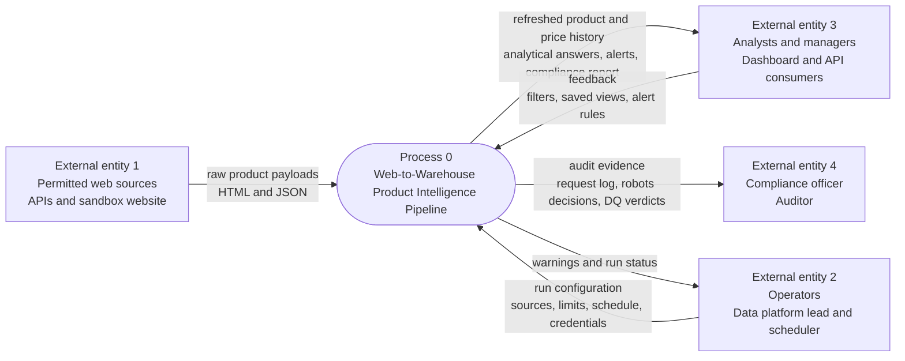
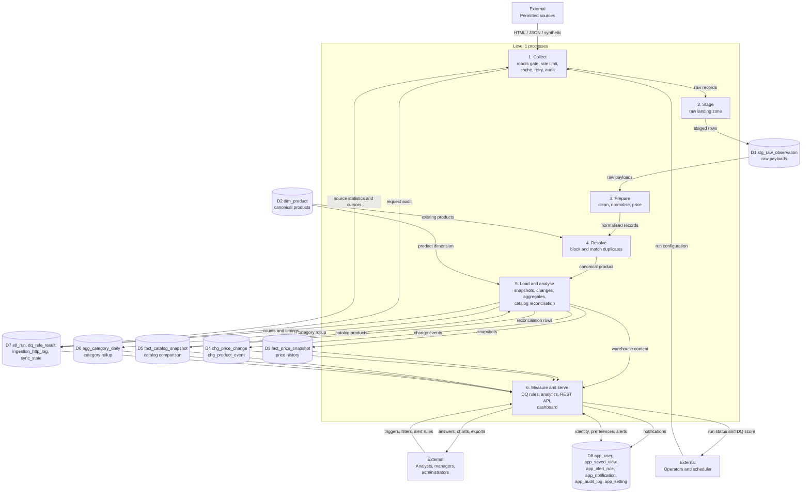
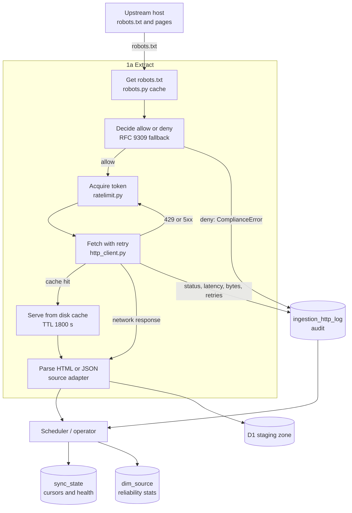
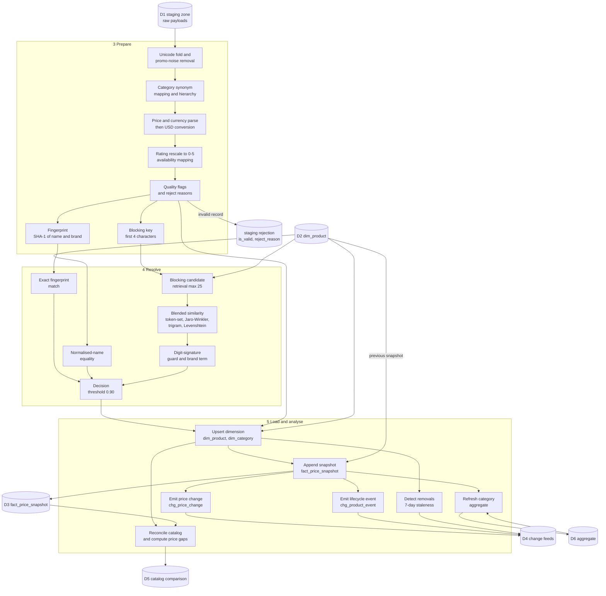
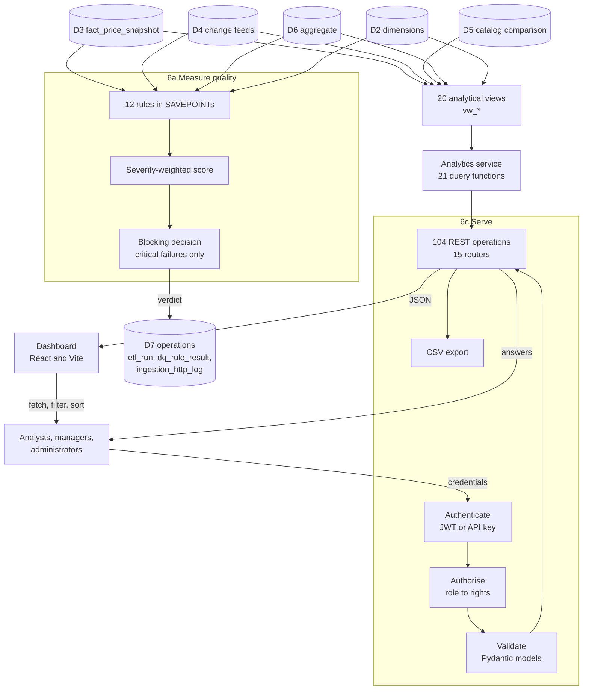
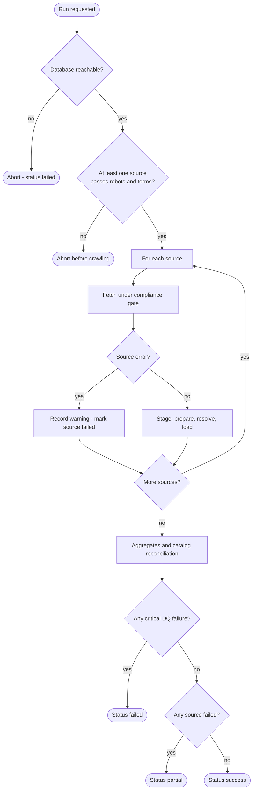

# 10 — Data Flow Diagrams

## Purpose

This document describes how data moves through the Web-to-Warehouse Product Intelligence Pipeline.
It contains a context-level (level 0) diagram, a level-1 diagram of the whole system, three level-2
diagrams for the ingestion, transformation and serving processes, and a data dictionary that defines
every data flow and data store by name.

**Notation.** External entities are rectangles, processes are labelled rectangles with a number,
data stores are labelled cylinders, and every arrow is named with the flow it carries. This follows
the classic Gane-Sarson notation as refined in modern practice.

---

## Table of contents

1. [Level 0 — Context diagram](#1-level-0--context-diagram)
2. [Level 1 — System overview](#2-level-1--system-overview)
3. [Level 2a — Ingestion and compliance](#3-level-2a--ingestion-and-compliance)
4. [Level 2b — Preparation, resolution and loading](#4-level-2b--preparation-resolution-and-loading)
5. [Level 2c — Analytics, quality and serving](#5-level-2c--analytics-quality-and-serving)
6. [Data dictionary](#6-data-dictionary)
7. [Data store dictionary](#7-data-store-dictionary)
8. [Control flows](#8-control-flows)

---

## 1. Level 0 — Context diagram

The whole system is a single process. It receives product information from permitted sources and
run instructions from operators, and it produces warehouse content, analytical answers, compliance
evidence and notifications.

| Flow | Direction | Composition |
| --- | --- | --- |
| Raw product payloads | In | HTML pages, JSON documents, synthetic records |
| Run configuration | In | Source codes, per-source limit, strictness, schedule, database target |
| Analytical answers | Out | Product list/detail, price history, change feeds, leaderboards, SQL results |
| Compliance report | Out | Request counts, robots decisions, cache and retry statistics |
| Warnings and run status | Out | Per-run counters, DQ score, reconciliation summary |
| Feedback | In | Saved views, alert thresholds, manual triggers |

---

## 2. Level 1 — System overview

Six processes, eight data stores. The pipeline is a **closed-loop** system: it writes back into
source metadata (run statistics, sync state) which then influences the next run.

### 2.1 Process dictionary (level 1)

| # | Process | Input flows | Output flows | Code |
| --- | --- | --- | --- | --- |
| 1 | Collect | Raw payloads, run configuration | Raw records, request audit, source statistics | `app/ingestion/http_client.py`, `sources/*` |
| 2 | Stage | Raw records | Staged rows with payload hash and status | `WarehouseLoader.stage()` |
| 3 | Prepare | Staged rows | Normalised records with flags, USD price, fingerprint | `app/ingestion/cleaning.py`, `transform_product()` |
| 4 | Resolve | Normalised records, existing products | Match result, canonical product | `app/ingestion/dedupe.py` |
| 5 | Load and analyse | Canonical product, normalised record | Snapshots, changes, aggregates, reconciliation, run counters | `app/etl/loader.py`, `app/etl/catalog_reconcile.py` |
| 6 | Measure and serve | Warehouse content, user identity, preferences | DQ verdicts, analytical answers, notifications, alerts | `app/etl/dq.py`, `app/analytics/service.py`, `app/api/` |

---

## 3. Level 2a — Ingestion and compliance

| Flow | Meaning |
| --- | --- |
| `robots.txt` | Requested once per host per TTL with the crawler's user-agent |
| allow / deny | `RobotsDecision(allowed, rule, crawl_delay, user_agent_matched)` |
| `Crawl-delay` | Applied to the rate limiter; the limiter uses the slowest constraint |
| Fetch with retry | Up to `MAX_RETRIES` retries with exponential back-off; 429/5xx penalise the host |
| Cache hit | A stored response within TTL is served without touching the network |
| Audit row | Written for **every** attempt, including refusals |
| Source statistics | `total_runs`, `success_rate_pct`, `avg_duration_seconds` updated per run |
| Sync state | `last_run_id`, `consecutive_failures`, `status` used for health reporting |

**Compliance invariants:** no request without a robots decision; no write statement; no write to any
store except the audit table, the cache directory and the staging zone.

---

## 4. Level 2b — Preparation, resolution and loading

| Decision | Rule | Flow to the rejected record |
| --- | --- | --- |
| `missing_or_invalid_name` | Canonical name shorter than 2 characters | `stg_raw_observation.is_valid = false` |
| `missing_price` (strict mode only) | Neither `price` nor `list_price` parsed | as above with `reject_reason` |
| `invalid_url` (strict mode only) | URL does not match `^https?://host` | as above |
| `duplicate_source_row` | Same `(source_code, source_product_id)` twice in one run | counted, not staged twice |
| Product skipped for grain | Two rows resolve to the same canonical product | counted in `duplicates_merged` |

---

## 5. Level 2c — Analytics, quality and serving

### 5.1 Rule flow through the quality process

| Step | Behaviour |
| --- | --- |
| Open savepoint | `Rule.run()` → `session.begin_nested()` |
| Evaluate | The rule's SQL runs against the run's data |
| Classify | `_status(observed, threshold)`: pass if ≥ threshold (or ≤ for "lower is better"), warn within 5 % of the threshold, otherwise fail |
| Persist | `dq_rule_result` row with observed, expected, threshold, counts and message |
| Score | `Σ(weight × factor) / Σ(weight) × 100`, `weight = 1 + 0.5 × severity_rank` |
| Gate | Only `severity = critical` failures set the run status to `failed` |
| Isolate | A raising rule is rolled back to its savepoint and recorded as `fail` |

---

## 6. Data dictionary

### 6.1 Inbound flows

| # | Flow name | Source | Destination | Structure | Frequency |
| --- | --- | --- | --- | --- | --- |
| IN-01 | Product payload | Upstream source | P1 Collect | HTML document or JSON object with title/price/rating/stock/brand | Per product page |
| IN-02 | `robots.txt` | Upstream host | A1 Robots parser | Group/User-agent, Allow/Disallow, Crawl-delay, Sitemap lines | Once per host per TTL |
| IN-03 | Run configuration | Operator / scheduler | P0/P1 | `{sources[], database, limit_per_source, strict, skip_dq, skip_catalog, trigger}` | Per run |
| IN-04 | Credentials | Operator | P6 Serve | email, password (or `pip_…` API key) | Per session |
| IN-05 | Query / filter request | User | P6 Serve | Paging, sorting, filters, saved view | Per request |
| IN-06 | Alert rule | User | P6 Serve | `{metric, operator, threshold, category, source_code, channel}` | On save |
| IN-07 | Read-only SQL | Analyst | P6 Serve | `{"sql": "SELECT …", "limit": 200}` | On execute |
| IN-08 | `Retry-After` header | Upstream host | Rate limiter | delta-seconds or HTTP-date | On 429/503 |

### 6.2 Internal flows

| # | Flow name | From | To | Structure |
| --- | --- | --- | --- | --- |
| IF-01 | `RawProduct` | Source adapter | Stager | `source_code, source_product_id, name, category, price_text, currency_hint, rating_text, rating_count_text, star_elements, availability_text, in_stock_flag, url, image_url, brand, description, payload, http_status, fetched_at` |
| IF-02 | Staged observation | Stager | `stg_raw_observation` | raw columns + `payload_hash`, `landed_at`, `is_valid`, `reject_reason` |
| IF-03 | `NormalizedProduct` | Preparer | Resolver | canonical and normalised name, fingerprint, blocking key, category path, price, `price_usd`, `fx_rate_to_usd`, rating, availability, `quality_flags`, `is_valid` |
| IF-04 | Match result | Resolver | Loader | `product_id, strategy, score, fingerprint, blocking_key, parts{}, is_duplicate` |
| IF-05 | Snapshot row | Loader | `fact_price_snapshot` | 26 columns (grain: product × source × run) |
| IF-06 | Price change event | Loader | `chg_price_change` | previous/new price, absolute and percentage change, direction, magnitude band, significance |
| IF-07 | Lifecycle event | Loader | `chg_product_event` | `event_type ∈ {new, recurring, removed, category_changed}`, severity, old/new values, `days_missing` |
| IF-08 | Category rollup | Loader | `agg_category_daily` | date × category × source with counts and price statistics |
| IF-09 | Reconciliation row | Reconciler | `fact_catalog_snapshot` | SKU, product, status, strategy, similarity, both prices, gap, brand/category match |
| IF-10 | Rule outcome | Quality engine | `dq_rule_result` | rule code, dimension, severity, status, observed/expected/threshold, counts, message, evidence |
| IF-11 | Audit entry | HTTP client | `ingestion_http_log` | method, url, host, status, latency, bytes, robots decision, cache flag, retries, error |
| IF-12 | Run record | Pipeline | `etl_run` | status, trigger, counters (12), DQ score, duration, warnings, params, `created_by` |
| IF-13 | Source statistics | Pipeline | `dim_source` | totals, running averages, `last_run_at`, `last_run_id` |
| IF-14 | Sync state | Pipeline | `sync_state` | cursors, `consecutive_failures`, status, message |
| IF-15 | Notification | Pipeline / alerts | `app_notification` | level, title, body, entity link, read state |

### 6.3 Outbound flows

| # | Flow name | From | To | Structure |
| --- | --- | --- | --- | --- |
| OUT-01 | Product page | P6 | Dashboard / client | `Page[ProductSummary]` with paging metadata |
| OUT-02 | Product detail | P6 | Dashboard / client | product + `history[]`, `changes[]`, `events[]`, `catalog[]` |
| OUT-03 | Change feed | P6 | Dashboard / client | `Page[PriceChangeRead]` or event rows |
| OUT-04 | KPI summary | P6 | Dashboard | counts, price statistics, change statistics, event mix, DQ and catalog blocks |
| OUT-05 | Trend series | P6 | Dashboard | daily observations, average price, in-stock percentage |
| OUT-06 | Leaderboards | P6 | Dashboard | brand leaderboard, category breakdown, top movers |
| OUT-07 | CSV export | P6 | Analyst | header row + up to 50,000 product rows |
| OUT-08 | Compliance report | P6 | Compliance officer | requests, blocked, cached, retried, bytes, latency percentiles, hosts |
| OUT-09 | Run status | P6 | Operator | status, counters, DQ score, warnings, stage timings |
| OUT-10 | Alert notifications | P6 | User | in-app notification with a deep link to the affected screen |
| OUT-11 | Paging envelope | P6 | Client | `items, total, page, page_size, pages, has_next, has_prev` |
| OUT-12 | Error response | P6 | Client | `error, message, details, path` |

---

## 7. Data store dictionary

| Store | Tables | Contents | Volumetric profile | Retention |
| --- | --- | --- | --- | --- |
| D1 Staging zone | `stg_raw_observation` | Raw payloads exactly as received, with hash, HTTP status, validity and rejection reason | Grows with extraction volume (126 rows for a demo run) | 90 days |
| D2 Product dimension | `dim_product` | Canonical products, identity, match provenance, current state | Small and slow-changing (66 rows) | Indefinite |
| D3 Price history | `fact_price_snapshot` | Every observed price with context and change | Largest table; append-only (8,302 rows) | 730 days |
| D4 Change feeds | `chg_price_change`, `chg_product_event` | Detected movements and lifecycle events | ≈ 1 event per snapshot (16,388 rows) | 730 days |
| D5 Catalog comparison | `fact_catalog_snapshot` | Per-run SKU matching with price gaps | SKU count × runs (285 rows) | 1 year |
| D6 Aggregate | `agg_category_daily` | Daily category rollup for fast dashboards | Days × categories (18 rows in the demo) | With D3 |
| D7 Operations | `etl_run`, `dq_rule_result`, `ingestion_http_log`, `sync_state` | Run history, quality verdicts, request audit, sync checkpoints | Runs × 12 rules; requests per run | 1 year / 90 days / 90 days / indefinite |
| D8 Application | `app_*` (7 tables) | Accounts, keys, saved views, alerts, notifications, audit, settings | Small (≤ 100 rows) | Indefinite / 3 years for audit |
| D9 Dimensions | `dim_category`, `dim_date`, `dim_source`, `dim_currency` | Conformed reference data | 18 + 403 + 5 + 25 rows | Indefinite |
| D10 Reference catalog | `catalog_product` | The retailer's internal SKU list | 60 rows | Indefinite |
| D11 Cache (filesystem) | `var/http-cache/<host>/<sha256>.json` | HTTP responses for 1,800 s | Bounded by TTL | 1,800 s |
| D12 Artifacts (filesystem) | `var/artifacts/report-*.json` | Analytics reports produced by the DAG | One per run | Manual |

---

## 8. Control flows

Control flows decide *when* data flows; they are the reason the pipeline degrades rather than fails.

| Control | Decision | Result |
| --- | --- | --- |
| Robots gate | `decision.allowed` | `true` → fetch; `false` → raise `ComplianceError`, log, skip the URL |
| Circuit breaker | 5 consecutive host failures | Subsequent requests to that host raise `IngestionError` without network I/O |
| Rate limiter | Token bucket + sliding window + crawl delay | The call sleeps until it is legal to proceed |
| Source isolation | Exception inside `_process_source()` | Recorded in `sources_failed`; run continues and becomes `partial` |
| Staleness window | `last_seen_at < captured_at - 7 days` | `removed` event, `is_active = false` |
| Fact grain | `product_id` already written this run | Snapshot skipped, `duplicates_merged` incremented |
| DQ gate | Any `critical` rule failed | Run status `failed`; DAG `data_quality_gate` raises |
| Reconciliation | Catalog empty | Reconciliation skipped, counters zero |
| Query Lab | Statement is not `SELECT`/`WITH`/`EXPLAIN`, or contains a write keyword | `422`, no database call |
| Account lock | 5 consecutive failed logins | `locked_until = now + 15 minutes` |
| API trigger | Role lacks `run_pipeline` | `403 permission_denied` |

