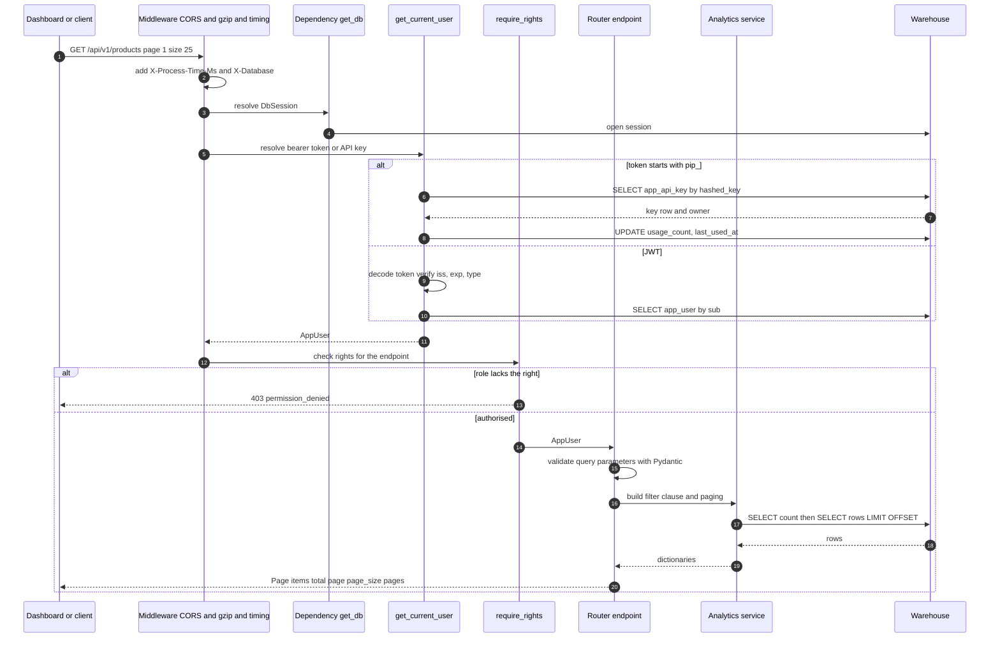
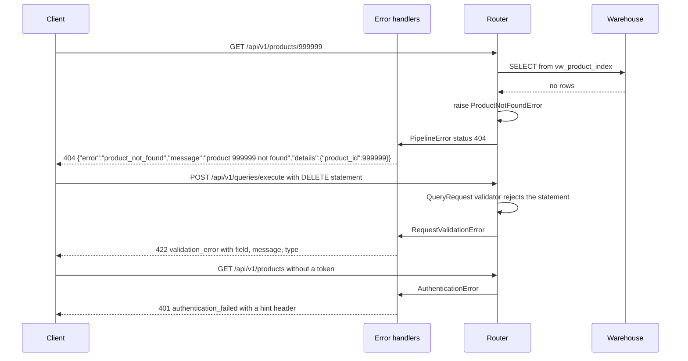
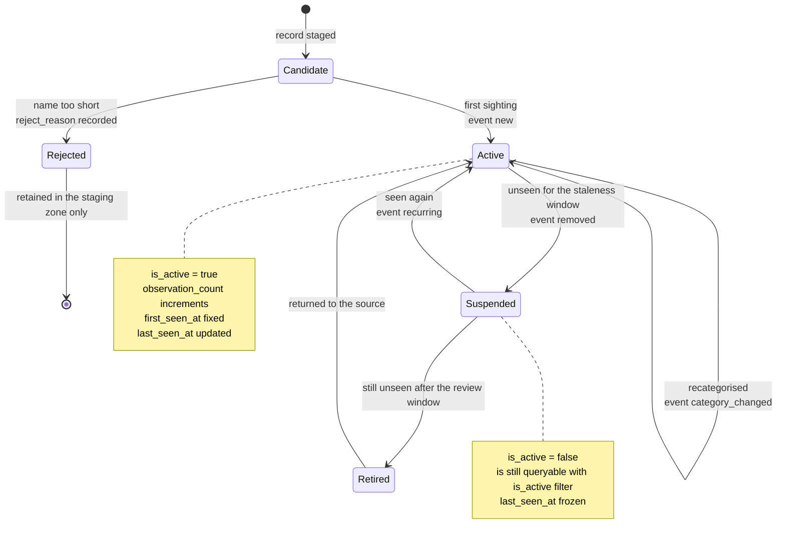
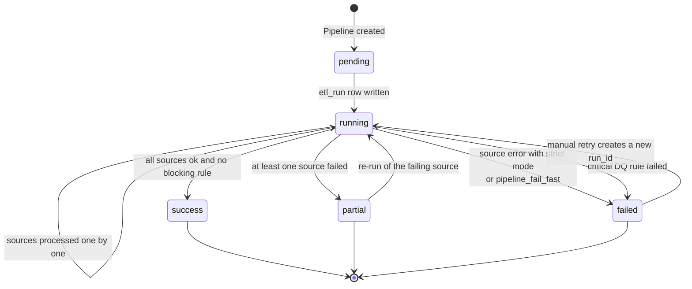
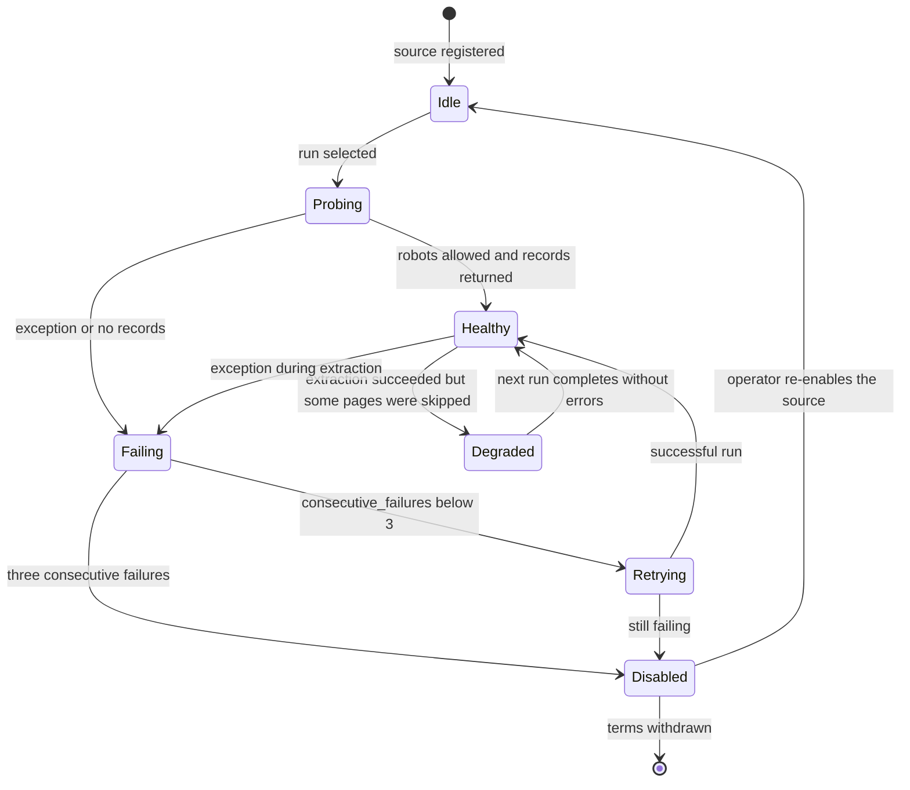
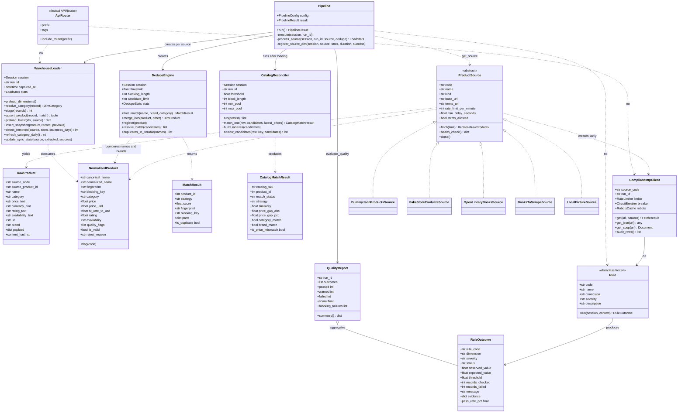

# 11 — Behaviour Diagrams

## Purpose

This document describes the dynamic behaviour of the Web-to-Warehouse Product Intelligence Pipeline
with four UML-style diagrams rendered in Mermaid: a **sequence diagram** of one end-to-end pipeline
run, an **activity diagram** of the run's control flow, **state diagrams** for the product lifecycle
and the run status, and a **class diagram** of the principal Python types. Together they answer
"what happens, in what order, under which conditions, and in which objects".

---

## Table of contents

1. [Sequence diagram — one pipeline run](#1-sequence-diagram--one-pipeline-run)
2. [Sequence diagram — an API request](#2-sequence-diagram--an-api-request)
3. [Activity diagram — pipeline run](#3-activity-diagram--pipeline-run)
4. [State diagram — product lifecycle](#4-state-diagram--product-lifecycle)
5. [State diagram — run status](#5-state-diagram--run-status)
6. [State diagram — source health](#6-state-diagram--source-health)
7. [Class diagram](#7-class-diagram)
8. [Interaction notes](#8-interaction-notes)

---

## 1. Sequence diagram — one pipeline run

```mermaid
sequenceDiagram
    autonumber
    participant CLI as CLI or Airflow or API
    participant PIPE as Pipeline
    participant SRC as ProductSource
    participant HTTP as CompliantHttpClient
    participant RB as RobotsCache
    participant LIM as RateLimiter
    participant CACHE as Disk cache
    participant LD as WarehouseLoader
    participant DD as DedupeEngine
    participant DB as Warehouse
    participant RC as CatalogReconciler
    participant DQ as Quality engine

    CLI->>PIPE: PipelineConfig sources, limit, strict
    PIPE->>DB: INSERT etl_run status running
    loop for each enabled source
        PIPE->>LD: preload_dimensions
        PIPE->>DB: sync_dim_source for foreign key integrity
        PIPE->>SRC: fetch limit
        SRC->>HTTP: get url
        HTTP->>RB: can_fetch url, user_agent
        RB-->>HTTP: RobotsDecision allowed, crawl_delay
        alt disallowed by robots.txt
            HTTP-->>SRC: ComplianceError
            HTTP->>DB: audit row robots_allowed false
            PIPE->>PIPE: record warning, source failed
        else allowed
            opt response already cached
                HTTP->>CACHE: read cached payload
                CACHE-->>HTTP: FetchResult from_cache true
            else cache miss
                HTTP->>LIM: acquire host
                LIM-->>HTTP: permit after pacing delay
                HTTP->>HTTP: GET with retry and backoff
                HTTP->>CACHE: store successful response
            end
            HTTP->>DB: INSERT ingestion_http_log
            HTTP-->>SRC: FetchResult text
            SRC-->>PIPE: RawProduct record
            PIPE->>LD: stage raw batch
            LD->>DB: INSERT stg_raw_observation
        end
        loop for each raw record
            PIPE->>PIPE: transform_product
            Note over PIPE: clean name, normalise category,<br/>parse price, convert to USD,<br/>attach quality flags
            PIPE->>DD: find_match name, brand, category
            alt fingerprint known
                DD-->>PIPE: MatchResult strategy exact score 1.0
            else normalised name equal
                DD->>DB: SELECT by normalized_name
                DD-->>PIPE: MatchResult strategy blocked_exact
            else fuzzy search
                DD->>DB: SELECT blocking candidates limit 25
                DB-->>DD: candidate rows
                DD->>DD: combined_similarity with digit guard
                DD-->>PIPE: MatchResult strategy fuzzy or new
            end
            PIPE->>LD: upsert_product record, match
            LD->>DB: UPSERT dim_product and dim_category
            PIPE->>LD: insert_snapshot product, record, previous
            LD->>DB: SELECT latest snapshot for product and source
            LD->>DB: INSERT fact_price_snapshot
            alt price changed
                LD->>DB: INSERT chg_price_change
            end
            LD->>DB: INSERT chg_product_event new or recurring
        end
        PIPE->>LD: detect_removed staleness 7 days
        LD->>DB: INSERT removed events and set is_active false
        PIPE->>LD: update_sync_state source
    end
    PIPE->>LD: refresh_category_daily
    LD->>DB: UPSERT agg_category_daily
    PIPE->>RC: run persist
    RC->>DB: SELECT catalog, candidates, latest prices
    RC->>DB: INSERT fact_catalog_snapshot
    RC-->>PIPE: reconciliation summary
    PIPE->>DQ: evaluate_quality run_id
    loop for each of 12 rules
        DQ->>DB: SAVEPOINT, evaluate, INSERT dq_rule_result, COMMIT
    end
    DQ-->>PIPE: score, pass, warn, fail, blocking
    PIPE->>DB: UPDATE etl_run counters, status, duration
    PIPE-->>CLI: PipelineResult
```

### 1.1 Message classification

| Message | Type | Cardinality | Notes |
| --- | --- | --- | --- |
| `PipelineConfig` | data | 1 → 1 | The only way to start a run |
| `fetch(limit)` | call | 1 per source | Generator: the source yields lazily |
| `can_fetch` | call | 1 per request | Cached per host for `CACHE_TTL_SECONDS` |
| `acquire(host)` | call | 1 per network request | Blocks until the policy allows it |
| `transform_product` | call | 1 per record | Pure function; never raises |
| `find_match` | call | 1 per record | Exact → exact-name → fuzzy cascade |
| `insert_snapshot` | call | ≤ 1 per product per run | Second row for the same product is skipped |
| `evaluate_quality` | call | 1 per run | 12 rule evaluations |
| `PipelineResult` | return | 1 | Counters, timings, quality, reconciliation, warnings |

---

## 2. Sequence diagram — an API request



### 2.1 Error paths in the same request



---

## 3. Activity diagram — pipeline run

```mermaid
flowchart TD
    A(["Run requested by CLI, Airflow or API"]) --> B["Create etl_run row: status running, trigger, params"]
    B --> C["Resolve the source list: enabled and terms_allowed"]
    C --> D{"Any source?"}
    D -->|"no"| Z(["Status failed: no usable source"])
    D -->|"yes"| E["Preload dimension caches and ensure dim_source rows"]

    E --> F["Extract: fetch limit records under the compliance gate"]
    F --> G{"Robots decision?"}
    G -->|"deny"| H["Log refusal, raise ComplianceError, warn"] --> I
    G -->|"allow"| I["Cache lookup"]
    I -->|"hit"| J["Reuse stored response"]
    I -->|"miss"| K["Rate-limit acquire, GET with retry and backoff"]
    K --> L{"HTTP status?"}
    L -->|"2xx"| M["Store in cache, write audit row"]
    L -->|"429 or 5xx"| N["Penalise host, retry or raise"] --> K
    L -->|"other 4xx"| O["Record error, stop this source"] --> I

    M --> P["Parse payload into RawProduct"]
    J --> P
    P --> Q["Stage raw payloads into the landing zone"]
    Q --> R["Clean name, category, price, currency, rating, availability"]
    R --> S{"Record valid?"}
    S -->|"no"| T["Mark invalid with reject_reason, count as rejected"] --> Y
    S -->|"yes"| U["Compute fingerprint and blocking key"]
    U --> V{"Match found?"}
    V -->|"exact"| W["Reuse canonical product"]
    V -->|"fuzzy"| X["Update canonical product and count the merge"]
    V -->|"none"| Y["Insert new dim_product and emit new event"]
    W --> Z1["Append fact_price_snapshot for this product and run"]
    X --> Z1
    Y --> Z1
    Z1 --> ZA{"Price changed?"}
    ZA -->|"yes"| ZB["Insert chg_price_change with band and significance"]
    ZA -->|"no"| ZC["Emit recurring event"]
    ZB --> ZD["Update dim_product current and previous price"]
    ZC --> ZD
    T --> Y
    ZD --> ZE["Product already loaded in this run?"]
    ZE -->|"yes"| ZF["Skip snapshot, count as duplicate merge"]
    ZE -->|"no"| ZG["Continue with the next record"]

    ZG --> ZH{"More records?"}
    ZF --> ZH
    ZH -->|"yes"| U
    ZH -->|"no"| ZI{"More sources?"}
    ZI -->|"yes"| F
    ZI -->|"no"| ZJ["Detect products unseen for the staleness window"]
    ZJ --> ZK["Refresh the category-day aggregate"]
    ZK --> ZL{"Catalog populated and reconciliation enabled?"}
    ZL -->|"yes"| ZM["Match SKUs, compute price gaps, persist"]
    ZL -->|"no"| ZN["Skip reconciliation"]
    ZM --> ZO{"DQ enabled?"}
    ZN --> ZO
    ZO -->|"yes"| ZP["Evaluate 12 rules in savepoints, persist outcomes"]
    ZO -->|"no"| ZQ["Skip quality evaluation"]
    ZP --> ZR["Compute the severity-weighted score"]
    ZQ --> ZS["Finalise: counters, duration, warnings"]
    ZR --> ZS
    ZS --> ZT{"Blocking critical failure?"}
    ZT -->|"yes"| ZU(["Status failed"])
    ZT -->|"no"| ZV{"Any source failed?"}
    ZV -->|"yes"| ZW(["Status partial"])
    ZV -->|"no"| ZX(["Status success"])
    ZX --> ZY(["Return PipelineResult to the caller"])
```



### 3.1 Activity phases and durations (measured)

| Phase | Stage name | Measured duration (multi-source demo run) |
| --- | --- | --- |
| Compliance-gated extraction | `extract` | Dominated by rate limiting; cached runs ≈ 0 |
| Landing | `stage` | Batch inserts of `PIPELINE_BATCH_SIZE` rows |
| Preparation | `transform` | Pure CPU work; the fastest stage |
| Resolution | `resolve` | Exact hits dominate; blocked candidates capped at 25 |
| Loading | `load` | One insert per product plus change events |
| Change detection | `detect` | Single query per source for removal detection |
| Aggregation | `aggregate` | One grouped query per run |
| Reconciliation | `reconcile` | 39/57 matched, ≈ 104–182 ms |
| Quality | `quality` | 12 rule queries |
| **Total** | — | **≈ 3.5 s (3,481 ms) for the delivered run** |

---

## 4. State diagram — product lifecycle



### 4.1 Event mapping

| Transition | Event written | Table | Condition in code |
| --- | --- | --- | --- |
| Candidate → Active | `new` | `chg_product_event` | `previous is None` in `insert_snapshot()` |
| Active → Active | `recurring` | `chg_product_event` | `previous is not None` and no price change |
| Active → Active (price) | `chg_price_change` | `chg_price_change` | `change_pct not in (None, 0.0)` |
| Active → Active (category) | `category_changed` | `chg_product_event` | `previous_category_id != new_category_id` |
| Active → Suspended | `removed` | `chg_product_event` | `last_seen_at < captured_at - staleness_days` |
| Suspended → Active | `recurring` | `chg_product_event` | Observed again; `is_active` set back to true |
| Candidate → Rejected | — | `stg_raw_observation` | `is_valid = false`, `reject_reason` set |
| Merged product | `match_strategy = merged` | `dim_product` | `DedupeEngine.merge_into()`; absorbed row keeps `matched_product_id` |

---

## 5. State diagram — run status



### 5.1 Status assignment rules

| Status | Assigned when | Consumers |
| --- | --- | --- |
| `running` | `_run_row()` writes the row at the start | Pipeline screen shows an in-progress run |
| `success` | No source failed and the blocking list is empty | KPI-01 counts it as success |
| `partial` | `sources_failed` is non-empty but the run completed | Warning column in the run list |
| `failed` | `PipelineError` propagated, or a **critical** DQ rule failed (`DQ006`, `DQ011`) | Exit code 1 from the CLI; the DAG fails |

---

## 6. State diagram — source health



| State | Field values | Effect |
| --- | --- | --- |
| Healthy | `sync_state.status = 'healthy'`, `consecutive_failures = 0` | Included in scheduled runs |
| Degraded | `success_rate_pct` dropping, `errors` on the source object | Run continues; warnings recorded |
| Failing | `sync_state.status = 'failing'`, `consecutive_failures ≥ 1` | Surfaced on the Sources screen |
| Disabled | `dim_source.enabled = false` (set by `sync_dim_source()` when terms are not allowed) | Excluded by `Pipeline._source_codes()` |

---

## 7. Class diagram



### 7.1 Relationship notes

| Relationship | Cardinality | Where |
| --- | --- | --- |
| `ProductSource` → `RawProduct` | 1 → many (lazy) | The source contract yields records |
| `ProductSource` → `NormalizedProduct` | 1 → 1 | `transform_product(raw)` |
| `ProductSource` → `CompliantHttpClient` | 1 → 0..1 | Created on first use, closed by `close()` |
| `Pipeline` → `DedupeEngine` | 1 → 1 per run | Shared across sources so the fingerprint cache is reused |
| `Pipeline` → `WarehouseLoader` | 1 → 1 per source | Counters merged with `LoadStats.merge()` |
| `WarehouseLoader` → `NormalizedProduct` | 1 → many | One snapshot per record |
| `CatalogReconciler` → `CatalogMatchResult` | 1 → many | One per active catalog SKU |
| `Rule` → `RuleOutcome` | 1 → 1 | Inside a savepoint |
| `QualityReport` → `RuleOutcome` | 1 → many | 12 per run |
| `ApiRouter` → models | 1 → many | Routers select from models; the class diagram shows no `DedupeEngine` dependency in the serving layer, which is deliberate |

---

## 8. Interaction notes

| Note | Detail |
| --- | --- |
| **Lazy extraction** | Sources are generators; the pipeline materialises them once per source with `_safe_take()`, so a misbehaving source cannot hang the run |
| **Cache-first politeness** | The second run of the same source performs no HTTP requests at all, which is why repeat demonstrations are instantaneous |
| **Session scope** | One `session_scope(database)` wraps the entire run: everything commits together, and any escaping exception rolls the run back |
| **Savepoint isolation** | Each DQ rule and each rule-result insert is wrapped in `session.begin_nested()` so a failure is contained |
| **Idempotent stage boundaries** | `etl_run` is written first (so a crashed run is visible), facts are appended per source, and the finalisation block writes the counters last |
| **Re-entrancy** | Two concurrent runs get different `run_id` values, so their facts never collide; `MAX_ACTIVE_RUNS = 1` in the DAG prevents overlap by schedule |
| **Dialect-neutral transactions** | `bootstrap.apply_views()` opens one connection per view statement because MySQL's implicit DDL commit invalidates savepoints |