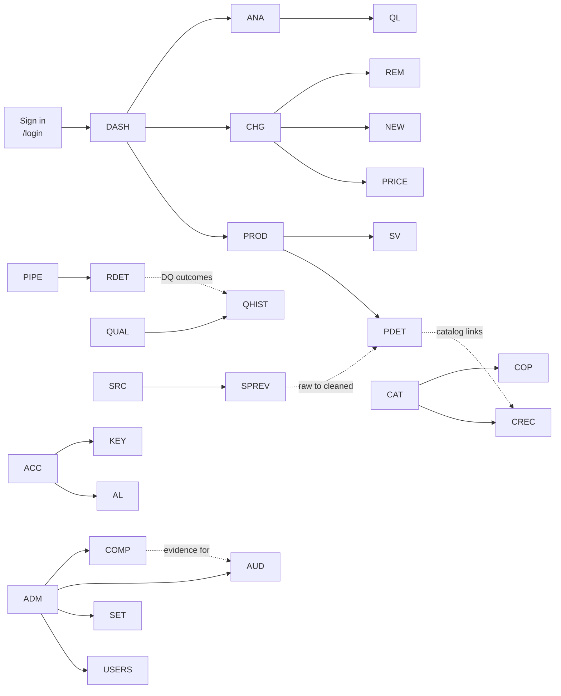

# 12 — UI/UX Design

## Purpose

This document specifies the interface of the analytics dashboard: the information architecture, the
navigation map, a wireframe for every screen, the design system (colour tokens for light and dark
mode with measured contrast ratios, typography scale, spacing, component inventory), the
accessibility statement against WCAG 2.1 AA, the responsive breakpoints and the motion policy.

**Scope note.** Every screen is defined by the data it displays and the API calls that back it. The
endpoints named in each wireframe exist in the delivered API (see `docs/14_api_documentation.md`),
so each screen is implementable — and verifiable — directly against the specification.

---

## Table of contents

1. [Design principles](#1-design-principles)
2. [Information architecture](#2-information-architecture)
3. [Navigation map](#3-navigation-map)
4. [Screen inventory](#4-screen-inventory)
5. [Wireframes](#5-wireframes)
6. [Design system](#6-design-system)
7. [Accessibility](#7-accessibility)
8. [Responsive design](#8-responsive-design)
9. [Motion policy](#9-motion-policy)
10. [Component inventory](#10-component-inventory)
11. [Empty, loading and error states](#11-empty-loading-and-error-states)

---

## 1. Design principles

| # | Principle | Consequence in the interface |
| --- | --- | --- |
| P1 | Data first | No hero images, no gradients behind text, no decorative illustration. The chart or table is the page |
| P2 | Overview, then zoom, then detail | Dashboard KPI cards → filtered lists → product drawer |
| P3 | Filters are visible, never hidden | Filters live in a left rail on desktop and in a collapsible sheet on mobile; the active filter count is always shown |
| P4 | Show the provenance of every number | Screens display the run id, the observation window and the data-quality score where a number appears |
| P5 | Silent by default | No spinners that flash, no skeleton shimmer, no auto-refresh animation, no page transitions beyond an instant swap |
| P6 | Keyboard first | Every action is reachable with Tab; Enter activates; Esc closes overlays; focus is always visible |
| P7 | Density with rhythm | Compact table rows (32 px) for scanning, generous 24–32 px padding around panels |
| P8 | One accent colour | The user's accent choice (`app_user.accent`) recolours the primary control only; status colours are semantic and never themed |

---

## 2. Information architecture

```mermaid
flowchart TB
    ROOT["Product Intelligence Pipeline"]
    ROOT --> DASH["Dashboard<br/>/"]
    ROOT --> PROD["Products<br/>/products"]
    ROOT --> CHG["Changes<br/>/changes"]
    ROOT --> ANA["Analytics<br/>/analytics"]
    ROOT --> PIPE["Pipeline<br/>/pipeline"]
    ROOT --> QUAL["Quality<br/>/quality"]
    ROOT --> CAT["Catalog<br/>/catalog"]
    ROOT --> SRC["Sources<br/>/sources"]
    ROOT --> QL["Query Lab<br/>/queries"]
    ROOT --> ACC["Account<br/>/account"]
    ROOT --> ADM["Admin<br/>/admin"]

    PROD --> PDET["Product detail<br/>/products/:id"]
    CHG --> PRICE["Price changes"]
    CHG --> NEW["New products"]
    CHG --> REM["Removed products"]
    CHG --> CATDR["Category changes"]
    ANA --> BRAND["Brand leaderboard"]
    ANA --> AVAIL["Availability"]
    ANA --> IDX["Category price index"]
    ANA --> DRIFT["Assortment drift"]
    PIPE --> RDET["Run detail<br/>/pipeline/runs/:runId"]
    QUAL --> QRULES["Rule catalogue"]
    QUAL --> QHIST["Result history"]
    CAT --> CREC["Reconciliation"]
    CAT --> COP["Pricing opportunities"]
    SRC --> SPREV["Source preview"]
    ACC --> PREF["Preferences"]
    ACC --> SV["Saved views"]
    ACC --> AL["Alerts"]
    ACC --> KEY["API keys"]
    ADM --> USERS["Users"]
    ADM --> SET["Settings"]
    ADM --> AUD["Audit log"]
    ADM --> COMP["Compliance"]
```



### 2.1 Global chrome

| Region | Contents | Behaviour |
| --- | --- | --- |
| Top bar | Product name, environment badge (`development` / `production`), global search, theme switch, notification bell, account menu | Fixed height 56 px; sticky |
| Left rail | Primary navigation with icons and labels; collapses to icons below 1280 px; hidden behind a hamburger below 768 px | 240 px expanded, 64 px collapsed |
| Breadcrumb | Only on detail screens (product detail, run detail) | Static text, clickable segments |
| Content area | Max width 1,440 px, centred, 24 px gutter | Single column of panels |
| Footer strip | Active database, schema version, last refresh time, API version | 40 px; static text, no animation |

---

## 3. Navigation map



**Rules.** Every screen is reachable in at most two clicks from the dashboard. Cross-links are
one-way and contextual (a run detail links to its DQ results, a product detail links to its catalog
rows). No screen links to itself. No dead ends: every list has an export or a parent link.

---

## 4. Screen inventory

| # | Screen | Route | Primary data source | Roles |
| --- | --- | --- | --- | --- |
| S1 | Sign in | `/login` | `POST /auth/login` | Public |
| S2 | Dashboard | `/` | `/analytics/kpi`, `/analytics/trend`, `/analytics/price-trend` | viewer+ |
| S3 | Products | `/products` | `/products`, `/products/facets` | viewer+ |
| S4 | Product detail | `/products/:id` | `/products/{id}`, `/history`, `/duplicates`, `/catalog` | viewer+ |
| S5 | Changes — price | `/changes/price` | `/changes/price`, `/top-movers` | viewer+ |
| S6 | Changes — new / removed / category | `/changes/new`, `/removed`, `/categories` | `/changes/*` | viewer+ |
| S7 | Analytics | `/analytics` | `/analytics/categories`, `/brands`, `/availability`, `/category-index` | viewer+ |
| S8 | Pipeline | `/pipeline` | `/pipeline/runs`, `/stages`, `/schedule`, `/sources/status` | viewer+ |
| S9 | Run detail | `/pipeline/runs/:runId` | `/pipeline/runs/{id}`, `/dq`, `/http` | viewer+ |
| S10 | Quality | `/quality` | `/quality/latest`, `/rules`, `/results`, `/trend`, `/summary` | viewer+ |
| S11 | Catalog | `/catalog` | `/catalog/reconciliation`, `/summary`, `/opportunities`, `/products` | viewer+ |
| S12 | Sources | `/sources` | `/sources`, `/sources/robots`, `/sources/{code}/preview` | viewer+ |
| S13 | Query Lab | `/queries` | `/queries/views`, `/tables`, `/examples`, `/execute` | analyst+ |
| S14 | Account and settings | `/account` | `/users/me` (PATCH), `/auth/change-password`, `/saved-views`, `/alerts`, `/users/{id}/api-keys` | viewer+ |
| S15 | Admin | `/admin` | `/users`, `/users/stats`, `/settings`, `/audit`, `/audit/http`, `/pipeline/clear-history` | admin |

---

## 5. Wireframes

### 5.1 S1 — Sign in

```text
+--------------------------------------------------------------+
|                                                              |
|                    Product Intelligence Pipeline              |
|                                                              |
|         +------------------------------------------------+ |
|         | Email                                           | |
|         | [ ahmed.abobakr@example.com                ]  | |
|         | Password                                        | |
|         | [ **************                         ] [show]| |
|         | ( ) Remember me                                 | |
|         |            [ Sign in ]                          | |
|         | error: invalid email or password                | |
|         +------------------------------------------------+ |
|                                                              |
|   Demo accounts (development only)                          |
|   admin@example.com  ·  analyst@example.com  ·  viewer@...   |
+--------------------------------------------------------------+
```

| Element | Behaviour |
| --- | --- |
| Email field | `type=email`, `autocomplete=username`, autofocus, error text linked by `aria-describedby` |
| Password field | `type=password`, show/hide toggle button with `aria-pressed` |
| Remember me | Maps to the refresh-token lifetime (`remember=true`) |
| Demo accounts | Rendered from `GET /api/v1/auth/demo-accounts`; the endpoint returns an empty list in production |

### 5.2 S2 — Dashboard

```text
+----------------- Dashboard ----------------- [30d v] [Refresh] ------------+
| KPI                                                                   |
| +-------------+ +-------------+ +-------------+ +-------------+ +-----------+ |
| | Products    | | Price chgs  | | New / rmv   | | DQ score    | | Catalog   | |
| | 66          | | 412         | | 6 / 0       | | 98.26       | | 39/57     | |
| | +2 this week| | 48 signif.  | | 7 recat.    | | 0 failures  | | 68.4%     | |
| +-------------+ +-------------+ +-------------+ +-------------+ +-----------+ |
|                                                                           |
| Observations and average price (90 days)        Price-change timeline      |
| +-----------------------------------------+     +------------------------+ |
| |  line chart: observations + avg price  |     |  bars: up / down       | |
| |                                         |     |  line: avg |change %|   | |
| +-----------------------------------------+     +------------------------+ |
|                                                                           |
| Category breakdown (top 8)                    Brand leaderboard           |
| +-----------------------------------------+     +------------------------+ |
| | horizontal bars: avg price + count      |     |  table: brand, price, | |
| |                                         |     |  rating, in-stock %   | |
| +-----------------------------------------+     +------------------------+ |
|                                                                           |
| Latest run: run_id | status | duration | extracted | valid | DQ | warnings |
+---------------------------------------------------------------------------+
```

| Panel | Endpoint | Notes |
| --- | --- | --- |
| KPI cards | `GET /api/v1/analytics/kpi?days=30` | Five cards: products, price changes, new/removed, DQ score, catalog match |
| Trend | `GET /api/v1/analytics/trend?days=90` | Dual axis: observation count and average USD price |
| Price timeline | `GET /api/v1/analytics/price-trend?days=90` | Diverging bars for increases/decreases plus the mean absolute change |
| Category breakdown | `GET /api/v1/analytics/categories?limit=8` | Horizontal bars, value labels, click-through to the filtered product list |
| Brand leaderboard | `GET /api/v1/analytics/brands?limit=10` | Sortable table with in-stock percentage |
| Latest run strip | `GET /api/v1/pipeline/runs/latest` | One line, no chart; link to the run detail |

### 5.3 S3 — Products

```text
+---------------- Products -------- [Save view] [Export CSV] [Compare] -------+
| Filters (left rail)          | Results (table)                            |
|  Search [____________]       | +------------------------------------------------+ |
|  Category  [ All        v ]  | | Name | Brand | Category | Price | Δ% | Stock |  |
|  Brand     [ All        v ]  | +------------------------------------------------+ |
|  Source    [ All        v ]  | | Smart LED TV 55"| Samsung | Televis..| 899.00 | |
|  Stock     [ Any        v ]  | | Wireless Earbuds| Sony    | Audio   | 249.99 | |
|  Price     [ 0 ] – [ 2000 ] | | ...                                            | |
|  Rating    [ >= 0     v ]   | +------------------------------------------------+ |
|  Movement  [ >= 5 %    v ]  | Showing 1-25 of 66        [<] 1 2 3 [>]        |
|  Recency   [ 30 days   v ]  | Sort: Price | Δ% | Rating | Last seen        |
|  Active    [ x ]           | Sortable headers are buttons with aria-sort       |
| +---------------------------+------------------------------------------------+
```

| Feature | Detail |
| --- | --- |
| Facets | `GET /api/v1/products/facets` populates the left rail with counts (categories, brands, sources, availability, price bands) |
| Filtering | Every filter maps to a query parameter of `GET /api/v1/products`; the URL is the state, so a filtered list is shareable |
| Sorting | `sort_by` + `sort_dir`; only whitelisted columns are accepted server-side |
| Saved view | `POST /api/v1/saved-views` stores filters, sort and visible columns; `POST /api/v1/saved-views/{id}/use` increments the usage counter |
| Export | `GET /api/v1/analytics/export/products.csv?limit=5000` |
| Compare | Tick up to 6 rows, then `GET /api/v1/products/compare/ids?ids=…` opens a side-by-side drawer |
| Type-ahead | `GET /api/v1/products/search/suggest?q=` after 2 characters |

### 5.4 S4 — Product detail

```text
+---------------------- Product: Samsung 4K Smart TV 55 inch ----------------+
| Breadcrumb: Products > Electronics > Televisions                           |
+----------------------------------------------------------------------------+
| Price 899.00 USD   | Rating 4.4 / 5 (312) | Stock in_stock | Δ +2.31%        |
| Match: fuzzy 0.9823 against "Samsung 4K Smart TV 55 inch" | source local_demo|
| Link to source page [open]                     Link to catalog SKU [open] |
+-------------------------------------+--------------------------------------+
| Price history (captured_at, USD)   | Recent changes                       |
| +---------------------------------+ | +----------------------------------+ |
| |  line chart, markers for every  | | | 2026-03-01  899.00 -> 919.00 +2.25%| |
| |  observation, band for ±1%       | | | 2026-02-27  899.00 -> 899.00 0.00% | |
| +---------------------------------+ | +----------------------------------+ |
| min 799.00 | avg 861.20 | max 949.00 | Lifecycle events: new, recurring x12, |
| Observations: 150 | First seen 2025-10-07 |  | category_changed 2026-02-14         |
+-------------------------------------+--------------------------------------+
| Duplicate candidates: similar name | score | breakdown (token-set, JW, trigram,|
|  Samsung 4K Smart TV 55 inch        | 0.981 | digit factor) -> "Same product" hint|
| Catalog position: SKU-00012, our    | gap    | market position                       |
+----------------------------------------------------------------------------+
```

| Panel | Endpoint |
| --- | --- |
| Header | `GET /api/v1/products/{id}` |
| History chart | `history[]` in the same response, plus `GET /api/v1/products/{id}/history?limit=500` |
| Changes | `changes[]` in the detail response (25 rows) |
| Events | `events[]` in the detail response |
| Duplicate candidates | `GET /api/v1/products/{id}/duplicates?limit=10` |
| Catalog position | `GET /api/v1/products/{id}/catalog` |
| Tabs | *Overview · History · Duplicates · Catalog · Raw payload* (raw shows `quality_flags`, `blocking_key`, `fx_rate_to_usd` from `dim_product.extra`) |

### 5.5 S5 — Changes (price)

```text
+-------------------- Changes: price -------------------- [Export] [Saved v] --+
| Window [90d v] Direction [Both v] Category [All v] Brand [All v]          |
| [x] Significant only   Min |change| [ 5 % ]  Source [All v]              |
+---------------------------------------------------------------------------+
| Date | Product | Category | From | To | Δ% | Band | Sig | Source |           |
| 03-04| Dell Deskt.. | Computers | 4.99 | 201.00 | +3927.76 | major | yes | local | |
| 03-04| Samsung 4K.. | Televisions | 899.00 | 919.00 | +2.23 | minor | yes | local | |
+---------------------------------------------------------------------------+
| 1-50 of 8,062                                   [<] 1 2 … 163 [>]          |
+---------------------------------------------------------------------------+
| Pagination note: total = SQL count, not the row estimate; sorting is by    |
| ABS(change_pct) DESC by default so the biggest movers appear first.        |
+---------------------------------------------------------------------------+
```

### 5.6 S6 — Changes (new / removed / category)

```text
+-- Changes: tabs [Price] [Events] [New] [Removed] [Category] [Drift] ------+
|                                                                            |
| Tab: New            | Tab: Removed        | Tab: Category change            |
| +-----------------+ | +-----------------+ | +------------------------------+ |
| | Name | Category  | | | Name | Days miss.| | | Product | From | To | When    | |
| | Price | First seen| | | Last price      | | |                              | |
| +-----------------+ | +-----------------+ | +------------------------------+ |
|                                                                            |
| Tab: Drift (SQL report)                                                    |
| +------------------------------------------------------------------------+ |
| | Category | Added | Removed | Recategorised | Net change                   | |
| | Electronics   | 12 |       3 |            4 |           +9                | |
| +------------------------------------------------------------------------+ |
```

| Tab | Endpoint | Key columns |
| --- | --- | --- |
| Events | `GET /api/v1/changes/events?event_type=…` | type, severity, old/new value |
| New | `GET /api/v1/changes/new?days=30` | name, category, first price, first seen |
| Removed | `GET /api/v1/changes/removed?days=180` | name, days missing, last known price |
| Category | `GET /api/v1/changes/categories?days=180` | product, old and new category |
| Drift | `GET /api/v1/changes/category-drift?days=90` | added, removed, recategorised, net |

### 5.7 S7 — Analytics

```text
+--------------------- Analytics ------------------- [30d v] [Export] -----+
| +------------------------------+  +--------------------------------------+ |
| | Category price index         |  | Availability by category           | |
| | lines per category           |  | stacked bars: in / limited / out  | |
| | + variance band              |  |                                      | |
| +------------------------------+  +--------------------------------------+ |
| +------------------------------+  +--------------------------------------+ |
| | Brand leaderboard            |  | Source coverage matrix              | |
| | brand | products | avg | rating|  | source x category heat map           | |
| +------------------------------+  +--------------------------------------+ |
| +------------------------------+  +--------------------------------------+ |
| | Price movers (top 20)        |  | Category drift                      | |
| | name | from | to | Δ% | band |  | category | added | removed | net     | |
| +------------------------------+  +--------------------------------------+ |
+----------------------------------------------------------------------------+
```

Each panel maps 1:1 to an endpoint: `/analytics/category-index`, `/analytics/availability`,
`/analytics/brands`, `/analytics/report/source-matrix`, `/analytics/report/price-changes`,
`/changes/category-drift`.

### 5.8 S8 — Pipeline

```text
+------------------------- Pipeline ---------------------- [Run pipeline] ---+
| Schedule: 0 3 * * *  |  Orchestrator: Airflow 2.10.5 LocalExecutor        |
| Last run: 2026-03-04 03:08 UTC  |  Next expected: 2026-03-05 03:08 UTC      |
| Status badges: success 34 | partial 2 | failed 0                           |
+---------------------------------------------------------------------------+
| Stage catalogue: extract, stage, transform, resolve, load, detect,        |
| reconcile, quality, aggregate                                              |
| +------------------------------------------------------------------------+ |
| | run_id | status | trigger | target | started | dur | ext | valid | DQ | warn | |
| +------------------------------------------------------------------------+ |
| | 6d795cd6f4 | success | cli | postgres | 03:08 | 0.2 s | 2 | 2 | 98.26 | - | |
| | bde43996c1 | success | airflow | postgres | 02:31 | 3.5 s | 60 | 57 | 98.26 | - | |
+---------------------------------------------------------------------------+
| Source health table: source | kind | rate | last run | success % | duration | |
|                                consecutive failures | sync status         |
+---------------------------------------------------------------------------+
```

`[Run pipeline]` opens a modal with `sources[]`, `limit_per_source`, `strict`, `skip_dq`,
`skip_catalog` and posts to `POST /api/v1/pipeline/run` (background) or `/run/sync` (blocking).
The button is only rendered for roles with `run_pipeline`.

### 5.9 S9 — Run detail

```text
+-------------------- Run 6d795cd6f4f43945 -------------------------------+
| status | trigger | target | started | finished | duration | DQ score  |
| Counters: extracted 2 | valid 2 | rejected 0 | new 0 | changes 0 |        |
| Warnings: none                                                             |
+-----------------------------------+--------------------------------------+
| DQ outcomes (12 rules)            | HTTP compliance for this run        |
| rule | dimension | sev | status   | host | status | ms | robots | cache |     |
+-----------------------------------+--------------------------------------+
| Reconciliation: matched 39/57, price mismatches 36, by strategy          |
| Run params JSON (expand/collapse), warnings JSON, errors                 |
+----------------------------------------------------------------------------+
```

### 5.10 S10 — Quality

```text
+------------------------- Quality ------------------- [Re-evaluate] -------+
| Score 98.26 | pass 22 | warn 2 | fail 0 | blocking: none              |
| Dimension matrix: completeness 4 rules | validity 3 | uniqueness 2 |        |
| consistency 1 | accuracy 1 | timeliness 1                                |
+---------------------------------------------------------------------------+
| Score trend per run (line, threshold line at 80)                          |
+---------------------------------------------------------------------------+
| Rule results table                                                       |
| | rule | name | dimension | severity | status | observed | expected | msg | |
| | DQ005 | fingerprints unique | uniqueness | warn | warn | 99.8 | 99.5 | ...| |
+---------------------------------------------------------------------------+
| Rule catalogue tab: code | name | dimension | severity | description    |
| Result history tab: paginated /quality/results with status and dimension |
+---------------------------------------------------------------------------+
```

`[Re-evaluate]` is admin/analyst only and calls `POST /api/v1/pipeline/quality` equivalent through
the CLI (`pip-cli quality --run-id …`); the screen itself is read-only over `/quality/*`.

### 5.11 S11 — Catalog

```text
+---------------------- Catalog ------------------- tabs [Reconciliation] ---+
| Summary: total 57 | matched 39 | unmatched 18 | match 68.42% | gaps 36   |
| by strategy: sku 38 | normalized_name 1 | fuzzy 0        avg gap 4.1%  |
+----------------------------------------------------------------------------+
| SKU | Catalog name | Supplier | Our price | Market price | Gap % | Status |
+----------------------------------------------------------------------------+
| Top opportunities                                                        |
| | SKU | Our price | Market price | Gap % | Position (cheaper / dearer) |    |
+----------------------------------------------------------------------------+
| Internal catalog tab: SKU | Name | Brand | Category | Cost | List | Stock |   |
| Status | Supplier |                                                       |
+----------------------------------------------------------------------------+
```

### 5.12 S12 — Sources

```text
+------------------------ Sources ------------------- [Preview] ------------+
| code | name | kind | base URL | rate/min | delay | paging | terms | robots |
+---------------------------------------------------------------------------+
| robots.txt cache: fetched 1 | cached 3 | blocked 0 | allowed 4 | errors 0 |
| user-agent: ProductIntelligenceBot/1.0 (+contact)                         |
+---------------------------------------------------------------------------+
| Preview drawer for the selected source                                    |
| +------------------------------------------------------------------------+ |
| | raw_name | cleaned name | category | price | USD | rating | stock | flags | |
| | DEMO-0001 | Wireless Earbuds Pro | Electronics | 129.99 | 129.99 | 4.4 | in_stock | - | |
| +------------------------------------------------------------------------+ |
| http_calls 0 | errors 0 | returned 3                                     |
+---------------------------------------------------------------------------+
```

`GET /api/v1/sources/{code}/preview?limit=5` is the transparency feature that shows raw versus
cleaned side by side — the fastest way to explain the cleaning stage in a demonstration.

### 5.13 S13 — Query Lab

```text
+-------------------- Query Lab ---------------- [Run] [Explain] [Format] ---+
| Tables (23) | Views (20) | Examples (5)                                        |
+---------------------------------------------------------------------------+
| SELECT canonical_name, category_name, previous_price, new_price, change_pct|
| FROM vw_price_changes                                                      |
| WHERE ABS(change_pct) > 5                                                  |
| ORDER BY change_pct LIMIT 25;                                              |
+---------------------------------------------------------------------------+
| 12 rows in 18.4 ms                                                         |
| +------------------------------------------------------------------+     |
| | canonical_name | category_name | previous | new | change_pct |     |     |
| +------------------------------------------------------------------+     |
| Truncation notice when result_count == limit                          |
+---------------------------------------------------------------------------+
```

Restrictions surfaced in the UI: only `SELECT`, `WITH` and `EXPLAIN`; a 5,000-row hard cap; a
200-row default; requires the `query` right, so the tab is hidden from viewers.

### 5.14 S14 — Account and settings

```text
+---------------------- Account -------------------------------------------+
| Profile: name, job title, department, avatar colour, timezone            |
| Appearance: theme [System|Light|Dark] | accent [indigo|sky|emerald…]      |
| Density: [Compact|Comfortable|Spacious] | rows per page [25]              |
| Data: default currency [USD] | price change alert [% 5]                |
| Notifications: e-mail alerts [ ] | weekly digest [ ] | two-factor (n/a)   |
+---------------------------------------------------------------------------+
| Tabs: [Profile] [Security] [Saved views] [Alerts] [API keys]              |
| Security: change password (current + new + confirm), password strength     |
| Saved views: name | entity | filters | shared | favourite | uses | delete    |
| Alerts: name | metric | operator | threshold | scope | active | evaluate  |
| API keys: name | prefix | created | last used | uses | expires | revoke    |
+---------------------------------------------------------------------------+
```

`PATCH /api/v1/users/me` persists the preferences; the theme switch writes `theme` and reloads the
token-free shell immediately (no page reload).

### 5.15 S15 — Admin

```text
+------------------------- Admin -----------------------------------------+
| tabs [Users] [Settings] [Audit] [Compliance] [Maintenance]               |
| Users: email | name | role | active | logins | last login | actions      |
| Stats: total | active | logins 24h | logins 7d | locked | keys | by role      |
| Settings (grouped by category): pipeline, dq, ingestion, ui, retention   |
| Audit: action | user | status | ip | duration | when (filters by action)  |
| Compliance: requests | blocked | cached | retried | bytes | avg/max ms | hosts   |
| Maintenance: clear run history (requires confirm=true and admin)        |
+----------------------------------------------------------------------------+
```

---

## 6. Design system

### 6.1 Colour tokens — light mode

| Token | Hex | Used for | Contrast note |
| --- | --- | --- | --- |
| `bg` | `#FFFFFF` | Page background | — |
| `surface` | `#F8FAFC` | Panels, table header | Text `#0F172A` = 17.06:1 |
| `surface-alt` | `#F1F5F9` | Hover rows, secondary panels | Text `#0F172A` = 16.4:1; muted text must be `#475569` (6.92:1), **not** `#64748B` (4.34:1, fails AA) |
| `border` | `#E2E8F0` | Dividers, input outlines | Non-text contrast against `#FFFFFF` ≈ 1.2:1 — paired with a 3:1 focus ring to satisfy 1.4.11 |
| `text` | `#0F172A` | Primary text | 17.85:1 on `#FFFFFF` |
| `text-muted` | `#475569` | Labels, secondary text | 7.58:1 on `#FFFFFF`; 6.92:1 on `#F1F5F9` |
| `text-subtle` | `#64748B` | Timestamps, footnotes | 4.76:1 on `#FFFFFF` — passes AA for normal text, use only for non-essential text |
| `primary` | `#4F46E5` | Primary buttons, active nav, links | White text 6.29:1 |
| `primary-hover` | `#4338CA` | Hover state | White text 8.4:1 |
| `success` | `#047857` | Positive deltas, `pass`, in-stock | White text 5.48:1 |
| `warning` | `#B45309` | `warn`, minor mismatches | White text 5.02:1 |
| `danger` | `#B91C1C` | `fail`, decreases, destructive actions | White text 6.47:1 |
| `info` | `#1D4ED8` | Informational badges | White text 6.70:1 |
| `accent-alt` | `#6D28D9` | User-selected alternate accent | White text 7.10:1 |
| `focus-ring` | `#0F172A` | Focus outline | 3:1 minimum against adjacent colours |

### 6.2 Colour tokens — dark mode

| Token | Hex | Contrast note |
| --- | --- | --- |
| `bg` | `#0B1220` | Page background |
| `surface` | `#111827` | Panels, table header |
| `surface-alt` | `#1F2937` | Hover rows, secondary panels |
| `border` | `#1F2937` | Dividers |
| `text` | `#F8FAFC` | 17.89:1 on `#0B1220`; 16.5:1 on `#111827` |
| `text-muted` | `#94A3B8` | 7.30:1 on `#0B1220`; 6.92:1 on `#111827` |
| `text-subtle` | `#64748B` | 3.75:1 on `#0F172A` — **decorative use only**; never for data text |
| `primary` | `#818CF8` | Dark text `#0B1220` on it = 6.28:1 |
| `primary-hover` | `#A78BFA` | 6.88:1 with dark text |
| `success` | `#34D399` | 9.74:1 |
| `warning` | `#FBBF24` | 11.22:1 |
| `danger` | `#F87171` | 6.77:1 |
| `info` | `#38BDF8` | 8.74:1 |
| `focus-ring` | `#F8FAFC` | 3:1 minimum |

### 6.3 Colour usage rules

1. Colour is never the only carrier of meaning: a price drop shows `▼ -2.3 %` with a down arrow and
   the `danger` colour; a `warn` DQ rule shows the word `warn`.
2. Status colours map to data, not to decoration: `success` = price down / rule pass / in stock;
   `danger` = price up / rule fail; `warning` = warn severity or an unmatched catalog row.
3. Direction colours follow the retail convention: **green = price decreased** (good for the
   buyer), **red = price increased**. The convention is stated in the legend of the Changes screen.
4. Charts use at most four categorical hues plus the semantic status colours; a single-series chart
   uses `primary` only.

### 6.4 Typography scale

| Token | Size / line height | Weight | Use |
| --- | --- | --- | --- |
| `display` | 30 px / 36 px | 700 | KPI value |
| `h1` | 24 px / 32 px | 650 | Page title |
| `h2` | 18 px / 26 px | 600 | Panel title |
| `h3` | 15 px / 22 px | 600 | Card title |
| `body` | 14 px / 21 px | 400 | Table cells, paragraphs |
| `body-strong` | 14 px / 21 px | 600 | Emphasised cell values |
| `small` | 12.5 px / 18 px | 400 | Column headers, timestamps |
| `code` | 13 px / 20 px mono | 400 | `run_id`, SKU, SQL, raw payloads |

Font stack: system UI stack (`system-ui, -apple-system, "Segoe UI", Roboto, "Helvetica Neue", Arial`)
with `ui-monospace, SFMono-Regular, Menlo, Consolas, monospace` for code. Numeric columns use
`font-variant-numeric: tabular-nums` so digits align in columns.

### 6.5 Spacing and layout scale

4 px base: `4, 8, 12, 16, 20, 24, 32, 40, 48, 64`. Panel padding 20–24 px; gutter between panels
16–24 px; table row height 32 px (compact) / 40 px (comfortable) / 48 px (spacious); icon sizes 16
and 20 px; control height 32 px (default) / 36 px (comfortable) / 40 px (spacious).

### 6.6 Icon set

`lucide-react`, 16 px stroke 1.75 by default. Mapped icons: layout-dashboard (Dashboard),
package (Products), trending-up/down (Changes), bar-chart-3 (Analytics), activity (Pipeline),
shield-check (Quality), database (Catalog), globe (Sources), terminal (Query Lab),
user-circle (Account), settings (Admin), bell (notifications), filter, download, refresh-cw,
chevron-left/right, check, x, alert-triangle, info, clock, external-link.

---

## 7. Accessibility

Target: **WCAG 2.1 level AA** (W3C Recommendation, 2018).

| Criterion | Requirement | How the design meets it |
| --- | --- | --- |
| 1.1.1 Non-text content | Every chart has a text alternative | Each chart has a title, a `figcaption` summary line and a "Show data table" disclosure containing the same numbers |
| 1.3.1 Info and relationships | Structure conveyed programmatically | Semantic HTML: `header`, `nav`, `main`, `table` with `caption` and `scope` on `th`, `section` with `aria-labelledby` |
| 1.3.2 Meaningful sequence | Logical reading order | DOM order equals visual order; no CSS re-ordering |
| 1.4.1 Use of colour | Colour is not the only cue | Arrows, signs and words accompany every colour (see §6.3) |
| 1.4.3 Contrast (minimum) | 4.5:1 for text | Token table: body 17.85:1, muted 7.58:1, subtle 4.76:1 (light); 17.89:1, 7.30:1 (dark) |
| 1.4.4 Resize text | Works at 200 % | Layout uses relative units in tables and wraps long names; no fixed-height text containers |
| 1.4.10 Reflow | Usable at 320 CSS px | Single-column reflow below 768 px; no horizontal scrolling except inside data grids with a sticky first column |
| 1.4.11 Non-text contrast | 3:1 for controls and focus | Focus ring `2px solid #0F172A` (light) / `#F8FAFC` (dark) with a 2 px offset, ≥ 3:1 against both fill and background |
| 1.4.12 Text spacing | No loss of content when spacing is increased | No fixed-height text boxes; line clamping only on table cells with an expandable row |
| 2.1.1 Keyboard | All functionality from the keyboard | Skip link first in tab order; rail and filters reachable; modals trap focus and close on `Esc` |
| 2.1.2 No keyboard trap | Focus can always leave | Modal focus trap releases on close; no infinite focus loop |
| 2.4.1 Bypass blocks | Skip link | "Skip to main content" as the first focusable element |
| 2.4.2 Page titled | Descriptive titles | Route-based titles, e.g. "Products · Product Intelligence Pipeline" |
| 2.4.3 Focus order | Logical order | Follows DOM order; the filter rail precedes the results region |
| 2.4.4 Link purpose | Purpose clear from context | Link text includes the entity, e.g. "SKU-00012", never "click here" |
| 2.4.6 Headings and labels | Descriptive | One `h1` per screen; panel titles as `h2`; form inputs labelled |
| 2.4.7 Focus visible | Visible focus | Global `:focus-visible` ring, never `outline: none` without a replacement |
| 2.5.1 Pointer gestures | Single pointer | No drag-only interactions; column resizing is optional and mirrored by a settings control |
| 2.5.2 Pointer cancellation | Act on up-event | All clicks on `pointerup`/`click`, so they can be aborted |
| 2.5.3 Label in name | Accessible name contains visible label | Buttons read "Export CSV", not "Export" alone |
| 2.5.4 Motion actuation | No motion required | All actions are click/keyboard-triggered |
| 3.1.1 Language of page | Declared | `<html lang="en">` |
| 3.2.1 On focus | Context stays | Focus never opens a dialog or submits a form |
| 3.2.2 On input | No context change | Filters update on change without navigating away; the URL updates without a reload |
| 3.3.1 Error identification | Errors described in text | Field errors are text next to the field and are announced through `aria-live="polite"` |
| 3.3.2 Labels or instructions | Inputs labelled | Every input has a visible label, plus helper text for units (for example "days") |
| 3.3.3 Error suggestion | Correction suggested | "Password too weak: at least one symbol" — the missing criteria are listed |
| 4.1.2 Name, role, value | Programmatic names | Icon-only buttons carry `aria-label`; toggles expose `aria-pressed`; sorting headers expose `aria-sort` |
| 4.1.3 Status messages | Announced without focus | `aria-live="polite"` regions report "Pipeline run queued", "78 of 78 checks passed", filter result counts |

Additional measures beyond the criteria: visible focus on every interactive element, a 44 × 44 px
minimum touch target on mobile, `prefers-reduced-motion` honoured, and a "high contrast borders"
preference that swaps `--border` for a 3:1 colour.

---

## 8. Responsive design

| Breakpoint | Width | Layout | Navigation | Tables |
| --- | --- | --- | --- | --- |
| Mobile | < 768 px | Single column, 16 px gutter | Hamburger drawer, overlay | Card list instead of a grid; each card shows name, price, Δ%, stock |
| Tablet | 768 – 1279 px | Single column with a two-up grid for KPI cards | Collapsed icon rail (64 px) | Horizontal scroll with a sticky name column; filter sheet |
| Desktop | ≥ 1280 px | 12-column grid; KPI cards 5-up; content max 1,440 px | Expanded rail 240 px | Full grid with all columns and column chooser |
| Wide | ≥ 1600 px | Same grid, wider gutters | Expanded rail | Additional columns visible by default |

| Component | Mobile | Tablet | Desktop |
| --- | --- | --- | --- |
| KPI card | Full width, stacked | 2 per row | 5 per row |
| Filter rail | Bottom sheet | Off-canvas drawer | Fixed 240 px |
| Data grid | Cards | Scroll + sticky first column | Full grid |
| Chart height | 180 px | 240 px | 280 px |
| Run detail panels | Stacked | Stacked | Two columns |
| Query editor | Full width, monospace, no line numbers | + line numbers | + line numbers and a results side-by-side toggle |
| Modals | Full-screen sheet | 80 % width | Centred, max 720 px |

Density preference (`compact` / `comfortable` / `spacious`) changes row heights only; the layout is
unchanged, so the preference never breaks the grid.

---

## 9. Motion policy

**Policy: silent by default.** The interface performs no decorative animation. This is a deliberate
requirement of the project brief, and it has an accessibility justification: users read dense
numeric tables for long sessions, and gratuitous motion increases cognitive load and can trigger
vestibular discomfort.

| Interaction | Motion | Duration | Rationale |
| --- | --- | --- | --- |
| Page navigation | Instant swap; no transition | 0 ms | The fastest possible feedback |
| Data fetch | A static "Loading" label with the query name; **no** spinner rotation, no skeleton shimmer | 0 ms | The label appears instantly and is removed on response; no animation loop |
| Chart render | Static SVG/canvas draw | 0 ms | No grow-in, no line-draw animation |
| Row hover | Background colour change only | 0 ms | Colour change only; no sliding highlight |
| Filter applied | Result count updates in place | 0 ms | No fade of the table body |
| Modal open | Instant | 0 ms | No scale or fade |
| Toast / notification | Appears and disappears; may stay 8 s | 0 ms | Announced through `aria-live`, never auto-dismissed before reading if critical |
| Theme switch | Instant token swap | 0 ms | `prefers-color-scheme` respected when the theme is `system` |
| Progress (pipeline run) | Status text with a static step list; refresh only on explicit user action | 0 ms | Prevents a polling loop from becoming an animation loop |

Rules: no CSS `transition` on layout-affecting properties, no `@keyframes` other than a disabled
skeleton used for print, and `prefers-reduced-motion: reduce` disables any residual transition.
Focus changes are instantaneous so keyboard users never lose their place.

---

## 10. Component inventory

| # | Component | Type | Purpose | Data contract |
| --- | --- | --- | --- | --- |
| C1 | `AppShell` | Layout | Top bar, rail, content, footer | session metadata (`/auth/session`) |
| C2 | `NavRail` | Navigation | Icon + label links, collapse, active state | static |
| C3 | `TopBar` | Layout | Search, theme, notifications, account | `/products/search/suggest`, `/notifications` |
| C4 | `KpiCard` | Display | Value, delta, context line, sparkline | `/analytics/kpi` |
| C5 | `DataTable` | Display | Sortable, paged, selectable, exportable grid | `Page[T]` envelope |
| C6 | `ColumnChooser` | Input | Toggle visible columns | saved view `visible_columns` |
| C7 | `FilterRail` | Input | Facet counts, range inputs, chips | `/products/facets` |
| C8 | `ActiveFilterBar` | Display | Removable chips, clear all | derived from the URL query |
| C9 | `SavedViewMenu` | Input | Save, load, share, favourite, delete | `/saved-views` |
| C10 | `LineChart` | Display | Time series with observation markers | `/analytics/trend`, product `history[]` |
| C11 | `BarChart` | Display | Diverging bars for increases/decreases | `/analytics/price-trend` |
| C12 | `StackedBarChart` | Display | Availability mix per category | `/analytics/availability` |
| C13 | `HeatmapGrid` | Display | Source × category coverage | `/analytics/report/source-matrix` |
| C14 | `StatBadge` | Display | pass / warn / fail / status pill | DQ and run statuses |
| C15 | `DeltaCell` | Display | Signed percentage with arrow and colour | `change_pct`, `change_abs` |
| C16 | `Sparkline` | Display | Inline 30-point trend | `/analytics/trend` |
| C17 | `Drawer` | Overlay | Product detail, compare, preview | varies |
| C18 | `Modal` | Overlay | Run pipeline, confirm destructive action | `POST /pipeline/run` |
| C19 | `Toast` | Feedback | Non-blocking confirmation, `aria-live` | local state |
| C20 | `ConfirmDialog` | Feedback | Requires `confirm=true` for deletion | `POST /pipeline/clear-history` |
| C21 | `Pagination` | Input | Page size, page numbers, total | `Page.pages` |
| C22 | `EmptyState` | Display | Explains *why* there is no data and what to do | — |
| C23 | `ErrorState` | Display | Error code, message, retry button, request id | `ErrorResponse` |
| C24 | `QualityScoreBadge` | Display | Score with dimension breakdown | `/quality/latest` |
| C25 | `RuleTable` | Display | 12 rules with status and threshold | `/quality/rules`, `/quality/results` |
| C26 | `StageTimeline` | Display | 9 stages with rows and duration | `PipelineResult.timings`, `/pipeline/stages` |
| C27 | `RunTable` | Display | Run history with counters and warnings | `/pipeline/runs` |
| C28 | `SourceCard` | Display | Kind, rate, terms, robots, sync health | `/sources`, `/pipeline/sources/status` |
| C29 | `RawVsCleanTable` | Display | Raw and normalised fields side by side | `/sources/{code}/preview` |
| C30 | `ComplianceSummary` | Display | Requests, blocked, cached, retried, latency | `/audit/compliance` |
| C31 | `SqlEditor` | Input | Monospace editor with validation feedback | `/queries/execute` |
| C32 | `ResultGrid` | Display | Column headers, truncation notice, row count | `QueryResponse` |
| C33 | `ThemeSwitch` | Input | System / light / dark | `PATCH /users/me` |
| C34 | `DensitySwitch` | Input | Compact / comfortable / spacious | `PATCH /users/me` |
| C35 | `AccentPicker` | Input | Accent colour | `PATCH /users/me` |
| C36 | `PasswordStrengthMeter` | Feedback | Criteria checklist, non-colour cues | `/auth/change-password` |
| C37 | `ApiKeyReveal` | Feedback | Shows the key once with a copy button | `POST /users/{id}/api-keys` |
| C38 | `AlertRuleEditor` | Input | Metric, operator, threshold, scope | `/alerts`, `/alerts/evaluate` |
| C39 | `TagInput` | Input | Category / brand multi-select | `/products` filters |
| C40 | `RelativeTime` | Display | "3 hours ago" plus an absolute `title` | timestamps |

---

## 11. Empty, loading and error states

| State | Presentation | Copy pattern |
| --- | --- | --- |
| No data yet (fresh install) | Empty state with the exact command to run | "No price snapshots yet. Run `make bootstrap && make run-pipeline`." |
| Filter matches nothing | Empty state that keeps the filter chips visible | "No product matches these filters. Clear one filter to widen the search." |
| A source is disabled | Source card shows a badge, not an error | "Disabled — terms of service do not permit automated access." |
| Pipeline run in progress | Static status line with the current stage | "Run 6d795cd6 — load (57 of 60 products)" |
| API 401 | Inline banner, redirect to `/login?next=…` | "Your session expired. Sign in again to continue where you were." |
| API 403 | Inline banner naming the missing right | "Your role (viewer) cannot trigger a pipeline run." |
| API 404 on a product | Empty state with a back link | "Product 999999 does not exist, or it was removed." |
| API 5xx | Error state with the error code and a retry button | "internal_error — the request was logged with id …" |
| Query Lab rejection | Inline message under the editor | "Only SELECT / WITH / EXPLAIN statements are allowed." |
| Offline (upstream down) | Source card shows consecutive failures; the run becomes `partial` | "books_to_scrape failed 3 times in a row; the source has been disabled." |