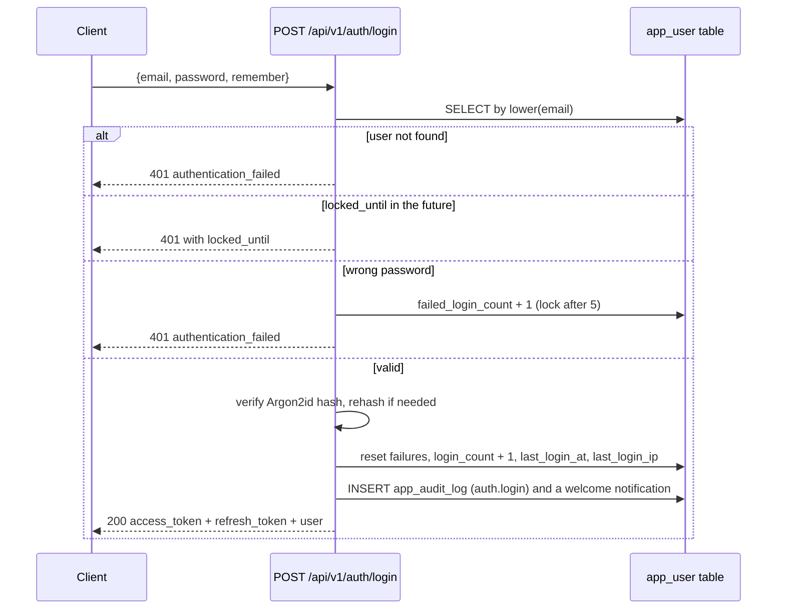

# 14 — API Documentation

## Purpose

This document is the complete reference for the REST API of the Web-to-Warehouse Product Intelligence
Pipeline: the authentication flow, the role matrix, an operation-by-operation catalogue of all
**110 documented operations** across 16 routers, the error catalogue, the pagination convention, the
versioning policy, instructions for the interactive OpenAPI documentation, and worked examples in
`curl`, Python and JavaScript.

The base path is `/api/v1`. Every operation listed below exists in the delivered code
(`app/api/routers/*.py`); the catalogue was generated from the live OpenAPI document, so it cannot
drift from the implementation.

---

## Table of contents

1. [Conventions](#1-conventions)
2. [Authentication flow](#2-authentication-flow)
3. [Role matrix](#3-role-matrix)
4. [Pagination, sorting and filtering](#4-pagination-sorting-and-filtering)
5. [Operation catalogue](#5-operation-catalogue)
6. [Worked examples](#6-worked-examples)
7. [Error catalogue](#7-error-catalogue)
8. [Versioning policy](#8-versioning-policy)
9. [Interactive documentation](#9-interactive-documentation)
10. [Rate limiting and quotas](#10-rate-limiting-and-quotas)
11. [Client integration checklist](#11-client-integration-checklist)

---

## 1. Conventions

| Aspect | Convention |
| --- | --- |
| Base URL (local) | `http://localhost:8000/api/v1` |
| Content type | `application/json` for requests and responses; `text/csv` for the export |
| Authentication | `Authorization: Bearer <access_token>` or `Authorization: Bearer pip_<api key>` |
| Timestamps | ISO 8601 with an explicit UTC offset, e.g. `2026-03-04T03:08:12.482Z` |
| Money | `price`, `price_usd`, `price_gap_abs` are decimal strings cast to float in JSON |
| Percentages | `change_pct`, `discount_pct`, `in_stock_pct` are numbers, e.g. `-12.5` |
| Booleans | `is_active`, `in_stock`, `is_significant`, `is_price_mismatch` |
| Enum-ish fields | `availability ∈ {in_stock, out_of_stock, limited_stock, preorder, unknown}`; `direction ∈ {increase, decrease}`; `magnitude_band ∈ {minor, small, moderate, large, major}`; `event_type ∈ {new, recurring, removed, category_changed}`; `match_strategy ∈ {sku, normalized_name, fuzzy}`; `status ∈ {pending, running, success, partial, failed}` |
| Response headers | `X-Process-Time-Ms` (server processing time), `X-Database` (active target), `Content-Disposition` on the export |
| Compression | `GZipMiddleware` for responses above 1,024 bytes |
| CORS | Allow-list from `CORS_ORIGINS`; `X-Process-Time-Ms`, `X-Database`, `Content-Disposition` exposed |

---

## 2. Authentication flow



### 2.1 Token characteristics

| Property | Access token | Refresh token |
| --- | --- | --- |
| Algorithm | HS256 | HS256 |
| Claims | `sub` (user id), `role`, `email`, `iat`, `exp`, `type=access`, `iss` | `sub`, `iat`, `exp`, `type=refresh`, `iss` |
| Lifetime | `ACCESS_TOKEN_EXPIRE_MINUTES` (default 720 = 12 h) | `REFRESH_TOKEN_EXPIRE_DAYS` (default 30) |
| Required on use | `exp` and `sub`; issuer and type are validated | Same, with `type` must be `refresh` |
| Usage | Every protected request | Only `POST /auth/refresh` |

### 2.2 API keys (machine clients)

```bash
TOKEN=$(curl -s -X POST localhost:8000/api/v1/auth/login \
  -H 'content-type: application/json' \
  -d '{"email":"admin@example.com","password":"Admin@12345"}' | jq -r .access_token)

KEY=$(curl -s -X POST localhost:8000/api/v1/users/1/api-keys \
  -H "Authorization: Bearer $TOKEN" -H 'content-type: application/json' \
  -d '{"name":"nightly-export"}' | jq -r .api_key)

curl -s localhost:8000/api/v1/products?page_size=5 -H "Authorization: Bearer $KEY"
```

Rules: the plain key starts with `pip_`, is displayed **once**, is stored as
`SHA-256(SECRET_KEY + key)`, expires after 90 days, and can be revoked with
`DELETE /api/v1/users/{user_id}/api-keys/{key_id}`. Each use increments `usage_count` and updates
`last_used_at`.

### 2.3 Demo accounts

| Email | Password | Role |
| --- | --- | --- |
| `admin@example.com` | `Admin@12345` | `admin` |
| `analyst@example.com` | `Analyst@12345` | `analyst` |
| `viewer@example.com` | `Viewer@12345` | `viewer` |

`GET /api/v1/auth/demo-accounts` returns these values outside production and an empty list when
`APP_ENV=production`.

---

## 3. Role matrix

Rights are defined once in `app/api/security.py` (`ROLE_RIGHTS`) and enforced by the
`require_rights(...)` dependency; the UI hides controls the caller cannot use.

| Right | `viewer` | `analyst` | `admin` | Used by |
| --- | --- | --- | --- | --- |
| `read` | yes | yes | yes | All GET operations on warehouse content |
| `query` | no | yes | yes | `POST /queries/execute`, `/queries/views`, `/queries/tables`, `/queries/examples` |
| `export` | yes | yes | yes | CSV export |
| `write` | no | yes | yes | Saved views, alerts, profile updates |
| `run_pipeline` | no | yes | yes | `POST /pipeline/run`, `/run/sync`, `/clear-history` |
| `manage_alerts` / `manage_views` | no | yes | yes | Alert and saved-view endpoints (enforced through ownership, not a separate dependency) |
| `manage_users` | no | no | yes | `/users` list, create, update, deactivate, stats; `/settings` writes; `/audit` |
| `manage_settings` | no | no | yes | `PUT`/`DELETE /settings/{key}` |
| `manage_keys` | no | no | yes | Revoking another user's key (own keys are always allowed) |
| `view_audit` | no | no | yes | `/audit`, `/audit/actions` |
| `manage_sources` | no | no | yes | Reserved for the future source-management screen |

Verified behaviour (from `scripts/api_smoke.py`): `GET /api/v1/products` without a token → **401**;
`POST /api/v1/pipeline/run/sync` with the viewer token → **403**.

---

## 4. Pagination, sorting and filtering

### 4.1 The `Page[T]` envelope

```json
{
  "items": [ { "...": "one row" } ],
  "total": 66,
  "page": 1,
  "page_size": 25,
  "pages": 3,
  "has_next": true,
  "has_prev": false
}
```

| Rule | Value |
| --- | --- |
| Parameters | `page` (1 … 10,000, default 1), `page_size` (1 … 200, default 25) |
| Offset | `(page - 1) * page_size` |
| Default sort | Endpoint-specific and documented in each row below |
| Sort validation | Whitelisted server-side (for example `SORTABLE` in `routers/products.py`); an unknown value falls back to the default |
| NULL ordering | Portable "nulls last" emulated with `ORDER BY (col IS NULL) ASC` because MySQL lacks `NULLS LAST` |
| Total | An exact `COUNT(*)` over the same predicate — not an estimate |
| Non-paged endpoints | `limit` (1 … 100/200/500/1,000/5,000 depending on the endpoint) without a total; used for charts and feeds |

### 4.2 Filtering convention

| Filter style | Example | Endpoints |
| --- | --- | --- |
| Explicit query parameters | `?category=Audio&min_price=100&max_price=900` | `/products`, `/changes/price`, `/changes/events` |
| Boolean flags | `?significant_only=true`, `?only_mismatches=true`, `?unread_only=true` | as above |
| Pattern parameters | `?event_type=new`, `?status=failed`, `?match_status=unmatched` | constrained by a regex in the signature |
| Window parameters | `?days=90` | all analytical and change endpoints |
| Free text | `?q=phone` (`LIKE %…%` on name, brand, category, URL) | `/products`, `/catalog/products`, `/users` |
| Saved view | `POST /saved-views` then replay its `filters` object as query parameters | every list screen |

---

## 5. Operation catalogue

Generated from the live OpenAPI document: **125 documented operations in 18 routers** (128 route
decorators in total; three are internal probes hidden from the schema — see §5.2).


## analytics  (13 operations)
| GET | `/api/v1/analytics/kpi` | read (viewer+) | Headline KPI cards | days? |
| GET | `/api/v1/analytics/trend` | read (viewer+) | Daily KPI trend | days? |
| GET | `/api/v1/analytics/price-trend` | read (viewer+) | Daily price-change trend | days? |
| GET | `/api/v1/analytics/categories` | read (viewer+) | Category breakdown | limit? |
| GET | `/api/v1/analytics/brands` | read (viewer+) | Brand leaderboard | limit? |
| GET | `/api/v1/analytics/availability` | read (viewer+) | In-stock ratio per category |  |
| GET | `/api/v1/analytics/sources` | read (viewer+) | Source coverage and reliability |  |
| GET | `/api/v1/analytics/category-index` | read (viewer+) | Daily category price index | days?, category? |
| GET | `/api/v1/analytics/report/price-changes` | read (viewer+) | SQL report: price changes | days?, limit? |
| GET | `/api/v1/analytics/report/catalog` | read (viewer+) | SQL report: scraped vs internal catalog | run_id? |
| GET | `/api/v1/analytics/report/compliance` | read (viewer+) | SQL report: robots.txt / rate-limit compliance evidence | days? |
| GET | `/api/v1/analytics/report/source-matrix` | read (viewer+) | SQL report: source x category coverage matrix |  |
| GET | `/api/v1/analytics/export/products.csv` | read (viewer+) | Export the current product list as CSV | limit? |

## users  (13 operations)
| GET | `/api/v1/users` | admin | List users (admin) | role?, q? |
| GET | `/api/v1/users/me` | authenticated | My profile |  |
| GET | `/api/v1/users/me/export` | authenticated | Export my account data as JSON |  |
| DELETE | `/api/v1/users/me` | authenticated | Delete my account (password confirmation) | payload |
| PATCH | `/api/v1/users/me` | authenticated | Update my profile & preferences | payload |
| POST | `/api/v1/users/me/password` | authenticated | Set a new password | payload |
| GET | `/api/v1/users/stats` | admin | Usage statistics |  |
| POST | `/api/v1/users` | admin | Create a user (admin) | payload |
| PATCH | `/api/v1/users/{user_id}` | admin | Update a user (admin) | user_id, payload |
| DELETE | `/api/v1/users/{user_id}` | admin | Deactivate a user (admin) | user_id |
| GET | `/api/v1/users/{user_id}/api-keys` | authenticated | API keys of a user | user_id |
| POST | `/api/v1/users/{user_id}/api-keys` | authenticated | Create an API key | user_id, payload |
| DELETE | `/api/v1/users/{user_id}/api-keys/{key_id}` | authenticated | Revoke an API key | user_id, key_id |

## pipeline  (11 operations)
| GET | `/api/v1/pipeline/runs` | read (viewer+) | List pipeline runs | status? |
| GET | `/api/v1/pipeline/runs/latest` | read (viewer+) | Most recent run (full detail) |  |
| GET | `/api/v1/pipeline/runs/{run_id}` | read (viewer+) | Run detail with DQ, HTTP audit and reconciliation | run_id |
| GET | `/api/v1/pipeline/runs/{run_id}/dq` | read (viewer+) | DQ rule results for one run | run_id |
| GET | `/api/v1/pipeline/runs/{run_id}/http` | read (viewer+) | HTTP compliance log for one run | run_id, limit? |
| POST | `/api/v1/pipeline/run` | run_pipeline (analyst+) | Trigger a pipeline run (background) |  |
| POST | `/api/v1/pipeline/run/sync` | run_pipeline (analyst+) | Trigger a pipeline run and wait for the result |  |
| GET | `/api/v1/pipeline/sources/status` | optional | Source health with sync state |  |
| GET | `/api/v1/pipeline/stages` | read (viewer+) | Stage catalogue and average durations |  |
| POST | `/api/v1/pipeline/clear-history` | run_pipeline (analyst+) | Delete run history (admin) | confirm? |
| GET | `/api/v1/pipeline/schedule` | read (viewer+) | Configured schedule and orchestration status |  |

## products  (10 operations)
| GET | `/api/v1/products` | read (viewer+) | List / filter products | q?, category?, brand?, source?, availability?, in_stock?, is_active?, min_price?, max_price?, min_rating?, min_change_pct?, max_change_pct?, new_since_days?, observed_within_days? |
| GET | `/api/v1/products/facets` | read (viewer+) | Facet counts for the products screen |  |
| GET | `/api/v1/products/categories` | read (viewer+) | Category tree with live counts |  |
| GET | `/api/v1/products/{product_id}` | read (viewer+) | Product detail | product_id, history_limit? |
| GET | `/api/v1/products/{product_id}/history` | read (viewer+) | Price history time series | product_id, limit? |
| GET | `/api/v1/products/{product_id}/duplicates` | read (viewer+) | Similar products (duplicate candidates) | product_id, limit? |
| GET | `/api/v1/products/{product_id}/catalog` | read (viewer+) | Catalog links for a product | product_id |
| GET | `/api/v1/products/search/suggest` | read (viewer+) | Type-ahead suggestions | q, limit? |
| GET | `/api/v1/products/compare/ids` | read (viewer+) | Side-by-side comparison | ids |
| GET | `/api/v1/products/count/active` | public |   [hidden from schema] |  |

## system  (9 operations)
| GET | `/api/v1/health` | public | Liveness + dependency health |  |
| GET | `/api/v1/health/ready` | public | Readiness probe |  |
| GET | `/api/v1/meta` | public | API metadata, limits and feature list |  |
| GET | `/api/v1/meta/features` | public | Structured feature catalogue (groups, icons, counts) |  |
| GET | `/api/v1/meta/tables` | public | Physical tables managed by the ORM |  |
| GET | `/api/v1/version` | public | Version string |  |
| GET | `/api/v1/stats/tables` | public | Row counts per table |  |
| GET | `/api/v1/ping` | public |   [hidden from schema] |  |
| GET | `/api/v1/debug/db` | public |   [hidden from schema] |  |

## changes  (8 operations)
| GET | `/api/v1/changes/price` | read (viewer+) | Detected price changes | days?, direction?, category?, brand?, source?, significant_only?, min_abs_change_pct? |
| GET | `/api/v1/changes/top-movers` | read (viewer+) | Largest absolute price movements | limit?, direction? |
| GET | `/api/v1/changes/events` | read (viewer+) | Product lifecycle events | days?, event_type?, category? |
| GET | `/api/v1/changes/new` | read (viewer+) | Newly discovered products | days?, limit? |
| GET | `/api/v1/changes/removed` | read (viewer+) | Products that disappeared from a source | days?, limit? |
| GET | `/api/v1/changes/categories` | read (viewer+) | Products whose category changed | days?, limit? |
| GET | `/api/v1/changes/category-drift` | read (viewer+) | SQL report: assortment movement per category | days? |
| GET | `/api/v1/changes/summary` | read (viewer+) | Change summary for the KPI cards | days? |

## notifications  (8 operations)
| GET | `/api/v1/notifications` | authenticated | My notifications | unread_only? |
| POST | `/api/v1/notifications/{notification_id}/read` | authenticated | Mark as read | notification_id |
| POST | `/api/v1/notifications/read-all` | authenticated | Mark all as read |  |
| GET | `/api/v1/alerts` | authenticated | My alert rules |  |
| POST | `/api/v1/alerts` | authenticated | Create an alert rule | payload |
| PATCH | `/api/v1/alerts/{alert_id}` | authenticated | Update an alert rule | alert_id, payload |
| DELETE | `/api/v1/alerts/{alert_id}` | authenticated | Delete an alert rule | alert_id |
| POST | `/api/v1/alerts/evaluate` | authenticated | Evaluate my alert rules against the latest data |  |

## authentication  (7 operations)
| POST | `/api/v1/auth/login` | public | Exchange credentials for tokens |  |
| POST | `/api/v1/auth/refresh` | public | Rotate an access token |  |
| POST | `/api/v1/auth/logout` | authenticated | Record a logout event |  |
| GET | `/api/v1/auth/me` | authenticated | Current user profile and permissions |  |
| POST | `/api/v1/auth/change-password` | authenticated | Change own password |  |
| GET | `/api/v1/auth/session` | authenticated | Session metadata for the shell UI |  |
| GET | `/api/v1/auth/demo-accounts` | public | Documented demo credentials (development only) |  |

## data-quality  (6 operations)
| GET | `/api/v1/quality/latest` | read (viewer+) | Most recent DQ report with the quality score |  |
| GET | `/api/v1/quality/runs/{run_id}` | read (viewer+) | DQ report for a specific run | run_id |
| GET | `/api/v1/quality/rules` | read (viewer+) | Catalogue of every data-quality rule |  |
| GET | `/api/v1/quality/results` | read (viewer+) | Historical DQ results | status?, dimension? |
| GET | `/api/v1/quality/trend` | read (viewer+) | Quality score trend per run | days? |
| GET | `/api/v1/quality/summary` | read (viewer+) | Aggregate quality posture |  |

## saved-views  (5 operations)
| GET | `/api/v1/saved-views` | authenticated | My views + shared views | entity? |
| POST | `/api/v1/saved-views` | authenticated | Save a view | payload |
| POST | `/api/v1/saved-views/{view_id}/favorite` | authenticated | Toggle favourite | view_id |
| DELETE | `/api/v1/saved-views/{view_id}` | authenticated | Delete a view | view_id |
| POST | `/api/v1/saved-views/{view_id}/use` | authenticated | Increment usage counter | view_id |

## catalog  (4 operations)
| GET | `/api/v1/catalog/reconciliation` | read (viewer+) | Scraped vs internal catalog | run_id?, match_status?, only_mismatches? |
| GET | `/api/v1/catalog/products` | read (viewer+) | Internal catalog SKUs | q?, status? |
| GET | `/api/v1/catalog/summary` | read (viewer+) | Reconciliation KPIs | run_id? |
| GET | `/api/v1/catalog/opportunities` | read (viewer+) | Top pricing opportunities (cheaper / dearer than market) | limit? |

## sources  (4 operations)
| GET | `/api/v1/sources` | read (viewer+) | Registered sources with compliance metadata |  |
| GET | `/api/v1/sources/robots` | read (viewer+) | robots.txt decisions cached by the ingestion layer |  |
| GET | `/api/v1/sources/{code}` | read (viewer+) | One source definition | code |
| GET | `/api/v1/sources/{code}/preview` | read (viewer+) | Fetch a few raw records without loading them | code, limit? |

## query-lab  (4 operations)
| POST | `/api/v1/queries/execute` | query (analyst+) | Run a read-only SELECT |  |
| GET | `/api/v1/queries/views` | query (analyst+) | Analytical views available for querying |  |
| GET | `/api/v1/queries/tables` | query (analyst+) | Physical tables available for querying |  |
| GET | `/api/v1/queries/examples` | query (analyst+) | Starter queries shown in the UI |  |

## builder  (2 operations)
| GET | `/api/v1/builder/schema` | query (analyst+) | Entities, columns, operators and aggregates |  |
| POST | `/api/v1/builder/query` | query (analyst+) | Structured read-only query (group-by + aggregate) | payload |

### 5.1 Structured builder queries

`POST /api/v1/builder/query` never accepts raw SQL. The client selects a whitelisted entity, columns,
operators and aggregate functions; the server assembles a parameterised `SELECT` from the `ENTITIES`
whitelist in `app/api/routers/builder.py`. Every identifier is validated, every value is a bind
parameter, and grouped queries may only sort by grouping columns or aggregate aliases.

```jsonc
// POST /api/v1/builder/query
{
  "entity": "products",              // one of 11 entities (see GET /builder/schema)
  "columns": ["canonical_name"],     // ignored when group_by or aggregates are present
  "group_by": ["category_name"],
  "aggregates": [
    { "function": "count" },
    { "function": "avg", "column": "price_usd", "alias": "avg_price" }
  ],
  "filters": [
    { "column": "price_usd", "operator": "between", "value": 5, "value2": 100 },
    { "column": "brand", "operator": "in", "value": ["Penguin"] },
    { "column": "discount_pct", "operator": "empty" }
  ],
  "sort": [{ "column": "avg_price", "direction": "desc" }],
  "limit": 25
}
```

Response fields: `entity`, `label`, `columns`, `rows`, `row_count`, `total`, `truncated`, `group_by`,
`aggregates`, `sql_preview`, `duration_ms`.

Validation errors use the standard envelope with HTTP 422 — an unknown entity, an unknown
select/filter/group/aggregate column, an unknown operator, a non-list value for `in`/`not_in`, or a
`between` without `value2`.

## settings  (4 operations)
| GET | `/api/v1/settings` | optional | List settings |  |
| PUT | `/api/v1/settings/{key}` | admin | Upsert a setting (admin) | key, payload |
| DELETE | `/api/v1/settings/{key}` | admin | Delete a setting (admin) | key |
| GET | `/api/v1/settings/groups` | optional | Settings grouped by category |  |

## audit  (5 operations)
| GET | `/api/v1/audit/me` | authenticated | My recent audited activity | days? |
| GET | `/api/v1/audit` | admin | Application audit log (admin) | action?, user_id?, days? |
| GET | `/api/v1/audit/actions` | admin | Distinct audited actions |  |
| GET | `/api/v1/audit/http` | read (viewer+) | Outbound HTTP compliance log | limit?, source_code? |
| GET | `/api/v1/audit/compliance` | read (viewer+) | Compliance summary (robots.txt, cache, retries) | days? |

TOTAL 107

### 5.1 Notable parameter semantics

| Parameter | Endpoint | Meaning and bounds |
| --- | --- | --- |
| `days` | most GETs | 1 … 3,650; window end is "now", start is `now - days` |
| `limit` | analytics, feeds, catalog | 1 … 100 (leaderboards), 200 (feeds), 500 (reports), 1,000 (audit), 50,000 (CSV export) |
| `page`, `page_size` | all paged lists | `page` ≥ 1, `page_size` ≤ 200 |
| `sort_by`, `sort_dir` | paged lists | `sort_dir ∈ {asc, desc}`, default `desc`; unknown `sort_by` falls back to the endpoint default |
| `only` | `POST /alerts/evaluate` | Not applicable — the endpoint evaluates every active rule of the caller |
| `limit` | `POST /queries/execute` | 1 … 5,000 rows, default 200, with a `truncated` flag |
| `confirm` | `POST /pipeline/clear-history` | Must be `true` **and** the caller must be an admin |
| `history_limit` | `GET /products/{id}` | Points embedded in the detail response (default 400) |
| `force_refresh` | internal to the HTTP client | Not exposed through the API |

### 5.2 Operations hidden from the schema (3)

| Method | Path | Purpose |
| --- | --- | --- |
| GET | `/api/v1/ping` | Trivial liveness probe returning `{"pong": "ok"}` |
| GET | `/api/v1/debug/db` | Executes `SELECT 1` and reports the dialect; useful for a deployment smoke check |
| GET | `/api/v1/products/count/active` | Returns `{"active": n, "inactive": m}`; a lightweight badge endpoint |
| GET | `/` (outside the prefix) | Service descriptor with links to `/docs`, `/redoc`, `/openapi.json`, `/api/v1/health` |

---

## export  (4 operations)
| GET | `/api/v1/export/datasets` | read (viewer+) | Exportable datasets, supported filters, formats and row caps |  |
| GET | `/api/v1/export/{dataset}.csv` | read (viewer+) | Download a dataset as CSV (date-stamped filename) | limit?, per-dataset filters |
| GET | `/api/v1/export/{dataset}.json` | read (viewer+) | Download a dataset as JSON with an export envelope | limit?, per-dataset filters |
| GET | `/api/v1/export/{dataset}` | read (viewer+) | Preview a dataset as JSON without downloading | limit?, per-dataset filters |

## webhooks  (8 operations)
| GET | `/api/v1/webhooks/events` | authenticated | Subscribable events, signature headers, retry policy |  |
| GET | `/api/v1/webhooks` | authenticated | My subscriptions (secrets withheld) |  |
| POST | `/api/v1/webhooks` | authenticated | Create a subscription; returns the signing secret once | name, target_url, events? |
| GET | `/api/v1/webhooks/{webhook_id}` | owner | Subscription detail |  |
| PATCH | `/api/v1/webhooks/{webhook_id}` | owner | Update target, events, timeout, attempts or active flag | partial body |
| DELETE | `/api/v1/webhooks/{webhook_id}` | owner | Delete a subscription and its delivery log |  |
| POST | `/api/v1/webhooks/{webhook_id}/test` | owner | Send a test event and return the delivery outcome | event?, data? |
| POST | `/api/v1/webhooks/{webhook_id}/rotate-secret` | owner | Rotate the signing secret (returned once) |  |
| GET | `/api/v1/webhooks/{webhook_id}/deliveries` | owner | Delivery history with status, attempts and errors | page?, page_size?, status? |
| POST | `/api/v1/webhooks/retry-due` | authenticated | Re-attempt failed deliveries whose backoff has elapsed |  |

## backfill additions to pipeline  (3 operations)
| GET | `/api/v1/pipeline/backfills` | read (viewer+) | Recent backfill jobs with rolled-up counts | limit? |
| POST | `/api/v1/pipeline/backfill` | run_pipeline | Replay a date range, one run per day (max 31 days) | start_date, end_date, sources? |
| GET | `/api/v1/pipeline/backfill/{id}` | read (viewer+) | Backfill progress and per-day results |  |
| GET | `/api/v1/pipeline/runs/compare` | read (viewer+) | Diff two runs: metric deltas, DQ regressions, catalogue and price movement | base, target, sample_limit? |

## 6. Worked examples

### 6.1 Log in and read the KPI cards (`curl`)

```bash
TOKEN=$(curl -s -X POST localhost:8000/api/v1/auth/login \
  -H 'content-type: application/json' \
  -d '{"email":"admin@example.com","password":"Admin@12345"}' | jq -r .access_token)

curl -s "localhost:8000/api/v1/analytics/kpi?days=30" -H "Authorization: Bearer $TOKEN" | jq
```

```json
{
  "window_days": 30,
  "counts": {
    "dim_product": 66, "dim_category": 18, "dim_source": 1, "dim_currency": 25,
    "dim_date": 403, "fact_price_snapshot": 8302, "fact_catalog_snapshot": 285,
    "chg_price_change": 8062, "chg_product_event": 8326, "agg_category_daily": 18,
    "catalog_product": 60, "etl_run": 155, "dq_rule_result": 72,
    "stg_raw_observation": 126, "ingestion_http_log": 0, "app_user": 3
  },
  "latest": {
    "products": 1716, "sources": 1, "avg_price": "243.09", "min_price": "1.27",
    "max_price": "1335.89", "avg_rating": "3.85", "in_stock_count": 1409,
    "last_observation_at": "2026-10-04T15:24:44.996352Z"
  },
  "changes": {
    "total_changes": 1608, "decreases": 875, "increases": 733, "significant": 499,
    "avg_abs_change_pct": "21.78", "max_abs_change_pct": "3937.76"
  },
  "events": { "recurring": 1710, "new": 6, "removed": 2, "category_changed": 7 },
  "quality": {
    "run_id": "6d795cd6f43945a7b99bf123a5a6f1c3", "rules_passed": 22,
    "rules_warned": 2, "rules_failed": 0, "rules_total": 24, "dq_score": 98.26
  },
  "catalog": { "total": 285, "matched": 195, "price_mismatches": 180 },
  "generated_at": "2026-10-04T15:24:45Z"
}
```

### 6.2 Filter and page the product list

```bash
curl -s "localhost:8000/api/v1/products?category=Electronics&in_stock=true&min_rating=4&page=1&page_size=2&sort_by=price&sort_dir=asc" \
  -H "Authorization: Bearer $TOKEN" | jq '.items[] | {product_id, canonical_name, price_usd, rating}'
```

```json
[
  { "product_id": 21, "canonical_name": "Apple Laptop 15 inch i7 16GB", "price_usd": 289.99, "rating": 4.8 },
  { "product_id": 44, "canonical_name": "Samsung Power Bank 20000mAh", "price_usd": 319.99, "rating": 4.6 }
]
```

The exact values depend on the loaded dataset; the **shape** is stable:
`items[]` with `product_id`, `canonical_name`, `brand`, `category_name`, `category_path`,
`availability`, `price`, `price_usd`, `currency`, `rating`, `in_stock`, `price_change_pct`,
`price_change_abs`, `is_active`, `last_seen_at`, `first_seen_at`, `observation_count`, `product_url`,
`image_url`, `source_code`, `match_strategy`, `match_score`.

### 6.3 Product detail with history

```bash
curl -s "localhost:8000/api/v1/products/1?history_limit=400" -H "Authorization: Bearer $TOKEN" \
  | jq '{name: .canonical_name, strategy: .match_strategy, score: .match_score,
         history: (.history | length), changes: (.changes | length), catalog: (.catalog | length)}'
```

```json
{
  "name": "Samsung 4K Smart TV 55 inch Plus",
  "strategy": "fuzzy",
  "score": 0.9823,
  "history": 150,
  "changes": 25,
  "catalog": 1
}
```

### 6.4 Price changes with filters

```bash
curl -s "localhost:8000/api/v1/changes/price?days=90&direction=decrease&significant_only=true&min_abs_change_pct=5&page_size=3&sort_by=change_pct&sort_dir=asc" \
  -H "Authorization: Bearer $TOKEN"
```

```json
{
  "items": [
    {
      "change_id": 8041, "product_id": 57, "canonical_name": "Dell Desktop Tower RTX",
      "brand": "Dell", "category_name": "Computers", "source_code": "local_demo",
      "previous_price": "4.99", "new_price": "201.30",
      "previous_price_usd": "4.99", "new_price_usd": "201.30",
      "change_abs": "196.31", "change_pct": 3933.87, "direction": "increase",
      "magnitude_band": "major", "is_significant": true, "currency": "USD",
      "detected_at": "2026-03-04T03:08:12Z", "full_date": "2026-03-04"
    }
  ],
  "total": 499, "page": 1, "page_size": 3, "pages": 167,
  "has_next": true, "has_prev": false
}
```

### 6.5 Data quality report

```bash
curl -s localhost:8000/api/v1/quality/latest -H "Authorization: Bearer $TOKEN" | jq
```

```json
{
  "run_id": "6d795cd6f43945a7b99bf123a5a6f1c3",
  "total": 24, "pass": 22, "warn": 2, "fail": 0, "score": 98.26,
  "evaluated_at": "2026-03-04T03:08:12Z",
  "rules": [
    { "code": "DQ001", "name": "Required fields populated", "dimension": "completeness",
      "severity": "error", "status": "pass", "observed_value": 100.0,
      "expected_value": 95.0, "records_checked": 66, "records_failed": 0,
      "pass_rate_pct": 100.0, "message": "0 of 66 active products are missing name/price/category" },
    { "code": "DQ009", "name": "Price movement plausibility", "dimension": "accuracy",
      "severity": "warn", "status": "warn", "observed_value": 99.31, "expected_value": 99.0,
      "records_checked": 8302, "records_failed": 57,
      "message": "57 single-step price movements exceed +/-50% (possible scraping defect)" }
  ]
}
```

### 6.6 Compliance evidence

```bash
curl -s "localhost:8000/api/v1/audit/compliance?days=7" -H "Authorization: Bearer $TOKEN" | jq
```

```json
{
  "requests": 0,
  "blocked_requests": null,
  "cached_requests": null,
  "retried_requests": null,
  "total_bytes": null,
  "avg_elapsed_ms": null,
  "max_elapsed_ms": null,
  "hosts": 0
}
```

A zero here is expected after an offline-only run and is itself the proof that the synthetic source
performs no network traffic. After `make run-all-sources` the same call reports real request counts,
cache hits, retries and latency.

### 6.7 Trigger a run synchronously

```bash
curl -s -X POST localhost:8000/api/v1/pipeline/run/sync \
  -H "Authorization: Bearer $TOKEN" -H 'content-type: application/json' \
  -d '{"sources":["local_demo"],"limit_per_source":2,"trigger":"api"}' | jq
```

```json
{
  "run_id": "b1f0c7d4e9a24f6c8d3a5e7b9c0d2f14",
  "status": "success",
  "database": "postgres",
  "started_at": "2026-03-04T15:10:02Z",
  "finished_at": "2026-03-04T15:10:02Z",
  "duration_ms": 210,
  "counters": {
    "staged": 2, "rejected": 0, "products_created": 0, "products_updated": 2,
    "duplicates_merged": 0, "snapshots_inserted": 2, "price_changes": 0,
    "new_products": 0, "removed_products": 0, "category_changes": 0,
    "categories_created": 0, "http_log_rows": 0
  },
  "quality": { "total": 12, "pass": 10, "warn": 2, "fail": 0, "score": 98.26,
               "blocking": [], "errors": [] },
  "reconciliation": { "total": 57, "matched": 39, "unmatched": 18, "match_rate_pct": 68.42,
                      "price_mismatches": 36, "avg_similarity": 1.0,
                      "by_strategy": { "sku": 38, "normalized_name": 1 } },
  "timings": [
    { "stage": "extract", "duration_ms": 1.2, "rows": 2, "detail": "local_demo -> 2 records in 0 http calls" },
    { "stage": "stage", "duration_ms": 2.4, "rows": 2, "detail": "" },
    { "stage": "transform", "duration_ms": 0.6, "rows": 2, "detail": "2 valid / 0 rejected" },
    { "stage": "resolve", "duration_ms": 3.1, "rows": 2, "detail": "2 exact / 0 fuzzy matches over 0 candidate comparisons" },
    { "stage": "load", "duration_ms": 4.8, "rows": 2, "detail": "0 intra-run duplicates collapsed" },
    { "stage": "detect", "duration_ms": 1.9, "rows": 0, "detail": "0 new, 0 price changes, 0 removed, 0 category changes" },
    { "stage": "aggregate", "duration_ms": 5.2, "rows": 18, "detail": "18 category-day aggregates" },
    { "stage": "reconcile", "duration_ms": 182.0, "rows": 57, "detail": "39/57 catalog SKUs matched" },
    { "stage": "quality", "duration_ms": 8.7, "rows": 12, "detail": "score 98.26 (10 pass / 2 warn / 0 fail)" }
  ],
  "warnings": [],
  "sources_processed": ["local_demo"],
  "sources_failed": []
}
```

### 6.8 Read-only SQL

```bash
curl -s -X POST localhost:8000/api/v1/queries/execute \
  -H "Authorization: Bearer $TOKEN" -H 'content-type: application/json' \
  -d '{"sql":"SELECT canonical_name, change_pct FROM vw_top_movers ORDER BY change_pct LIMIT 3","limit":10}' | jq
```

```json
{
  "columns": ["canonical_name", "change_pct"],
  "rows": [
    ["Dell Desktop Tower RTX", 3937.7586],
    ["Samsung 4K Smart TV 55 inch Plus", 3257.6207],
    ["KitchenAid Cast Iron Skillet 2024", 2015.2505]
  ],
  "row_count": 3, "duration_ms": 6.4, "truncated": false
}
```

### 6.9 CSV export

```bash
curl -s "localhost:8000/api/v1/analytics/export/products.csv?limit=1000" \
  -H "Authorization: Bearer $TOKEN" -o products.csv
head -2 products.csv
```

```text
product_id,canonical_name,brand,category_name,availability,price,price_usd,currency,rating,price_change_pct,last_seen_at,source_code,product_url
1,Samsung 4K Smart TV 55 inch Plus,Samsung,Electronics,in_stock,1244.6700,1244.6700,USD,3.5,0.0,2026-10-04T15:24:44.996352Z,local_demo,https://demo.local/products/DEMO-0001
```

### 6.10 Python client (httpx)

```python
import httpx

BASE = "http://localhost:8000/api/v1"

with httpx.Client(base_url=BASE, timeout=30.0) as client:
    token = client.post(
        "/auth/login",
        json={"email": "admin@example.com", "password": "Admin@12345"},
    ).json()["access_token"]
    client.headers["Authorization"] = f"Bearer {token}"

    kpi = client.get("/analytics/kpi", params={"days": 30}).json()
    print("products:", kpi["latest"]["products"], "dq:", kpi["quality"]["dq_score"])

    page = client.get("/products", params={
        "q": "smart", "in_stock": True, "page": 1, "page_size": 10,
        "sort_by": "price", "sort_dir": "desc",
    }).json()
    for item in page["items"]:
        print(f'{item["canonical_name"]:<45} {item["price_usd"]:>10} {item["availability"]}')

    movers = client.get("/changes/price", params={
        "days": 30, "significant_only": True, "sort_by": "change_pct", "sort_dir": "asc",
    }).json()
    print("biggest drop:", movers["items"][0]["canonical_name"], movers["items"][0]["change_pct"])

    run = client.post("/pipeline/run/sync", json={
        "sources": ["local_demo"], "limit_per_source": 2,
    }).json()
    print("run:", run["run_id"], run["status"], f'{run["duration_ms"]} ms')
```

### 6.11 JavaScript / TypeScript client (fetch)

```typescript
const BASE = "http://localhost:8000/api/v1";

type Page<T> = { items: T[]; total: number; page: number; pages: number };

async function login(email: string, password: string): Promise<string> {
  const res = await fetch(`${BASE}/auth/login`, {
    method: "POST",
    headers: { "content-type": "application/json" },
    body: JSON.stringify({ email, password, remember: true }),
  });
  if (!res.ok) throw new Error(`login failed: ${res.status}`);
  return (await res.json()).access_token as string;
}

export async function fetchProducts(token: string, q: string): Promise<Page<any>> {
  const params = new URLSearchParams({ q, page: "1", page_size: "25", sort_by: "price", sort_dir: "desc" });
  const res = await fetch(`${BASE}/products?${params}`, {
    headers: { Authorization: `Bearer ${token}` },
  });
  if (res.status === 401) throw new Error("token expired - refresh and retry");
  if (!res.ok) throw new Error(`request failed: ${res.status}`);
  return res.json();
}

export async function runPipeline(token: string, sources: string[]): Promise<void> {
  const res = await fetch(`${BASE}/pipeline/run`, {
    method: "POST",
    headers: { Authorization: `Bearer ${token}`, "content-type": "application/json" },
    body: JSON.stringify({ sources, trigger: "dashboard" }),
  });
  if (res.status === 403) throw new Error("role may not trigger a run");
  if (!res.ok) throw new Error(`trigger failed: ${res.status}`);
}

const token = await login("viewer@example.com", "Viewer@12345");
const page = await fetchProducts(token, "smart tv");
console.log(`${page.total} products, first page has ${page.items.length}`);
```

### 6.12 React Query integration (used by the dashboard)

```typescript
import { useQuery, useMutation, useQueryClient } from "@tanstack/react-query";

export function useKpi(days = 30) {
  return useQuery({
    queryKey: ["kpi", days],
    queryFn: async () => {
      const res = await fetch(`/api/v1/analytics/kpi?days=${days}`, { headers: authHeaders() });
      if (!res.ok) throw new Error(String(res.status));
      return res.json();
    },
    staleTime: 60_000,          // KPI cards stay fresh for a minute
    refetchOnWindowFocus: false, // silent: no polling loop
  });
}

export function useTriggerRun() {
  const qc = useQueryClient();
  return useMutation({
    mutationFn: (sources: string[]) =>
      fetch("/api/v1/pipeline/run", {
        method: "POST",
        headers: { ...authHeaders(), "content-type": "application/json" },
        body: JSON.stringify({ sources }),
      }).then((r) => r.json()),
    onSuccess: () => {
      qc.invalidateQueries({ queryKey: ["runs"] });
      qc.invalidateQueries({ queryKey: ["kpi"] });
      qc.invalidateQueries({ queryKey: ["quality"] });
    },
  });
}
```

---

## 7. Error catalogue

Every error is returned by a global handler in `app/api/main.py` with a stable envelope:

```json
{
  "error": "product_not_found",
  "message": "product 999999 not found",
  "details": { "product_id": 999999 },
  "path": "/api/v1/products/999999"
}
```

| HTTP status | `error` code | Raised by | Meaning and client action |
| --- | --- | --- | --- |
| 200 / 201 | — | — | Success. `201` for `POST /users`, `POST /saved-views`, `POST /alerts`, `POST /users/{id}/api-keys` |
| 400 | `validation_error` (domain) | `ValidationError` | Domain-level validation (for example a weak password) — fix the input |
| 401 | `authentication_failed` | `AuthenticationError` | Missing, malformed, expired or wrong-type token; or bad credentials. Send `Authorization: Bearer …`, or refresh |
| 403 | `permission_denied` | `PermissionDeniedError` | The role lacks the required right. `details` lists `role`, `missing` and `granted` |
| 404 | `product_not_found` | `ProductNotFoundError` | Unknown product, run, view, setting, user or notification |
| 404 | `source_not_found` | `SourceNotFoundError` | Unknown source code; `details.available` lists the registered codes |
| 409 | `conflict` | `ConflictError` | Duplicate user email or saved-view name |
| 422 | `validation_error` | `RequestValidationError`, `ValidationError` | Pydantic or domain validation failure; `details.errors[]` gives `field`, `message`, `type` |
| 422 | `validation_error` | `QueryRequest` validator | The Query Lab statement is not `SELECT`/`WITH`/`EXPLAIN`, or contains a write keyword, a comment or two statements |
| 429 | `rate_limited` | `RateLimitError` | Upstream rate limit (429) — back off using `Retry-After` |
| 451 | `compliance_violation` | `ComplianceError` | `robots.txt` forbids the URL. Never retry from a client; fix the source registration |
| 500 | `internal_error` | generic handler | Unexpected error. `details.type` is present only when `APP_DEBUG=true` |
| 502 | `ingestion_error` | `IngestionError` | Upstream fetch failed after retries, or the circuit breaker is open |
| 503 | `database_unavailable` | `DatabaseUnavailableError` | The warehouse is unreachable |
| — | `configuration_error` | `ConfigurationError` | Invalid configuration (for example `ACTIVE_DATABASE=mysql` without `MYSQL_URL`) |
| — | `http_<code>` | `StarletteHTTPException` | Framework-level errors such as 405; `message` carries the detail |

### 7.1 Error-handling pseudocode for clients

```typescript
try {
  const res = await fetch(url, { headers: authHeaders() });
  if (res.ok) return res.json();
  const body = await res.json().catch(() => ({}));
  switch (res.status) {
    case 401: await refreshToken(); return retryOnce();
    case 403: showBanner(`Not permitted: ${body.details?.missing?.join(", ")}`); break;
    case 422: showFieldErrors(body.details?.errors ?? []); break;
    case 451: showBanner("Blocked by robots.txt — source must not be queried"); break;
    case 429: await sleep(Number(res.headers.get("retry-after") ?? 30)); return retryOnce();
    default: showBanner(body.message ?? `HTTP ${res.status}`);
  }
} catch (networkError) {
  showBanner("The API is unreachable");
}
```

---

## 8. Versioning policy

| Aspect | Policy |
| --- | --- |
| URL strategy | Major version in the path: `/api/v1` (`API_PREFIX` in `app/api/main.py`) |
| Current version | 1.0.0, reported by `GET /api/v1/version` and the `X-API-Version` field of `/meta` |
| Additive changes | Allowed within a version: new endpoints, new optional query parameters, new response fields, new enum values that are documented |
| Breaking changes | New prefix only (`/api/v2`); the previous version is kept for at least one release cycle |
| Deprecation | `/api/v1` endpoints are marked `deprecated: true` in their OpenAPI operation, and the deprecation date is announced in the response headers `Deprecation` and `Sunset` |
| Schema evolution | Pydantic models use optional fields with defaults, so an older client keeps working when a field is added |
| Error envelope | Stable since 1.0.0: `error`, `message`, `details` |
| Pagination envelope | Stable since 1.0.0: `Page[T]` with `has_next` / `has_prev` |
| Database coupling | None: clients must not depend on table names; the API exposes views-level concepts only |
| Deprecation example | `GET /api/v1/products/count/active` is already excluded from the schema; it will be removed in 2.0.0 |

---

## 9. Interactive documentation

| Artefact | URL | What it gives |
| --- | --- | --- |
| Swagger UI (interactive) | `http://localhost:8000/docs` | Try-it-out console: authenticate with `admin@example.com` / `Admin@12345`, then execute any operation |
| ReDoc | `http://localhost:8000/redoc` | Three-panel reference for reading |
| OpenAPI JSON | `http://localhost:8000/openapi.json` | Machine-readable contract (`openapi` 3.1) |
| Makefile shortcut | `make api-docs` | Prints both documentation URLs |

### 9.1 Generating client SDKs and Postman collections

```bash
# OpenAPI → typed TypeScript client
npx openapi-typescript http://localhost:8000/openapi.json -o src/api/schema.d.ts

# OpenAPI → Postman collection
npx openapi-to-postman http://localhost:8000/openapi.json -o docs/assets/postman.json

# Verify the contract is valid
.venv/bin/python -c "import json,httpx; s=httpx.get('http://localhost:8000/openapi.json').json(); \
print(s['openapi'], len(s['paths']), 'paths', sum(len([m for m in i if m in ('get','post','put','patch','delete')]) for i in s['paths'].values()), 'operations')"
```

### 9.2 Tags in the OpenAPI document

`system`, `authentication`, `users`, `products`, `changes`, `analytics`, `pipeline`, `data-quality`,
`catalog`, `sources`, `query-lab`, `saved-views`, `notifications`, `settings`, `audit` — one per
router, each with a description (see `TAGS_METADATA`).

---

## 10. Rate limiting and quotas

| Consumer | Limit | Enforcement |
| --- | --- | --- |
| Dashboard users | None at the API layer | The API is internal; protection is by authentication and paging caps |
| API keys | 120 requests/minute (recorded in `app_api_key.rate_limit_per_minute`) | Field available; enforcement planned (doc 20) |
| Query Lab | 5,000 rows per execution; a 45-minute `statement_timeout` on PostgreSQL | `QueryRequest.limit`, `DB_STATEMENT_TIMEOUT_MS` |
| List endpoints | `page_size ≤ 200` | `Pagination` validation |
| Export | ≤ 50,000 rows per call | `limit` bound |
| Pipeline trigger | `limit_per_source ≤ 5,000` | `PipelineTriggerRequest` validation |
| Upstream sources | 30 requests/minute per host, `Crawl-delay` honoured | `RateLimiter` (outbound, not inbound) |

Response header `X-Process-Time-Ms` allows a client to see server processing time; requests slower
than 2,000 ms are also written to the application log as warnings.

---

## 11. Client integration checklist

- [ ] Obtain a token from `POST /api/v1/auth/login` and store it in memory or `sessionStorage`
- [ ] Send `Authorization: Bearer …` on every call except the public health and meta operations
- [ ] Handle 401 by calling `POST /api/v1/auth/refresh` once, then retry; never loop
- [ ] Handle 403 by hiding the control, not by retrying
- [ ] Use `Page[T]` (`total`, `pages`, `has_next`) rather than assuming a full page
- [ ] Keep `page_size ≤ 200`; use `days` windows instead of unbounded ranges
- [ ] Treat `X-Process-Time-Ms` as the latency signal for the UI's slow-call banner
- [ ] Export with `analytics/export/products.csv`, not by paging the whole list
- [ ] Re-fetch KPI, quality and run queries after a pipeline trigger
- [ ] Never send SQL that is not `SELECT`/`WITH`/`EXPLAIN` to the Query Lab
- [ ] Display `match_strategy` and `match_score` when quoting a product record, so the user can judge
      whether the de-duplication is trustworthy
- [ ] Do not parse database column names out of responses; use the documented view-level fields