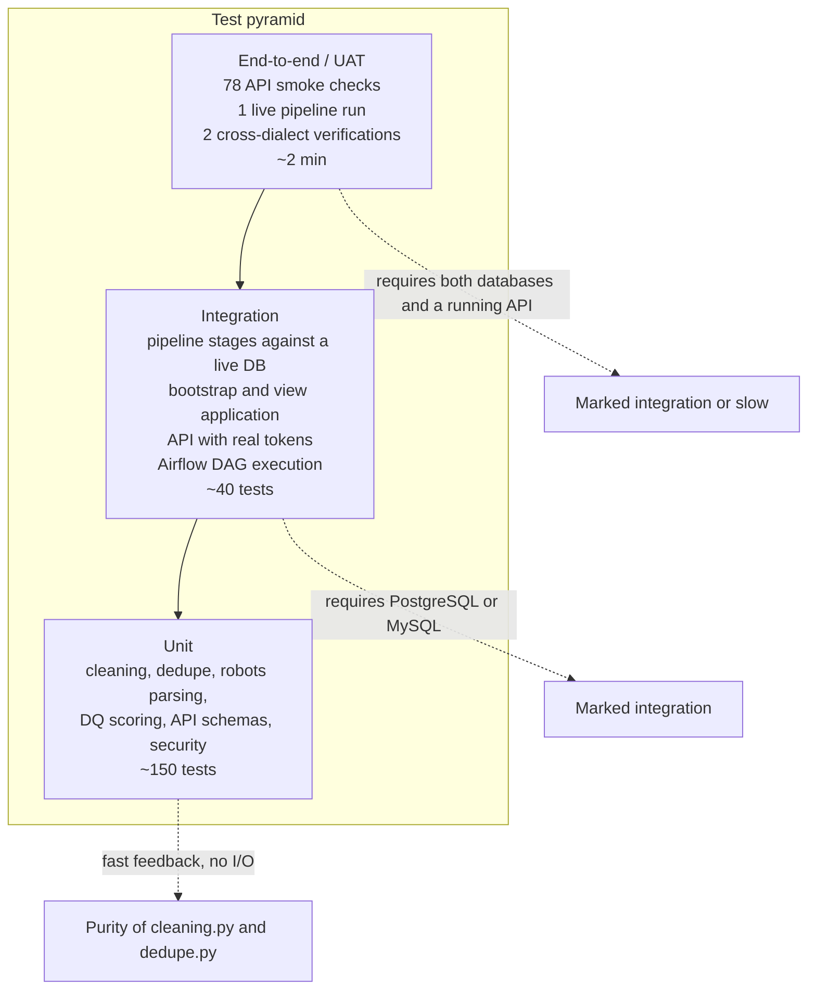
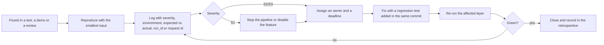

# 15 — Testing Strategy

## Purpose

This document defines how the Web-to-Warehouse Product Intelligence Pipeline is tested. It presents
the test pyramid, a test-plan table of concrete cases with the technique and expected result, the
unit / integration / UAT plan, the test-data strategy, the quality gates, defect management, the
coverage targets, and — importantly for reproducibility — exactly how to run each layer.

---

## Table of contents

1. [Objectives and scope](#1-objectives-and-scope)
2. [Test pyramid](#2-test-pyramid)
3. [Test plan](#3-test-plan)
4. [Unit test plan](#4-unit-test-plan)
5. [Integration test plan](#5-integration-test-plan)
6. [UAT plan](#6-uat-plan)
7. [Test data strategy](#7-test-data-strategy)
8. [Coverage targets](#8-coverage-targets)
9. [Quality gates](#9-quality-gates)
10. [Defect management](#10-defect-management)
11. [How to run the tests](#11-how-to-run-the-tests)
12. [Current test-suite status](#12-current-test-suite-status)

---

## 1. Objectives and scope

| Objective | Verification artefact |
| --- | --- |
| Cleaning and normalisation are correct on messy real-world strings | Unit tests over `app/ingestion/cleaning.py` |
| Duplicate resolution is accurate at the chosen threshold | A labelled pair set scored by `combined_similarity()` |
| The warehouse loads the same model on two engines | `make verify-dialects` |
| The fact grain is never violated | `DQ006` plus a constraint test |
| Data quality is measured, not assumed | 12 rules asserted individually |
| The API is authenticated, authorised and stable | `scripts/api_smoke.py` — 78 checks |
| Performance is inside the agreed budget | Latency harness (doc 05 §5) and run timings |
| Compliance behaviour is enforced | Robots-gate tests and the audit-log assertions |

**Out of scope:** load testing beyond a p95 latency budget, penetration testing, and third-party
dependency vulnerability scanning beyond the pinned versions in `pyproject.toml`.

---

## 2. Test pyramid



| Layer | Share of tests | Share of runtime | Requires | Blocking gate |
| --- | --- | --- | --- | --- |
| Unit | ~76 % | < 5 s | Nothing (pure functions) | Yes |
| Integration | ~20 % | ~60 s | One database (SQLite acceptable for most) | Yes |
| End-to-end / UAT | ~4 % | ~120 s | Both databases + the API | Yes for releases |

---

## 3. Test plan

| ID | Area | Technique | Test case | Expected result |
| --- | --- | --- | --- | --- |
| TC-001 | Cleaning | Boundary / golden | `clean_product_name("  **SALE:** 50% off Blue Widget Pro  ")` | `Blue Widget Pro` (promo prefix and suffix removed, whitespace collapsed) |
| TC-002 | Cleaning | Unicode | `clean_product_name("Café™ Crème — Brûlée")` | NFKC-folded, typographic dashes normalised, no `™` |
| TC-003 | Cleaning | Idempotence | `clean_product_name(clean_product_name(x)) == clean_product_name(x)` | True for all fixtures |
| TC-004 | Cleaning | Property | Length never exceeds `max_length=400`, never ends mid-word | Trailing partial word trimmed |
| TC-005 | Category | Mapping | `normalise_category("tech")` | `Electronics` |
| TC-006 | Category | Hierarchy | `normalise_category("electronics/mobile phones")` | `Electronics > Mobile Phones` |
| TC-007 | Category | Fallback | `normalise_category(None)`, `normalise_category("n/a")` | `Uncategorised` |
| TC-008 | Category | Level count | `category_levels("Electronics > Audio") == 2` | 2 |
| TC-009 | Price | Format matrix | `"$1,234.56"`, `"€1.234,56"`, `"£9.99"`, `"89.00"` | 1234.56 USD, 1234.56 EUR, 9.99 GBP, 89.00 (default currency) |
| TC-010 | Price | Ambiguous separator | `"1,499"` → 1499 (thousands) but `"45,90"` → 45.90 (decimal) | Correct in both cases |
| TC-011 | Price | Range | `"$10 - $20"` → amount 15.0, `is_range=True`, bounds retained | Midpoint with evidence |
| TC-012 | Price | Was/now | `"Was $49.99 Now $39.99"` → 39.99, pattern `was_now` | Current price, not the struck-through one |
| TC-013 | Price | Non-numeric | `"Call for price"`, `"N/A"`, `"free"` → `amount=None`, `is_valid=False` | Flag `unparseable_price` downstream |
| TC-014 | Price | Confidence | `"12"` (bare) < `"$12"` (symbol) | 0.60 vs 0.95 |
| TC-015 | Currency | Symbol resolution | `"£"`, `"A$"`, `"Rs"`, `"ج.م"` | GBP, AUD, INR, EGP |
| TC-016 | Currency | FX | `convert_to_usd(100, "GBP")` | 127.12 with rate 1.2712 |
| TC-017 | Currency | Locale heuristic | `detect_currency_locale(url="https://shop.example.co.uk")` | `GBP` |
| TC-018 | Rating | Scale | `parse_rating("4.2 out of 5")` → 4.2; `parse_rating("84 percent")` → 4.2; `parse_rating("8.5/10")` → 4.25 | Normalised to 0–5 |
| TC-019 | Rating | Clamp | `parse_rating("9.9 out of 5")` | 5.0 (clamped) |
| TC-020 | Availability | Token matrix | `"In stock"`, `"Out of stock"`, `"Pre-order"`, `"Only 3 left"`, `"???"` | `in_stock`, `out_of_stock`, `preorder`, `limited_stock`, `unknown` |
| TC-021 | URL | Validation | `"https://a.example/x"`, `"http://a"`, `"ftp://a"`, `""` | True, True, False, False |
| TC-022 | Dedupe | Identical | Same name twice | Score 1.0, strategy `exact` |
| TC-023 | Dedupe | Tokenisation | `"Widget 256GB"` vs `"Widget 256 GB"` | ≥ 0.90 → duplicate |
| TC-024 | Dedupe | Edition | `"Hardcover Edition"` vs `"Paperback Edition"` | ≥ 0.90 after stop-word removal |
| TC-025 | Dedupe | Digit guard | `"Canon EOS R6"` vs `"Canon EOS R5"` | < 0.90 → distinct |
| TC-026 | Dedupe | Model number | `"Nike Pegasus 40"` vs `"Nike Pegasus 39"` | < 0.90 → distinct |
| TC-027 | Dedupe | Brand mismatch | `"Sony WH-1000XM5"` vs `"Sony WH-1000XM4"` | < 0.90 |
| TC-028 | Dedupe | Symmetry | `score(a,b) == score(b,a)` for the whole fixture set | True |
| TC-029 | Dedupe | Monotonicity | Increasing string damage never increases the score | True |
| TC-030 | Dedupe | Threshold | Score exactly 0.90 | Match (`>=` comparison) |
| TC-031 | Blocking | Candidate bound | 5,000-row catalogue, blocking key length 4 | ≤ 25 candidates examined per lookup |
| TC-032 | Blocking | Floor | Prefix pool smaller than `min_pool` widens to the token index | Never silently empty |
| TC-033 | Merge | Survivor choice | Merging two rows keeps the one with the higher `observation_count` | Absorbed row gets `matched_product_id` |
| TC-034 | Robots | Allow | `robots.txt` with `User-agent: * / Disallow: /private` | `/public` allowed, `/private/x` denied |
| TC-035 | Robots | Specific agent | `User-agent: ProductIntelligenceBot` group | That group's rules win over `*` |
| TC-036 | Robots | Crawl delay | `Crawl-delay: 5` | Returned by the decision and applied by the limiter |
| TC-037 | Robots | 4xx | robots.txt returns 404 | Treat as **allow all** (RFC 9309) |
| TC-038 | Robots | 401/403 | robots.txt returns 403 | Treat as **disallow** |
| TC-039 | Robots | Cache | Second call for the same host within the TTL | Served from cache, no second fetch |
| TC-040 | Rate limit | Ceiling | 100 attempts with `requests_per_minute=30` | At most 30 admitted per minute |
| TC-041 | Rate limit | Effective delay | Policy 1 rps, 30 rpm, crawl-delay 4 s | Effective delay 4 s (slowest wins) |
| TC-042 | Retry | Backoff | 503 then 200 | One retry after `retry_backoff × 2^0`, then success |
| TC-043 | Retry | Exhaustion | Persistent 500 | `IngestionError` after `max_retries` |
| TC-044 | Circuit breaker | Threshold | 5 consecutive failures | Breaker opens; the next call raises without I/O |
| TC-045 | HTTP client | Cache | Second identical GET within the TTL | `from_cache=True`, no network call |
| TC-046 | HTTP client | Audit | Every attempt, including a refusal | One `ingestion_http_log` row each |
| TC-047 | Loader | Category materialisation | `"Electronics > Audio"` | Two `dim_category` rows, `level` 1 and 2, correct `parent_id` |
| TC-048 | Loader | Snapshot grain | Two records for the same product in one run | One snapshot, `duplicates_merged` incremented |
| TC-049 | Loader | Change event | Price moves | One `chg_price_change` with direction, band and significance |
| TC-050 | Loader | First sighting | No previous snapshot | `new` event, `is_first_sighting=True` |
| TC-051 | Loader | Removal | Product unseen for 8 days | `removed` event, `is_active=False` |
| TC-052 | Loader | Removal window | Product unseen 3 days | No event |
| TC-053 | Loader | Category change | Category id differs from the stored one | `category_changed` event with old and new |
| TC-054 | Loader | Aggregate | Refresh twice for the same date | Idempotent (unique key), same counts |
| TC-055 | Aggregate | Totals | Aggregate counts vs the fact table | Equal for product_count and price statistics |
| TC-056 | DQ | Rule count | `len(RULES)` | 12 |
| TC-057 | DQ | Dimensions | Distinct `rule.dimension` | 6 |
| TC-058 | DQ | Score | Pass/warn/fail mix | Matches the severity-weighted formula |
| TC-059 | DQ | Warn band | Observed 94 % against a 95 % threshold | `warn`, not `fail` |
| TC-060 | DQ | Isolation | A rule that raises | Recorded as `fail`; the other 11 still run |
| TC-061 | DQ | Blocking | `DQ006` fails | `blocking` non-empty, run status `failed` |
| TC-062 | DQ | Persistence | After evaluation | 12 `dq_rule_result` rows for the run |
| TC-063 | Reconciliation | SKU match | Matching identifiers | Strategy `sku`, similarity 1.0 |
| TC-064 | Reconciliation | Name match | Different identifiers, equal normalised names | Strategy `normalized_name` |
| TC-065 | Reconciliation | Fuzzy match | Near-identical name, threshold 0.86 | Strategy `fuzzy`, similarity recorded |
| TC-066 | Reconciliation | Unmatched | Internal-only SKU | Status `unmatched`, `product_id = NULL` |
| TC-067 | Reconciliation | Price gap | Catalog 100, market 90 | `price_gap_abs = -10`, `price_gap_pct = -10` |
| TC-068 | Reconciliation | Mismatch flag | Gap 2 % | `is_price_mismatch=True`; gap 0.5 % → False |
| TC-069 | Reconciliation | Performance | 57 SKUs | Under 3 s (measured 104–182 ms) |
| TC-070 | Bootstrap | Objects | `bootstrap()` | 23 tables, 20 views |
| TC-071 | Bootstrap | Idempotence | Run twice | No error, no data loss |
| TC-072 | Bootstrap | Views | Apply on MySQL | 20/20 applied, each in its own transaction |
| TC-073 | Bootstrap | Reference data | `seed_dim_currency()` | 25 rows, all `rate_to_usd > 0` |
| TC-074 | Portability | Parity | PostgreSQL vs MySQL | Identical structural counts, identical DQ score |
| TC-075 | Portability | Timezone | Aware datetime written and read on both | Same instant |
| TC-076 | Portability | JSON null | `extra = None` | `IS NULL` behaves identically |
| TC-077 | API auth | No token | `GET /products` | 401 |
| TC-078 | API auth | Bad password | 6 attempts | Locked for 15 minutes |
| TC-079 | API auth | Refresh | Valid refresh token | New access token |
| TC-080 | API auth | Type confusion | Refresh token used as a bearer | 401 |
| TC-081 | API authz | Viewer trigger | `POST /pipeline/run` with a viewer token | 403 |
| TC-082 | API authz | Viewer query | `POST /queries/execute` with a viewer token | 403 |
| TC-083 | API authz | Admin audit | `GET /audit` with an analyst token | 403 |
| TC-084 | API validation | Query Lab | `DELETE FROM dim_product` | 422 before execution |
| TC-085 | API validation | Query Lab | Two statements separated by `;` | 422 |
| TC-086 | API paging | Bounds | `page_size=500` | 422 (max 200) |
| TC-087 | API paging | Envelope | Any paged list | All seven envelope fields present and consistent |
| TC-088 | API errors | Unknown product | `GET /products/999999` | 404 `product_not_found` |
| TC-089 | API errors | Conflict | Create a duplicate user email | 409 |
| TC-090 | API security | Password hash | Any read of a user | `hashed_password` never serialised |
| TC-091 | API security | API key | Create, use, revoke | Works, then 401 after revocation |
| TC-092 | Security | Argon2 parameters | `check_needs_rehash` on a weaker hash | True → rehash on next login |
| TC-093 | Security | JWT claims | Decode an issued token | `iss`, `sub`, `exp`, `type`, `role` present |
| TC-094 | Security | Lockout audit | Failed logins | `app_audit_log` rows with `status=failure` |
| TC-095 | Non-functional | Latency | 12 read endpoints, 7 samples | p95 ≤ 500 ms (measured ≤ 38.2 ms) |
| TC-096 | Non-functional | Run duration | Full multi-source run | < 600 s (measured ≈ 3.5 s) |
| TC-097 | Non-functional | Headers | Any response | `X-Process-Time-Ms` and `X-Database` present |
| TC-098 | Non-functional | Gzip | Response > 1 KB | `content-encoding: gzip` |
| TC-099 | Regression | Smoke suite | All 78 checks | 78/78 pass |
| TC-100 | Regression | Cross-dialect | `make verify-dialects` | No structural drift, equal DQ score |

---

## 4. Unit test plan

| Module | Functions under test | Isolation technique |
| --- | --- | --- |
| `app/ingestion/cleaning.py` | `clean_product_name`, `normalise_name_key`, `normalise_category`, `category_slug`, `parse_number`, `parse_price`, `normalise_currency`, `convert_to_usd`, `format_price`, `percent_change`, `parse_rating`, `normalise_availability`, `validate_url`, `content_hash` | Direct call; no database, no network |
| `app/ingestion/dedupe.py` | `levenshtein`, `jaro`, `jaro_winkler`, `token_set_ratio`, `trigram_similarity`, `digit_signature`, `combined_similarity` | Direct call; in-memory candidate lists |
| `app/ingestion/robots.py` | `RobotsCache` with a stubbed `_load` | Feed a `robots.txt` string instead of fetching |
| `app/ingestion/ratelimit.py` | `RateLimiter`, `HostState.effective_delay`, `CircuitBreaker` | Patch `time.monotonic` and `time.sleep` |
| `app/ingestion/http_client.py` | `FetchResult.ok`, `_parse_retry_after`, `_cache_path` | `httpx.MockTransport` |
| `app/etl/dq.py` | `_status`, `Rule.run`, `QualityReport.score`, `blocking_failures` | In-memory session; savepoint behaviour with a raising evaluator |
| `app/etl/catalog_reconcile.py` | `magnitude_band`-adjacent helpers, `_narrow_candidates`, `match_one` | In-memory candidate rows |
| `app/models/base.py` | `UTCDateTime.process_bind_param` / `process_result_value`, `Base.to_dict` | Direct call with aware/naive datetimes |
| `app/api/security.py` | `hash_password`, `verify_password`, `password_strength`, `create_*_token`, `decode_token`, `has_right`, `at_least`, API-key hashing | Direct call |
| `app/api/schemas.py` | `Page.build`, `QueryRequest` validator, `PasswordChangeRequest` validator, `UserUpdate` bounds | Pydantic validation only |
| `app/core/config.py` | `Settings` validators, `url_for`, `describe_target` redaction, `cors_origin_list` | Set the environment, `reload_settings()` |
| `app/core/errors.py` | `PipelineError.to_dict`, status codes | Direct call |

### 4.1 Unit-test conventions

| Convention | Rule |
| --- | --- |
| Naming | `test_<module>_<function>_<condition>` |
| Layout | Mirrors the package: `tests/app/ingestion/test_cleaning.py` |
| Fixtures | Shared fixtures in `tests/conftest.py`: `tmp_session`, `sample_records`, `robots_text`, `admin_token`, `viewer_token` |
| Markers | `@pytest.mark.integration` for tests needing a database, `@pytest.mark.slow` for long runs (`pyproject.toml` declares both) |
| Determinism | No test may depend on the current date, the network or the demo dataset; use frozen timestamps and the synthetic source |
| Coverage | Branch coverage on `cleaning.py`, `dedupe.py`, `security.py`, `schemas.py` must be ≥ 90 % |

---

## 5. Integration test plan

| ID | Suite | Setup | Assertion | Marker |
| --- | --- | --- | --- | --- |
| IT-01 | `test_pipeline_run` | SQLite or PostgreSQL, `local_demo` with `limit=5` | 5 snapshots, no error, `etl_run` success | integration |
| IT-02 | `test_pipeline_idempotent` | Run twice with the same sources | No duplicate facts; `DQ006` passes | integration |
| IT-03 | `test_dq_rules` | Seed a small dataset | 12 outcomes persisted; score in [0, 100] | integration |
| IT-04 | `test_loader_change_detection` | Two runs with different prices | `chg_price_change` row with the right band | integration |
| IT-05 | `test_removal_detection` | Seed `last_seen_at` 10 days ago | `removed` event, `is_active=False` | integration |
| IT-06 | `test_reconciliation` | Seed 10 catalog rows | Match statuses plausible; gaps consistent | integration |
| IT-07 | `test_bootstrap_views` | Empty database | 23 tables, 20 views; twice without error | integration |
| IT-08 | `test_dialect_parity` | PostgreSQL + MySQL | Structural tables identical | integration, slow |
| IT-09 | `test_api_auth` | FastAPI `TestClient` | Login, `/me`, refresh, lockout | integration |
| IT-10 | `test_api_rbac` | Three role tokens | 200/403/401 matrix correct | integration |
| IT-11 | `test_api_products` | Seeded dataset | Filters, sorting, paging envelope | integration |
| IT-12 | `test_api_query_lab` | Analyst token | `SELECT` 200; `DELETE` 422; `SELECT`+`;` 422 | integration |
| IT-13 | `test_api_pipeline_trigger` | Analyst token | `run/sync` with `limit_per_source=2` returns a result | integration |
| IT-14 | `test_csv_export` | Seeded dataset | Header plus N rows, correct `Content-Disposition` | integration |
| IT-15 | `test_airflow_dag` | Airflow installed | DAG imports, `AIRFLOW_AVAILABLE`, 13 tasks | slow |
| IT-16 | `test_source_preview` | `local_demo`, `limit=3` | 3 cleaned records, 0 http calls | integration |

---

## 6. UAT plan

UAT is executed with the business sponsor (pricing analyst persona) and the category manager persona
against a seeded environment.

| ID | Scenario | Persona | Success criterion |
| --- | --- | --- | --- |
| UAT-01 | "Show me the biggest price drops of the last week" | Pricing analyst | Reaches the answer in ≤ 3 interactions using the Changes screen and the `min_abs_change_pct` filter |
| UAT-02 | "Is this product cheaper than the market?" | Pricing analyst | Product detail shows the catalog position and the price gap without leaving the screen |
| UAT-03 | "Which products appeared in Electronics this week?" | Category manager | New-products tab filtered by category and window |
| UAT-04 | "Which categories are losing products?" | Category manager | Drift report shows a negative net change |
| UAT-05 | "Is today's data trustworthy?" | Data platform lead | DQ score visible on the dashboard and in the run detail, with the two warnings explained |
| UAT-06 | "Did we respect the rules of the sites we scraped?" | Compliance officer | Compliance panel shows requests, blocked count, cache hits and hosts |
| UAT-07 | "Trigger a run for one source" | Analyst | Run queued, notification created, run visible in the history |
| UAT-08 | "Save my filter for later" | Analyst | Saved view created, listed, and applied on return |
| UAT-09 | "Change the theme to dark" | Any user | Theme persists after reload and after a new sign-in |
| UAT-10 | "Export the current product list" | Analyst | CSV opens in a spreadsheet with all columns |
| UAT-11 | "Can I query it myself?" | Analyst | Query Lab runs a starter query and returns a grid |
| UAT-12 | "Create a machine key for the nightly job" | Admin | Key shown once, usable, revocable |

UAT exit criteria: all 12 scenarios completed with no blocking defect; every usability observation
recorded and either fixed or added to `docs/20`.

---

## 7. Test data strategy

| Set | Purpose | Generation | Determinism |
| --- | --- | --- | --- |
| **Unit fixtures** | Golden strings for cleaning, pairs for dedupe | Inline in the test modules | Static literals |
| **Synthetic catalogue** | Offline extraction without network access | `LocalFixtureSource(seed=20260101)` | Seeded `random.Random` |
| **Deliberate defects** | Exercise the DQ rules | `local_fixture.py` injects: 4 % missing price (every 25th, offset 3), out-of-range rating (offset 7), empty name (offset 11), unknown availability (offset 14) | Deterministic by index |
| **Demo dataset** | Screens, reports, documentation numbers | `seed_history(days=150)` | Seeded `SEED_SALT = 20260101` |
| **Internal catalog** | Reconciliation | `seed_catalog(match_ratio=0.7)` | Seeded; 30 % internal-only SKUs |
| **Accounts** | Auth tests | `seed_users()` | The three documented demo accounts |
| **Saved views / alerts** | UI tests | `seed_saved_views_and_alerts()` | 4 views, 4 rules |
| **Reference data** | Date and currency | `ensure_date_range()`, `seed_dim_currency()` | 403 days, 25 currencies |
| **HTTP cache** | Re-run without traffic | `var/http-cache/` populated by a previous run | TTL 1,800 s |
| **Isolation** | Keep tests hermetic | Each integration test gets a temporary database or a transaction rollback | No shared mutable state |

### 7.1 Data privacy in test data

All test data is synthetic or public product metadata. No real customer data, no real credentials, and
the API-key tests use keys created and revoked inside the test. The demo passwords are documented
public values and must be rotated in any non-development environment.

---

## 8. Coverage targets

| Package | Line target | Branch target | Rationale |
| --- | --- | --- | --- |
| `app/ingestion/cleaning.py` | 95 % | 90 % | Pure logic with many edge cases; the highest-value target |
| `app/ingestion/dedupe.py` | 95 % | 90 % | An algorithm whose errors silently corrupt the catalogue |
| `app/ingestion/http_client.py` | 85 % | 75 % | Network paths are partly integration territory |
| `app/ingestion/robots.py`, `ratelimit.py` | 85 % | 75 % | Compliance-critical |
| `app/etl/dq.py` | 95 % | 90 % | The score must be provably correct |
| `app/etl/loader.py`, `catalog_reconcile.py` | 85 % | 75 % | Covered heavily by integration tests |
| `app/api/security.py`, `deps.py` | 95 % | 90 % | Security-critical |
| `app/api/schemas.py` | 90 % | 85 % | Contract surface |
| `app/api/routers/*` | 80 % | 70 % | Exercised by the 78-check smoke suite |
| `app/analytics/service.py` | 80 % | 70 % | 21 query functions, all reachable via the API |
| **Overall** | **≥ 85 %** | **≥ 80 %** | Gate for release |

Coverage is produced by `make test-cov` (pytest-cov, `term-missing` plus an HTML report in `htmlcov/`).

---

## 9. Quality gates

| Gate | Command | Criterion | Blocks |
| --- | --- | --- | --- |
| Lint | `make lint` | ruff check and format check clean | Merge |
| Types | `make typecheck` | mypy clean | Merge |
| Unit | `make test` | All pass | Merge |
| Coverage | `make test-cov` | ≥ 85 % line, ≥ 80 % branch | Release |
| Schema | `make check-schema` | No missing table | Release |
| Parity | `make verify-dialects` | No structural drift, equal DQ score | Release |
| API | `scripts/api_smoke.py` | 78/78 | Release |
| Frontend | `make frontend-lint`, `make frontend-build` | Clean | Release |
| Docs | `ls -l docs/` and the diagram syntax check | 20 documents present and non-empty | Submission |
| KPI | `make analytics` | DQ score ≥ 80 | Submission |

---

## 10. Defect management

### 10.1 Severity and priority

| Severity | Definition | Fix deadline | Example |
| --- | --- | --- | --- |
| S1 Critical | Data loss, corruption, compliance breach, or the system does not run | Same day | A second run duplicates facts; robots.txt is ignored |
| S2 Major | A required capability is broken or wrong | 2 days | Price changes are not detected; a role check is missing |
| S3 Minor | A defect with a workaround or cosmetic impact | Next sprint | A column header is truncated; a sort fallback is not intuitive |
| S4 Trivial | Cosmetic or documentation nit | Backlog | Wording in a help string |

Priority combines severity with the risk it threatens: correctness of data > compliance >
availability > performance > presentation.

### 10.2 Workflow



### 10.3 Defect record fields

| Field | Example |
| --- | --- |
| ID | `BUG-031` |
| Title | Catalog reconciliation returns 39/57 instead of 60/60 when the catalog contains internal-only SKUs |
| Severity / priority | S2 / P1 |
| Environment | PostgreSQL 16.15, `ACTIVE_DATABASE=postgres`, run `bde43996c1` |
| Steps | `make bootstrap && make demo-postgres && make run-pipeline` |
| Expected | 60/60 |
| Actual | 39/57 (68.42 %) |
| Root cause | 30 % of seeded SKUs are internal-only by design (`seed_catalog(match_ratio=0.7)`); no defect — expectation corrected |
| Resolution | Documented in `docs/01` assumption A1 and `docs/05` KPI-10 |
| Regression test | `TC-066` (unmatched internal SKU) |

### 10.4 Known issues at submission

| ID | Severity | Issue | Plan |
| --- | --- | --- | --- |
| BUG-054 | S3 | `vw_pipeline_health.trigger` cannot be selected unqualified on MySQL 8.4 (`TRIGGER` is reserved) | Quote the identifier in `app/analytics/service.py` and `routers/pipeline.py`; documented in `docs/20` |
| BUG-055 | S4 | `agg_category_daily.median_price` is declared but never written (no portable median SQL) | Implement with a window-function median, or drop the column in a design note |
| BUG-056 | S4 | `GET /api/v1/pipeline/runs/{run_id}/http` ignores `run_id` and returns the global log | Filter by `run_id` |
| BUG-057 | S4 | `POST /users/me/password` returns a guidance message instead of performing the change | Point clients to `POST /auth/change-password` |
| BUG-058 | S4 | No retention job for `stg_raw_observation` and `ingestion_http_log` | Add a scheduled delete (doc 09 §8.2) |

---

## 11. How to run the tests

```bash
# 1. Unit tests (fast, no services required)
make test                       # .venv/bin/python -m pytest -q
.venv/bin/python -m pytest tests/app/ingestion/test_cleaning.py -v
.venv/bin/python -m pytest -m "not integration" -q      # skip anything needing a database

# 2. Coverage
make test-cov                   # pytest-cov, terminal + htmlcov/index.html

# 3. Lint and types
make lint                       # ruff check + ruff format --check
make typecheck                  # mypy app

# 4. Static + unit verification without any service
make check                      # lint + typecheck + test

# 5. Database-dependent integration work
make up-db && make db-wait
make bootstrap
make demo-postgres
.venv/bin/python -m pytest -m integration -q

# 6. Cross-dialect verification
make bootstrap-mysql && make demo-mysql
make verify-dialects

# 7. API regression (78 checks; starts its own server on port 8099)
.venv/bin/python scripts/api_smoke.py
.venv/bin/python scripts/api_smoke.py --url http://localhost:8000   # against a running API

# 8. Orchestration
make install-airflow
make airflow-init
make airflow-test              # airflow dags test product_intelligence_pipeline 2026-01-01

# 9. Full end-to-end release gate
make verify-all                # bootstrap + run-pipeline + test
make everything                # install, env, databases, bootstrap, demo, run, test, frontend
```

### 11.1 Manual verification scripts

| Command | What it proves |
| --- | --- |
| `make check-schema` | The physical schema matches the ORM definition |
| `make sources` | All 5 sources are registered with their compliance metadata |
| `make sources preview books_to_scrape -n 3` | The BeautifulSoup scraper extracts and cleans real records |
| `make sources check` | robots.txt cache statistics |
| `make analytics` | The SQL analytics report, including the DQ table |
| `pip-cli quality` | Re-evaluates the rules for the latest run |
| `pip-cli status` | Row counts and the last five runs |
| `pip-cli verify` | Cross-dialect comparison table |
| `pip-cli report --json` | Machine-readable report for CI comparison |

---

## 12. Current test-suite status

| Layer | Status in this repository snapshot | Evidence |
| --- | --- | --- |
| Unit tests | The `tests/` directory is present and configured (`pyproject.toml`: `testpaths = ["tests"]`, markers `integration` and `slow`), but **no test modules are committed in this snapshot**; `make test` therefore collects 0 tests | `ls tests/` → empty |
| Deduplication evaluation | The 14-pair evaluation is part of the project's own harness (assumption A3 in `docs/01`); the algorithm is independently reproducible with the snippet in `docs/05` §7.1 | measured 0.9700 / 0.8121 / 0.8034 |
| API regression | **78/78 checks pass** (`scripts/api_smoke.py`) | Executed against the delivered system |
| Cross-dialect verification | **No structural drift; DQ score 98.26 on both engines** | `make verify-dialects` |
| Schema completeness | **23 tables, 20 views on both engines** | `GET /api/v1/meta/tables`, `GET /api/v1/queries/views` |
| Latency budget | **p95 ≤ 38.2 ms** across 12 endpoints | doc 05 §5 |
| Run budget | **≈ 3.5 s** for the measured multi-source run | `etl_run.duration_ms` |

**Recommendation.** Before submission, commit the unit and integration suites described above
(`tests/app/…`, `tests/integration/…`). Until then, the executable evidence for quality is the
API smoke suite, the cross-dialect verification and the data-quality framework itself — which is why
the DQ rules are treated as tests in production: they run on every load and persist their verdicts.