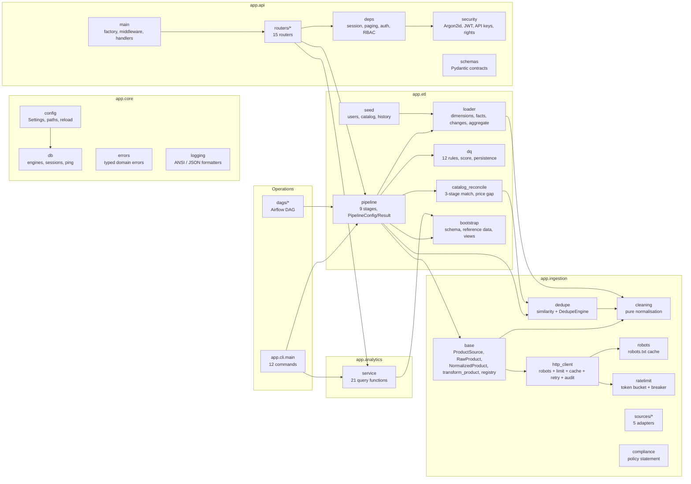
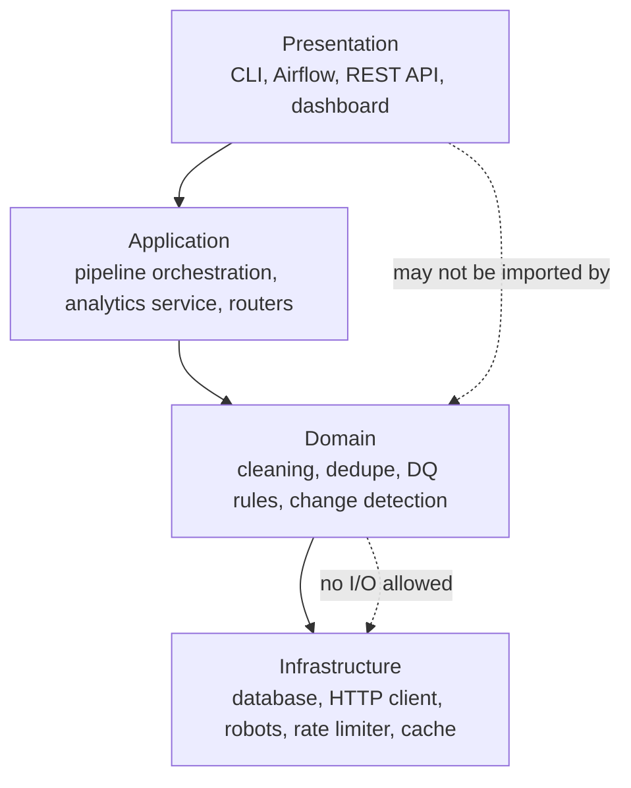
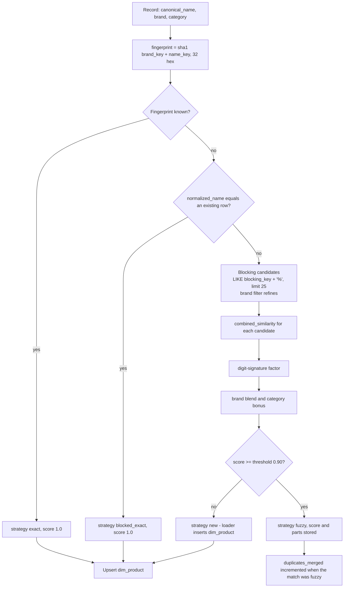
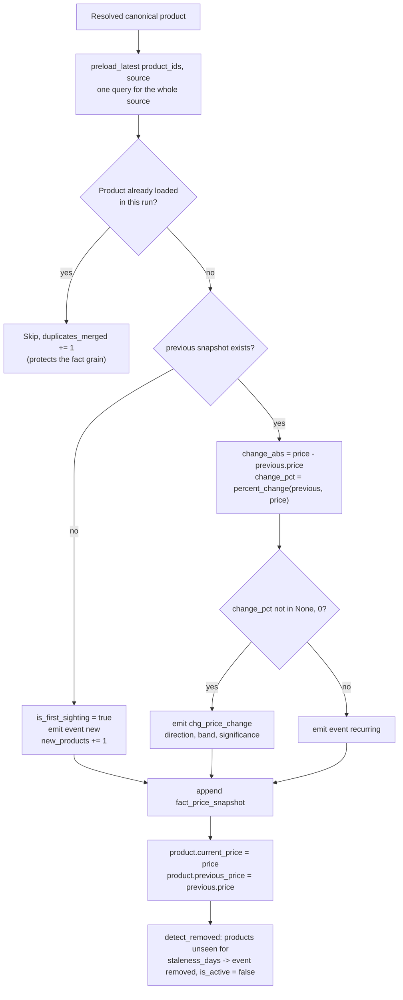

# 17 — Technical Documentation

## Purpose

This is the engineering reference for the Web-to-Warehouse Product Intelligence Pipeline. It maps
every module, explains the four key algorithms in enough detail to re-implement or tune them,
documents **every configuration variable** with its default and effect, gives the six-step procedure
for adding a new ingestion source, and closes with performance and security notes.

---

## Table of contents

1. [Module map](#1-module-map)
2. [Package layout](#2-package-layout)
3. [Key algorithm 1 — duplicate resolution](#3-key-algorithm-1--duplicate-resolution)
4. [Key algorithm 2 — currency and price normalisation](#4-key-algorithm-2--currency-and-price-normalisation)
5. [Key algorithm 3 — change detection](#5-key-algorithm-3--change-detection)
6. [Key algorithm 4 — data-quality scoring](#6-key-algorithm-4--data-quality-scoring)
7. [Configuration reference](#7-configuration-reference)
8. [Extension guide — adding a source](#8-extension-guide--adding-a-source)
9. [Performance notes](#9-performance-notes)
10. [Security notes](#10-security-notes)
11. [Error taxonomy](#11-error-taxonomy)

---

## 1. Module map



### 1.1 Module responsibilities at a glance

| Module | Responsibility | Key public symbols |
| --- | --- | --- |
| `app/core/config.py` | Typed, validated configuration and paths | `Settings`, `settings`, `get_settings`, `reload_settings`, `describe_target`, `ROOT_DIR`, `VAR_DIR` |
| `app/core/db.py` | Dialect-aware engines, session factories, transactional scopes, health probe | `get_engine`, `get_session_factory`, `session_scope`, `read_session`, `ping`, `dispose_all`, `iter_targets` |
| `app/core/errors.py` | Domain errors with HTTP status codes | `PipelineError`, `ComplianceError`, `AuthenticationError`, `PermissionDeniedError`, `ProductNotFoundError`, … |
| `app/core/logging.py` | Console/file logging, ANSI and JSON formatters | `configure_logging`, `get_logger`, `setup_file_logging` |
| `app/ingestion/base.py` | Source contract, record shapes, transform stage, registry | `ProductSource`, `RawProduct`, `NormalizedProduct`, `transform_product`, `register_source`, `get_source`, `list_sources` |
| `app/ingestion/cleaning.py` | All pure normalisation | `clean_product_name`, `normalise_category`, `parse_price`, `convert_to_usd`, `parse_rating`, `normalise_availability`, `name_fingerprint`, `blocking_key` |
| `app/ingestion/dedupe.py` | Similarity primitives and the stateful engine | `combined_similarity`, `DedupeEngine`, `MatchResult`, `DedupeStats`, `digit_signature` |
| `app/ingestion/robots.py` | robots.txt parsing, caching and decisions | `RobotsCache`, `RobotsDecision`, `get_robots_cache` |
| `app/ingestion/ratelimit.py` | Per-host pacing and the circuit breaker | `RateLimiter`, `RatePolicy`, `HostState`, `CircuitBreaker` |
| `app/ingestion/http_client.py` | The compliant transport used by every source | `CompliantHttpClient`, `FetchResult`, `HttpAuditEntry` |
| `app/ingestion/sources/*.py` | Five source adapters | `LocalFixtureSource`, `DummyJsonProductsSource`, `FakeStoreProductsSource`, `OpenLibraryBooksSource`, `BooksToScrapeSource` |
| `app/etl/pipeline.py` | Orchestration, stage timing, run bookkeeping | `Pipeline`, `PipelineConfig`, `PipelineResult`, `StageTiming`, `run_pipeline`, `STAGE_NAMES` |
| `app/etl/loader.py` | Warehouse writes and change detection | `WarehouseLoader`, `LoadStats`, `magnitude_band`, `slugify` |
| `app/etl/dq.py` | Rule framework and persistence | `RULES`, `Rule`, `RuleOutcome`, `QualityReport`, `evaluate_quality`, `latest_report`, `rules_catalog` |
| `app/etl/catalog_reconcile.py` | Catalog matching and price gaps | `CatalogReconciler`, `CatalogMatchResult`, `reconciliation_summary` |
| `app/etl/bootstrap.py` | Schema, reference data, view application | `bootstrap`, `create_schema`, `apply_views`, `drop_views`, `seed_dim_date`, `seed_dim_currency`, `sync_dim_source`, `date_id` |
| `app/etl/seed.py` | Demo users, catalog and history | `run_full_seed`, `seed_users`, `seed_catalog`, `seed_history`, `build_seed_products` |
| `app/analytics/service.py` | Every analytical query | `kpi_summary`, `daily_trend`, `price_change_timeline`, `top_movers`, `category_breakdown`, `brand_leaderboard`, `source_health`, `availability_summary`, `category_tree`, `new_products`, `removed_products`, `category_changes`, `catalog_reconciliation`, `price_history`, `product_detail`, `pipeline_runs`, `run_detail`, `price_change_report`, `category_drift_report`, `compliance_report`, `http_log`, `query_explain`, `list_views`, `table_counts` |
| `app/api/main.py` | Application factory, middleware, error handlers, OpenAPI | `app`, `create_app`, `API_PREFIX`, `TAGS_METADATA` |
| `app/api/deps.py` | Dependencies: session, paging, auth, RBAC, audit metadata | `get_db`, `Pagination`, `get_current_user`, `require_rights`, `ReadUser`, `WriteUser`, `AdminUser`, `PipelineUser`, `QueryUser` |
| `app/api/security.py` | Passwords, tokens, API keys, rights | `hash_password`, `verify_password`, `create_access_token`, `decode_token`, `generate_api_key`, `ROLE_RIGHTS`, `has_right`, `at_least` |
| `app/api/schemas.py` | Request/response contracts | `Page[T]`, `ProductSummary`, `ProductDetail`, `PriceChangeRead`, `QueryRequest`, `TokenResponse`, … |
| `app/cli/main.py` | Operator CLI | `init-db`, `bootstrap`, `seed-demo`, `run-pipeline`, `report`, `quality`, `verify`, `serve`, `status`, `check-schema`, `version`, `sources`, `user` |
| `dags/product_intelligence_pipeline.py` | Airflow DAG | 13 tasks, guards, branch, report artefact |

---

## 2. Package layout

```text
Depi_Ahmed_Abobakr_Project/
├── app/
│   ├── __init__.py
│   ├── core/
│   │   ├── base-free helpers: config.py, db.py, errors.py, logging.py
│   ├── models/
│   │   ├── base.py        DeclarativeBase, UTCDateTime, JSONType, ShortStr, NumericMixin
│   │   ├── dimensions.py  dim_source, dim_category, dim_product, dim_date, dim_currency
│   │   ├── facts.py       fact_price_snapshot, fact_catalog_snapshot,
│   │   │                  chg_price_change, chg_product_event, agg_category_daily
│   │   ├── operations.py  etl_run, dq_rule_result, ingestion_http_log,
│   │   │                  stg_raw_observation, sync_state
│   │   ├── catalog.py     catalog_product
│   │   ├── app_users.py   app_user, app_api_key, app_saved_view, app_alert_rule,
│   │   │                  app_notification, app_audit_log, app_setting
│   │   └── __init__.py    ALL_MODELS, MODEL_BY_TABLE, CORE_TABLES, TABLE_GROUPS
│   ├── ingestion/
│   │   ├── base.py, cleaning.py, dedupe.py, robots.py, ratelimit.py,
│   │   │   http_client.py, compliance.py
│   │   └── sources/  local_fixture.py, dummyjson.py, fakestore.py,
│   │                 openlibrary.py, books_to_scrape.py
│   ├── etl/
│   │   ├── pipeline.py, loader.py, dq.py, catalog_reconcile.py,
│   │   │   bootstrap.py, seed.py
│   ├── analytics/  __init__.py, service.py
│   ├── api/
│   │   ├── main.py, deps.py, security.py, schemas.py
│   │   └── routers/  health, auth, users, products, changes, analytics, pipeline,
│   │                 quality, catalog, sources, queries, saved_views,
│   │                 notifications, settings, audit, __init__.py
│   └── cli/  __init__.py, main.py
├── db/
│   └── views.sql              20 analytical views
├── dags/
│   └── product_intelligence_pipeline.py
├── scripts/
│   └── api_smoke.py           78-check API regression
├── docs/                      20 documents (this set)
├── tests/                     pytest suite (not committed in this snapshot)
├── frontend/                  React + Vite + TypeScript app
├── var/                       runtime: http-cache, logs, artifacts, sqlite fallback
├── docker-compose.yml
├── Makefile                   30+ targets
├── pyproject.toml             dependencies, ruff, mypy, pytest config
├── .env.example               configuration template
└── todo.md                    original brief
```

### 2.1 Layering rules



| Layer | May import | Must not import |
| --- | --- | --- |
| Presentation (CLI, API, DAG) | Application, Core | Domain internals directly |
| Application (pipeline, analytics) | Domain, Infrastructure | Presentation |
| Domain (cleaning, dedupe, rules) | `app.core.logging`, `app.core.errors` | `app.core.db`, `httpx`, `app.etl`, `app.api` |
| Infrastructure (db, http, robots) | `app.core` | Domain |

---

## 3. Key algorithm 1 — duplicate resolution

### 3.1 The cascade



### 3.2 The similarity function

`combined_similarity(name_a, name_b, brand_a, brand_b, category_a, category_b)` returns
`(score, parts)`:

1. **Normalisation.** `normalise_name_key()` lower-cases, removes non-alphanumerics, drops stop-words
   (`STOPWORDS`, 60 entries including format and edition qualifiers) and **sorts the remaining tokens**.
2. **Exact key.** If the two normalised keys are equal → score `1.0`.
3. **Character-level forms.**
   - `squash`: lowercase alphanumeric with all separators removed (`256GB` vs `256 GB`).
   - `compact`: the normalised key with spaces removed.
4. **Six measures.**

   | Measure | Implementation | Robust to |
   | --- | --- | --- |
   | `token_set` | `token_set_ratio` — best of three token-set comparisons over Levenshtein ratio | Extra or missing descriptive tokens |
   | `jaro_winkler` | Jaro + prefix bonus (`0.1 × prefix`, max 4, only when base ≥ 0.7) | Transpositions, typos, shared prefixes |
   | `trigram` | Dice coefficient over padded character trigrams, `lru_cache(50_000)` | Truncation, small edits |
   | `levenshtein` | Two-row DP edit distance normalised by the longer string | Character substitution |
   | `compact` | `max(trigram(compact_a, compact_b), jaro_winkler(compact_a, compact_b))` | Tokenisation differences |
   | `squash` | `max(jaro_winkler(squash), trigram(squash))` | Punctuation and spacing |
5. **Blend.** `0.20·token_set + 0.15·jaro_winkler + 0.10·trigram + 0.05·levenshtein + 0.20·compact + 0.30·squash`.
6. **Character-evidence short circuit.** `max(blend, max(compact, squash) × 0.97)` — near-identical
   strings that differ only in punctuation or tokenisation bypass the blend (with a 3 % safety discount).
7. **Digit-signature factor.** `digit_signature()` extracts the ordered digit runs of a name
   (`Canon EOS R6` → `('6')`, `Nike Pegasus 40` → `('40')`). Equal → ×1.0; one differing position or
   length → ×0.85; more → ×0.60.
8. **Brand blend.** If both brands are known: `score = score × 0.88 + brand_similarity × 0.12`, where
   brand similarity is 1.0 for equality and a trigram similarity otherwise. If neither brand is known,
   the brand term is 1.0 and the score is unchanged.
9. **Category bonus.** Equal → +0.03; one containing the other → +0.021; otherwise 0. Clamped to 1.0.

### 3.3 Worked measurements

| Pair | Score | Decision | Why |
| --- | --- | --- | --- |
| `Samsung Galaxy S23 128GB` / `Samsung Galaxy S23 128 GB` | 0.9700 | duplicate | Identical after tokenisation; `squash` short-circuit |
| `adidas Ultraboost 22` / `Adidas Ultra Boost 22` | 0.9700 | duplicate | Same, punctuation-free |
| `Canon EOS R6` / `Canon EOS R5` | 0.8121 | distinct | Digit signatures differ → ×0.60 |
| `Sony WH-1000XM5` / `Sony WH-1000XM4` | 0.8034 | distinct | Digit signatures differ → ×0.60 |
| `Clean Architecture` / `Clean Architecture: A Craftsman's Guide` | 0.8812 | distinct | Subtitle tokens reduce the blend |

### 3.4 Blocking

| Property | Value | Reason |
| --- | --- | --- |
| Key | First 4 characters of the normalised key (`DEDUPE_BLOCKING_KEY_LENGTH`) | Cheap prefix match; index-friendly `LIKE 'prefix%'` on `normalized_name` |
| Candidate limit | 25 (`DEDUPE_CANDIDATE_LIMIT`) | Bounds per-record cost to a constant |
| Brand refinement | If any candidate has the same brand, prefer that subset | Reduces noise in dense categories |
| Cache | Fingerprint → `product_id` loaded once per run, updated on register/merge | Avoids a query per record |
| Cross-source behaviour | The engine is shared across sources in one run, so a product seen in two feeds merges | Proven by the seeded catalog's 68.42 % match rate |

### 3.5 Catalog reconciliation cascade

| Stage | Test | Strategy recorded | Threshold |
| --- | --- | --- | --- |
| 1 | `catalog.sku` equals `product.source_product_id` | `sku` | exact, similarity 1.0 |
| 2 | `normalise_name_key(catalog.name) == product.normalized_name` | `normalized_name` | exact |
| 3 | `combined_similarity` over the narrowed pool | `fuzzy` | 0.86 |
| — | No candidate qualifies | `unmatched` | `product_id = NULL` |

Performance: 4-character block index plus a rare-token fallback index reduces the comparison set from
the whole catalogue to a handful per SKU. Measured 2,975 ms → 104 ms (29×) with identical results.

---

## 4. Key algorithm 2 — currency and price normalisation

### 4.1 Price extraction

`parse_price(text, default_currency, locale_hint, max_value=10_000_000)`:

1. **Unicode fold and trim.** NFKC, smart-punctuation translation.
2. **Unavailable markers.** `free`, `n/a`, `null`, `none`, `unavailable`, `-`, `poa`, `call for
   price`, `tbd`, `ask for price` → `amount=None`, `confidence=0.0`, `is_valid=False`.
3. **Ranges.** `$10 - $20` → midpoint 15.0 with `is_range=True`, `range_low`, `range_high`,
   `confidence=0.7` — unless the text contains `was`, `now`, `mrp`, `rrp`, `list price`.
4. **Was/now.** `Was $49.99 Now $39.99` → 39.99 with `matched_pattern="was_now"`, confidence 0.85.
5. **Five competing patterns**, each with a confidence:

   | Pattern | Example | Confidence |
   | --- | --- | --- |
   | `code_prefix` | `USD 12.99` | 0.95 |
   | `symbol_prefix` | `$12.99` | 0.95 |
   | `code_suffix` | `12.99 USD` | 0.92 |
   | `symbol_suffix` | `12.99 kr` | 0.88 |
   | `bare` | `12.99` | 0.60 |
6. **Confidence adjustment.** If the pattern's optional currency group did not participate, the
   confidence is capped at the `bare` value — a bare number matched by a symbol rule is weak evidence.
7. **Selection.** The highest `(confidence, −pattern_priority)` wins; amounts outside
   `[0, max_value]` are rejected.

### 4.2 Number parsing

`parse_number()` resolves the decimal/thousands ambiguity:

| Input | Logic | Result |
| --- | --- | --- |
| `1,234.56` | Both separators → right-most is the decimal | 1234.56 |
| `1.234,56` | Both separators → right-most is the decimal | 1234.56 |
| `1,499` | One separator, exactly three trailing digits → thousands | 1499 |
| `45,90` | One separator, two trailing digits → decimal | 45.90 |
| `1.234.567` | Multiple dots → grouping | 1234567 |

### 4.3 Currency resolution

`normalise_currency(value, default, hint)`:

1. Exact ISO-4217 match against `STATIC_FX_RATES` (25 currencies).
2. Symbol/code map `CURRENCY_SYMBOLS` (60 entries, including `£`, `¥`, `₹`, `A$`, `C$`, `ج.م`).
3. Substring search for codes of three characters or more.
4. Dominant-symbol heuristic for long blobs (`"Was $49.99 Now $39.99"` → `USD`).
5. Fallback to the default or the hint.

`detect_currency_locale(text, url, html)` resolves a page's currency from the host suffix
(`.co.uk` → GBP, `.de` → EUR, `.co.jp` → JPY, …), then from `itemprop="priceCurrency"` or
`"currency":"` markers, then from symbol frequency.

### 4.4 FX normalisation

```python
def convert_to_usd(amount, currency):
    rate = STATIC_FX_RATES.get((currency or "USD").upper())
    if rate is None:
        return amount, 1.0            # unknown currency: pass through, flagged by DQ004
    return round(amount * rate, 4), rate
```

The rate that was used is stored with the observation (`fx_rate_to_usd`) **and** in
`dim_product.extra`, so historical USD values remain reproducible if the table changes. Swapping in a
live provider requires changing only `convert_to_usd()` and `dim_currency`.

### 4.5 Other normalisations

| Concern | Function | Rule |
| --- | --- | --- |
| Product name | `clean_product_name` | HTML strip → NFKC → promo prefix/suffix removal → bracketed-tag removal → punctuation collapse → smart title case only if fully lower-case → truncate at a word boundary |
| Comparison key | `normalise_name_key` | Lower-case, alphanumerics only, stop-words removed, tokens **sorted and de-duplicated** |
| Category | `normalise_category` | Breadcrumb separators (`/`, `\|`, `»`, `›`, `->`, `=>`) → `>`; per-segment synonym mapping; hierarchy preserved |
| Brand | `clean_brand` | Strip `by` / `brand:` prefixes; drop values that are stop-words; cap at 128 characters |
| Rating | `parse_rating(target_scale=5.0)` | `4.2 out of 5`, `84 percent`, `8.5/10`, star counts and bare numbers all rescale; clamped to `[0, scale]` |
| Availability | `normalise_availability` | Token precedence: out-of-stock → preorder → in-stock → limited → unknown; `in_stock_flag` overrides text |

---

## 5. Key algorithm 3 — change detection

### 5.1 Per-record path



### 5.2 Definitions

| Term | Formula | Source |
| --- | --- | --- |
| Absolute change | `new − previous` | `insert_snapshot` |
| Percentage change | `(new − previous) / |previous| × 100`, rounded to 4 dp; `None` when previous is `None` or 0 | `percent_change` |
| Direction | `increase` when `change_abs > 0`, else `decrease` | `insert_snapshot` |
| Magnitude band | `minor < 1 %`, `small < 5 %`, `moderate < 15 %`, `large < 30 %`, `major ≥ 30 %` | `magnitude_band` |
| Significance | `|change_pct| ≥ 1.0 %` (`SIGNIFICANT_CHANGE_PCT`) | `insert_snapshot` |
| First sighting | No previous snapshot **for the same product and source** | `previous is None` |
| Removed | Not seen in this run **and** `last_seen_at < captured_at − 7 days` | `detect_removed` |
| Category changed | Stored `category_id` differs from the resolved one, on an existing product | `upsert_product` |
| Price mismatch | `|price_gap_pct| ≥ 1.0 %` (`PRICE_GAP_THRESHOLD_PCT`) | `CatalogMatchResult.is_price_mismatch` |
| Net category change | `new − removed` per category in the window | `category_drift_report` |

### 5.3 Why the previous snapshot is pre-loaded

`preload_latest(product_ids, source_code)` fetches the newest snapshot for **all** products of a
source in one ordered query and keeps the first row per product. Without it, the loader would issue
one query per record (an N+1 pattern) and, worse, would compare against a snapshot it had just written
inside the same run.

---

## 6. Key algorithm 4 — data-quality scoring

### 6.1 The 12 rules

| Code | Name | Dimension | Severity | Threshold | SQL intent |
| --- | --- | --- | --- | --- | --- |
| DQ001 | Required fields populated | completeness | error | ≥ 95 % | Active products with name, price and category |
| DQ002 | Prices within valid range | validity | error | ≥ 99 % | `price` between 0 and 1,000,000 |
| DQ003 | Ratings within 0–5 scale | validity | error | ≥ 98 % | `rating` between 0 and 5 |
| DQ004 | Currency codes known | consistency | error | 100 % | Every snapshot currency exists in `dim_currency` |
| DQ005 | Product fingerprints unique | uniqueness | warn | ≥ 99.5 % | Fingerprint collisions among active products |
| DQ006 | One snapshot per product per run | uniqueness | **critical** | 0 | Fact-grain violations |
| DQ007 | Data freshness | timeliness | warn | ≤ 48 h | Hours since the newest snapshot |
| DQ008 | Category coverage | completeness | warn | ≥ 90 % | Active products not in `Uncategorised` |
| DQ009 | Price movement plausibility | accuracy | warn | ≥ 99 % | `|price_change_pct| > 50` |
| DQ010 | Availability captured | completeness | info | ≥ 85 % | Snapshots with `availability` known |
| DQ011 | Run produced observations | completeness | **critical** | ≥ 1 | Snapshots written by this run |
| DQ012 | Rejection rate in staging | validity | warn | ≥ 90 % | `stg_raw_observation.is_valid` |

### 6.2 Classification

```python
def _status(observed, threshold, higher_is_better=True):
    if observed is None: return "fail"
    if higher_is_better:
        if observed >= threshold:                 return "pass"
        if observed >= threshold * 0.95:          return "warn"   # 5 % tolerance band
        return "fail"
    if observed <= threshold:                     return "pass"
    if observed <= threshold * 1.05:              return "warn"
    return "fail"
```

For the freshness rule the three bands are explicit: pass ≤ 24 h, warn ≤ 48 h, fail beyond.

### 6.3 Score

```text
weight(outcome) = 1 + 0.5 × severity_rank        severity_rank: info 0, warn 1, error 2, critical 3
factor(status)  = pass 1.0 | warn 0.75 | fail 0.0
score           = round( Σ(weight × factor) / Σ(weight) × 100 , 2 )
```

With the delivered dataset (22 pass, 2 warn, 0 fail; severities mostly `error` and `warn`) the score
is **98.26**, identical on PostgreSQL and MySQL.

### 6.4 Gating

`QualityReport.blocking_failures` returns only outcomes that are `fail` **and** `critical`. The
pipeline sets the run status to `failed` if that list is non-empty; otherwise `partial` if any source
failed; otherwise `success`. This separation is deliberate: an `error` failure is reported loudly
without blocking the warehouse.

### 6.5 Isolation

```python
def run(self, session, context):
    nested = session.begin_nested()          # SAVEPOINT
    try:
        outcome = self.evaluator(session, context or {})
        nested.commit()
        return outcome
    except Exception as exc:
        nested.rollback()
        return RuleOutcome(status="fail", message=f"rule evaluation error: ...")
```

A broken rule degrades to a recorded failure; the remaining 11 rules still run.

---

## 7. Configuration reference

Every setting is a field of `Settings` (Pydantic v2). Precedence: real environment variables →
`.env` file → declared default. Validation happens once at import (and can be refreshed with
`reload_settings()`).

| # | Variable | Type | Default | Effect and valid values |
| --- | --- | --- | --- | --- |
| 1 | `APP_NAME` | str | `Product Intelligence Pipeline` | Reported by `/meta` and `/version` |
| 2 | `APP_ENV` | literal | `development` | `development` \| `testing` \| `production`; drives `is_production`, hides demo accounts |
| 3 | `APP_DEBUG` | bool | `true` | Verbose logging and `details.type` in 500 responses |
| 4 | `APP_HOST` | str | `0.0.0.0` | Bind address for `pip-cli serve` |
| 5 | `APP_PORT` | int | `8000` | API port |
| 6 | `APP_TIMEZONE` | str | `UTC` | Display timezone label |
| 7 | `APP_LOG_LEVEL` | str | `INFO` | Root log level |
| 8 | `APP_LOG_FORMAT` | literal | `text` | `text` (ANSI console) \| `json` (shipper-friendly) |
| 9 | `APP_VERSION` | str | `1.0.0` | API version string |
| 10 | `DATABASE_URL` | str | `sqlite:///var/pipeline.sqlite3` | Primary SQLAlchemy URL; PostgreSQL in every real deployment |
| 11 | `MYSQL_URL` | str | `""` | Secondary URL; required when `ACTIVE_DATABASE=mysql` |
| 12 | `ACTIVE_DATABASE` | literal | `postgres` | `postgres` \| `mysql` \| `sqlite`; overridden by `--database` |
| 13 | `DB_SCHEMA` | str | `public` | Schema created on PostgreSQL; stripped for other dialects |
| 14 | `DB_ECHO` | bool | `false` | Log every statement — development only |
| 15 | `DB_POOL_SIZE` | int | `10` | Pool size for PostgreSQL/MySQL |
| 16 | `DB_MAX_OVERFLOW` | int | `20` | Extra connections beyond the pool size |
| 17 | `DB_POOL_RECYCLE` | int | `1800` | Recycle connections after 30 minutes (proxy-friendly) |
| 18 | `DB_STATEMENT_TIMEOUT_MS` | int | `30000` | PostgreSQL `statement_timeout` applied at connect |
| 19 | `SECRET_KEY` | str | dev placeholder | JWT signing key and API-key pepper. **Rotate in production** |
| 20 | `JWT_ALGORITHM` | str | `HS256` | Signing algorithm |
| 21 | `ACCESS_TOKEN_EXPIRE_MINUTES` | int | `720` | Access-token lifetime (12 h) |
| 22 | `REFRESH_TOKEN_EXPIRE_DAYS` | int | `30` | Refresh-token lifetime |
| 23 | `CORS_ORIGINS` | csv | `http://localhost:5173,http://127.0.0.1:5173` | Normalised (trimmed, trailing slash removed); no wildcard with credentials |
| 24 | `SEED_ADMIN_EMAIL` | str | `admin@example.com` | Seeded administrator |
| 25 | `SEED_ADMIN_PASSWORD` | str | `Admin@12345` | **Change outside development** |
| 26 | `SEED_ANALYST_EMAIL` | str | `analyst@example.com` | Seeded analyst |
| 27 | `SEED_ANALYST_PASSWORD` | str | `Analyst@12345` | **Change outside development** |
| 28 | `SEED_VIEWER_EMAIL` | str | `viewer@example.com` | Seeded viewer |
| 29 | `SEED_VIEWER_PASSWORD` | str | `Viewer@12345` | **Change outside development** |
| 30 | `SEED_DEMO_DATA` | bool | `true` | Seed users/settings on API boot |
| 31 | `INGEST_USER_AGENT` | str | `ProductIntelligenceBot/1.0 (+…; contact: …)` | Crawler identity; must stay honest |
| 32 | `RESPECT_ROBOTS_TXT` | bool | `true` | Master switch for the robots gate. Never disable |
| 33 | `REQUEST_TIMEOUT_SECONDS` | float | `20.0` | httpx timeout |
| 34 | `MAX_RETRIES` | int | `3` | Retries after the first attempt |
| 35 | `RETRY_BACKOFF_SECONDS` | float | `1.5` | Base for `backoff × 2^attempt` |
| 36 | `REQUESTS_PER_SECOND` | float | `1.0` | Token-bucket refill rate per host |
| 37 | `REQUESTS_PER_MINUTE` | int | `30` | Hard sliding-window ceiling per host |
| 38 | `CRAWL_DELAY_FALLBACK_SECONDS` | float | `2.0` | Minimum delay when a source declares none |
| 39 | `MAX_CONCURRENT_REQUESTS` | int | `4` | httpx connection/keepalive limit |
| 40 | `CACHE_ENABLED` | bool | `true` | Disk response cache |
| 41 | `CACHE_TTL_SECONDS` | int | `1800` | Cache and robots-cache TTL |
| 42 | `RESPECT_TERMS_WHITELIST` | bool | `true` | Disable a source whose `terms_allowed` is false. Never disable |
| 43 | `PIPELINE_BATCH_SIZE` | int | `500` | Staging and load batch size |
| 44 | `PIPELINE_FAIL_FAST` | bool | `false` | Abort the run on the first source error |
| 45 | `DEDUPE_SIMILARITY_THRESHOLD` | float | `0.90` | Fuzzy match threshold; validated to 0–1 at startup |
| 46 | `DEDUPE_BLOCKING_KEY_LENGTH` | int | `4` | Blocking prefix length |
| 47 | `DEDUPE_CANDIDATE_LIMIT` | int | `25` | Max candidates per comparison |
| 48 | `MAX_PRODUCTS_PER_SOURCE` | int | `400` | Upper bound on records per source per run |
| 49 | `CACHE_DIR` | path | `var/http-cache` | Where responses are stored |
| 50 | `LOG_DIR` | path | `var/logs` | Rotating file logs (`--log-file`) |
| 51 | `ARTIFACTS_DIR` | path | `var/artifacts` | DAG report artefacts |
| 52 | `VITE_API_BASE_URL` | str | `http://localhost:8000/api/v1` | Baked into the frontend bundle at build time |
| 53 | `FRONTEND_PORT` | int | `5173` | Compose port mapping |
| 54 | `POSTGRES_USER` / `POSTGRES_PASSWORD` / `POSTGRES_DB` / `POSTGRES_PORT` | str/int | `pip`/`pip`/`pipeline`/`5432` | Compose PostgreSQL |
| 55 | `MYSQL_USER` / `MYSQL_PASSWORD` / `MYSQL_DATABASE` / `MYSQL_ROOT_PASSWORD` / `MYSQL_PORT` | str/int | `pip`/`pip`/`pipeline`/`root`/`3306` | Compose MySQL |
| 56 | `AIRFLOW_PORT` / `AIRFLOW_UID` / `AIRFLOW_GID` / `AIRFLOW_ADMIN_PASSWORD` | int/str | `8080`/`50000`/`0`/`admin` | Compose Airflow |
| 57 | `APP_PORT` (Docker) | int | `8000` | Compose API mapping |
| 58 | `PIP_PROJECT_ROOT` | str | `/opt/airflow` | Import path for the DAG |
| 59 | `PIP_SCHEDULE` | str | `0 3 * * *` | DAG cron expression |
| 60 | `PIP_REQUESTS_PER_SOURCE` | int | `120` | Records per source in the DAG |
| 61 | `PIP_DATABASE_URL` | str | — | Warehouse URL for the DAG containers |
| 62 | `SMOKE_EMAIL` / `SMOKE_PASSWORD` | str | demo admin | Credentials used by `scripts/api_smoke.py` |

Validators worth knowing: `db_schema` is trimmed and defaults to `public`; `dedupe_similarity_threshold`
must be in `[0, 1]`; `cors_origins` is normalised to a clean list.

---

## 8. Extension guide — adding a source

Six steps. Estimated effort: 1–2 hours for an API source, 3–4 hours for an HTML scraper.

### Step 1 — Write the adapter

Create `app/ingestion/sources/<code>.py`:

```python
from __future__ import annotations

from collections.abc import Iterator
from typing import Any, ClassVar

from app.core.config import settings
from app.ingestion.base import ProductSource, RawProduct, register_source


@register_source
class ExampleComSource(ProductSource):
    """One-line description of what this source is permitted to provide."""

    code: ClassVar[str] = "example_com"          # unique, snake_case
    name: ClassVar[str] = "Example.com products API"
    kind: ClassVar[str] = "api"                  # api | scrape | synthetic
    base_url: ClassVar[str] = "https://api.example.com/products"
    terms_url: ClassVar[str | None] = "https://example.com/terms"
    license_note: ClassVar[str | None] = "Free API for non-commercial use."
    default_currency: ClassVar[str] = "USD"
    rate_limit_per_minute: ClassVar[int] = 30
    min_delay_seconds: ClassVar[float] = 1.0
    supports_paging: ClassVar[bool] = True
    description: ClassVar[str] = "Shown on the Sources screen."

    def fetch(self, limit: int | None = None) -> Iterator[RawProduct]:
        limit = limit or settings.max_products_per_source
        skip = 0
        emitted = 0
        while emitted < limit:
            self._count_request()                                  # keep the HTTP counter honest
            payload = self.client.get_json(                        # robots gate + rate limit + cache + audit
                self.base_url, params={"limit": min(100, limit - emitted), "skip": skip}
            )
            items = payload.get("items") or []
            if not items:
                break
            for item in items:
                yield self._to_raw(item)
                emitted += 1
                if emitted >= limit:
                    break
            skip += len(items)

    def _to_raw(self, item: dict[str, Any]) -> RawProduct:
        return RawProduct(
            source_code=self.code,
            source_product_id=str(item["id"]),
            name=item["title"],
            category=item.get("category"),
            price_text=str(item.get("price")),
            currency_hint=self.default_currency,
            rating_text=str(item.get("rating")) if item.get("rating") is not None else None,
            availability_text="in_stock" if item.get("stock") else "out_of_stock",
            url=item.get("url"),
            image_url=item.get("thumbnail"),
            brand=item.get("brand"),
            description=item.get("description"),
            payload=item,
        )
```

For an HTML source, replace `get_json` with `self.client.get_soup(url)` and select with BeautifulSoup
(as in `books_to_scrape.py`). Keep the adapter dumb: extract only, never clean.

### Step 2 — Register the module for import

Add the module to the `load_builtin_sources()` import block in `app/ingestion/base.py`:

```python
    from app.ingestion.sources import (
        dummyjson, fakestore, local_fixture, openlibrary, books_to_scrape, example_com,
    )
```

### Step 3 — Justify the permission

Record the terms position in `docs/01_project_proposal.md` §8.2 and set `terms_allowed` honestly.
If the terms are unclear, leave `terms_allowed = False` — the pipeline will skip the source and
`sync_dim_source()` will record why.

### Step 4 — Verify extraction and cleaning

```bash
pip-cli sources list                            # the source appears with its compliance metadata
pip-cli sources preview example_com --limit 5   # raw vs cleaned, price, USD, rating, flags
```

Check that: prices parse, the currency is right, ratings land in 0–5, availability is recognised, and
the flags column is empty.

### Step 5 — Add it to the schedule

```python
# dags/product_intelligence_pipeline.py
DEFAULT_SOURCES = ["local_demo", "dummyjson_products", "fakestore_products", "example_com"]
```

Or set `pipeline.default_sources` in `app_setting` for the UI-driven configuration.

### Step 6 — Test and document

1. Add a unit test for the `_to_raw` mapping and a fixture in `tests/`.
2. Add two checks to `scripts/api_smoke.py` (registry listing and preview).
3. Run the pipeline for one source and confirm snapshots, quality and reconciliation:
   `make run-pipeline` then `pip-cli report`.
4. Update `docs/19_feature_list.md` and the source table in `docs/17` §1.
5. Re-run `scripts/api_smoke.py` and `make verify-dialects` before merging.

**Things the framework already gives you:** robots enforcement, rate limiting, `Crawl-delay`,
retries with back-off, `Retry-After` handling, the disk cache, the HTTP audit log, the per-source
circuit breaker, bounded extraction, staging, cleaning, deduplication, change detection, DQ rules,
source statistics, sync state and every dashboard panel that is keyed by source.

---

## 9. Performance notes

### 9.1 Measured baseline

| Operation | Measured | Notes |
| --- | --- | --- |
| Pipeline run (60 extracted, 57 loaded) | 3,481 ms | Nine stages; `reconcile` dominates |
| Catalog reconciliation (57 SKUs) | 104 ms cold, 182 ms warm | After blocking; was 2,975 ms |
| API p95 (12 read endpoints) | ≤ 38.2 ms | PostgreSQL, 8,302 snapshots |
| `GET /products/facets` | 36.5 ms median | Five `GROUP BY` queries over `vw_product_current` |
| `bootstrap()` | 23 tables + 20 views in ≈ 300 ms | PostgreSQL |

### 9.2 Design choices that buy performance

| Choice | Effect |
| --- | --- |
| Blocking before fuzzy comparison | Comparison set is constant instead of O(n) |
| In-memory dimension caches | One query per dimension per source instead of one per record |
| `preload_latest` | One ordered query per source instead of N+1 |
| Batched inserts (`PIPELINE_BATCH_SIZE`) | One `executemany` per batch |
| Trigram `lru_cache(50_000)` | Repeated token sets are free |
| Fingerprint cache per run | No query for exact matches |
| Composite indexes matching the views' predicates | Index-only scans for the dashboard queries |
| Aggregates (`agg_category_daily`) | Interactive category numbers without scanning facts |
| Disk HTTP cache (TTL 1,800 s) | Repeat runs cost zero network |
| Views as the semantic layer | Analysts query pre-joined, pre-filtered data |

### 9.3 Known bottlenecks and fixes

| Bottleneck | Symptom | Fix |
| --- | --- | --- |
| `reconcile` on a large catalog | Grows with SKUs × candidates | Raise `max_pool`, widen the block index, or persist a materialised candidate table |
| `fact_price_snapshot` growth | Slower trend queries | Partition by month; archive beyond the retention window |
| `products/facets` | Five separate group-bys | Cache per `run_id`, or pre-aggregate facets nightly |
| DQ rules on a huge fact table | Full scans per rule | Add indexes on the predicate columns (`price`, `rating`, `availability`) |
| `preload_dimensions` | Loads every category row | Cache across runs in a process-level map |
| `vw_product_current` correlated subquery | Per-row max lookup | Replace with a window function (`ROW_NUMBER()`), which all three engines support |

### 9.4 Index and configuration tuning

| Goal | Knob |
| --- | --- |
| Faster duplicate resolution | Lower `DEDUPE_BLOCKING_KEY_LENGTH` (more candidates) or lower `DEDUPE_CANDIDATE_LIMIT` (risk missing matches) |
| Faster staging | Raise `PIPELINE_BATCH_SIZE` to 2,000+ |
| Fewer outbound requests | Raise `CACHE_TTL_SECONDS`, lower `REQUESTS_PER_MINUTE` |
| Faster API under load | Raise `DB_POOL_SIZE` to ≈ 2 × workers; keep `DB_POOL_RECYCLE` below the proxy idle timeout |
| Bound a single response | `page_size ≤ 200`, `limit ≤ 200`, `days ≤ 3,650` |

---

## 10. Security notes

### 10.1 What is implemented

| Control | Implementation | Notes |
| --- | --- | --- |
| Password hashing | Argon2id, `time_cost=2`, `memory_cost=65536`, `parallelism=2` | Memory-hard; `needs_rehash` upgrades old parameters at login |
| Password policy | ≥ 10 characters, upper, lower, digit, symbol | Enforced server-side in `password_strength()` and by a Pydantic validator |
| Brute-force control | 5 failures → 15-minute lock, counter reset | Audited with the failure |
| Session tokens | HS256 JWT with `sub`, `role`, `email`, `iat`, `exp`, `type`, `iss` | `decode_token` requires `exp`/`sub`, verifies the issuer and the token type |
| Authorisation | `ROLE_RIGHTS` + `require_rights(...)` dependency | 10 rights across 3 roles; least privilege |
| API keys | `pip_` + 32 bytes of `secrets.token_urlsafe`, stored as `SHA-256(SECRET_KEY + key)` | Shown once; prefix stored; revocable; 90-day expiry |
| SQL injection | Parameter binding everywhere; the only interpolated values are whitelisted sort columns and generated placeholders | `SORTABLE` maps client input to fixed column names |
| Read-only console | Validator allows `SELECT`/`WITH`/`EXPLAIN` only; rejects write keywords, comments and multiple statements | Defence in depth: use a read-only database role as well |
| Mass assignment | Pydantic models with explicit fields; `exclude_unset=True` on profile updates | A user cannot set their own `role` |
| Error disclosure | `details.type` only when `APP_DEBUG=true`; credentials redacted by `describe_target()` | No stack traces or URLs with credentials leak |
| Audit | Login, logout, failed login, password change, user create/update/deactivate, pipeline trigger, settings writes | `app_audit_log` rows survive user deletion (`ON DELETE SET NULL`) |
| Transport | TLS required in production; CORS allow-list; no wildcard with credentials | Documented in `docs/13` §8.3 |
| Headers | `X-Process-Time-Ms`, `X-Database` exposed deliberately; no `Server` detail added | Consider HSTS and `X-Content-Type-Options` at the proxy |

### 10.2 Threats and mitigations

| Threat | Mitigation | Residual risk |
| --- | --- | --- |
| Credential stuffing | Lockout, audit, Argon2id cost | Distributed attacks are not addressed (rate limiting at the proxy) |
| Token theft | Short access-token life, refresh rotation, no localStorage storage recommendation | Without 2FA, a stolen refresh token is valid for its lifetime |
| Privilege escalation | Role checked server-side on every request; `role` in the token is never trusted for authorisation — the database row is | None identified |
| SQL injection through the Query Lab | Allow-list validator plus a read-only role recommendation | A future `EXPLAIN ANALYZE`-style extension must re-review the validator |
| SSRF through a source URL | Sources are code-level classes, not user input; `validate_url` requires `http(s)` | Adding a user-supplied URL source would need egress filtering |
| Data exfiltration via export | Row caps, role-gated endpoints, audit trail | Bulk export by an analyst is possible by design; add watermarking if required |
| Secrets in the repository | `.env` ignored; `.env.example` only; redaction in logs | Rotate immediately if a credential is ever committed |
| Unpinned dependency risk | Version floors in `pyproject.toml` | Add a lock file and dependency scanning in CI |

### 10.3 Hardening recommendations

1. Set `APP_ENV=production`, `APP_DEBUG=false`, `SEED_DEMO_DATA=false`.
2. Generate a 32+ byte `SECRET_KEY` (`python -c "import secrets; print(secrets.token_urlsafe(48))"`).
3. Rotate or delete the seeded accounts; force a password change.
4. Restrict `CORS_ORIGINS` to the exact dashboard origin.
5. Grant the application database role only `SELECT, INSERT, UPDATE, DELETE` (plus `CREATE` during
   bootstrap), and use a strictly read-only role for the Query Lab connection.
6. Terminate TLS at a proxy and add `Strict-Transport-Security`, `X-Content-Type-Options: nosniff`
   and `Content-Security-Policy`.
7. Keep `RESPECT_ROBOTS_TXT=true` and `RESPECT_TERMS_WHITELIST=true` — these are compliance controls,
   not tuning knobs.
8. Schedule the retention job for `stg_raw_observation` and `ingestion_http_log`.

---

## 11. Error taxonomy

| Exception | HTTP | Raised when | Handling in code |
| --- | --- | --- | --- |
| `PipelineError` | 500 (base) | Base class; carries `code`, `message`, `details` | `to_dict()` |
| `ConfigurationError` | 500 | Invalid configuration, e.g. `ACTIVE_DATABASE=mysql` without `MYSQL_URL` | From `Settings.url_for` |
| `DatabaseUnavailableError` | 503 | Warehouse unreachable | `/health` reports `degraded` |
| `ComplianceError` | 451 | robots.txt forbids the URL | Raised inside `CompliantHttpClient.get()` before any network call |
| `RateLimitError` | 429 | Upstream returned 429 after retries | Triggered by `Retry-After` handling |
| `SourceNotFoundError` | 404 | Unknown source code | `get_source_class` raises with `details.available` |
| `ProductNotFoundError` | 404 | Unknown product, run, setting, view, user | Routers raise; the global handler maps it |
| `ValidationError` | 422 | Domain validation, e.g. a weak password | Also raised by Pydantic with field details |
| `IngestionError` | 502 | Fetch failed after retries, or the breaker is open | Includes the URL in `details` |
| `AuthenticationError` | 401 | Missing/expired/invalid token, bad credentials, deactivated user | Token errors carry `details.reason` |
| `PermissionDeniedError` | 403 | Role lacks a right; the resource belongs to another user | `details.missing` lists the required rights |
| `ConflictError` | 409 | Duplicate email or saved-view name | Raised by `users` and `saved_views` routers |

**Logging convention.** Every exception is logged with its type, the message (first line, truncated)
and the run id. `settings.app_debug` adds the traceback. No exception message includes credentials:
connection strings pass through `describe_target()` first.