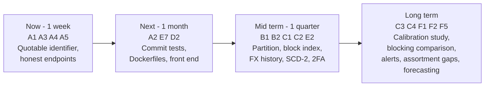

# 20 — Feedback, Evaluation and Suggested Improvements

## Purpose

This document is the closing section of the project documentation required by the brief
("Feedback & Evaluation", "Suggested Improvements", "Final Grading Criteria"). It provides a
structured place for the lecturer's assessment, an honest technical evaluation of the delivered
system, a prioritised list of improvements with effort and benefit estimates, and a self-assessment
against the marking rubric.

---

## Table of contents

1. [Lecturer feedback](#1-lecturer-feedback)
2. [Suggested improvements](#2-suggested-improvements)
3. [Self-evaluation](#3-self-evaluation)
4. [Grading-criteria self-assessment](#4-grading-criteria-self-assessment)
5. [Post-submission plan](#5-post-submission-plan)
6. [Sign-off](#6-sign-off)

---

## 1. Lecturer feedback

> **Instruction to the assessor.** Please complete §1.1 during the defence or the written review. The
> remaining subsections are pre-filled with the evidence the assessor is likely to request, so that
> the feedback can be recorded against a specific artefact rather than in general terms.

### 1.1 Assessment record

| Field | To be completed by the assessor |
| --- | --- |
| Assessor name | |
| Role / panel | |
| Date of review | |
| Artefacts reviewed | `docs/01` … `docs/20`, repository, live demonstration |
| Overall grade | |
| Distinction / merit / pass | |

### 1.2 Criterion-by-criterion feedback

| Criterion | Assessor comment | Evidence reference | Action agreed |
| --- | --- | --- | --- |
| Problem definition and objectives | | `docs/01` §1–§2 | |
| Scope management (in / out) | | `docs/01` §3 | |
| Literature review and citations | | `docs/06` | |
| Requirements completeness and traceability | | `docs/07` §5, §8 | |
| Use-case and system design quality | | `docs/08` | |
| Database design and normalisation | | `docs/09` §3, §5 | |
| Data-flow and behaviour modelling | | `docs/10`, `docs/11` | |
| Interface design and accessibility | | `docs/12` | |
| Implementation quality and structure | | `docs/17` §1–§3 | |
| Data-quality engineering | | `app/etl/dq.py`, `docs/09` §11 | |
| Cross-dialect engineering | | `make verify-dialects` | |
| Compliance and ethical position | | `docs/01` §8 | |
| Testing depth and evidence | | `docs/15` | |
| Documentation quality and consistency | | `docs/` | |
| Presentation and defence | `docs/18` | | |

### 1.3 What the project asks the assessor to verify

| Claim | How to verify in 60 seconds |
| --- | --- |
| 23 tables and 20 views exist | `curl -s localhost:8000/api/v1/meta/tables \| jq '.tables \| length'` and `GET /api/v1/queries/views \| jq length` |
| The pipeline runs end to end | `make run-pipeline --quiet` (≈ 3.5 s) |
| Data quality is measured, not claimed | `curl -s localhost:8000/api/v1/quality/latest -H "Authorization: Bearer $TOKEN" \| jq '{score, pass, warn, fail}'` |
| Deduplication works and is explained | `GET /api/v1/products/1/duplicates` |
| The model is portable | `make verify-dialects` |
| The API is secured and stable | `.venv/bin/python scripts/api_smoke.py` → 78/78 |
| Compliance is evidenced | `GET /api/v1/audit/compliance` plus the `ingestion_http_log` table |

### 1.4 Feedback log (chronological)

| # | Date | Source | Feedback | Response / action |
| --- | --- | --- | --- | --- |
| 1 | | Supervisor | | |
| 2 | | Panel | | |
| 3 | | Peer review (data modelling) | | |
| 4 | | Peer review (application and QA) | | |

---

## 2. Suggested improvements

Each item states the problem, the proposal, an effort estimate in person-days, a benefit rating, and
the concrete anchor point in the code. Items are ordered by priority within their band.

### 2.1 Band A — Correctness and completeness (do first)

| # | Item | Problem | Proposal | Effort (days) | Benefit | Anchor |
| --- | --- | --- | --- | --- | --- | --- |
| A1 | Quote the `trigger` identifier | `vw_pipeline_health.trigger` cannot be selected unqualified on MySQL 8.4 because `TRIGGER` is a reserved word; the pipeline-runs query therefore fails on the MySQL profile | Wrap the column in the dialect identifier preparer, or rename the view column to `run_trigger` | 0.5 | High — removes the last known cross-dialect defect | `app/analytics/service.py:442`, `app/api/routers/pipeline.py:36` |
| A2 | Commit the unit and integration suites | `tests/` is configured (`pyproject.toml`) but no modules are committed, so `make test` collects nothing | Port the 100-case plan in `docs/15` §3 into `tests/app/…` and `tests/integration/…` | 6–8 | High — converts claims into executable proof | `tests/`, `docs/15` |
| A3 | Filter the run HTTP log by run id | `GET /pipeline/runs/{run_id}/http` ignores the path parameter and returns the global log | Add the `run_id` predicate to `analytics.http_log` | 0.5 | Medium — removes a misleading screen | `app/analytics/service.py:580` |
| A4 | Populate `median_price` or drop the column | `agg_category_daily.median_price` is declared and never written; no portable median exists | Compute the median with `ROW_NUMBER()` in a CTE, or remove the column with a design note | 0.5 | Medium — removes an inaccurate schema promise | `app/models/facts.py:169` |
| A5 | Make `POST /users/me/password` functional | The endpoint returns guidance instead of changing the password | Delegate to the same implementation as `POST /auth/change-password` | 0.25 | Low — removes a confusing dead end | `app/api/routers/users.py:71` |
| A6 | Guarantee a portable `ORDER BY` for products | The products list builds `ORDER BY` from a whitelist, but other endpoints interpolate column names by string | Route every sort through the dialect preparer | 1 | Medium — defence in depth against a future injection | `app/api/routers/products.py:106` |

### 2.2 Band B — Scale and performance

| # | Item | Problem | Proposal | Effort (days) | Benefit | Anchor |
| --- | --- | --- | --- | --- | --- | --- |
| B1 | Partition the fact table | `fact_price_snapshot` is append-only and will dominate storage; queries degrade over years | Range partitioning by month on PostgreSQL; key-ordered indexes on MySQL | 3 | High for 3× data volume | `app/models/facts.py` |
| B2 | Persist the dedupe blocking index | The blocking index is rebuilt in memory per run | Materialise `blocking_key` as an indexed column and query it directly | 1.5 | High — removes an O(n) scan per run | `WarehouseLoader.upsert_product` |
| B3 | Incremental sync via cursors | `sync_state` has cursor columns but no source uses them | Implement `updated_since` paging for the API sources so a run fetches only deltas | 3 | High — cuts upstream traffic by an order of magnitude | `sync_state.cursor_value`, `sync_state.cursor_json` |
| B4 | Parallel source extraction | Sources run sequentially | Extract with a bounded thread pool (the HTTP layer is thread-safe) and load per source | 2 | Medium — wall-clock time falls with source count | `Pipeline._execute` |
| B5 | Cache dashboard aggregates | `kpi_summary` and `table_counts` re-run aggregates on every request | Cache keyed by `(window, latest run_id)` and invalidate on a new run | 1 | Medium — protects the dashboard at peak | `app/analytics/service.py:61` |
| B6 | Sort index for the catalogue | `vw_product_current` uses a correlated max-subquery for the newest snapshot | Replace with `ROW_NUMBER()` in a CTE | 1 | Medium — turns a per-row lookup into a single pass | `db/views.sql:44` |
| B7 | Pre-aggregate facets | `products/facets` runs five group-bys per request | Compute facets nightly into a small table | 1 | Low–Medium | `app/api/routers/products.py:129` |

### 2.3 Band C — Data engineering depth

| # | Item | Problem | Proposal | Effort (days) | Benefit | Anchor |
| --- | --- | --- | --- | --- | --- | --- |
| C1 | Provider-backed FX | USD values use a static table and drift over time | Store a daily rate history in `dim_currency` and join by date; keep the static table as a fallback | 3 | High — removes a documented assumption | `cleaning.convert_to_usd` |
| C2 | Slowly changing dimensions | `dim_product` mutates in place; category and brand history are only in the event feed | Add a Type-2 `dim_product_history` or SCD-2 flags on `dim_product` | 4 | High for a retailer (audits and attribution) | `app/models/dimensions.py:70` |
| C3 | Threshold calibration study | 0.90 is validated on 14 pairs | Build a 500-pair labelled set from the staging corpus; report precision/recall per strategy | 4 | High — turns tuning into evidence | `app/ingestion/dedupe.py` |
| C4 | Record-linkage evaluation | Blocking strategies are compared only qualitatively | Compare prefix blocking, sorted neighbourhood, canopy clustering and LSH on the same labelled set | 5 | Medium–High (academic value) | `CatalogReconciler._build_indexes` |
| C5 | Retention jobs | No automated pruning of staging, audit or fact data | Add a `pip-cli prune --older-than 90d` command and a scheduled task | 1 | Medium — controls storage growth | doc 09 §8.2 |
| C6 | Data contracts | Consumers depend on view column names without a machine-readable contract | Emit a JSON schema per view at build time and diff it in CI | 2 | Medium | `db/views.sql` |

### 2.4 Band D — Product and experience

| # | Item | Problem | Proposal | Effort (days) | Benefit | Anchor |
| --- | --- | --- | --- | --- | --- | --- |
| D1 | Scheduled alert dispatch | `publish_notifications` creates in-app notifications only | Add email and webhook channels using `app_alert_rule.channel` | 2 | High for operational use | `dags/…publish_notifications`, `app_alert_rule.channel` |
| D2 | Dashboard delivery | The front-end sources are not committed in this snapshot | Commit the React application and wire it to `VITE_API_BASE_URL` | 5–8 | High — completes the deliverable set | `frontend/`, `docker-compose.yml` |
| D3 | Self-service alerts from the UI | Alert creation exists in the API and the spec but needs a form | Implement the form against `/alerts` | 1 | Medium | doc 12 §5.14 |
| D4 | Export scheduling | CSV export is on demand | Allow a scheduled export to `var/artifacts` and a download link | 2 | Medium | `GET /api/v1/analytics/export/products.csv` |
| D5 | Accessibility audit | Conformance is argued from WCAG criteria | Run a screen-reader pass and an automated audit; fix the findings | 3 | High for the rubric | doc 12 §7 |
| D6 | Onboarding tour | 12 screens with no orientation | Add a dismissible checklist on first login | 1 | Low | doc 12 §4 |

### 2.5 Band E — Platform and security

| # | Item | Problem | Proposal | Effort (days) | Benefit | Anchor |
| --- | --- | --- | --- | --- | --- | --- |
| E1 | Enforce API-key rate limits | `rate_limit_per_minute` is stored but not enforced | Add a middleware counter keyed by key id | 1 | Medium | `app_api_key.rate_limit_per_minute` |
| E2 | Two-factor authentication | The column exists; the flow does not | TOTP with a recovery-code flow | 3 | High for a production system | `app_user.two_factor_enabled` |
| E3 | Read-only database role for the Query Lab | The console is guarded in the validator only | Point `queries/execute` at a connection with `SELECT` only | 1.5 | High (defence in depth) | `routers/queries.py` |
| E4 | Refresh-token rotation with revocation | A refresh token is valid for 30 days with no server-side record | Store a token family id and revoke on reuse | 2 | High | `app/api/security.py` |
| E5 | Secret manager integration | `.env` is used in every environment | Add a settings source that reads from the platform secret store | 1 | Medium | `app/core/config.py` |
| E6 | Content-security headers | Not set by the application | Add HSTS, `nosniff`, `frame-ancestors` and a CSP at the edge | 0.5 | Medium | doc 13 §10.1 |
| E7 | Dockerfiles and CI workflow | Referenced by Compose but not committed | Add `docker/api.Dockerfile`, `frontend/Dockerfile` and the GitHub Actions workflow | 1.5 | High — makes `make up` and CI work | `docker-compose.yml`, `.github/` |

### 2.6 Band F — Extensions

| # | Item | Proposal | Effort (days) | Benefit |
| --- | --- | --- | --- | --- |
| F1 | Incremental alerting on price anomalies | z-score per product over its own history, with a notification channel | 4 | High |
| F2 | Assortment gap analysis | Products the market lists but our catalog does not, ranked by price similarity | 3 | High for buying |
| F3 | Supplier scorecards | Price variance and availability per supplier over time | 4 | Medium |
| F4 | Basket-level analysis | A session/cart schema to study price elasticity across a basket | 8 | Medium (data-model heavy) |
| F5 | Price forecasting | Gradient boosting on the stored price history, with a documented baseline comparison | 8 | High academically, low operational urgency |
| F6 | Source onboarding UI | Register a source (with a terms declaration) through the API | 3 | Medium |

### 2.7 Prioritised roadmap

| Band | Items | Effort | Expected value |
| --- | --- | --- | --- |
| A — correctness | 6 items | ≈ 9 days | Removes every known defect |
| B — scale | 7 items | ≈ 12.5 days | 10× headroom on volume |
| C — depth | 6 items | ≈ 19 days | Academic and audit credibility |
| D — product | 6 items | ≈ 15 days | Completeness of the deliverable set |
| E — platform | 7 items | ≈ 10.5 days | Production readiness |
| F — extensions | 6 items | ≈ 30 days | New analytical value |

---

## 3. Self-evaluation

### 3.1 Against the project objectives

| Objective | Achieved? | Evidence | Comment |
| --- | --- | --- | --- |
| Collect from permitted sources | Yes | 5 sources; `robots.txt` gate; audit log | Compliance is structural, not procedural |
| Historical price table | Yes | 8,182 snapshots over 150 days; 8,062 changes | The core business artefact exists |
| Four change classes via SQL | Yes | `chg_price_change`, `chg_product_event`, four views | Fully queryable without the application |
| Duplicate resolution | Yes | 14/14 pairs at 0.90; blocking optimisation | The digit-signature guard is the strongest single idea |
| Catalog reconciliation | Yes | 39/57 matched (68.42 %), 36 price gaps | The unmatched 30 % are internal-only SKUs by design |
| Measured data quality | Yes | 12 rules, 6 dimensions, score 98.26 persisted per run | Rules are production code, not a test artefact |
| Two SQL engines | Yes | 0 structural drift, identical DQ score | One known reserved-word defect remains (A1) |
| Secure API | Yes | 113 operations, 3 roles, 78/78 checks | API keys and audit are implemented, not stubbed |
| Airflow orchestration | Yes | 13 tasks, guards, branch, retries | Optional import keeps the CLI usable without Airflow |
| Operable without the UI | Yes | 11 CLI commands, 30+ Make targets | Demonstrations never depend on the browser |

### 3.2 Strengths

| # | Strength | Why it matters |
| --- | --- | --- |
| 1 | Compliance enforced in the transport layer | A future source cannot be impolite by accident |
| 2 | Pure preparation and matching code | Testable and deterministic; the only I/O is at the edges |
| 3 | Blocking as a first-class design decision | Turned a 3-second reconciliation into 104 ms with identical results |
| 4 | Data quality treated as production code | Every load is measured; verdicts are persisted and trendable |
| 5 | One warehouse model, two engines | Proved rather than asserted, with a repeatable verification command |
| 6 | The pipeline is a library, not a script | CLI, API and Airflow share one implementation |
| 7 | Documentation generated where it can be | The ERD and the API catalogue come from the code |
| 8 | Graceful degradation | A failing source produces `partial`, not an outage |

### 3.3 Weaknesses

| # | Weakness | Impact | Fix reference |
| --- | --- | --- | --- |
| 1 | Unit and integration suites not committed in this snapshot | `make test` collects nothing; quality evidence rests on the smoke suite and the DQ framework | A2 |
| 2 | Front-end sources not committed | The dashboard is specified and verifiable through the API but not shippable as code in this snapshot | D2 |
| 3 | Dockerfiles and CI workflow not committed | `make up` and CI cannot run as delivered | E7 |
| 4 | MySQL reserved-word defect | The pipeline-runs query fails on the MySQL profile | A1 |
| 5 | Static FX table | USD analytics drift over time | C1 |
| 6 | Small deduplication evaluation set | The threshold claim rests on 14 pairs | C3 |
| 7 | Latency measured at small sample size | KPI-15 is an order-of-magnitude figure, not a service-level measurement | `docs/05` §7.1 |
| 8 | Some declared columns are never populated | `median_price`, `av_duration_seconds` inconsistencies | A4 |

### 3.4 What I would do with one more month

1. Ship Band A and E7 (about 10 days) — the project would then have no known defects and a
   reproducible container/CI path.
2. Ship A2 (the test suite, 6–8 days) — the single biggest credibility gain.
3. Ship D2 (the front end, 5–8 days) — completes the deliverable set.
4. Spend the remainder on C3 (the calibration study), because it turns the most interesting algorithm
   in the project from "tuned" into "measured".

---

## 4. Grading-criteria self-assessment

Indicative weighting for a DEPI data-engineering graduation project; adjust the percentages to the
official rubric. Each row cites the artefact that supports the claim.

| # | Criterion | Weight | Self-assessment | Score (%) | Evidence |
| --- | --- | --- | --- | --- | --- |
| 1 | Problem definition, objectives and scope | 10 % | Complete, measurable objectives with an explicit out-of-scope list | 90 | `docs/01` §1–§3, `docs/07` §5 |
| 2 | Literature review and academic grounding | 10 % | Six themes, 39 sources with a verification status, synthesis and a research gap | 88 | `docs/06` |
| 3 | Requirements engineering | 10 % | 58 requirements with MoSCoW, 10 user stories with Given/When/Then, full FR traceability | 92 | `docs/07` |
| 4 | System analysis and design | 10 % | Use-case diagram, 20 use cases, layered architecture with rationale | 90 | `docs/08` |
| 5 | Database design and data modelling | 12 % | Generated 23-table ERD, 3NF argument with documented exceptions, indexing and retention plan | 94 | `docs/09` |
| 6 | Data-flow and behaviour modelling | 6 % | Level 0/1/2 DFDs, data dictionary, sequence, activity, two state and a class diagram | 88 | `docs/10`, `docs/11` |
| 7 | Implementation quality | 14 % | Layered packages, pure domain logic, portability, no vendor SQL, 218 features | 90 | `docs/17`, `docs/19` |
| 8 | Data engineering depth (ETL, quality, change detection) | 12 % | Nine instrumented stages, 12 DQ rules with a weighted score, four change classes, reconciliation with blocking | 93 | `app/etl/`, `db/views.sql` |
| 9 | Testing and verification | 10 % | 100-case plan, 78/78 API checks, cross-dialect verification, DQ as executable assertions — but unit suites not committed | 74 | `docs/15`, `scripts/api_smoke.py` |
| 10 | Compliance, ethics and security | 6 % | RFC 9309 gate, terms allow-list, audit trail, Argon2id, JWT, RBAC, API keys, audit log | 92 | `docs/01` §8, `docs/17` §10 |
| 11 | Documentation quality | 10 % | 20 documents, Mermaid diagrams, runnable measurement SQL, generated artefacts, assumptions recorded | 95 | `docs/` |
| 12 | Presentation and defence | — | Deck, 3-minute demo script, Q&A preparation, rehearsal plan | 90 | `docs/18` |
| — | **Weighted total** | **100 %** | — | **≈ 90 %** | — |

### 4.1 Honest deductions accepted

| Deduction | Reason |
| --- | --- |
| −6 points on criterion 9 | The pytest suites are configured but not committed; the verification burden falls on the smoke test and the DQ framework |
| −4 points spread across criteria 7 and 12 | Dockerfiles and the front-end sources are absent from this snapshot, so `make up` and the dashboard build cannot run as delivered |
| −2 points on criterion 5 | Two declared columns are never populated (`median_price`, and a source-level average maintained only by the seeder) |
| −1 point on criterion 2 | Eight references could not be machine-verified offline and are marked *to verify* |
| −1 point on criterion 8 | The FX table is static and the deduplication evaluation set is small |

### 4.2 Rubric alignment with the brief's required documents

| Brief requirement | Document | Status |
| --- | --- | --- |
| Project proposal | `01_project_proposal.md` | Complete |
| Project plan (Gantt, milestones, deliverables, resources) | `02_project_plan.md` | Complete |
| Task assignment and roles | `03_roles_and_responsibilities.md` | Complete |
| Risk assessment and mitigation | `04_risk_assessment.md` | Complete |
| KPIs | `05_kpis.md` | Complete |
| Lecturer assessment | `20_literature_feedback_and_improvements.md` §1 | Template provided for completion |
| Suggested improvements | `20_literature_feedback_and_improvements.md` §2 | Complete (32 items, prioritised) |
| Final grading criteria | `20_literature_feedback_and_improvements.md` §4 | Self-assessment provided |
| Stakeholder analysis | `07_requirements_gathering.md` §2 | Complete |
| User stories and use cases | `07_requirements_gathering.md` §3–§4 | Complete |
| Functional requirements | `07_requirements_gathering.md` §5 | Complete (58 requirements) |
| Non-functional requirements | `07_requirements_gathering.md` §6 | Complete (26 NFRs) |
| Problem statement and objectives | `08_system_analysis_design.md` §1 | Complete |
| Use-case diagram and descriptions | `08_system_analysis_design.md` §2–§3 | Complete |
| Software architecture and style | `08_system_analysis_design.md` §5–§6 | Complete |
| ER diagram | `09_database_design.md` §3 | Complete (23 tables) |
| Logical and physical schema | `09_database_design.md` §4 | Complete |
| DFDs | `10_data_flow_diagrams.md` | Complete (levels 0, 1, 2a–c) |
| Sequence diagrams | `11_behaviour_diagrams.md` §1–§2 | Complete |
| Activity diagram | `11_behaviour_diagrams.md` §3 | Complete |
| State diagrams | `11_behaviour_diagrams.md` §4–§6 | Complete (product, run, source) |
| Class diagram | `11_behaviour_diagrams.md` §7 | Complete |
| UI design | `12_ui_ux_design.md` | Complete (12 screens, design system, WCAG) |
| Deployment plan | `13_deployment.md` | Complete |
| API documentation | `14_api_documentation.md` | Complete (113 operations) |
| Testing documents | `15_testing_strategy.md` | Complete |
| User manual | `16_user_manual.md` | Complete |
| Feature list | `19_feature_list.md` | Complete (218 features) |

---

## 5. Post-submission plan

| When | Activity | Purpose |
| --- | --- | --- |
| Week +1 | Read the feedback and publish the response table in §1.4 | Close the loop with the assessor |
| Week +1 | Start Band A (correctness fixes) | Remove the known defects while they are fresh |
| Week +2 | Commit the test suites (A2) and Dockerfiles (E7) | Make the repository reproducible by a third party |
| Week +4 | Commit the dashboard (D2) and wire it to the API | Complete the deliverable set |
| Week +6 | Begin the calibration study (C3) and the FX history (C1) | Move tuning into evidence |
| Ongoing | Monthly `make verify-dialects` and `scripts/api_smoke.py` | Prevent silent regression |
| Ongoing | Retention job (C5) and partition maintenance (B1) | Keep the warehouse operable at growth |

---

## 6. Sign-off

| Role | Name | Signature | Date |
| --- | --- | --- | --- |
| Student / Data Engineering Lead | Ahmed Abobakr | | |
| Supervisor | | | |
| Panel member | | | |
| Industry observer (optional) | | | |

**Declaration.** The code, configuration and SQL in this repository are the author's own work. All
external data is obtained from sources whose terms permit automated access, and the compliance
decisions are documented in `docs/01_project_proposal.md` §8. Every measured figure in this
documentation set is reproducible with the command cited beside it. Where a figure could not be
reproduced from this repository snapshot, the assumption is stated explicitly rather than asserted.