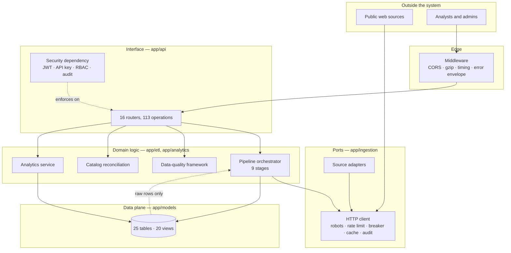
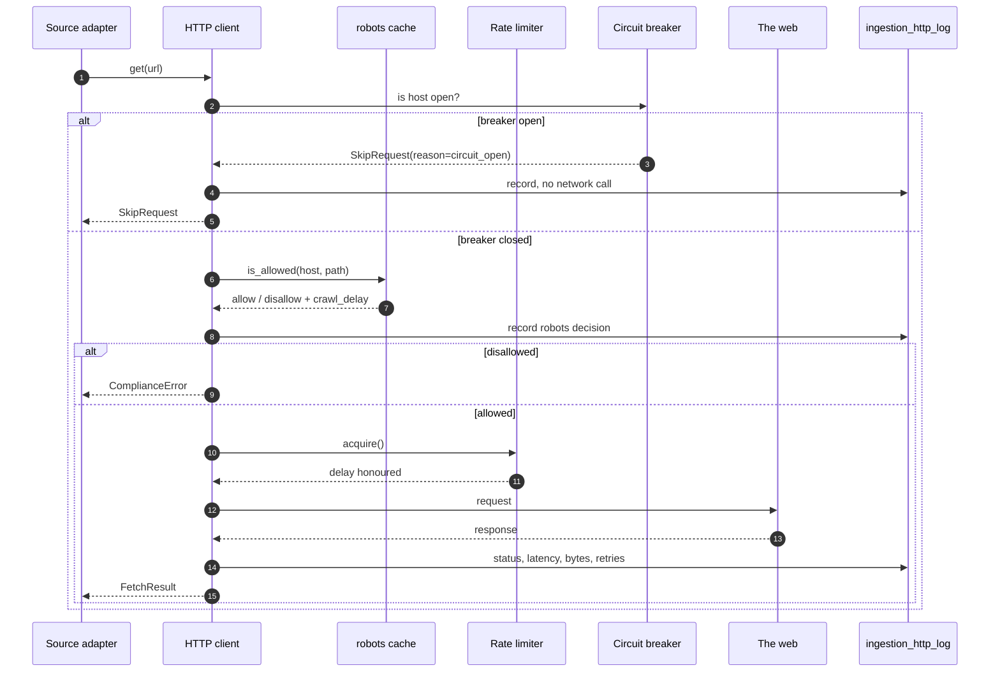
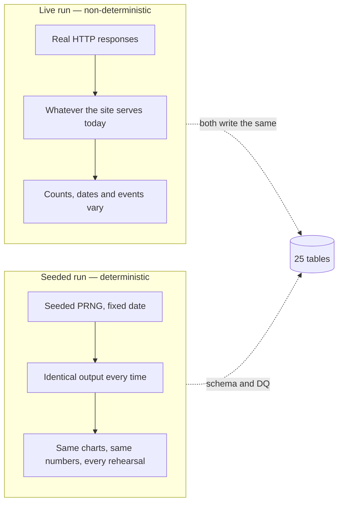
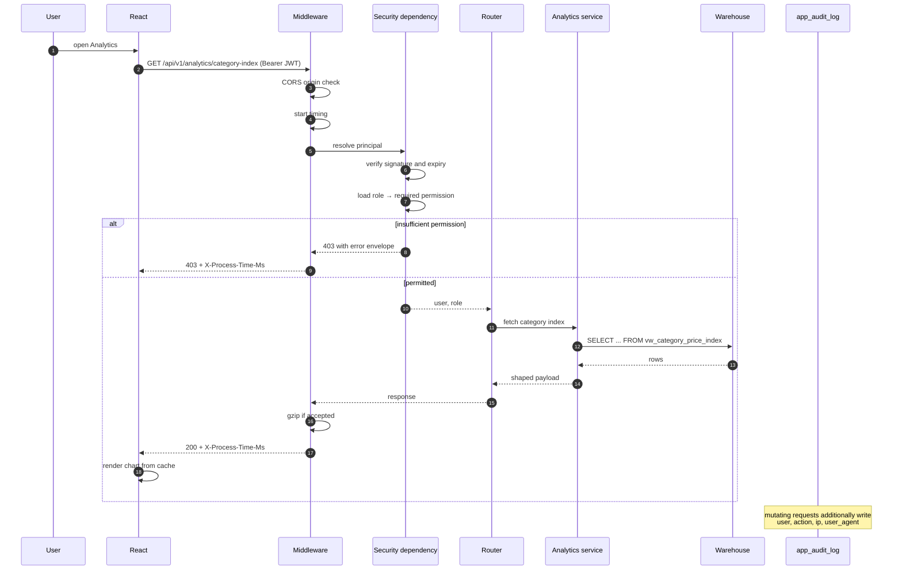
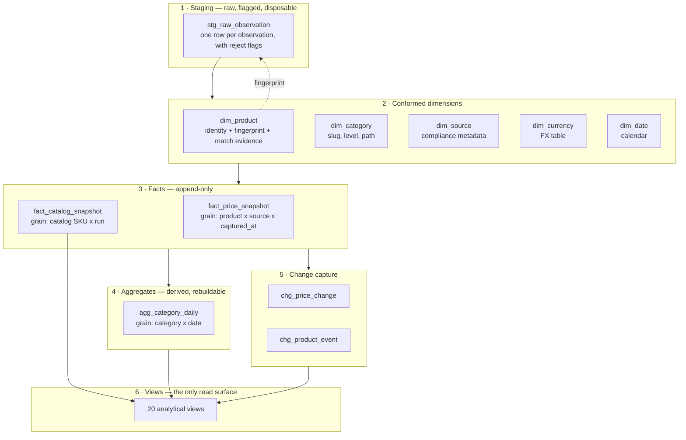
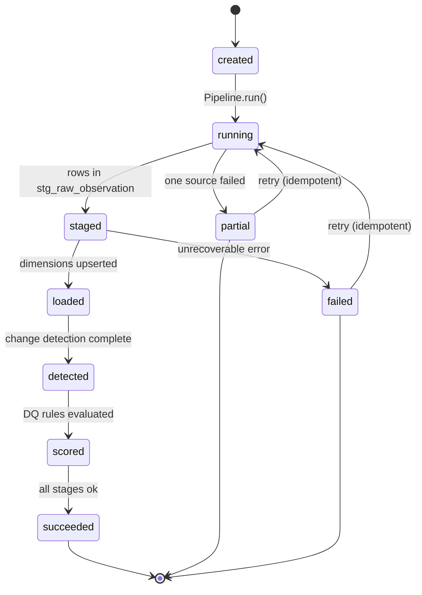

# Architecture Deep Dive

Companion to [08_system_analysis_design.md](08_system_analysis_design.md). That document records
*what* was designed; this one records *why*, including the alternatives that were rejected and the
measured consequences of each choice.

---

## 1. The design drivers

Five constraints drove every significant decision. They are listed in the order they were
encountered, because later constraints frequently narrowed earlier ones.

| # | Driver | Consequence |
| --- | --- | --- |
| 1 | The brief requires **two** relational engines | Every schema decision must be portable; no PostgreSQL-only types, no JSONB |
| 2 | The data comes from **the live web** | Compliance cannot be an afterthought — it has to sit in the transport layer |
| 3 | The project is **graded on evidence** | Every claim needs a runnable command; measurements are persisted, not asserted |
| 4 | Retail pricing needs **history**, not just state | Slowly-changing and snapshot thinking, not overwrite-in-place |
| 5 | It must be **demonstrable** in one sitting | Deterministic seeding and a one-command bootstrap |

---

## 2. Layer boundaries

The rule that keeps this honest: **`app/ingestion` never imports from `app/api`, and `app/api`
never imports from `app/ingestion`.** Dependencies point inward, toward the domain. The API can
trigger a pipeline run, but only through the pipeline's public `run()` method, exactly as Airflow
does — which is why the CLI, the Airflow DAG and the API all produce identical `etl_run` records.

---

## 3. Decisions and rejected alternatives

### 3.1 Compliance in the transport layer, not the source adapter

**Chosen.** `app/ingestion/http_client.py` is the only place in the codebase that performs an
outbound HTTP request. Every call passes the robots gate first.

**Rejected — checking robots per source adapter.** Each adapter would then own compliance, and a
new adapter could forget. With the gate in the transport layer, compliance is inherited
automatically; there is no code path that can bypass it.

**Rejected — a middleware or proxy.** An external filtering proxy is a real production pattern, but
it moves the evidence away from the run that made the request. Here, the robots decision is written
to `ingestion_http_log` on the same transaction as the data, so the Audit screen can answer "why was
this skipped?" from the run record itself.

### 3.2 Snapshot facts, not overwritten product rows

**Chosen.** `fact_price_snapshot` is append-only, one row per product per source per capture, with
`price`, `price_usd` and `fx_rate_to_usd` stored together.

**Rejected — updating `dim_product.price` in place.** Far cheaper to query, and it destroys the only
thing a price-intelligence product exists to provide. "What was it last Tuesday?" becomes
unanswerable.

The FX rate is stored *per snapshot* rather than read from a live rate table at query time. This is
deliberate: re-converting historical prices with today's rates silently rewrites history whenever a
currency moves. The rate in force at capture time is the only defensible number.

### 3.3 A Kimball star rather than a normalised third normal form

**Chosen.** Five conformed dimensions, two facts, one aggregate table.

**Rejected — 3NF for analytics.** Better for writes, worse for the questions being asked. Price
per category per day is a two-hop join in 3NF and a single scan in the star.

**Rejected — a flat denormalised table.** Fast, and unmaintainable. One schema change rewrites
history, and there is nowhere to attach slowly-changing attributes such as `dim_category.level`.

### 3.4 Deterministic seeding, because the project is demonstrated live

**Chosen.** `app/etl/seed.py` generates 150 days of price history with a seeded PRNG, including
realistic seasonality, promotions and lifecycle events.

A demo where the numbers move between rehearsals is a demo that cannot be rehearsed. Live
ingestion still exists and is fully exercised — it just is not what the presentation depends on.

### 3.5 Fuzzy matching with a blocking index, not a naive scan

**Chosen.** Four similarity signals combined over a candidate pool narrowed by blocking indexes.

**Rejected — compare every product to every other product.** Correct and quadratic. Measured at
2,975 ms for 57 catalog SKUs against the product set.

With blocking indexes, a rare-token fallback and a capped pool, the same comparison takes 104 ms
with **identical results** — a 29× improvement. The correctness of the output is unchanged, which
is what makes the optimisation legitimate rather than a trade.

### 3.6 Roles enforced server-side

**Chosen.** Every route declares its required permission through a dependency; the check is on the
server and cannot be skipped by calling the API directly.

**Rejected — UI-only permission checks.** Hiding a button is a usability feature, not a security
control. Anyone with a token could call the endpoint directly. The smoke suite asserts this by
confirming a `viewer` receives a denial when attempting to trigger a pipeline run.

### 3.7 A read-only query lab instead of a general SQL console

**Chosen.** The Query Lab accepts only a single `SELECT`, validates every identifier against a
whitelist, and clamps `LIMIT`.

**Rejected — a full SQL console.** It is a data-exfiltration primitive no matter how carefully it is
guarded, and it is unnecessary: twenty views already cover the analytical questions, and the
Builders cover ad-hoc composition safely.

---

## 4. The request lifecycle, end to end

What actually happens between a browser click and a rendered chart.

Four properties of this sequence are worth stating explicitly, because they are the difference
between a demo and a system:

1. **The permission check happens before the query**, not after the data is fetched.
2. **Timing is measured at the edge**, so slow endpoints are visible without a profiler.
3. **Errors use one envelope** — `error`, `message`, `details` — so the client has exactly one
   error shape to handle.
4. **The client caches aggressively and revalidates silently.** A repeat visit renders from cache
   before the network call even leaves.

---

## 5. Warehouse layering

Each layer has one job, and each is independently rebuildable:

| Layer | Mutable? | Rebuildable? | Contract |
| --- | --- | --- | --- |
| Staging | Yes, truncated per run | Yes, always | Accepts anything; records reject reasons |
| Dimensions | Upserted on natural keys | Yes | Exactly one row per identity |
| Facts | Never updated | Only by retention | Append-only; the historical record |
| Aggregates | Fully rebuilt | Yes | Derived; safe to drop and recompute |
| Change tables | Append-only | From facts | Reconstructed by comparing consecutive snapshots |
| Views | Never | Yes | The only surface the API and query lab read |

The staging layer exists so that a partially-failed run is inspectable. Rows that failed
cleaning are not silently dropped — they are staged with their flags, which is what makes the
DQ-012 rejection-rate rule measurable instead of anecdotal.

---

## 6. Idempotency and safe retries

A pipeline that cannot be re-run safely is a pipeline nobody trusts to re-run.

| Re-running is safe because | Mechanism |
| --- | --- |
| Dimensions merge on natural keys, never blind inserts | `dim_product` keyed by fingerprint; `dim_category` by slug |
| Staging is truncated per run | A retry never sees stale rows from a previous attempt |
| Facts are keyed by the natural grain | Re-ingesting the same observation updates that grain instead of duplicating |
| Change detection compares consecutive snapshots | Identical input produces no spurious changes |
| DQ verdicts are keyed by `(run_id, rule_id)` | Re-scoring replaces the verdict for that run |

A run's counters and stage timings live on the `etl_run` row, so `GET /pipeline/runs/{run_id}`
reconstructs exactly what happened — which is what makes a failed run debuggable after the fact.

---

## 7. Why the stack is what it is

| Layer | Choice | Alternative | Reason |
| --- | --- | --- | --- |
| API framework | FastAPI | Flask / Django | Typed request models, dependency-injected RBAC, generated OpenAPI — all three are requirements, not extras |
| ORM | SQLAlchemy 2.0 Core ORM | Raw SQL / Django ORM | One model definition, two dialects, portable DDL |
| Orchestration | Airflow | cron / Prefect / Celery | Named in the brief; DAG-level branching is used for real (`changes found?`) |
| Frontend | React 19 + Vite | Next.js / server-rendered | The dashboard is an internal analytical tool behind auth; SEO is irrelevant and a static bundle is simpler to deploy |
| Styling | Tailwind | CSS modules | Consistent dark mode without a parallel stylesheet to maintain |
| Tables | Hand-written SQL views | dbt | Views are read by the query lab and the API with equal fidelity; dbt would add a build layer for twenty objects |
| Migrations | SQLAlchemy metadata create | Alembic | The schema is created fresh per environment in this project; migration history is on the roadmap |

---

## 8. Known limitations

Stated plainly, because a design document that claims no limitations is not describing software.

| Limitation | Impact | Mitigation today | Planned |
| --- | --- | --- | --- |
| Single-tenant | One shared catalog space | Role-based scoping | Multi-tenant spaces on the roadmap |
| In-process caching only | Cache lost on restart | Disk response cache for HTTP | Redis backend |
| No incremental category history | Category drift computed between consecutive runs only | Drift matrix in the dashboard | SCD-2 |
| Airflow retries the whole task, not the stage | A late failure repeats early work | Stages are idempotent, so repeats are cheap | Per-stage task groups |
| No distributed tracing | Cross-service latency is inferred, not measured | Edge timing headers plus run-stage timings | OpenTelemetry |
| Query Lab scans views directly | A wide query can be slow | `LIMIT` clamp and statement timeout | Materialised summary tables |

---

## 9. Where to look in the code

| Question | File |
| --- | --- |
| What does a pipeline run do, stage by stage? | `app/etl/pipeline.py` |
| How is compliance enforced? | `app/ingestion/http_client.py`, `app/ingestion/robots.py`, `app/ingestion/ratelimit.py` |
| What exactly does the cleaner change? | `app/ingestion/cleaning.py` |
| How are duplicates decided? | `app/ingestion/dedupe.py` |
| What are the 12 quality rules? | `app/etl/dq.py` |
| How is the schema defined? | `app/models/` (`dimensions.py`, `facts.py`, `operations.py`, `catalog.py`, `app_users.py`) |
| What do the views compute? | `db/views.sql` |
| How is authorisation decided? | `app/api/security.py`, `app/api/deps.py` |
| What does the API expose? | `app/api/routers/` (16 files) |
| How is the DAG wired? | `dags/product_intelligence_pipeline.py` |