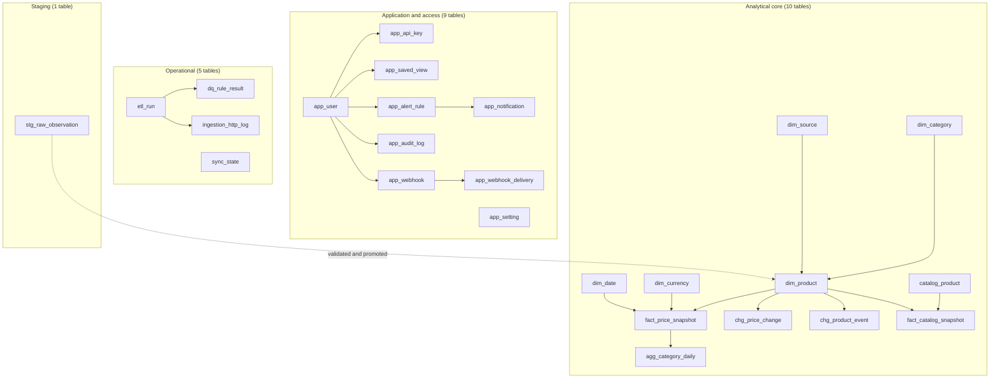

# Data Dictionary

Every table in the warehouse, every column, and what it means. Generated against the live SQLAlchemy
metadata, so it matches the code rather than a design intention.

Conventions used below:

- **PK** primary key · **FK** foreign key · **UQ** unique constraint
- `NUMERIC(18,4)` for money — never a float, so sums are exact
- `VARCHAR` lengths follow the physical model; the longest meaningful value is noted
- Timestamps are stored naive UTC; presentation timezones are applied at the edge
- `JSON` columns hold structures that are read as a whole, not queried field-by-field — which keeps
  the schema identical on PostgreSQL and MySQL (MySQL has no `JSONB`)

---

## 1. How the schema is organised



**25 tables** in total: 5 dimensions, 2 facts, 1 aggregate, 2 change tables, 1 staging table, 4
operational tables, 9 application tables (including the two webhook tables added in v1.3), 1 catalog
table. Plus **20 analytical views** in [db/views.sql](../db/views.sql).

---

## 2. Dimensions

### 2.1 `dim_product` — product identity

Grain: **one row per canonical product identity**. This is the conformed dimension every fact
points at.

| Column | Type | Null | Meaning |
| --- | --- | --- | --- |
| `product_id` | INTEGER | **PK** | Surrogate key, warehouse-internal |
| `source_product_id` | VARCHAR(128) | yes | Identifier as published by the source |
| `source_code` | VARCHAR(128) | FK | The source this identity came from |
| `canonical_name` | VARCHAR(512) | no | Cleaned, human-facing name |
| `normalized_name` | TEXT | no | Lowercased, punctuation-free comparison form |
| `display_name` | VARCHAR(512) | yes | Name shown in the UI when it differs from canonical |
| `brand` | VARCHAR(128) | yes | Extracted brand, normalised |
| `category_id` | INTEGER | FK | Resolved category |
| `product_url` | VARCHAR(2048) | yes | Canonical product page |
| `image_url` | VARCHAR(2048) | yes | Product image |
| `description` | TEXT | yes | Source description, stripped of HTML |
| `currency` | VARCHAR(128) | yes | Native currency of `current_price` |
| `current_price` | NUMERIC(18,4) | yes | Latest observed price, native currency |
| `previous_price` | NUMERIC(18,4) | yes | Previous observation, for inline deltas |
| `current_rating` | FLOAT | yes | Latest rating, 0–5 |
| `rating_count` | INTEGER | yes | How many ratings the rating is based on |
| `availability` | VARCHAR(128) | yes | Normalised vocabulary, see §8 |
| `fingerprint` | VARCHAR(128) | **UQ** | Deterministic identity key — see §2.1.1 |
| `match_strategy` | VARCHAR(128) | yes | How the identity was established: `fingerprint`, `sku`, `fuzzy`, `manual` |
| `match_score` | FLOAT | yes | Similarity score when the strategy was fuzzy |
| `matched_product_id` | INTEGER | FK | The surviving product when this row was merged away |
| `is_active` | BOOLEAN | no | Seen in the most recent run |
| `version` | INTEGER | no | Increments on every update; a cheap optimistic-concurrency check |
| `observation_count` | INTEGER | no | Lifetime count of snapshots for this identity |
| `first_seen_at` | DATETIME | no | First ever sighting |
| `last_seen_at` | DATETIME | no | Most recent sighting |
| `extra` | JSON | yes | Source-specific fields with no home in the core model |

#### 2.1.1 The fingerprint

`fingerprint` is the single most important column in the warehouse. It is a deterministic hash of
the cleaned name, the brand and a digit signature, and it is what makes the load **idempotent**:
re-running the same data merges onto the same row instead of creating a duplicate.

```
fingerprint = hash( normalized_name | brand | digit_signature )
```

Consequences worth knowing:

- The same product from two sources gets two rows unless fuzzy matching merges them — which is why
  `matched_product_id` and `match_score` exist and why the dashboard exposes duplicate candidates.
- Changing the fingerprint algorithm is a **breaking schema change**; existing rows would no longer
  merge. It is versioned deliberately.

### 2.2 `dim_category` — taxonomy

| Column | Type | Null | Meaning |
| --- | --- | --- | --- |
| `category_id` | INTEGER | **PK** | Surrogate key |
| `name` | VARCHAR(512) | no | Cleaned category name |
| `slug` | VARCHAR(128) | **UQ** | URL-safe form; the natural key for merges |
| `parent_id` | INTEGER | FK | Self-referencing parent; enables the tree view |
| `level` | SMALLINT | no | Depth in the taxonomy, 1-based |
| `path` | VARCHAR(512) | yes | Full ancestry, e.g. `electronics/audio/headphones` |
| `source_category_raw` | VARCHAR(512) | yes | The unnormalised label as published |
| `product_count` | INTEGER | no | Denormalised count, refreshed per run |
| `avg_price` | NUMERIC(18,4) | yes | Denormalised average, refreshed per run |
| `created_at` / `updated_at` | DATETIME | no | Audit timestamps |

`product_count` and `avg_price` are deliberate denormalisations: they turn a screen that would
otherwise aggregate the fact table on every request into an indexed read. They are recomputed by
`build_aggregates`, never incrementally patched, so they cannot drift.

### 2.3 `dim_source` — the ingestion registry

This table is the compliance record as much as a dimension. It answers "what may we fetch, from
where, how often, and what did we actually get?"

| Column | Type | Null | Meaning |
| --- | --- | --- | --- |
| `source_code` | VARCHAR(128) | **PK** | Short code, e.g. `dummyjson`, `fakestore` |
| `name` | VARCHAR(512) | no | Display name |
| `kind` | VARCHAR(128) | no | `api`, `html`, `local` |
| `base_url` | VARCHAR(2048) | no | Entry point |
| `robots_url` | VARCHAR(2048) | yes | Where robots.txt is fetched from |
| `terms_url` | VARCHAR(2048) | yes | Terms of service, recorded for the ethics section |
| `license_note` | TEXT | yes | Licence or usage note |
| `rate_limit_per_minute` | INTEGER | no | Ceiling enforced by the token bucket |
| `min_delay_seconds` | FLOAT | no | Floor delay between requests, even if robots.txt declares none |
| `enabled` | BOOLEAN | no | Operator switch |
| `terms_allowed` | BOOLEAN | no | Whether the terms permit this use |
| `robots_checked_at` | DATETIME | yes | When robots.txt was last evaluated |
| `last_run_id` / `last_run_at` | | yes | Most recent attempt |
| `total_records` | BIGINT | no | Lifetime records extracted |
| `total_runs` | INTEGER | no | Lifetime run count |
| `success_rate_pct` | FLOAT | no | Rolling success rate — drives the Sources screen |
| `avg_duration_seconds` | FLOAT | no | Rolling mean duration |
| `config` | JSON | yes | Source-specific settings |

### 2.4 `dim_currency`

| Column | Type | Null | Meaning |
| --- | --- | --- | --- |
| `currency_code` | VARCHAR(128) | **PK** | ISO 4217 code |
| `currency_name` | VARCHAR(128) | no | Display name |
| `symbol` | VARCHAR(8) | yes | Symbol where one exists |
| `rate_to_usd` | NUMERIC(18,6) | no | Conversion rate, precision matters |
| `rate_source` | VARCHAR(128) | yes | Where the rate came from — `offline_table` for this project |
| `as_of` | DATE | yes | Date the rate was accurate for |

The project uses an **offline FX table** deliberately: a pipeline that depends on a third-party
rates API cannot run when that API is down, and cannot reproduce a historical run. Each snapshot
stores the rate actually used (see `fact_price_snapshot.fx_rate_to_usd`), so history is stable even
if this table is later updated.

### 2.5 `dim_date`

A conventional calendar dimension with no gaps and no duplicates.

| Column | Type | Null | Meaning |
| --- | --- | --- | --- |
| `date_id` | INTEGER | **PK** | `YYYYMMDD` as an integer |
| `full_date` | DATE | no | The date itself |
| `year`, `quarter`, `month`, `day` | SMALLINT | no | Calendar parts |
| `month_name`, `day_name` | VARCHAR(128) | yes | Pre-formatted names, so the UI needs no date library |
| `week_of_year`, `iso_week` | SMALLINT | yes | ISO-8601 week numbering |
| `is_weekend` | BOOLEAN | no | Saturday or Sunday |
| `is_month_start`, `is_month_end` | BOOLEAN | no | Calendar boundaries |

`date_id` as `YYYYMMDD` rather than a sequence means a fact row is self-describing in a `SELECT`,
which makes debugging considerably easier.

---

## 3. Facts

### 3.1 `fact_price_snapshot`

Grain: **one row per product × source × capture moment**. Append-only — this table is never updated
after insert.

| Column | Type | Null | Meaning |
| --- | --- | --- | --- |
| `snapshot_id` | INTEGER | **PK** | Surrogate key |
| `product_id` | INTEGER | FK | Conform dimension |
| `source_code` | VARCHAR(128) | FK | Conform dimension |
| `run_id` | VARCHAR(128) | FK | Which run produced it |
| `date_id` | INTEGER | FK | Conform dimension |
| `captured_at` | DATETIME | no | When the source reported the value |
| `ingested_at` | DATETIME | no | When we stored it |
| `price` | NUMERIC(18,4) | yes | Native price as published |
| `list_price` | NUMERIC(18,4) | yes | Pre-discount price when the source exposes one |
| `currency` | VARCHAR(128) | FK | Native currency |
| `fx_rate_to_usd` | NUMERIC(18,6) | no | **The rate used for this row** |
| `price_usd` | NUMERIC(18,4) | yes | Converted price |
| `discount_pct` | FLOAT | yes | Derived from `list_price` and `price` |
| `rating` | FLOAT | yes | 0–5, or null |
| `rating_count` | INTEGER | yes | Sample size behind the rating |
| `availability` | VARCHAR(128) | yes | Normalised vocabulary |
| `in_stock` | BOOLEAN | yes | Derived boolean, for fast filtering |
| `price_change_abs` | NUMERIC(18,4) | yes | Change vs the previous snapshot |
| `price_change_pct` | FLOAT | yes | Percentage change vs the previous snapshot |
| `is_first_sighting` | BOOLEAN | no | True on the product's first ever appearance |
| `product_url` | VARCHAR(2048) | yes | URL as captured, even if the product has since moved |
| `raw_price_text` | VARCHAR(128) | yes | **The original string** before parsing |
| `quality_flags` | JSON | yes | Flags raised by the cleaner and DQ framework |

Two columns carry more weight than they appear to:

- **`raw_price_text`** makes price-parsing bugs diagnosable after the fact. When `price` is wrong,
  the original string that produced it is still there.
- **`fx_rate_to_usd`** makes the USD column reproducible. Changing `dim_currency` does not rewrite
  history, because history already knows the rate it used.

### 3.2 `fact_catalog_snapshot`

Grain: **one row per catalog SKU × run**. This is where the retailer's own catalog meets the
scraped market.

| Column | Type | Null | Meaning |
| --- | --- | --- | --- |
| `match_id` | INTEGER | **PK** | Surrogate key |
| `run_id` | VARCHAR(128) | FK | Which run produced it |
| `catalog_sku` | VARCHAR(128) | FK | Internal SKU |
| `product_id` | INTEGER | FK | Matched market product, null when unmatched |
| `source_code` | VARCHAR(128) | yes | Source of the match |
| `date_id` | INTEGER | FK | Conform dimension |
| `match_status` | VARCHAR(128) | no | `matched`, `unmatched`, `ambiguous` |
| `match_strategy` | VARCHAR(128) | yes | `sku_exact`, `fingerprint`, `fuzzy`, `none` |
| `similarity_score` | FLOAT | yes | Score for the chosen match |
| `scraped_name` / `catalog_name` | TEXT | yes | Both sides retained, so a bad match is visible |
| `scraped_price` / `catalog_price` | NUMERIC(18,4) | yes | Both sides of the comparison |
| `price_gap_abs` | NUMERIC(18,4) | yes | Absolute difference |
| `price_gap_pct` | FLOAT | yes | Gap as a percentage of the catalog price |
| `category_match` / `brand_match` | BOOLEAN | yes | Independent agreement signals |
| `is_price_mismatch` | BOOLEAN | no | Gap beyond the configured tolerance |
| `matched_at` | DATETIME | no | When the comparison ran |
| `details` | JSON | yes | Evidence for the decision |

`price_gap_pct` positive means the market is more expensive than our list price — that is the
pricing opportunity the Catalog screen surfaces.

---

## 4. Aggregate

### `agg_category_daily`

Grain: **category × date × source**. Fully derived and fully rebuildable — drop it and recompute,
nothing is lost.

| Column | Type | Null | Meaning |
| --- | --- | --- | --- |
| `agg_id` | INTEGER | **PK** | Surrogate key |
| `date_id` | INTEGER | FK | Conform dimension |
| `category_id` | INTEGER | FK | Conform dimension |
| `source_code` | VARCHAR(128) | yes | Null means all sources combined |
| `product_count` | INTEGER | no | Distinct products observed |
| `new_product_count` | INTEGER | no | First sightings that day |
| `removed_product_count` | INTEGER | no | Products that stopped being observed |
| `avg_price`, `median_price`, `min_price`, `max_price` | NUMERIC(18,4) | yes | Price distribution |
| `avg_rating` | FLOAT | yes | Mean rating |
| `price_change_count` | INTEGER | no | Price changes in this cell |
| `avg_price_change_pct` | FLOAT | yes | Mean movement — the volatility signal |
| `computed_at` | DATETIME | no | When this row was computed |

---

## 5. Change capture

### 5.1 `chg_price_change`

Append-only. One row per detected price movement.

| Column | Type | Null | Meaning |
| --- | --- | --- | --- |
| `change_id` | INTEGER | **PK** | Surrogate key |
| `product_id` | INTEGER | FK | Conform dimension |
| `source_code` | VARCHAR(128) | no | Source the change came from |
| `run_id` | VARCHAR(128) | no | Detecting run |
| `date_id` | INTEGER | FK | Conform dimension |
| `previous_price` / `new_price` | NUMERIC(18,4) | yes | Native currency |
| `change_abs` | NUMERIC(18,4) | yes | Absolute delta |
| `change_pct` | FLOAT | yes | Percentage delta |
| `direction` | VARCHAR(128) | no | `increase` or `decrease` |
| `currency` | VARCHAR(128) | no | Native currency |
| `magnitude_band` | VARCHAR(128) | yes | See §8 |
| `is_significant` | BOOLEAN | no | Beyond the alerting threshold |
| `previous_price_usd` / `new_price_usd` | NUMERIC(18,4) | yes | USD equivalents at their own rates |
| `detected_at` | DATETIME | no | Detection timestamp |

Comparing the previous and new price in **USD as well as native** avoids a false "price change"
when only the exchange rate moved.

### 5.2 `chg_product_event`

| Column | Type | Null | Meaning |
| --- | --- | --- | --- |
| `event_id` | INTEGER | **PK** | Surrogate key |
| `product_id` | INTEGER | FK | Conform dimension |
| `source_code` | VARCHAR(128) | no | Source |
| `run_id` | VARCHAR(128) | no | Detecting run |
| `date_id` | INTEGER | FK | Conform dimension |
| `event_type` | VARCHAR(128) | no | `new`, `removed`, `category_changed`, `price_changed` |
| `severity` | VARCHAR(128) | no | `info`, `warning`, `critical` |
| `old_value` / `new_value` | TEXT | yes | Human-readable before and after |
| `old_category_id` / `new_category_id` | INTEGER | yes | For `category_changed` |
| `days_missing` | INTEGER | yes | How long a `removed` product had already been absent |
| `detected_at` | DATETIME | no | Detection timestamp |
| `details` | JSON | yes | Extra context |

---

## 6. Operational tables

### 6.1 `etl_run` — the run record

One row per execution, whatever triggered it. This is the spine of the whole observability story:
`GET /pipeline/runs/{run_id}` returns this row.

| Column | Type | Null | Meaning |
| --- | --- | --- | --- |
| `run_id` | VARCHAR(128) | **PK** | Unique run identifier |
| `run_key` | VARCHAR(128) | yes | Natural key for deduplicating retried runs |
| `pipeline` | VARCHAR(128) | no | Pipeline name |
| `target_database` | VARCHAR(128) | no | `postgres`, `mysql` or `sqlite` |
| `dag_id` / `task_id` | VARCHAR(128) | yes | Present when Airflow triggered the run |
| `status` | VARCHAR(128) | no | `running`, `success`, `partial`, `failed` |
| `trigger` | VARCHAR(128) | no | `airflow`, `api`, `cli`, `schedule`, `manual` |
| `started_at` / `finished_at` | DATETIME | — | Wall-clock bounds |
| `duration_ms` | INTEGER | yes | Total duration |
| `records_extracted` | INTEGER | no | Rows pulled from sources |
| `records_valid` | INTEGER | no | Passed validation |
| `records_rejected` | INTEGER | no | Failed validation and staged with a reason |
| `records_inserted` / `records_updated` | INTEGER | no | Warehouse writes |
| `duplicates_merged` | INTEGER | no | Fuzzy merges performed |
| `new_products` / `removed_products` | INTEGER | no | Lifecycle changes |
| `price_changes` | INTEGER | no | Price movements detected |
| `catalog_matched` | INTEGER | no | SKUs matched to the market |
| `dq_passed` / `dq_failed` | INTEGER | no | DQ rule outcomes |
| `dq_score` | FLOAT | yes | Weighted quality score |
| `error_message` | TEXT | yes | Failure detail |
| `warnings` | JSON | yes | Non-fatal warnings, e.g. a source skipped |
| `params` | JSON | yes | Effective configuration for this run |
| `created_by` | VARCHAR(128) | yes | Principal that triggered it |

Fifteen-plus counters on one row is intentional: a run is a **measurement**, and the Pipeline screen
can reconstruct what happened without re-reading logs.

### 6.2 `dq_rule_result` — the verdicts

Grain: **run × rule**. Persisting verdicts (rather than only logging them) is what makes the
90-day quality trend possible.

| Column | Type | Null | Meaning |
| --- | --- | --- | --- |
| `result_id` | INTEGER | **PK** | Surrogate key |
| `run_id` | VARCHAR(128) | FK | Run evaluated |
| `rule_code` | VARCHAR(128) | no | `DQ001` … `DQ012` |
| `rule_name` | VARCHAR(512) | yes | Human-readable rule name |
| `dimension` | VARCHAR(128) | no | `completeness`, `validity`, `uniqueness`, `accuracy`, `consistency`, `timeliness` |
| `severity` | VARCHAR(128) | no | `info`, `warning`, `critical` |
| `status` | VARCHAR(128) | no | `pass`, `warn`, `fail` |
| `table_name` | VARCHAR(128) | yes | Table the rule inspected |
| `observed_value` | FLOAT | yes | What was measured |
| `expected_value` / `threshold` | FLOAT | yes | What was required |
| `records_checked` / `records_failed` | INTEGER | no | Sample size and failures |
| `pass_rate_pct` | FLOAT | yes | Pass rate |
| `message` | TEXT | yes | Explanation |
| `evidence` | JSON | yes | Example offending rows |
| `evaluated_at` | DATETIME | no | When evaluated |

### 6.3 `ingestion_http_log` — the crawler evidence

Grain: **one row per outbound HTTP attempt**, including attempts that never left the process.

| Column | Type | Null | Meaning |
| --- | --- | --- | --- |
| `log_id` | INTEGER | **PK** | Surrogate key |
| `run_id` | VARCHAR(128) | yes | Run during which it happened |
| `source_code` | VARCHAR(128) | yes | Source being fetched |
| `method` | VARCHAR(128) | no | Usually `GET` |
| `url` | VARCHAR(2048) | no | Full URL |
| `host` | VARCHAR(128) | yes | Extracted host |
| `status_code` | INTEGER | yes | HTTP status, null if never sent |
| `elapsed_ms` | FLOAT | yes | Latency |
| `response_bytes` | INTEGER | yes | Response size |
| `robots_allowed` | BOOLEAN | yes | **The compliance decision** |
| `robots_rule` | VARCHAR(128) | yes | Which rule matched |
| `from_cache` | BOOLEAN | no | Whether the response cache served it |
| `retry_count` | INTEGER | no | Retries before this attempt |
| `error` | TEXT | yes | Failure detail |
| `requested_at` | DATETIME | no | When the attempt was made |

A row with `robots_allowed = false` and `status_code = null` is the proof that the crawler declined
to make a request — which is exactly the evidence an examiner asks for.

### 6.4 `sync_state`

| Column | Type | Null | Meaning |
| --- | --- | --- | --- |
| `source_code` | VARCHAR(128) | **PK** | Source |
| `last_run_id` | VARCHAR(128) | yes | Most recent attempt |
| `last_success_at` / `last_attempt_at` | DATETIME | yes | Timestamps |
| `cursor_value` / `cursor_json` | | yes | Resume position for incremental fetches |
| `total_extracted` | BIGINT | no | Lifetime records |
| `consecutive_failures` | INTEGER | no | Feeds the circuit breaker |
| `status` | VARCHAR(128) | no | `ok`, `degraded`, `failing` |
| `message` | TEXT | yes | Last message |

---

## 7. Staging

### `stg_raw_observation`

Grain: **one row per raw observation**, including rows that failed validation. Truncated per run.

| Column | Type | Null | Meaning |
| --- | --- | --- | --- |
| `observation_id` | INTEGER | **PK** | Surrogate key |
| `run_id` | VARCHAR(128) | yes | Run that produced it |
| `source_code` | VARCHAR(128) | no | Source |
| `source_product_id` | VARCHAR(128) | yes | Source identifier |
| `entity_type` | VARCHAR(128) | no | `product`, `book`, … |
| `source_url` | VARCHAR(2048) | yes | Where it came from |
| `raw_name`, `raw_category`, `raw_price_text`, `raw_currency`, `raw_rating_text`, `raw_availability` | | yes | **Original values before any cleaning** |
| `raw_payload` | JSON | yes | Complete original response fragment |
| `payload_hash` | VARCHAR(128) | yes | Hash of `raw_payload`, for change detection |
| `http_status` | INTEGER | yes | Status of the fetch |
| `is_valid` | BOOLEAN | no | Passed validation |
| `reject_reason` | VARCHAR(512) | yes | Why it was rejected |
| `fetched_at` / `landed_at` | DATETIME | no | Fetch time and landing time |

Rejected rows are kept, not discarded. That is what makes the DQ-012 rejection-rate rule
measurable, and what lets a cleaning rule be tuned and its effect compared.

---

## 8. Application and access tables

### 8.1 `app_user`

| Column | Type | Null | Meaning |
| --- | --- | --- | --- |
| `user_id` | INTEGER | **PK** | Surrogate key |
| `email` | VARCHAR(512) | **UQ** | Login identifier |
| `full_name` | VARCHAR(512) | no | Display name |
| `hashed_password` | VARCHAR(255) | no | **Argon2id hash — never plain text** |
| `role` | VARCHAR(128) | no | `admin`, `analyst`, `viewer` |
| `job_title` / `department` | VARCHAR(128) | yes | Profile metadata |
| `avatar_color` | VARCHAR(128) | yes | Chosen swatch, applied app-wide |
| `timezone` / `locale` | VARCHAR(128) | no | Presentation preferences |
| `theme` | VARCHAR(128) | no | `light`, `dark`, `system` |
| `accent` | VARCHAR(128) | no | Accent colour choice |
| `density` | VARCHAR(128) | no | `comfortable`, `compact` |
| `is_active` / `is_verified` | BOOLEAN | no | Account state |
| `rows_per_page` | INTEGER | no | Table page size |
| `default_currency` | VARCHAR(128) | no | Presentation currency |
| `price_change_alert_pct` | FLOAT | no | Alert threshold for this user |
| `email_alerts_enabled` / `weekly_digest_enabled` | BOOLEAN | no | Notification preferences |
| `login_count` | INTEGER | no | Lifetime logins |
| `last_login_at` / `last_login_ip` | DATETIME | yes | Last sign-in evidence |
| `password_changed_at` | DATETIME | yes | Drives expiry policy |
| `two_factor_enabled` | BOOLEAN | no | Reserved for a future TOTP implementation |
| `failed_login_count` | INTEGER | no | Consecutive failures |
| `locked_until` | DATETIME | yes | Lockout expiry — five failures locks for 15 minutes |
| `preferences` | JSON | yes | Server-side preferences so they follow the user to a new device |
| `created_at` / `updated_at` | DATETIME | no | Audit timestamps |

### 8.2 `app_api_key`

| Column | Type | Null | Meaning |
| --- | --- | --- | --- |
| `key_id` | INTEGER | **PK** | Surrogate key |
| `user_id` | INTEGER | FK | Owner |
| `name` | VARCHAR(128) | no | Human label |
| `prefix` | VARCHAR(128) | no | Displayed prefix, e.g. `pip_live_a1b2…` |
| `hashed_key` | VARCHAR(255) | no | **Hash — the secret itself is shown exactly once** |
| `scopes` | JSON | yes | Granted scopes |
| `is_active` | BOOLEAN | no | Revocation flag |
| `expires_at` | DATETIME | yes | Optional expiry |
| `last_used_at` | DATETIME | yes | Usage evidence |
| `usage_count` | INTEGER | no | Lifetime calls |
| `rate_limit_per_minute` | INTEGER | no | Per-key limit |
| `created_at` / `updated_at` | DATETIME | no | Audit timestamps |

### 8.3 `app_audit_log`

Grain: **one row per mutating request.**

| Column | Type | Null | Meaning |
| --- | --- | --- | --- |
| `audit_id` | INTEGER | **PK** | Surrogate key |
| `user_id` | INTEGER | FK | Actor, null for system actions |
| `user_email` | VARCHAR(512) | yes | Denormalised so the trail survives user deletion |
| `action` | VARCHAR(128) | no | e.g. `product.update` |
| `entity_type` / `entity_id` | VARCHAR(128) | yes | What was touched |
| `status` | VARCHAR(128) | no | `success` or `failure` |
| `ip_address` / `user_agent` | VARCHAR(128) | yes | Request origin |
| `duration_ms` | INTEGER | yes | Handler duration |
| `details` | JSON | yes | Structured context |
| `created_at` | DATETIME | no | When it happened |

### 8.4 `app_saved_view`, `app_alert_rule`, `app_notification`, `app_setting`

| Table | Grain | Key columns |
| --- | --- | --- |
| `app_saved_view` | One saved configuration per user | `name`, `entity`, `filters` (JSON), `sort_by`, `sort_dir`, `visible_columns` (JSON), `is_shared`, `is_favorite`, `is_default`, `use_count` |
| `app_alert_rule` | One rule per user | `metric`, `operator`, `threshold`, `category`, `source_code`, `channel`, `is_active`, `last_triggered_at`, `trigger_count` |
| `app_notification` | One notification per recipient | `level`, `title`, `body`, `entity_type`, `entity_id`, `action_url`, `is_read` |
| `app_setting` | One global setting per key | `value`, `value_type`, `category`, `description`, `is_public` (exposed to clients), `updated_by` |

`app_setting.is_public` is the single flag that decides whether a setting reaches the browser —
anything sensitive stays server-side by default.

### 8.5 `app_webhook` — outbound event subscriptions

Added in v1.3. One row per webhook a user has registered to receive pipeline and
quality events.

| Column | Type | Null | Meaning |
| --- | --- | --- | --- |
| `webhook_id` | INTEGER | **PK** | Surrogate key |
| `user_id` | INTEGER | FK | Owner |
| `name` | VARCHAR(512) | no | Human label |
| `target_url` | VARCHAR(512) | no | Endpoint that receives the POST |
| `secret` | VARCHAR(128) | no | Shared secret used to sign the payload |
| `events` | JSON | yes | Subscribed event names |
| `is_active` | BOOLEAN | no | Delivery switch |
| `description` | TEXT | yes | Free-text note |
| `headers` | JSON | yes | Extra headers sent with each delivery |
| `timeout_seconds` | INTEGER | no | Per-attempt timeout |
| `max_attempts` | INTEGER | no | Retry ceiling before disabling |
| `success_count` / `failure_count` | INTEGER | no | Lifetime counters |
| `consecutive_failures` | INTEGER | no | Drives automatic disabling |
| `last_status_code` | INTEGER | yes | Most recent response status |
| `last_error` | TEXT | yes | Most recent failure detail |
| `last_triggered_at` | DATETIME | yes | Most recent attempt |
| `disabled_reason` | VARCHAR(128) | yes | Why it was switched off |
| `created_at` / `updated_at` | DATETIME | no | Audit timestamps |

`consecutive_failures` combined with `disabled_reason` means a webhook that keeps
failing stops being called rather than hammering an unhealthy endpoint — the same
circuit-breaker principle applied to outbound webhooks.

### 8.6 `app_webhook_delivery` — the delivery log

One row per delivery attempt, so a failing integration is diagnosable rather than
mysterious.

| Column | Type | Null | Meaning |
| --- | --- | --- | --- |
| `delivery_id` | INTEGER | **PK** | Surrogate key |
| `webhook_id` | INTEGER | FK | Target webhook |
| `event` | VARCHAR(128) | no | Event name delivered |
| `payload` | JSON | yes | Body sent |
| `status` | VARCHAR(128) | no | `pending`, `delivered`, `failed` |
| `attempts` | INTEGER | no | Attempts made so far |
| `status_code` | INTEGER | yes | Response status |
| `response_excerpt` | TEXT | yes | Truncated response body |
| `error` | TEXT | yes | Failure detail |
| `duration_ms` | INTEGER | yes | Latency |
| `next_retry_at` | DATETIME | yes | Scheduled retry |
| `delivered_at` | DATETIME | yes | Successful delivery time |
| `created_at` | DATETIME | no | When the attempt was queued |

### 8.7 `catalog_product`

The retailer's own catalog — the left-hand side of every price-gap comparison.

| Column | Type | Null | Meaning |
| --- | --- | --- | --- |
| `sku` | VARCHAR(128) | **PK** | Internal SKU |
| `name` | VARCHAR(512) | no | Catalog name |
| `normalized_name` | TEXT | yes | Comparison form |
| `brand` / `category` / `supplier` | VARCHAR | yes | Attributes |
| `cost_price` / `list_price` | NUMERIC(18,4) | yes | Our prices |
| `currency` | VARCHAR(128) | no | Our currency |
| `qty_on_hand` | INTEGER | no | Stock on hand |
| `status` | VARCHAR(128) | no | `active`, `discontinued`, … |
| `product_url` / `image_url` | VARCHAR(2048) | yes | Links |
| `attributes` | JSON | yes | Extra attributes |
| `created_at` / `updated_at` | DATETIME | no | Audit timestamps |

---

## 9. Controlled vocabularies

Enumerations used across the warehouse. Keeping these closed is what makes the DQ validity rules
possible — an open vocabulary cannot be validated.

| Column | Permitted values |
| --- | --- |
| `etl_run.status` | `running`, `success`, `partial`, `failed` |
| `etl_run.trigger` | `airflow`, `api`, `cli`, `schedule`, `manual` |
| `app_user.role` | `admin`, `analyst`, `viewer` |
| `app_user.theme` | `light`, `dark`, `system` |
| `app_user.density` | `comfortable`, `compact` |
| `dim_source.kind` | `api`, `html`, `local` |
| `dim_product.match_strategy` | `fingerprint`, `sku`, `fuzzy`, `manual` |
| `availability` | `in_stock`, `out_of_stock`, `backorder`, `preorder`, `discontinued`, `unknown` |
| `chg_price_change.direction` | `increase`, `decrease` |
| `chg_price_change.magnitude_band` | `flash_sale`, `large`, `medium`, `small`, `minor` |
| `chg_product_event.event_type` | `new`, `removed`, `category_changed`, `price_changed` |
| `chg_product_event.severity` | `info`, `warning`, `critical` |
| `dq_rule_result.status` | `pass`, `warn`, `fail` |
| `dq_rule_result.dimension` | `completeness`, `validity`, `uniqueness`, `accuracy`, `consistency`, `timeliness` |
| `dq_rule_result.severity` | `info`, `warning`, `critical` |
| `fact_catalog_snapshot.match_status` | `matched`, `unmatched`, `ambiguous` |
| `fact_catalog_snapshot.match_strategy` | `sku_exact`, `fingerprint`, `fuzzy`, `none` |
| `sync_state.status` | `ok`, `degraded`, `failing` |
| `stg_raw_observation.entity_type` | `product`, `book`, `category` |
| `app_audit_log.status` | `success`, `failure` |

### Magnitude bands

`change_pct` is banded so the dashboard can filter for what matters:

| Band | Absolute change | Meaning |
| --- | --- | --- |
| `flash_sale` | ≥ 30 % | Almost certainly a promotion, not a market move |
| `large` | 15 – 30 % | Significant; worth alerting on |
| `medium` | 5 – 15 % | Ordinary movement |
| `small` | 1 – 5 % | Routine |
| `minor` | < 1 % | Noise |

---

## 10. Views

Twenty views in [db/views.sql](../db/views.sql) form the only read surface exposed to the API and
the query lab.

| View | Answers |
| --- | --- |
| `vw_product_current` | What is every product's latest state? |
| `vw_product_index` | Searchable product index with category and brand |
| `vw_price_history` | Full price series per product |
| `vw_price_movements` | Snapshots that changed price |
| `vw_price_changes` | Change records joined to product and source |
| `vw_product_events` | Lifecycle events with product context |
| `vw_new_products` | First sightings in a window |
| `vw_removed_products` | Products that stopped appearing |
| `vw_category_changes` | Taxonomy drift between runs |
| `vw_category_price_index` | Price level per category, indexed |
| `vw_category_tree` | Hierarchy with counts, for the taxonomy screen |
| `vw_brand_summary` | Brand-level counts, prices and ratings |
| `vw_source_coverage` | Per-source volume, freshness and success |
| `vw_quality_latest` | Latest DQ verdicts per rule |
| `vw_pipeline_health` | Recent runs with duration and status |
| `vw_catalog_reconciliation` | Catalog SKUs against matched market prices |
| `vw_top_movers` | Largest price movements in a window |
| `vw_availability_summary` | Stock-state distribution |
| `vw_daily_kpis` | Headline metrics per day |
| `vw_http_audit` | Crawler evidence with the robots decision |

---

## 11. Dialect portability

The schema must load identically on PostgreSQL 16 and MySQL 8.4. `make verify-dialects` proves there
is no structural drift.

| Concern | How it is handled |
| --- | --- |
| `SERIAL` vs `AUTO_INCREMENT` | SQLAlchemy abstracts it per dialect |
| `TIMESTAMP` vs `DATETIME` | Handled by the type layer |
| `JSONB` vs `JSON` | **Only `JSON` is used** — MySQL has no `JSONB` |
| `NUMERIC` semantics | Consistent precision and scale declared everywhere |
| `ILIKE` | Replaced with portable `LIKE` on normalised columns |
| `DISTINCT ON` | Not used; window functions instead, since both engines support them |
| Identifiers | Lowercase without reserved words |
| Boolean handling | `BOOLEAN` on both; MySQL's `TINYINT(1)` is mapped transparently |
| `CREATE OR REPLACE VIEW` | Emitted per dialect by the migration layer |

Money is `NUMERIC(18,4)` throughout and never a float. A 0.0001 error on a revenue figure is a
reporting defect that compounds the moment anyone sums a column.