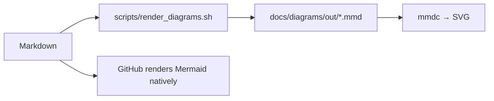

# Glossary and FAQ

Terms defined, then the questions that actually come up when running, reviewing or demonstrating
this project.

---

## Part 1 — Glossary

### A

**Airflow DAG** — the directed acyclic graph in `dags/product_intelligence_pipeline.py` that
orchestrates the run: 13 tasks, with a real branch that skips notification when no changes were
detected.

**Analytical view** — a named `SELECT` stored in the database (`db/views.sql`). Views are the only
read surface the API and query lab use, which keeps query logic in one place instead of scattered
across endpoints.

**Argon2id** — the password hashing algorithm used for `app_user.hashed_password`. Memory-hard, and
currently the recommended choice for password storage.

**Availability** — the normalised stock state of a product, from the closed vocabulary
`in_stock`, `out_of_stock`, `backorder`, `preorder`, `discontinued`, `unknown`.

### B

**Backoff (exponential)** — each retry waits longer than the last, typically doubling the interval.
Prevents a struggling source from being hammered while it recovers.

**Blocking index** — a precomputed lookup that narrows the set of products a fuzzy comparison must
consider, instead of comparing every product with every other. This is what turned catalog
reconciliation from 2,975 ms into 104 ms.

**Bounded extraction** — a generator wrapped so it cannot yield more than the configured limit.
`_safe_take` applies it to every source, so a misbehaving source cannot hang a run.

### C

**Candlestick / CoNCEPT of conformance** — see *conformed dimension*.

**Catalog reconciliation** — matching the retailer's internal SKUs to observed market products and
computing the price gap. This is where "we are 8 % more expensive than the market" comes from.

**Change detection** — comparing consecutive snapshots per product to derive price changes and
lifecycle events.

**Circuit breaker** — after five consecutive failures against a host, the client stops attempting
requests for a cooling-off period. Zero network I/O while open; the skip is logged.

**Conformed dimension** — a dimension shared by multiple fact tables, so `dim_date` means the same
thing everywhere. This is what keeps a star schema consistent.

**Crawl-delay** — a `robots.txt` directive asking crawlers to wait a minimum interval. The effective
delay here is the **slowest** of the global setting, the per-minute budget and the site's declared
value.

**Crawler evidence log** — `ingestion_http_log`, one row per outbound HTTP attempt including the
ones that never happened because robots.txt disallowed them.

### D

**Data quality (DQ) rule** — one named check with a dimension, a threshold and a persisted verdict.
Twelve rules across six dimensions, re-evaluated on every load.

**Data quality dimension** — the category a DQ rule belongs to: completeness, validity, uniqueness,
accuracy, consistency or timeliness.

**Deterministic seed** — a reproducible dataset generated from a fixed seed and a fixed date, so
demonstrations and screenshots are stable across runs.

**Deduplication** — collapsing several source records that describe the same real product into one
canonical identity.

**Digit signature** — the set of numbers appearing in a product name. "iPhone 15 Pro 256GB" and
"Apple iPhone 15 Pro (256 GB)" share a digit signature even though their strings differ; this is one
of the four similarity signals.

**Drift (taxonomy)** — a product moving between categories between snapshots.

### E

**ETL / ELT** — Extract-Transform-Load, or Extract-Load-Transform. This project is ETL: cleaning
happens in Python before anything is written to the warehouse.

**Event (lifecycle)** — a recorded transition: `new`, `removed` or `category_changed`.

### F

**Fingerprint** — a deterministic hash of a cleaned product name, brand and digit signature. The
identity key that makes loads idempotent.

**Fuzzy matching** — similarity scoring rather than exact comparison. Four signals are combined here:
Jaro-Winkler, token-set, trigram and digit-signature factors.

### G

**Grain** — the level of detail a fact table records, stated as "one row per X". A table with an
undeclared grain cannot be aggregated safely, so every fact here declares its grain in the
documentation.

### I

**Idempotent** — re-running produces the same result without duplicating data. Achieved by merging
on natural keys rather than blind-inserting.

**Ingestion** — everything between "a source exists" and "a `RawProduct` object exists": robots
enforcement, rate limiting, retries, caching, HTML parsing and validation.

### J

**Jaro-Winkler similarity** — a string-distance measure that scores prefix matches more favourably.
Effective on product names that differ mainly in spacing or a shared prefix.

### K

**Kimball star schema** — denormalised dimensions around fact tables, optimised for read-heavy
analytical queries rather than write integrity.

### L

**LRU / response cache** — responses stored on disk keyed by a hash of the URL, so a repeated run
performs no outbound requests at all.

### M

**Magnitude band** — a classification of a price change by size: `flash_sale` (≥ 30 %), `large`
(15–30 %), `medium` (5–15 %), `small` (1–5 %), `minor` (< 1 %).

**Mode (per-user)** — a user preference set by an admin and applied to every account, in contrast to
per-user preferences in `app_user.preferences`.

### N

**Natural key** — a business-meaningful identifier (`sku`, `slug`, `fingerprint`) used to merge rows
instead of a surrogate key.

### P

**Partial run** — a run that completed with one or more sources failing. It is reported as
`partial` with warnings rather than failing outright, because losing one source should not discard
the work of four others.

**Product fingerprint** — see *fingerprint*.

**Promo prefix/suffix** — marketing text such as "NEW", "Hot Sale" or "30% off" stripped during
cleaning so it does not pollute the identity.

### Q

**Query Lab** — the read-only SQL console in the dashboard. `SELECT` only, identifiers whitelisted,
`LIMIT` clamped.

### R

**RBAC** — role-based access control. Three roles (`viewer`, `analyst`, `admin`), enforced per
route on the server.

**Reconciliation rate** — the percentage of internal SKUs matched to a market product. Current
measured value: 39 of 57 (68.42 %).

**Retries** — bounded re-attempts after a failure, using exponential backoff and honouring
`Retry-After` when the server sends it.

**robots.txt** — the per-site rules file consulted before every request. RFC 9309 fallback
semantics are implemented: 4xx allows, 401/403 disallows, 5xx falls back to the cached decision.

**Row count / row count parity** — comparing table counts across PostgreSQL and MySQL to prove the
load is structurally identical.

### S

**SCD (slowly changing dimension)** — a dimension whose attributes change over time. Category
history would be SCD-2; it is on the roadmap, not yet implemented.

**Snapshot** — one observation of one product at one moment. Append-only.

**Stage (pipeline)** — one of the nine ordered steps in a run, each recording its own counters and
duration.

**Staging table** — `stg_raw_observation`, holding raw rows including rejected ones, so a
partially-failed run stays inspectable.

**Token bucket** — a rate limiter allowing bursts up to a bucket capacity while enforcing a steady
average rate.

**Trimmed / normalised** — lowercased, punctuation-stripped, whitespace-collapsed. Stored in
`dim_product.normalized_name` for comparison while `canonical_name` stays human-readable.

### T

**Token-set similarity** — compares name tokens as a set, so word order and extra marketing words
matter less.

**Trigram similarity** — compares overlapping three-character sequences; robust to typos and
reordering.

**Truncate per run** — staging is emptied at the start of each run, so a retry never sees stale rows.

### V

**Views** — see *analytical view*.

### W

**Warm cache run** — a run where every response is served from the on-disk cache, making zero
outbound requests.

---

## Part 2 — Setup and running

### Why is the dashboard empty after I start the stack?

Bootstrap creates the schema but not demo data. Load it:

```bash
make demo-postgres     # or: make demo-mysql
```

Check the Pipeline screen for run status. If you want real data instead of the demo dataset:

```bash
make run-pipeline
```

### `make db-wait` seems to hang

It is polling both engines until they report healthy. Check what is actually running:

```bash
make ps
docker compose logs postgres | tail -30
```

On a cold first start, database initialisation genuinely takes 20–40 seconds.

### Which port do I use?

| Service | URL |
| --- | --- |
| Dashboard | <http://localhost:5173> |
| API | <http://localhost:8000> |
| Interactive API docs | <http://localhost:8000/docs> |
| ReDoc | <http://localhost:8000/redoc> |
| Airflow | <http://localhost:8080> |
| PostgreSQL | `localhost:5432` |
| MySQL | `localhost:3306` |

### How do I sign in?

| Role | Email | Password |
| --- | --- | --- |
| Admin | `admin@example.com` | `Admin@12345` |
| Analyst | `analyst@example.com` | `Analyst@12345` |
| Viewer | `viewer@example.com` | `Viewer@12345` |

These are **demo credentials**. Change them via `.env` before exposing anything beyond localhost.

### The dashboard cannot reach the API

In development, Vite proxies `/api` to `127.0.0.1:8000`, so the **API must be running first**. In
the Compose stack, the Nginx container performs the same proxy.

```bash
curl http://localhost:8000/api/v1/health     # should answer without auth
```

### How do I switch between PostgreSQL and MySQL?

```bash
make run-pipeline            # uses ACTIVE_DATABASE
make run-pipeline-mysql      # the MySQL twin
make verify-dialects         # proves the two are structurally identical
```

Set `ACTIVE_DATABASE` in `.env` to change what the API and pipeline use by default.

---

## Part 3 — The pipeline

### Does it actually respect robots.txt?

Yes, and the evidence is queryable. Every outbound attempt — including blocked ones — is written to
`ingestion_http_log`:

```sql
SELECT status_code, robots_allowed, robots_rule, COUNT(*)
FROM ingestion_http_log
GROUP BY status_code, robots_allowed, robots_rule;
```

A row with `robots_allowed = false` and `status_code IS NULL` is a request the crawler **declined to
make**. The Audit screen shows the same data through the UI.

### Why does Open Library show `partial` with robots warnings?

That is the compliance layer working. Open Library's robots.txt forbids the request patterns used, so
those topics are skipped and the run finishes as `partial` rather than failing. The remaining
sources proceed. Skipping a disallowed source is the correct behaviour, not a bug.

### What happens if a source fails?

The run continues and is recorded as `partial` with a warning. One unavailable source should not
discard the output of four working ones. Five consecutive failures against the same host trip the
circuit breaker, and subsequent requests are skipped with zero network I/O.

### Can I re-run a pipeline safely?

Yes. Loads are idempotent: dimensions merge on natural keys, staging is truncated per run, facts are
keyed by their grain, and DQ verdicts are keyed by `(run_id, rule_id)`. Re-running merges rather than
duplicating.

### Where is the raw data before cleaning?

`stg_raw_observation`, including rows that failed validation along with a `reject_reason`. This is
what makes the DQ-012 rejection-rate rule measurable, and what lets a cleaning rule be tuned and its
effect compared.

### How do I add a new source?

1. Subclass `ProductSource` in `app/ingestion/sources/`.
2. Declare the compliance metadata as class variables: `code`, `name`, `kind`, `base_url`,
   `robots_url`, `rate_limit_per_minute`, `min_delay_seconds`.
3. Implement `fetch(limit)` as a **generator** yielding `RawProduct`.
4. Decorate with `@register_source`.
5. Add a seed row to `dim_source` if you want it in the Sources screen.
6. Add a test asserting your generator is bounded and raises nothing on malformed input.

```python
from app.ingestion.base import ProductSource, RawProduct, register_source


@register_source
class MySource(ProductSource):
    code = "mysource"
    name = "My Permitted Source"
    kind = "api"
    base_url = "https://example.com/products.json"
    robots_url = "https://example.com/robots.txt"
    rate_limit_per_minute = 20
    min_delay_seconds = 2.0

    def fetch(self, limit: int):
        response = self.client.get(self.base_url)
        for item in response.json()["products"][:limit]:
            yield RawProduct(
                source_product_id=str(item["id"]),
                name=item["title"],
                price_text=item["price_text"],
                currency=item["currency"],
                url=item["url"],
            )
```

You do **not** write any HTTP, robots, retry or rate-limit code. Using `self.client` inherits the
entire compliance layer, because the gate lives in the transport, not in the adapter.

### How does deduplication decide?

Four signals — Jaro-Winkler, token-set, trigram and digit-signature factors — combined into one
score. Candidates are narrowed by blocking indexes before comparison. Above `DEDUPE_THRESHOLD`
(default `0.90`) two products merge, and the decision is recorded in `match_strategy` and
`match_score` so it stays auditable. Every duplicate keeps its trail via `matched_product_id`.

---

## Part 4 — Data quality and analytics

### What do the twelve rules actually check?

| Code | Dimension | Rule |
| --- | --- | --- |
| DQ001 | Completeness | Product name present and non-empty |
| DQ002 | Completeness | Price present on active products |
| DQ003 | Validity | Price is a positive, parseable number |
| DQ004 | Validity | Rating within 0–5, or null |
| DQ005 | Uniqueness | One canonical row per fingerprint |
| DQ006 | Consistency | Snapshot grain respected (product × source × time) |
| DQ007 | Accuracy | USD price within 5 % of native price × FX |
| DQ008 | Validity | Availability in the normalised vocabulary |
| DQ009 | Completeness | Category resolved for ≥ 90 % of products |
| DQ010 | Consistency | Change percentages consistent with prices |
| DQ011 | Timeliness | Fresh observation for every active product |
| DQ012 | Validity | Staging rejection rate below 5 % |

### Why is the score 98.26 and not 100?

One rule returns `warn` rather than `pass`. The weighted score reflects that — a warning is not a
failure, and a project that reports 100 % while a rule is warning is not measuring honestly. Check
the Quality screen for which rule is warning and why.

### Can I run the rules without a full pipeline run?

```bash
pip-cli quality
```

This re-evaluates the twelve rules against the most recent run.

### Why is the score identical on PostgreSQL and MySQL?

Because the rules are written against the shared model rather than against dialect-specific SQL, and
the same rows are loaded to both engines. `make verify-dialects` proves it, which is a stronger
claim than "the queries ran".

### How do I interpret a price gap?

`price_gap_pct` in `fact_catalog_snapshot` is the market price relative to our list price:

- **Positive** — the market is more expensive than our list price. Opportunity to raise, or evidence
  we are under-priced.
- **Negative** — we are more expensive. A competitive problem worth investigating.

Only `match_status = 'matched'` rows are meaningful; `unmatched` SKUs have no gap by definition.

### What is the Query Lab, and is it safe?

Read-only by construction: `SELECT` only, identifiers validated against a whitelist, `LIMIT` clamped.
A general SQL console would be a data-exfiltration primitive regardless of how carefully it was
guarded, and it is unnecessary — twenty views cover the analytical questions and the Builders handle
ad-hoc composition safely.

---

## Part 5 — Security

### How are passwords stored?

Argon2id, memory-hard. Plain text is never stored or logged. Passwords never appear in the audit log
or in any API response.

### What is an API key, and how do I use one?

Generated in **Account → API keys**, shown exactly once, hashed at rest thereafter. Send it as a
header:

```bash
curl -H "X-API-Key: pip_live_..." http://localhost:8000/api/v1/products
```

Keys are usage-counted and individually revocable.

### How do I check that RBAC really works?

Use the API directly, not the UI — the point is that the server refuses regardless of what the
interface shows:

```bash
# as viewer: should be denied
curl -X POST -H "Authorization: Bearer $VIEWER_TOKEN" \
     http://localhost:8000/api/v1/pipeline/run/sync
```

The smoke suite asserts exactly this.

### Why store `raw_price_text` on the snapshot?

So a price-parsing bug is diagnosable after the fact. When `price` is wrong, the original string that
produced it is still on the row. Same reasoning for `fx_rate_to_usd`: history records the rate it
used, so updating the currency table cannot silently rewrite it.

### Is the crawler ethical?

It identifies itself with an honest `User-Agent` including a contact address, checks robots.txt before
every request, applies a floor delay even when a site declares none, stops after repeated failures,
and records every decision. `dim_source.terms_url` and `license_note` document the terms for each
source. The position taken in the proposal is that permitted public data, collected politely and
transparently, is legitimate; scraping that evades access controls is not, and this system has no
code path that could.

---

## Part 6 — Development

### How do I run everything?

```bash
make check       # ruff, mypy, 255 tests — no services required
make everything  # full stack: install, databases, bootstrap, demo data, pipeline, tests, build
```

### What does the test suite cover?

| File | Focus |
| --- | --- |
| `test_ingestion.py` | Source adapters, robots, validation |
| `test_ratelimit.py` | Token bucket, sliding window, circuit breaker |
| `test_cleaning.py` | The 29 normalisation steps |
| `test_dedupe.py` | Similarity signals and merge thresholds |
| `test_etl_pipeline.py` | Stage sequencing, idempotency, counters |
| `test_security.py` | Hashing, tokens, lockout, RBAC |
| `test_api.py` | Endpoint behaviour, exports, audit |
| `test_new_features.py` | Builders, aggregate queries, notifications |

Tests run against SQLite and need no running services, which is what makes `make check` fast enough
to run on every save.

### How do I add a DQ rule?

1. Add it to the rule list in `app/etl/dq.py` with code, dimension, severity and threshold.
2. Write the check function returning `(status, observed, expected, message, evidence)`.
3. Add tests for the pass case and at least one fail case.
4. Re-run `make test` — verdicts are keyed by `(run_id, rule_code)`, so the trend chart picks it up
   automatically.

### Why do the docs quote specific numbers?

Because each one is reproducible. 255 tests comes from `make test`, 78 smoke checks from
`scripts/api_smoke.py`, 23 tables and 20 views from `make bootstrap`, and the DQ score from the
Quality screen. A number nobody can reproduce is a number nobody should trust.

### How do I render the diagrams as SVG?



```bash
make docs-render   # extract and render every diagram
make docs-serve    # serve docs/ locally
```

### How do I build the documentation website?

```bash
python3 scripts/build_site.py            # writes site/
python3 scripts/build_site.py --serve    # build, then serve on :8001
```

No dependencies beyond the standard library. It produces one page per document, client-side search
over a generated index, and a dark mode that respects system preference.

### The repo is private — how do I show it to someone?

Add them as a collaborator (**Settings → Collaborators**), or grant them read access on your plan.
GitHub Pages does not serve private repositories on the free plan, which is why the documentation
website is built as a portable static directory rather than deployed to Pages.

---

## Part 7 — Project context

### What is this project for?

A DEPI data-engineering graduation project: demonstrate that the full pipeline from "permitted
public web source" to "analytical answer" can be built to production standards — with compliance,
idempotency, measurable data quality, two SQL dialects and full auditability — rather than as a
script that happens to work once.

### Why two databases?

The brief requires it, and it is a genuine portability test rather than a formality. The same model
must load identically on PostgreSQL 16 and MySQL 8.4, which constrains the schema: no `JSONB`, no
`DISTINCT ON`, portable boolean and timestamp handling. `make verify-dialects` proves no structural
drift.

### Why a Kimball star instead of a normalised warehouse?

Analytical workloads read broadly and write rarely. A star makes "average price per category per
day" a single indexed scan instead of a multi-hop join. Normalisation optimises the opposite
profile.

### Why store every snapshot instead of just the current price?

Because the product is about **change**. "What was the price last week?" and "which products
disappeared?" are only answerable from history. Keeping the FX rate with each snapshot additionally
means history is stable even as exchange rates move.

### What would you build next?

In priority order, with the reasoning in
[20_literature_feedback_and_improvements.md](20_literature_feedback_and_improvements.md):

1. **Incremental SCD-2 for categories** — so category drift has real history instead of a
   run-to-run comparison.
2. **A Playwright end-to-end suite** — the frontend is currently covered by lint, types and API
   tests, but not by browser-level interaction tests.
3. **Redis-backed caching and a Celery worker pool** — for runs large enough that in-process
   parallelism stops being enough.
4. **Prometheus metrics and a Grafana dashboard** — turning the existing counters into proper time
   series.
5. **Webhook and email alert channels** — extending in-app notifications.
6. **Multi-tenant catalog spaces** — so saved views and catalog data can be partitioned per team.