# Demo Runbook

A screen-by-screen script for demonstrating the system live, with exact URLs,
exact clicks, and the one sentence to say at each step. Companion to
[18_presentation_outline.md](18_presentation_outline.md), which covers the slide
deck and the examiner Q&A; this document is the operational version.

---

## Before you start

### The one rule that makes a demo reliable

**Never demonstrate against live web sources.** Real HTTP responses change between
rehearsal and delivery, and a source that worked yesterday may rate-limit you
today. Demonstrate against the seeded dataset, which is byte-for-byte identical on
every run, and keep live ingestion for the single moment you are asked to prove the
compliance layer works.

```bash
make up && make db-wait          # 6 services healthy
make bootstrap                   # 25 tables, 20 views, demo users
make demo-postgres               # deterministic 120-day dataset
make run-pipeline                # one live pipeline run, ~3.5 s
```

Then open three tabs and leave them open:

| Tab | URL | Why |
| --- | --- | --- |
| Dashboard | `http://localhost:5173` | The 60-second overview |
| Audit | `http://localhost:5173/audit` | The compliance evidence |
| API docs | `http://localhost:8000/docs` | The fallback if the UI stalls |

The order below is deliberate — it moves from the whole system, to the data, to the
business answer, to the engineering evidence, and ends on compliance so the ethics
question is pre-empted rather than raised.

```mermaid
flowchart LR
    A["0:00 Dashboard<br/>scope in 10 seconds"] --> B["0:45 Products<br/>dedupe + snapshot history"]
    B --> C["2:00 Changes<br/>the business question"]
    C --> D["3:00 Catalog match<br/>where it pays for itself"]
    D --> E["4:00 Runs<br/>orchestration + idempotency"]
    E --> F["4:45 Data quality<br/>measured, not assumed"]
    F --> G["5:30 Query lab<br/>self-service, read-only"]
    G --> H["6:00 Audit<br/>the compliance proof"]
    H --> I["7:00 Questions"]

    style A fill:#e7ecff,stroke:#3b5bdb
    style D fill:#e7ecff,stroke:#3b5bdb
    style H fill:#e7ecff,stroke:#3b5bdb
```



Sign in as **`admin@example.com` / `Admin@12345`**. The demo-credentials picker on
the login screen fills them for you, which saves typing under pressure.

### Pre-flight checklist

Run this the day before. It catches the failures that actually happen.

```bash
make check                        # ruff, mypy, 338 tests — no services needed
.venv/bin/python scripts/api_smoke.py   # 86/86 API checks
make frontend-build               # production bundle compiles
```

| Check | Pass signal | If it fails |
| --- | --- | --- |
| Containers healthy | `make ps` shows all six `healthy` | `make down && make up-db && make db-wait` |
| Demo data present | Dashboard shows 8 KPI tiles with values | `make demo-postgres` |
| Pipeline run succeeded | Runs screen shows `success` | `make run-pipeline`, read the warning banner |
| Login works | Dashboard loads after sign-in | `make bootstrap` reseeds the admin account |
| Reduced motion off | No animation on navigation | Account → Appearance → reduce motion |
| Browser zoom | Set to 100 % | A zoomed browser breaks the layout on a projector |

**Close everything else.** Notifications, a running IDE and a half-used terminal
window all steal focus at the worst moment.

---

## The eight-minute walkthrough

Each step gives the action, then the single sentence worth saying. Do not narrate
the interface — examiners can read labels. Narrate the *decision* behind what they
are seeing.

### 0:00 — Dashboard: the whole system in one screen

**Do:** Open the Dashboard. Point at the KPI row, then the trend chart.

> "Everything on this screen came from a scheduled crawl. Eight tiles, each backed
> by a SQL view — not a hard-coded number. In a moment I'll show you where each one
> comes from."

**Why this screen:** it establishes scope in ten seconds. A wall of charts on the
first slide is overwhelming; eight labelled numbers is a story.

### 0:45 — Products: search, then one product's history

**Do:** Click **Products**. Search `phone`. Open any result.

> "This is the deduplicated catalogue. The same product listed on three different
> sites is one row here, because four similarity signals agreed it was the same
> thing."

Then, on the detail page, scroll to the price history chart.

> "Every observation is kept, not just the latest. This is the only reason 'what
> was the price last Tuesday?' is answerable at all. Note the stored FX rate —
> history cannot be silently rewritten when exchange rates move."

**Why this screen:** it demonstrates deduplication *and* the snapshot design, which
are the two most-motivated design decisions in the project.

### 2:00 — Changes: the business question

**Do:** Click **Changes**. Open the **Price changes** tab. Sort by change %.

> "These are the price movements detected by comparing consecutive snapshots. They're
> banded by magnitude — a flash sale above 30 % is a promotion, not a market move, and
> lumping the two together would make the alert useless."

Switch to **Removed** and **Recategorised**.

> "Products that disappeared, and products that moved between categories. Both come
> free from having kept the history."

### 3:00 — Catalog match: where the project pays for itself

**Do:** Click **Catalog match**.

> "This compares our internal SKUs against the scraped market. This row is 8 % cheaper
> at the competitor — that's a pricing decision we can make today, and last month we
> had no way to know."

**Why this screen:** it is the only screen that connects the engineering to a
business outcome. If an examiner is unconvinced by any single component, this is the
one that matters.

### 4:00 — Runs: orchestration and idempotency

**Do:** Click **Runs**. Open the most recent run.

> "Fourteen Airflow tasks, and every stage recorded its own counters and duration. The
> same pipeline can be triggered from Airflow, the CLI or the API, and all three
> produce an identical run record — which is what makes the demo reproducible."

**Optional 20-second flourish,** if the examiner is technical:

```bash
make verify-dialects
```

> "Same model, same data-quality score, loaded independently on PostgreSQL and MySQL."

### 4:45 — Data quality: measured, not assumed

**Do:** Click **Data quality**.

> "Twelve rules across six dimensions, re-evaluated on every load, with the verdict for
> each rule persisted against the run — which is what makes the 90-day trend chart
> possible. The score is weighted, and a rule that returns a warning lowers it rather
> than being rounded away. On this dataset all twelve pass, but the framework will tell
> you when one doesn't."

**Why this screen:** a system that measures its own quality is the difference between
a script that worked once and a pipeline someone can operate.

### 5:30 — Query lab: self-service without a data team

**Do:** Click **Query lab**. Run one of the starter examples.

> "Read-only by construction. It accepts a single SELECT, validates every identifier
> against a whitelist, and clamps the LIMIT — because a general SQL console is a
> data-exfiltration primitive no matter how carefully it's guarded."

**Do, briefly:** try to paste an `UPDATE` and show it refused.

> "Rejected server-side, not hidden in the UI."

### 6:00 — Audit: the compliance proof

**Do:** Click **Audit**, then the **HTTP compliance log** tab.

> "This is the table I'd point at if someone asked whether we respected the sites we
> crawled. Every outbound request is recorded with its robots decision — including
> the ones we decided *not* to make. A row with no status code and robots_allowed
> false is a request the crawler declined to send."

**Why this screen last:** it pre-empts the ethics question before it is asked, and
it is the strongest single answer to "is this scraping defensible?"

### 7:00 — Your turn

> "That's the system. Happy to take questions, or to go deeper on any part of it."

---

## Time-boxed variants

| Situation | Plan | Cut |
| --- | --- | --- |
| 3 minutes | Dashboard → Products (one detail) → Catalog match → Audit | Analytics, Changes, Runs, DQ, Query lab |
| 5 minutes | Dashboard → Products → Changes → Catalog match → Runs → Audit | Analytics, Categories, DQ, Query lab |
| 15 minutes | Full walkthrough, then open the floor | Nothing |

**If you are running long,** cut in this order: Analytics, Categories, Builder,
Features, Alerts, Webhooks. Those are the most impressive and the least
load-bearing. Never cut Audit — it carries the ethics position.

---

## Proving the compliance layer on demand

If asked *"but can it actually crawl something?"*, do this rather than promising it
earlier. It is a 30-second demonstration and it makes the point far better than a
screenshot.

```bash
make sources                     # the registry, with robots URL and rate limits
make run-pipeline                # a live, rules-compliant crawl of the permitted sources
```

Then show the Audit screen again and point at the new rows.

**Expect a `partial` run, and say so before anyone asks.** Open Library's robots.txt
forbids our request patterns, so that source is skipped. That is the system working:

> "Open Library disallows those paths in its robots.txt, so we skipped it and the run
> completed as partial rather than failing. One unavailable source shouldn't discard
> the work of four working ones — and skipping a disallowed source is the correct
> behaviour, not a bug."

---

## Failure playbook

| Symptom | Cause | Recovery |
| --- | --- | --- |
| Dashboard spins, then errors | API not started | `curl localhost:8000/api/v1/health`, then `make serve` |
| Empty tables, no errors | Schema missing or demo data not seeded | `make bootstrap && make demo-postgres` |
| "Sign in failed" | Wrong database active | Check `ACTIVE_DATABASE` in `.env`, then `make bootstrap` |
| Numbers differ from rehearsal | Wrong `--days` on the seed | `make demo-postgres` reseeds deterministically |
| Slides render but charts don't | WebSocket/HMR stall | Reload once; fall back to the API tabs |
| Everything is broken | — | Go to the fallback below |

### The full fallback, which always works

The API is the source of truth; the dashboard is a consumer of it. If the UI dies
entirely, the demo continues from a terminal:

```bash
# Every claim, verifiable, without a browser
make analytics                   # the SQL report to stdout
make analysis                    # the four standalone analyses
make verify-dialects             # cross-dialect parity

TOKEN=$(curl -s -X POST localhost:8000/api/v1/auth/login \
  -H 'Content-Type: application/json' \
  -d '{"email":"admin@example.com","password":"Admin@12345"}' \
  | python3 -c 'import sys,json; print(json.load(sys.stdin)["access_token"])')

curl -s -H "Authorization: Bearer $TOKEN" localhost:8000/api/v1/quality/latest
curl -s -H "Authorization: Bearer $TOKEN" "localhost:8000/api/v1/products?q=phone&limit=5"
curl -s -H "Authorization: Bearer $TOKEN" localhost:8000/api/v1/catalog/reconciliation
```

> "The dashboard is a view over the API. If the browser fails, the evidence doesn't —
> here it is from the terminal."

This is not a consolation prize. Being able to drop to `curl` on demand is itself a
demonstration of the API design.

---

## Answers to the five questions you will be asked

Keep these short. The full bank is in [18_presentation_outline.md](18_presentation_outline.md).

**"Is scraping these sites ethical?"**
> "Each source records its terms URL and a licence note. robots.txt is enforced in the
> transport layer, before the request is made, so no adapter can bypass it. Rate limits,
> a floor delay even where a site declares none, a circuit breaker after repeated
> failures, and an honest User-Agent with a contact address. We collect permitted
> public data politely and leave an audit trail. Scraping that evades access controls
> isn't something this system can do — there's no code path for it."

**"Why two databases?"**
> "The brief requires it, and it's a genuine portability constraint rather than a
> formality. The same model has to load on both, which rules out `JSONB`, rules out
> `DISTINCT ON`, and forces portable booleans and timestamps. `make verify-dialects`
> proves there's no structural drift."

**"Why store every snapshot instead of just the current price?"**
> "Because the product is about change. Price history, disappeared products and category
> drift are all only answerable from retained history, and retaining the FX rate with
> each snapshot keeps history stable as exchange rates move."

**"What was the hardest part?"**
> "Reconciliation performance. Comparing every internal SKU against every product took
> 2,975 ms. Blocking indexes, a rare-token fallback and a capped pool brought it to
> 104 ms — 29× faster with identical output, which is what makes it a legitimate
> optimisation rather than a silent accuracy trade."

**"What would you do next?"**
> "Incremental SCD-2 for category history, a Playwright suite for the frontend, and
> Redis-backed caching for runs large enough that in-process parallelism stops being
> enough. All three are in the roadmap with reasoning."

---

## Post-demo

```bash
make down          # stop containers, keep volumes
```

Leaving the stack running is fine locally, but do **not** leave `.env` with real
secrets or a non-demo `SECRET_KEY` in a committed state. The demo credentials are
public by design — they are printed in this repository's own documentation — so the
only thing protecting a deployed instance is `SECRET_KEY` and the database password.

If you recorded the demo, check the recording for credentials before sharing it.
`make down` does not remove the database volume.