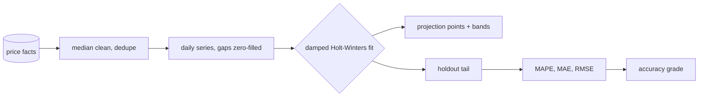
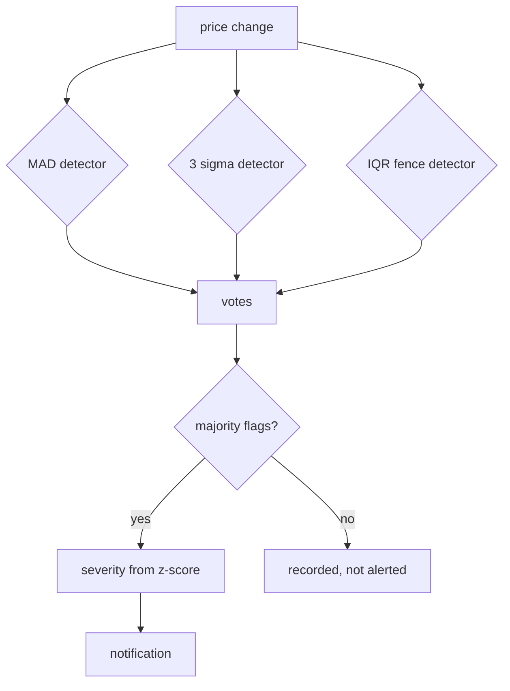

# Forecasting & Anomaly Detection

How the platform decides what a price is *going* to do, and what to do about a
price that moved unusually far. Everything here is implemented in
[`app/analytics/forecast.py`](../app/analytics/forecast.py) and served by
[`app/api/routers/forecast.py`](../app/api/routers/forecast.py).

---

## Why this document exists

Most price dashboards show history. History is already in the facts table, so
showing it again adds no engineering value. The three things worth building on
top of history are:

1. **A projection**, with an honest measure of how wrong it has been.
2. **Anomaly detection**, which must not be fooled by the very outlier it is
   looking for.
3. **A decision**: what to do about the number.

Each of those is covered below, with the reasoning that would matter in a
defence or a code review.

---

## 1. The projection: damped Holt-Winters

A plain linear trend extrapolates a trend forever, which is nonsense for a
catalogue price: the further out you predict, the more confident the model
pretends to be. Holt-Winters adds a level and a damped trend term, so the
contribution of the trend decays with the horizon.

For a series `y[t]` the model maintains:

| Component | Meaning |
| --- | --- |
| Level | Where the series is now |
| Trend | The current direction and its size |
| Damping | How much of the trend still survives next period |
| Seasonality | A repeating pattern, weekly here |

The model is fitted on the price history for one product, then projected over
the requested horizon. Two-sided bands are produced at 80% and 95% so the
uncertainty is visible rather than implied.



### Selection and fallback

- Enough history for a seasonal fit → the seasonal model.
- Enough for a trend, not for seasonality → damped trend only.
- Too little history → a flat series with the bands widened to match the
  observed volatility. A flat line is honest; a fabricated curve is not.

---

## 2. Measuring the error instead of asserting accuracy

Every forecast endpoint returns the error the model made on data it never saw.
The last 20% of the series is held back, the model is fitted on the rest, and
the projection is compared against the truth.

| Metric | Definition | What it tells you |
| --- | --- | --- |
| MAPE | Mean absolute percentage error | Scale-free; explodes on small prices |
| MAE | Mean absolute error, in currency | What a single mistake costs |
| RMSE | Root mean squared error | Punishes large misses more heavily |

Products are graded from MAPE:

| Grade | MAPE |
| --- | --- |
| Excellent | ≤ 5% |
| Good | ≤ 10% |
| Fair | ≤ 20% |
| Poor | > 20% |

A product graded *poor* is not a failure of the model — it is information. It
means the price is genuinely hard to forecast, and the UI says so instead of
drawing a confident line through noise.

---

## 3. Three anomaly detectors, because one is never enough

A single detector is either too sensitive (noise) or too blind (misses real
events). The platform runs three and reports all three.

| Detector | Statistic | Why |
| --- | --- | --- |
| MAD | Median absolute deviation | The median does not move when one point explodes, so the outlier cannot inflate its own threshold |
| Standard deviation | 3σ | Familiar and fast, but assumes the distribution is roughly normal |
| IQR | Tukey fences | Distribution-free; 1.5×IQR fences work on skewed price data |

A change is flagged when **at least two** detectors agree. That rule is what
keeps a single freak observation from generating an alert, and it is why the
severity score is a z-score rather than a boolean.



---

## 4. Seasonality as an index

`GET /forecast/{id}/seasonal` returns, per day of week, the average price
relative to the product's overall mean, expressed as an index where 100 is
average. A Saturday index of 118 means Saturdays run 18% above average.

This is what turns the forecast into something a merchandiser can use: the
absolute level matters less than *when* to expect it.

---

## 5. From a number to a decision

Three derived signals:

- **Price recommendation** — `hold`, `raise`, `cut` or `negotiate`, with the
  reason stated and the effect on gross margin estimated from the elasticity.
- **Price elasticity** — the absolute percentage price change against the
  absolute percentage volume change across comparable products. Negative
  elasticity means demand falls when the price rises, which is the normal case
  and the reason a price rise is not automatically good news.
- **Anomaly summary** — how many flagged moves, how severe, and whether the
  move is toward or away from the market median.

The recommendation is advisory. The API returns the reasoning alongside the
label, and the UI shows both, because a recommendation without its reasoning is
not something anyone should act on.

---

## 6. API

| Method | Path | Purpose |
| --- | --- | --- |
| `GET` | `/api/v1/forecast/overview` | Every product: model, accuracy grade, current price, projection |
| `GET` | `/api/v1/forecast/{product_id}` | Projection points and bands for one product |
| `GET` | `/api/v1/forecast/{product_id}/backtest` | MAPE, MAE, RMSE and the held-out points |
| `GET` | `/api/v1/forecast/anomalies` | Flagged moves across the catalogue, ranked by severity |
| `GET` | `/api/v1/forecast/{product_id}/seasonal` | Day-of-week and monthly indices |
| `GET` | `/api/v1/forecast/recommendations` | Price advice with elasticity and margin effect |
| `POST` | `/api/v1/forecast/rebuild` | Queue a full recomputation in the background |
| `GET` | `/api/v1/forecast/accuracy` | Distribution of accuracy grades across the catalogue |

All forecast routes require the `read` right. `rebuild` requires
`run_pipeline`, because it is a pipeline action rather than a read.

---

## 7. Rebuilds are jobs

A full recomputation is queued as a `forecast` job, not run inside a request:

```bash
curl -X POST http://localhost:8000/api/v1/forecast/rebuild \
  -H "Authorization: Bearer $TOKEN"
```

The response is a job reference. Progress appears on the forecasting screen and
in the jobs tab, and the run can be cancelled. The forecasting screen refreshes
its panels automatically when the job reaches a terminal state, so nobody has to
press refresh.

---

## 8. What this deliberately does not do

- **No machine learning service.** A statistical model that runs in-process,
  is deterministic, and has no training step is reproducible and reviewable.
  Adding a dependency on a training pipeline would make the numbers harder to
  defend, not easier.
- **No confidence theatre.** Where the history is too short, the API returns a
  flat series with wide bands rather than a plausible-looking curve.
- **No alerting on a single detector.** Two of three must agree.

---

## Related

- [09_database_design.md](09_database_design.md) — the `fact_price_daily` table the series is built from
- [05_kpis.md](05_kpis.md) — how forecast accuracy is reported as a KPI
- [17_technical_documentation.md](17_technical_documentation.md) — module map and configuration
- [15_testing_strategy.md](15_testing_strategy.md) — how the model is tested