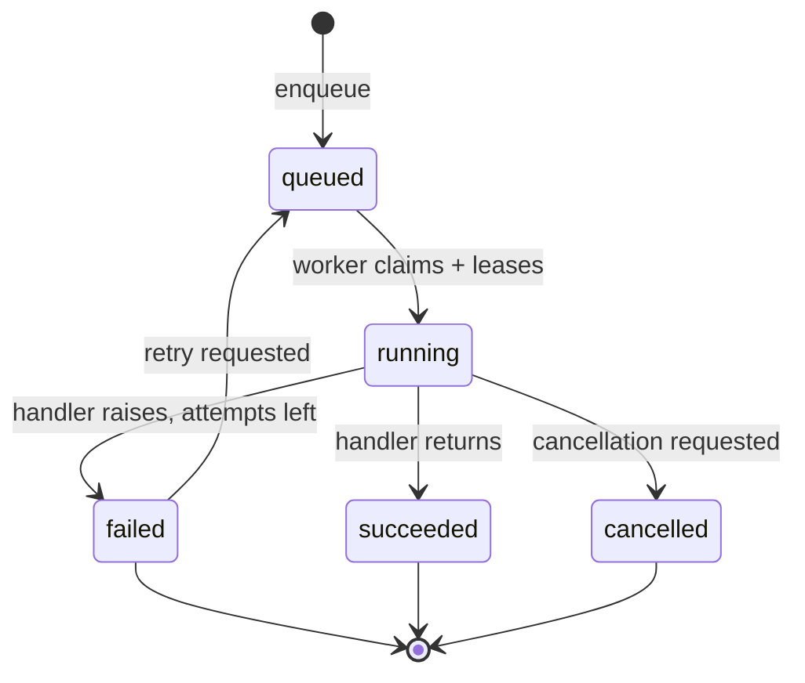
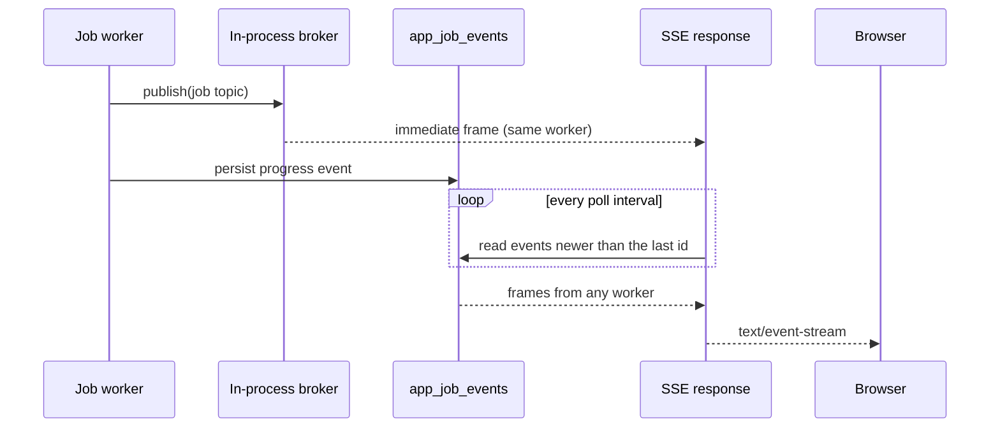

# Background Jobs & Realtime

Two mechanisms that keep slow work off the request thread and keep the UI
current without polling. Implemented in
[`app/jobs/`](../app/jobs), [`app/services/realtime.py`](../app/services/realtime.py)
and [`app/api/routers/stream.py`](../app/api/routers/stream.py).

---

## 1. Why a queue at all

A backfill, a full forecast rebuild or a PDF render takes seconds to minutes.
Three things follow from that:

1. A synchronous `POST` would hold an HTTP connection open for minutes, which
   proxies, load balancers and browser timeouts all punish.
2. Progress has to be reported somehow, or the user clicks a button and watches
   a spinner they cannot trust.
3. If the process dies mid-work, the work is lost.

So every long operation becomes a **job**: a row in `app_jobs`, with a status, an
attempt budget, a lease, and an append-only progress log in `app_job_events`.

---

## 2. Job lifecycle



| Status | Meaning |
| --- | --- |
| `queued` | Waiting for a worker |
| `running` | Leased by a worker, heartbeating |
| `succeeded` | Finished; progress ends at 100% |
| `failed` | All attempts used; the last error is stored |
| `cancelled` | Stopped cooperatively at a checkpoint |

### Leases, not locks

A worker claims a job by setting `lease_expires_at` and bumping the attempt
counter, then renews that lease while it works. If the worker is killed, the
lease simply expires and the job becomes claimable again. Nothing needs to know
that a process died; time is the only coordination primitive.

### Retry

Retries are bounded by `max_attempts`, default 3. The last exception message is
stored on the row rather than only in a log file, so the UI can show *why* a job
failed without anyone opening a terminal.

### Progress

Every step publishes `stage`, `message` and `progress`. On SQLite those writes
are coalesced: SQLite serialises writers with a file lock, so flushing every
event would let the database stall the very worker producing them. On
PostgreSQL the writes go straight through.

---

## 3. Registered job types

| Type | Trigger | Cancellable |
| --- | --- | --- |
| `pipeline-run` | `POST /pipeline/run`, `/jobs/pipeline-run` | Yes |
| `backfill` | `POST /pipeline/backfill` | Yes |
| `export` | `POST /jobs/export` | Yes |
| `forecast` | `POST /forecast/rebuild` | Yes |
| `aggregate` | `POST /aggregates/rebuild` | Yes |
| `report_pdf` | `POST /reports/{template}/queue` | Yes |

Each handler receives `(job, progress)` where `progress(stage, message, percent)`
is the only way it reports back. Handlers therefore cannot silently swallow a
failure: the queue owns the state transition.

---

## 4. Job API

| Method | Path | Purpose |
| --- | --- | --- |
| `GET` | `/api/v1/jobs` | Job history; a non-admin sees only their own |
| `GET` | `/api/v1/jobs/{reference}` | Status, attempts, lease, error, full progress log |
| `GET` | `/api/v1/jobs/{reference}/events` | Progress events after an id, for polling or replay |
| `GET` | `/api/v1/jobs/worker` | Queue depth, running count, lease age |
| `GET` | `/api/v1/jobs/types` | Registered types and which are cancellable |
| `POST` | `/api/v1/jobs/{reference}/cancel` | Cooperative cancellation |
| `POST` | `/api/v1/jobs/{reference}/retry` | Re-queue a failed or cancelled job |
| `GET` | `/api/v1/jobs/stream/jobs` | SSE: live job progress |

A non-admin listing their own jobs is enforced in the query itself
(`requested_by = user_id`), not by filtering after the fact.

---

## 5. Realtime: SSE first, WebSocket second

The platform publishes on six topics: `run`, `job`, `kpi`, `change`, `quality`
and `notification`.



### The two-worker problem

Uvicorn runs more than one worker, and a process-local broker only sees events
published *in that process*. A job executed by worker 2 would be invisible to a
client connected to worker 1.

So each SSE response merges two sources:

1. the in-memory broker, for immediacy, and
2. a poll of `app_job_events`, for cross-worker completeness.

`Last-Event-ID` is honoured, so a reconnect resumes where it left off instead of
replaying everything.

### Streaming details that matter

| Detail | Why |
| --- | --- |
| `X-Accel-Buffering: no` | Without it nginx buffers and nothing arrives until the stream closes |
| `Cache-Control: no-cache, no-transform` | Stops proxies transforming the stream |
| Keep-alive comments | Holds the connection open between events |
| Bounded client buffer | A chatty topic cannot grow the browser's array without limit |
| Capped exponential backoff | A server restart is not hammered on reconnect |

### Authentication, and the `EventSource` problem

`EventSource` cannot set an `Authorization` header. The browser can only
authenticate by putting the credential in the query string.

That is normally a bad idea — query strings end up in access logs — so it is
accepted **only** on the SSE routes and **only** as a fallback for the header.
The dependency in `app/api/deps.py::stream_user` applies exactly the same role
and API-key scope checks as any other read, so the transport widens and the
permissions do not.

```python
# Header wins when both are present, so a header-based client cannot be
# downgraded to a query credential.
if credentials is None and token:
    credentials = HTTPAuthorizationCredentials(scheme="Bearer", credentials=token)
```

The header path remains the default and is fully supported: `curl -N` and any
non-browser client should keep using it.

---

## 6. Client contract

[`frontend/src/lib/stream.ts`](../frontend/src/lib/stream.ts) wraps both
transports:

```ts
const { state, events, latest } = useEventStream(['job'], {
  onEvent: (event) => applyProgress(event),
})
```

`state` is `connecting | open | closed | error`, which the jobs screen turns
into a **Live / Connecting / Polling** badge. If the stream cannot connect at
all, the screen still works — it falls back to polling the job endpoint, so
realtime is an enhancement and never a dependency.

---

## 7. Failure modes considered

| Failure | Behaviour |
| --- | --- |
| Worker killed mid-job | Lease expires, job is reclaimed, attempt count increments |
| Handler raises | Error stored on the row, retried up to the budget, then `failed` |
| Cancel during a long step | Honoured at the next `progress()` checkpoint |
| API restarted | Jobs are rows; they are picked up again on the next poll |
| Broker subscriber gone | Frame write fails, the subscriber is dropped, the client reconnects |
| SQLite lock contention | Progress writes coalesced so the worker is not blocked |
| Two API workers | Database poll delivers the other worker's events |

---

## Related

- [26_reporting_and_document_generation.md](26_reporting_and_document_generation.md) — the PDF path that most needs a queue
- [17_technical_documentation.md](17_technical_documentation.md) — handler registration and configuration
- [13_deployment.md](13_deployment.md) — worker scaling and what a single worker means
- [15_testing_strategy.md](15_testing_strategy.md) — lease, retry and cancellation tests