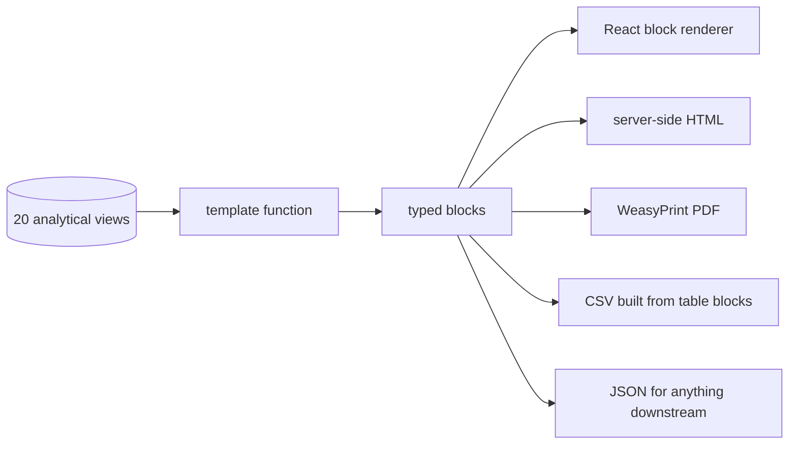
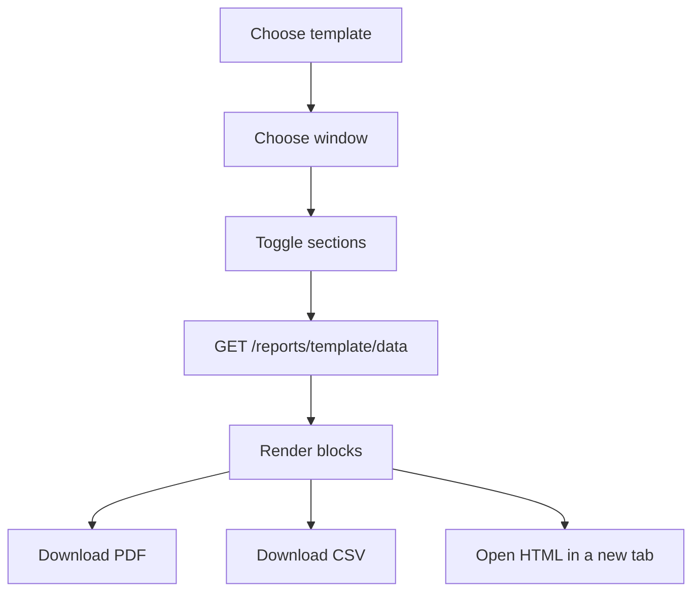

# Reporting & Document Generation

How a report becomes a PDF, and why the screen, the HTML preview, the CSV and
the PDF can never disagree. Implemented in
[`app/services/report.py`](../app/services/report.py),
[`app/services/pdf.py`](../app/services/pdf.py) and
[`app/api/routers/reports.py`](../app/api/routers/reports.py).

---

## 1. The problem with report builders

Report builders usually fail in one of two ways. Either the PDF is written with
its own layout code and quietly drifts from the screen, or the export is defined
twice — once for display and once for download — and the two disagree within a
release.

The fix is structural: **a report is a list of typed blocks**, and every format
is a renderer over that one list.



One definition, four renderers. A block type that the screen cannot draw is
skipped rather than crashing the report, so a newer server can add block types
without breaking an older cached frontend.

---

## 2. Block types

| Type | Payload | Used for |
| --- | --- | --- |
| `heading` | `title` | Section heading |
| `tiles` | `tiles[{label, value, hint}]` | Headline numbers |
| `table` | `columns[{key, label, align}]`, `rows[]` | Tabular detail |
| `bars` | `items[{label, value}]` | Distributions and trends |
| `callout` | `title`, `body` | Plain-language explanation |
| `text` | `body` | Prose |

Column alignment travels with the column definition, so a right-aligned numeric
column is right-aligned in the screen, the HTML and the PDF without anyone
restating it.

---

## 3. The five templates

| Template | Answers |
| --- | --- |
| `executive_summary` | Where do we stand? Market position, freshness, trustworthiness |
| `price_movements` | What moved, in which direction, and how volatile is each category |
| `data_quality` | Which rules pass, which fail, and how is the score trending |
| `catalog_gaps` | Where are we cheaper, where are we missing, what is worth chasing |
| `product` | Everything about one product, including its projection |

Templates are functions of `(session, days, horizon, product_id)`. They query
the analytical views, never the raw tables, so every figure in a report is
reproducible from `/api/v1/query`.

---

## 4. Parameters

| Parameter | Range | Default | Meaning |
| --- | --- | --- | --- |
| `days` | 1 – 365 | 30 | Reporting window |
| `horizon` | 1 – 60 | 14 | Forecast horizon in the product report |
| `product_id` | ≥ 1 | — | Required by the product template |
| `sections` | subset | all | Comma-separated section keys, kept in template order |

Requesting a section list returns the report with only those sections. The order
is the template's, not the caller's, so a report cannot be assembled out of
sequence.

---

## 5. PDF rendering

`GET /api/v1/reports/{template}/pdf` renders with **WeasyPrint**, which is a real
HTML/CSS layout engine: the stylesheet is authored once in CSS and the PDF comes
out of it. That is why the PDF matches the HTML preview instead of approximating
it.

Host requirements, all installed by `docker/api.Dockerfile`:

```
libpango-1.0-0  libpangoft2-1.0-0  libharfbuzz-subset0
libjpeg62-turbo  libopenjp2-7  gdk-pixbuf-2.0-0
libffi8  shared-mime-info  fonts-dejavu-core
```

### Graceful unavailability

WeasyPrint is a native dependency, and a host may not have it. Rather than
failing with a 500, `GET /reports/templates` reports:

```json
{
  "formats": ["html", "pdf", "csv", "json"],
  "pdf_available": false,
  "pdf_unavailable_reason": "WeasyPrint is not installed on this host"
}
```

and the PDF route answers **501** with that reason as plain text. HTML, JSON and
CSV keep working, and the UI disables the PDF button with the reason visible
rather than showing an error after a click.

### Queued rendering

A full catalogue report is large enough that WeasyPrint can take a while.
`POST /reports/{template}/queue` enqueues a `report_pdf` job and returns a
reference immediately. The job screen shows progress, and the PDF is produced
off the request thread.

---

## 6. API

| Method | Path | Returns |
| --- | --- | --- |
| `GET` | `/api/v1/reports/templates` | Templates, formats, PDF availability |
| `GET` | `/api/v1/reports/{template}` | Server-rendered HTML preview |
| `GET` | `/api/v1/reports/{template}/data` | Blocks as JSON |
| `GET` | `/api/v1/reports/{template}/pdf` | PDF download |
| `POST` | `/api/v1/reports/{template}/queue` | Job reference |

All routes require the `read` right; `queue` also accepts only templates that
exist, and rejects anything else with a validation error naming the available
keys.

---

## 7. The report builder screen

[`frontend/src/pages/Reports.tsx`](../frontend/src/pages/Reports.tsx) renders
blocks with the same components used elsewhere — `StatTile`, `DataTable`,
`BarSeries` — so the screen is not a preview of the report, it *is* the report.



The CSV is built client-side from the same table blocks the screen rendered, so
the export contains exactly the rows that were on screen — including their
formatting — and cannot fall out of step with a second server-side export path.

The HTML preview opens in a new tab with the credential in the query string,
because `window.open` cannot send an `Authorization` header. It is a read-only
render of the user's own report.

---

## 8. Accessibility and print hygiene

- The stylesheet carries print rules, so the PDF is not a screenshot of a dark
  theme.
- Numeric columns use tabular figures, so digits align down the page.
- Colour is never the only signal: status badges carry text.
- Every table has real headers, so a screen reader announces the column names.

---

## Related

- [14_api_documentation.md](14_api_documentation.md) — full endpoint reference
- [09_database_design.md](09_database_design.md) — the views every report reads
- [26_background_jobs_and_realtime.md](26_background_jobs_and_realtime.md) — the queued PDF path
- [16_user_manual.md](16_user_manual.md) — how to read a report as a user