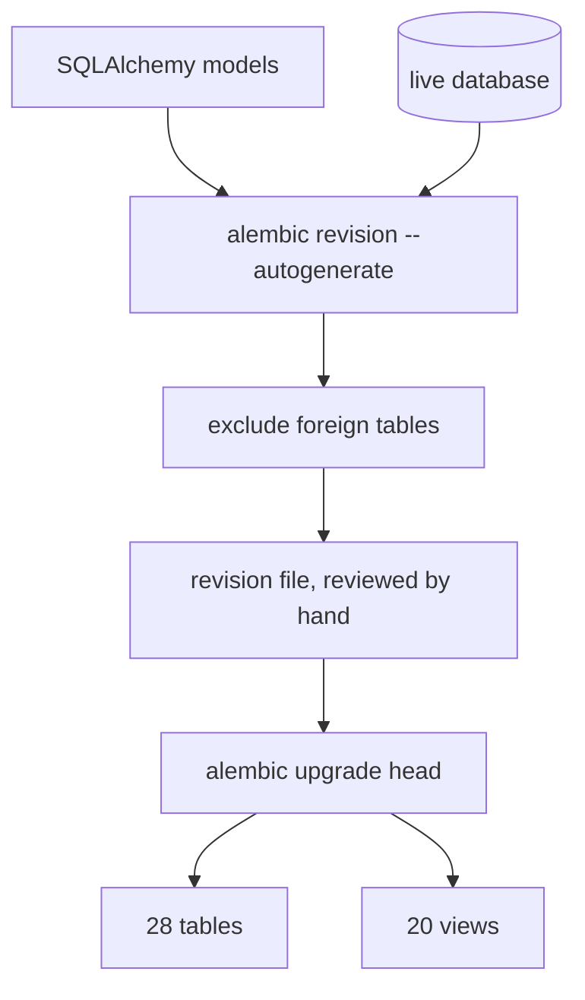
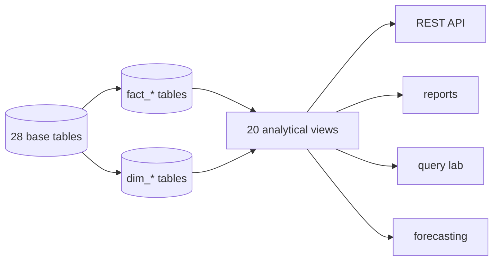

# Schema & Migrations

How the database is owned, how it is changed safely, and how CI proves the models
and the migration still agree. Implemented by `alembic.ini`,
[`migrations/env.py`](../migrations/env.py) and the revision in
[`migrations/versions/`](../migrations/versions).

---

## 1. Why stop using `create_all`

The original bootstrap called `Base.metadata.create_all` on startup, which is
convenient and wrong in three specific ways:

1. **No history.** A changed column is never recorded, so there is no way to
   reconstruct what a database looked like last month.
2. **No downgrade.** A bad column type cannot be rolled back.
3. **Silent drift.** Adding a column to a model does nothing to an existing
   database, so the schema and the code quietly diverge until a query fails.

Alembic fixes all three. `migrations/versions/0001_initial` creates **28
tables** and applies the **20 analytical views**, so an empty database reaches
exactly the state the application expects.

---

## 2. Migration layout

```
alembic.ini                  # script_location and the sqlalchemy.url placeholder
migrations/
  env.py                     # resolves the target from the active database setting
  script.py.mako             # revision template
  versions/
    20261005_0747_0001_initial_initial_warehouse_schema.py
```

### Target-aware environment

`env.py` reads the active database from settings, so the same revision set runs
against SQLite, PostgreSQL or MySQL without a second set of migration files. It
also sets `version_table` from `settings.alembic_version_table`, which keeps the
bookkeeping table from colliding with a warehouse table of the same name.

### Foreign tables are excluded

Autogenerate compares the models against the live database. If the target also
holds tables this project does not own — and it does, because Airflow keeps its
metadata in the same server — autogenerate would try to drop them. They are
explicitly excluded, so a revision only ever describes the warehouse schema.



---

## 3. Applying migrations

```bash
make db-upgrade          # alembic upgrade head
make db-downgrade        # alembic downgrade -1
make db-current          # what is applied right now
make db-history          # the full revision list
make db-check            # alembic check: no drift
make db-revision         # create a revision after editing models
```

Or directly:

```bash
alembic upgrade head
alembic check
```

`alembic check` is the important one: it exits non-zero when the models and the
migrations describe different schemas. That single command is the whole defence
against silent drift, and it runs in CI.

---

## 4. Views belong to the schema

The analytical layer is 20 SQL views. They are not created by the application at
runtime and they are not fixtures — the initial revision applies them through
`apply_views()`, and the downgrade drops them in the reverse order.



That is deliberate: the API, the reports, the query lab and the forecaster all
read the same views. A figure in a PDF, a figure on the dashboard and a figure in
a hand-written query cannot disagree, because there is only one definition.

---

## 5. Airflow is not in the warehouse

Airflow keeps DAG runs, task instances, xcom values and its own version table.
Originally that metadata lived in the analytical database, which meant:

- the migration could see tables it did not own, and
- a DAG run could appear in an export of "our" tables.

The fix is a separate `airflow` database, created by
`docker/postgres-init/01-create-airflow-db.sh`, with the API pointed at the
warehouse. Orchestration metadata is now genuinely separate from analytics, and
autogenerate has nothing foreign to exclude beyond the version tables.

---

## 6. Verification performed

| Check | Result |
| --- | --- |
| `alembic upgrade head` on an empty database | Creates all 28 tables and applies the 20 views |
| `alembic upgrade head` again | No-op, idempotent |
| `alembic downgrade -1` | Drops the views and tables cleanly |
| `alembic check` | No drift |
| Autogenerate against a live PostgreSQL | Emits only warehouse changes |
| Migration under the test suite | Covered by `tests/test_new_features.py` |

Two tests guard this permanently: one asserts the committed revision creates
every table the models declare, and one asserts the revision applies the views —
otherwise the analytics layer would have nothing to query.

---

## 7. Working on the schema

The intended loop:

1. Change the model in `app/models/`.
2. `make db-revision` and **read the generated file**.
3. Fix the file by hand: autogenerate misses server defaults, data migrations and
   view changes.
4. `make db-upgrade`, then run the tests.
5. If the data itself must move, write it in the revision with an explicit
   `op.execute`, not in application startup code.

Data migrations belong in revisions. Startup code that mutates data runs on every
boot, cannot be rolled back, and behaves differently depending on whether the
database is fresh or not.

---

## Related

- [09_database_design.md](09_database_design.md) — the ERD and indexing strategy
- [22_data_dictionary.md](22_data_dictionary.md) — every table and column
- [13_deployment.md](13_deployment.md) — migrations in the deploy order
- [15_testing_strategy.md](15_testing_strategy.md) — schema-related test coverage