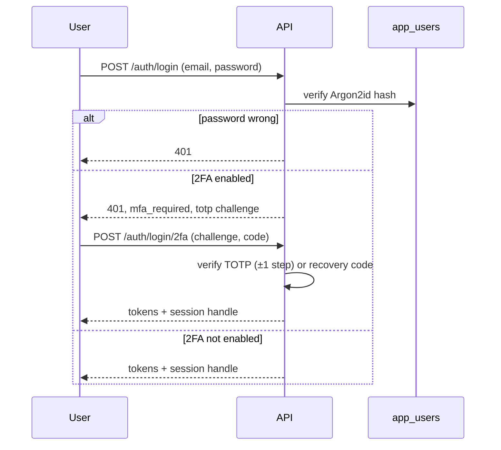
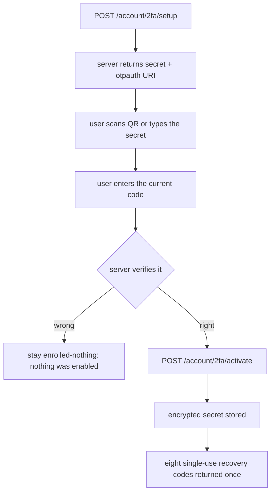
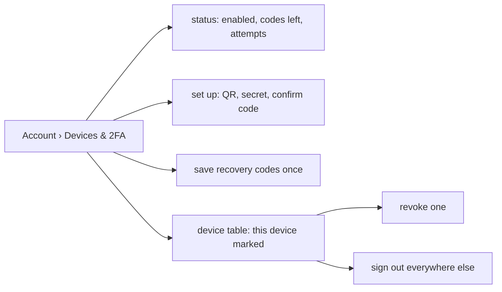

# Two-Factor Authentication & Session Control

The account-security surface: a real TOTP second factor, real recovery codes, and
sessions that can be revoked per device. Implemented in
[`app/services/twofactor.py`](../app/services/twofactor.py),
[`app/services/sessions.py`](../app/services/sessions.py) and
[`app/api/routers/account.py`](../app/api/routers/account.py).

---

## 1. The threat this addresses

A password leak is not a hypothetical. Phished credentials, reused passwords and
a breached password store all end up in the same place. A second factor means a
stolen password is not sufficient to sign in, which is the entire point — so the
implementation has to be genuinely enforced rather than a checkbox.

Note the ordering: the password is verified **before** a challenge is issued, so
the challenge itself leaks nothing about which accounts exist.

---

## 2. TOTP

RFC 6238, SHA-1, 30-second steps, six digits, with ±1 step of drift tolerated —
which is what a phone whose clock has slipped by a few seconds needs.

Compatible with Google Authenticator, Authy, 1Password, Bitwarden and anything
else speaking `otpauth://`.

### Enrolment is two-step, on purpose

Nothing is enabled until a real code is accepted. The alternative — enabling on
setup and letting the user discover a typo later — is the standard way 2FA
enrolment locks people out of their own accounts.

### The secret is encrypted at rest

The shared secret is the whole second factor. It is encrypted with Fernet before
being stored, so a database dump does not hand an attacker working TOTP secrets.

### Recovery codes are hashed

Eight codes, generated once, stored hashed and shown exactly once. Each is
single-use: consuming one decrements the counter, so the UI can warn before the
last one rather than after.

---

## 3. Lockout, and the case that contradicts it

Three wrong codes locks the second factor for five minutes. That stops a stolen
password from being brute-forced through the second factor — a million TOTP
attempts is otherwise a script, not an attack.

But three mistyped codes would also lock out the legitimate owner, and the
recovery codes would be useless if the lock blocked them too. So a valid recovery
code is accepted **while locked**, on the grounds that it is proof of possession
in its own right. The lock exists to slow an attacker who has only the password.

The remaining-attempt counter is shown *before* the lock, not only after it,
because a counter nobody can see is not a warning.

---

## 4. Sessions

Every sign-in creates a session row: device, address, user agent, created and
last-seen times, and the refresh token's digest.

| Action | Effect |
| --- | --- |
| Sign in | Creates a session, returns its handle |
| Revoke one | Invalidates that refresh token digest immediately |
| Revoke others | Invalidates every session except the current one |
| Password change | Invalidates every other session |

Refresh tokens are stored as digests, never in the clear, so a database leak is
not a session leak.

### The handle has to survive a reload

Revocation only works if the browser can tell the server *which* session it
means. The handle is therefore persisted alongside the tokens on sign-in and sent
on sign-out. Without that, "sign out this device" silently degrades into "log
out locally", which is the usual implementation and is not the same thing.

The handle is stored in `localStorage` because the access token already is; it is
a credential in exactly the same sense, and the threat model is unchanged.

---

## 5. API

| Method | Path | Purpose |
| --- | --- | --- |
| `GET` | `/api/v1/account/2fa/status` | Enabled, enrolled at, codes remaining, attempts left |
| `POST` | `/api/v1/account/2fa/setup` | Returns the secret and `otpauth://` URI |
| `POST` | `/api/v1/account/2fa/activate` | Confirms a code and enables 2FA |
| `POST` | `/api/v1/account/2fa/disable` | Confirms a code and disables 2FA |
| `POST` | `/api/v1/account/2fa/regenerate-codes` | New recovery codes, invalidating the old set |
| `GET` | `/api/v1/account/sessions` | This device's sessions |
| `POST` | `/api/v1/account/sessions/revoke` | Revoke one, or all others |
| `POST` | `/api/v1/auth/login/2fa` | Second step of sign-in |
| `POST` | `/api/v1/auth/logout?session_key=…` | Ends a specific session |

Every 2FA route requires the current password or a current code. Enabling a second
factor and then disabling it are both authenticated actions.

---

## 6. UI

One Account tab, *Devices & 2FA*, holds both: the two-factor panel with its state,
recovery codes remaining and the setup flow, and the device table with revoke and
sign-out-everywhere-else.

Small decisions worth naming:

- The QR is rendered from the `otpauth://` URI, with the secret also shown as
  text, for an authenticator that cannot scan.
- Recovery codes are shown in a modal that cannot be dismissed accidentally, with
  a copy button — because this is the only moment they exist.
- A warning appears when two or fewer codes remain, not at zero.
- Disabling asks for a current code. The password alone will not do.

---

## 7. What is deliberately absent

- **No SMS or email codes.** Both are weaker than TOTP and depend on a third
  party; pretending otherwise would be dishonest.
- **No push approvals.** Needs a vendor account and an app store release, which is
  out of scope for this project.
- **No remembered device.** Remembering the second factor defeats its purpose for
  a stolen credential; recovery codes are the deliberate escape hatch instead.

---

## Related

- [30_access_control_and_rate_limiting.md](30_access_control_and_rate_limiting.md) — API keys, scopes and rate limiting
- [16_user_manual.md](16_user_manual.md) — the user-facing walkthrough
- [14_api_documentation.md](14_api_documentation.md) — auth endpoints in full
- [06_literature_review.md](06_literature_review.md) — why TOTP over SMS