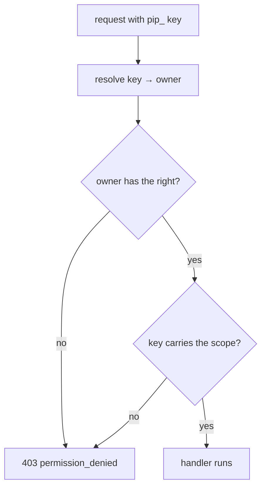
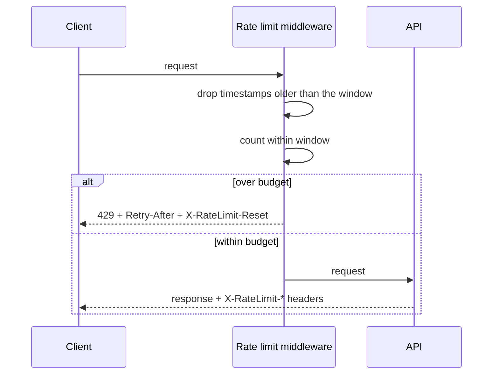

# Access Control, API Keys & Rate Limiting

Who may call what, how often, and with which credential. Implemented in
[`app/api/deps.py`](../app/api/deps.py), [`app/api/security.py`](../app/api/security.py)
and [`app/api/ratelimit.py`](../app/api/ratelimit.py).

---

## 1. Three credential types

| Credential | Format | Carries | Typical use |
| --- | --- | --- | --- |
| Access token | `eyJ…` JWT, HS256 | A user, a role, 12 hours | The browser and scripts acting as a person |
| Refresh token | `eyJ…` JWT, type `refresh` | A session, 30 days | Silent re-authentication |
| API key | `pip_…` | A user, a scope set, optional expiry | Machine-to-machine integration |

All three resolve to a user, and every authorisation decision is then made from
that user's role. There is no "key role" — a key cannot do anything its owner
could not do.

---

## 2. Roles and rights

| Role | Read | Write | Query | Run pipeline | Manage users |
| --- | --- | --- | --- | --- | --- |
| `admin` | ✓ | ✓ | ✓ | ✓ | ✓ |
| `engineer` | ✓ | ✓ | ✓ | ✓ | — |
| `analyst` | ✓ | ✓ | ✓ | — | — |
| `viewer` | ✓ | — | — | — | — |

Rights are declared once in `ROLE_RIGHTS` and enforced by a dependency factory:

```python
ReadUser = Annotated[AppUser, Depends(require_rights("read"))]
PipelineUser = Annotated[AppUser, Depends(require_rights("run_pipeline"))]
```

A route states its requirement in its signature, so the permission and the
endpoint are visible together and cannot drift apart.

When a caller lacks a right, the response names the role, what was missing, and
what that role *does* have — which turns a 403 into something actionable.

---

## 3. Scopes: authorised twice

An API key carries its own scopes. Without a second check, `scopes` would be
decorative: stored on creation and never read.



The key's effective scopes are intersected with the owner's rights, so a key can
never exceed its owner. Capping at creation time would be easier and would let a
later role change silently widen an existing key.

`GET /api/v1/keys` reports usage — last used and total calls per key — because a
credential nobody has looked at in months is exactly how a leak goes unnoticed.

---

## 4. Rate limiting

A sliding window over two budgets:

| Budget | Default | Purpose |
| --- | --- | --- |
| Per second | 20 requests | Stops a burst |
| Per minute | 300 requests | Stops a sustained crawl |



Design points that matter:

- **Sliding, not fixed.** A fixed window lets a client send 2× the budget across
  a boundary. The sliding window does not.
- **Headers on success, not only on failure.** Remaining budget is visible before
  the limit is reached, so a well-behaved client can slow down on its own.
- **Outermost middleware.** A rejected request never reaches the database. If the
  budget were enforced in a route dependency, every rejected request would still
  have paid for a session.
- **`Retry-After` on the 429.** A client that is told when to come back does not
  need to guess.
- **Client identity** is the API key, or the authenticated user, falling back to
  the client address for unauthenticated calls.

Limits are configurable through settings, so a test can raise them rather than
being made slow by them.

---

## 5. Token handling

| Property | Value |
| --- | --- |
| Algorithm | HS256 |
| Access lifetime | 12 hours |
| Refresh lifetime | 30 days, or the session limit |
| Storage, browser | `localStorage` |
| Storage, server | Refresh digests only |
| Rotation | Every refresh issues a new refresh token |

`decode_token` verifies the expected `type`, so an access token cannot be
presented where a refresh token is expected. Without that check, a leaked access
token would silently mint refreshes for 12 hours' worth of sessions.

Passwords are Argon2id, rehashed on verification when the parameters change, and
never logged.

---

## 6. Audit

Every mutating request writes a row to `app_audit_log`: user, action, method,
path, status, client address, user agent and duration. Reads against the audit log
are themselves audited, and the audit rows are not deletable through the API.

That combination is the point: the evidence cannot be edited through the interface
that generated it.

---

## 7. Failures considered

| Situation | Behaviour |
| --- | --- |
| Inactive user with a valid token | 401, user lookup rejects on `is_active` |
| Expired API key | 401, checked at authentication time |
| Role lacks the right | 403 naming the role and its rights |
| Key scope lacks the right | 403 naming the required scope |
| Wrong password | 401, then a lock after 5 attempts |
| Wrong 2FA code | 401, then a 2FA lock after 3 |
| Over budget | 429 with `Retry-After` |
| Unknown key | 401, indistinguishable from an invalid one on purpose |

---

## Related

- [29_two_factor_and_sessions.md](29_two_factor_and_sessions.md) — the second factor
- [14_api_documentation.md](14_api_documentation.md) — every authenticated route
- [04_risk_assessment.md](04_risk_assessment.md) — how these map to project risks
- [15_testing_strategy.md](15_testing_strategy.md) — authorisation tests per role